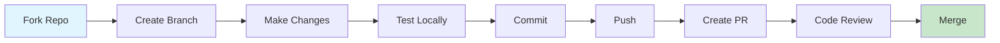

# Developer Guide

Welcome to the CRIOBE developer documentation. This guide helps contributors understand the system architecture, development workflows, and contribution processes.

## For Contributors

<div class="grid cards" markdown>

-   :material-vector-triangle:{ .lg .middle } **Architecture**

    ---

    Understand the system design, module interactions, and technology stack.

    [:octicons-arrow-right-24: System Architecture](architecture.md)

-   :material-source-pull:{ .lg .middle } **Contributing**

    ---

    Learn how to contribute code, documentation, or bug reports to the project.

    [:octicons-arrow-right-24: Contribution Guide](contributing.md)

-   :material-code-tags:{ .lg .middle } **Code Style**

    ---

    Follow project coding standards, naming conventions, and best practices.

    [:octicons-arrow-right-24: Code Standards](code-style.md)

</div>

## Quick Links

| Resource | Purpose |
|----------|---------|
| [Architecture Overview](architecture.md) | High-level system design |
| [Contributing Guide](contributing.md) | How to contribute |
| [Code Style Guide](code-style.md) | Coding standards |
| [Module READMEs](../../) | Technical module details |

## Development Workflow



## Getting Started

1. **Understand the Architecture**: Read [Architecture Overview](architecture.md)
2. **Set Up Development Environment**: Follow [Contributing Guide](contributing.md)
3. **Learn Coding Standards**: Review [Code Style Guide](code-style.md)
4. **Pick an Issue**: Check [GitHub Issues](https://github.com/criobe/coral-segmentation/issues)

## Module Structure

The repository is organized as a mono-repo with independent modules:

```
criobe/
├── bridge/                 # CVAT webhook service
├── data_engineering/       # Dataset management
├── grid_pose_detection/    # Grid keypoint detection
├── grid_inpainting/        # Grid removal
├── coral_seg_yolo/         # YOLO segmentation
├── DINOv2_mmseg/          # DINOv2 segmentation
├── dashapp/               # Dashboard application
├── documentation/         # This documentation site
└── modelling/             # Legacy modeling code
```

Each module has:
- Independent `pixi.toml` for environment management
- Module-specific `README.md` with technical details
- `CLAUDE.md` for AI-assisted development guidance

## Technology Stack

### Core Technologies
- **Python**: 3.9-3.11 (module-dependent)
- **PyTorch**: 2.0+ with CUDA support
- **Docker**: Container orchestration
- **Pixi**: Package management

### ML Frameworks
- **Ultralytics YOLO**: Detection and segmentation
- **MMSegmentation**: Semantic segmentation
- **DINOv2**: Vision transformer backbone
- **FiftyOne**: Dataset curation

### Services
- **CVAT**: Annotation platform
- **Nuclio**: Serverless ML functions
- **FastAPI**: Bridge service API
- **PostgreSQL**: CVAT database

## Development Tools

| Tool | Purpose | Installation |
|------|---------|--------------|
| Pixi | Environment management | [pixi.sh](https://pixi.sh) |
| Git | Version control | Pre-installed on most systems |
| Docker | Containerization | [docker.com](https://docker.com) |
| VSCode / PyCharm | IDE | Optional but recommended |

## Testing Strategy

- **Unit Tests**: Test individual functions and classes
- **Integration Tests**: Test module interactions
- **End-to-End Tests**: Test complete pipeline workflows
- **Manual Testing**: Visual inspection of segmentation results

## Contributing Areas

We welcome contributions in:

- 🐛 **Bug Fixes**: Fix issues reported on GitHub
- ✨ **Features**: Add new functionality
- 📝 **Documentation**: Improve guides and examples
- 🧪 **Tests**: Increase test coverage
- 🎨 **Models**: Add new segmentation models
- 🔧 **Infrastructure**: Improve deployment and CI/CD

## Code Review Process

All contributions go through code review:

1. **Automated Checks**: Linting, formatting, tests
2. **Peer Review**: At least one maintainer reviews
3. **Testing**: Verify changes work as expected
4. **Documentation**: Check docs are updated
5. **Merge**: Approved PRs merged to main

## Release Process

- **Semantic Versioning**: MAJOR.MINOR.PATCH
- **Changelog**: Updated with each release
- **Tags**: Git tags for version tracking
- **Announcements**: Release notes on GitHub

## Communication Channels

- **GitHub Issues**: Bug reports and feature requests
- **GitHub Discussions**: General questions and ideas
- **Pull Requests**: Code contributions
- **Email**: taiamiti.edmunds@ml4everyone.com

## Resources

- **Main Repository**: [GitHub](https://github.com/criobe/coral-segmentation)
- **Documentation**: This site
- **Module Documentation**: Individual module README files
- **Research Papers**: [Publications](../community/publications.md)

---

**Ready to contribute?** → [Contributing Guide](contributing.md){ .md-button .md-button--primary }
