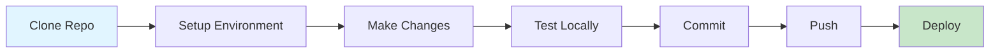

# Developer Guide

Welcome to the QUADRATSEG developer documentation, covering the platform developed by CRIOBE. This guide helps developers understand the system architecture and development workflows.

## Development Workflow



## Getting Started

1. **Review System Requirements**: See [Requirements](../setup/requirements.md)
2. **Install Development Environment**: Follow [Developer Setup](../quickstart/developer-setup.md)
3. **Explore User Guides**: Review [Data Preparation](../user-guide/data-preparation/index.md) and [Training Guides](../user-guide/training-and-deployment/index.md)
4. **Check Module READMEs**: Each module has detailed technical documentation

## Module Structure

The repository is organized as a mono-repo with independent modules:

```
criobe/
├── bridge/                 # CVAT webhook service
├── data_engineering/       # Dataset management
├── grid_pose_detection/    # Grid keypoint detection
├── grid_inpainting/        # Grid removal
├── coral_seg_yolo/         # YOLO segmentation
├── DINOv2_mmseg/          # DINOv2 segmentation
├── dashapp/               # Dashboard application
├── documentation/         # This documentation site
└── modelling/             # Legacy modeling code
```

Each module has:
- Independent `pixi.toml` for environment management
- Module-specific `README.md` with technical details
- `CLAUDE.md` for AI-assisted development guidance

## Technology Stack

### Core Technologies
- **Python**: 3.9-3.11 (module-dependent)
- **PyTorch**: 2.0+ with CUDA support
- **Docker**: Container orchestration
- **Pixi**: Package management

### ML Frameworks
- **Ultralytics YOLO**: Detection and segmentation
- **MMSegmentation**: Semantic segmentation
- **DINOv2**: Vision transformer backbone
- **FiftyOne**: Dataset curation

### Services
- **CVAT**: Annotation platform
- **Nuclio**: Serverless ML functions
- **FastAPI**: Bridge service API
- **PostgreSQL**: CVAT database

## Development Tools

| Tool | Purpose | Installation |
|------|---------|--------------|
| Pixi | Environment management | [pixi.sh](https://pixi.sh) |
| Git | Version control | Pre-installed on most systems |
| Docker | Containerization | [docker.com](https://docker.com) |
| VSCode / PyCharm | IDE | Optional but recommended |

## Testing Strategy

- **Unit Tests**: Test individual functions and classes
- **Integration Tests**: Test module interactions
- **End-to-End Tests**: Test complete pipeline workflows
- **Manual Testing**: Visual inspection of segmentation results

## Contributing

Contributions are welcome! Ways to contribute:

- 🐛 **Bug Reports**: File issues on GitHub
- ✨ **Feature Requests**: Suggest new capabilities
- 📝 **Documentation**: Improve guides and examples
- 💻 **Code**: Submit pull requests

## Communication

- **GitHub**: [criobe/coral-segmentation](https://github.com/criobe/coral-segmentation)
- **Email**: taiamiti.edmunds@ml4everyone.com
- **Documentation**: This site

---

**Need help?** → [Contact](../community/index.md){ .md-button }
