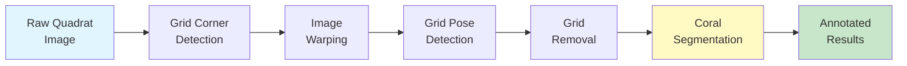

# QUADRATSEG Platform Documentation

Welcome to the comprehensive documentation for **QUADRATSEG**, the automated coral reef monitoring and segmentation platform developed by CRIOBE. This system enables researchers to process underwater photo quadrat images from capture through automated grid removal to species-level coral segmentation using state-of-the-art machine learning models.

<div class="grid cards" markdown>

-   :material-clock-fast:{ .lg .middle } **Quickstart**

    ---

    Get up and running in minutes with our quick demo and first annotation guide.

    [:octicons-arrow-right-24: 5-Minute Demo](quickstart/5-minute-demo.md)
    [:octicons-arrow-right-24: First Annotation](quickstart/first-annotation.md)

-   :material-cog:{ .lg .middle } **Setup**

    ---

    Complete installation and configuration guides for deploying the full system.

    [:octicons-arrow-right-24: Installation Guide](setup/installation/index.md)
    [:octicons-arrow-right-24: Configuration](setup/configuration/index.md)

-   :material-book-open-page-variant:{ .lg .middle } **User Guide**

    ---

    Learn core concepts, follow tutorials, and discover how-to guides for common tasks.

    [:octicons-arrow-right-24: Concepts](user-guide/concepts/index.md)
    [:octicons-arrow-right-24: Tutorials](user-guide/tutorials/index.md)

-   :material-code-braces:{ .lg .middle } **Developer Guide**

    ---

    Understand the architecture and learn how to contribute to the project.

    [:octicons-arrow-right-24: Architecture](developer-guide/architecture.md)
    [:octicons-arrow-right-24: Contributing](developer-guide/contributing.md)

</div>

## What is QUADRATSEG?

QUADRATSEG is a complete, automated platform for analyzing coral reef photo quadrats, developed by CRIOBE (Centre de Recherches Insulaires et Observatoire de l'Environnement). The platform:

- **Detects and corrects** grid corners for perspective normalization
- **Removes grid overlays** using advanced inpainting techniques
- **Segments coral species** using YOLO or DINOv2-based models
- **Integrates with CVAT** for annotation and quality control
- **Manages datasets** through FiftyOne for reproducible research

## Pipeline Overview



## Key Features

!!! tip "Production-Ready ML Models"
    - **YOLO-based**: Fast inference (~7s per image) with good accuracy
    - **DINOv2-based**: Superior accuracy (49.53% mIoU) for research applications
    - **Pre-trained models**: Download and deploy immediately

!!! success "Complete Automation"
    - **CVAT webhooks**: Trigger processing stages automatically
    - **Nuclio functions**: Deploy ML models as serverless functions
    - **FiftyOne integration**: Manage datasets with a single source of truth

!!! note "Flexible Taxonomies"
    - **Finegrained**: 18-20 coral species classes
    - **Extended**: 10-11 grouped families
    - **Main families**: 7 major coral groups
    - **Agnostic**: Binary coral vs. background

## Quick Navigation

### For New Users
1. Start with the [**5-Minute Demo**](quickstart/5-minute-demo.md) to see the system in action
2. Follow the [**Complete Pipeline Tutorial**](user-guide/tutorials/complete-pipeline.md) for step-by-step learning
3. Explore [**Module Documentation**](user-guide/modules/index.md) for detailed references

### For Administrators
1. Review [**System Requirements**](setup/requirements.md) for hardware and software needs
2. Follow the [**Installation Guide**](setup/installation/index.md) to deploy the system
3. Configure [**CVAT Projects and Webhooks**](setup/configuration/webhooks.md) for automation

### For Developers
1. Understand the [**System Architecture**](developer-guide/architecture.md)
2. Read the [**Contributing Guidelines**](developer-guide/contributing.md)
3. Explore individual module READMEs for technical details

## Supported Datasets

| Dataset | Classes | Description | Status |
|---------|---------|-------------|--------|
| **CRIOBE Finegrained** | 18 species | Fine-grained coral classification | ✅ Available |
| **Banggai Extended** | 10 genera | Regional coral species (Banggai) | ✅ Available |
| **CoralMask** | Multiple | Public benchmark dataset | ✅ Supported |

## Performance Benchmarks

| Module | Task | Inference Time | Accuracy |
|--------|------|----------------|----------|
| Grid Pose Detection | 117 keypoints | ~2s | High precision |
| Grid Inpainting | Removal | ~5-8s | Visual quality |
| YOLO Segmentation | Instance seg. | ~7.4s | mAP@0.5: 0.65-0.75 |
| DINOv2 + CoralSCoP | Two-stage seg. | ~15-25s | mIoU: 49.53% |

*Performance measured on NVIDIA GTX 1070 Mobile GPU with 1920x1920px images*

## Technology Stack

=== "Core ML Frameworks"
    - PyTorch 2.0+ with CUDA support
    - Ultralytics YOLO for detection/segmentation
    - MMSegmentation for semantic segmentation
    - DINOv2 vision transformer backbone

=== "Data & Orchestration"
    - CVAT for annotation and workflow management
    - FiftyOne for dataset curation and analysis
    - Nuclio for serverless ML function deployment
    - Docker Compose for service orchestration

=== "Development Tools"
    - Pixi for environment management
    - Python 3.9-3.11 depending on module
    - FastAPI for bridge service
    - MkDocs Material for documentation

## Getting Help

!!! question "Need Assistance?"
    - 📖 **Documentation Issues**: Open an issue on [GitHub](https://github.com/criobe/coral-segmentation/issues)
    - 💬 **Questions**: See our [Getting Help](community/getting-help.md) guide
    - 📧 **Email Support**: taiamiti.edmunds@ml4everyone.com

## Acknowledgments

QUADRATSEG was developed by [CRIOBE](https://www.criobe.pf/) (Centre de Recherches Insulaires et Observatoire de l'Environnement) and partly funded by [Marepolis](https://www.marepolis.fr/).

!!! info "Funding & Support"
    - **Developed by**: CRIOBE Research Team
    - **Partly funded by**: Marepolis
    - **Contributors**: See individual module READMEs for complete contributor lists

## Citation

If you use this platform in your research, please cite:

```bibtex
@software{quadratseg_2025,
  author = {Edmunds, Taiamiti and CRIOBE Research Team},
  title = {QUADRATSEG: Automated Coral Reef Monitoring and Segmentation Platform},
  year = {2025},
  url = {https://github.com/criobe/coral-segmentation},
  note = {Developed by CRIOBE, partly funded by Marepolis}
}
```

For detailed citation information, see [How to Cite](community/citations.md).

## License

This project is licensed under the MIT License. See module-specific LICENSE files for details.

---

<div class="grid" markdown>

!!! example "Example Workflows"
    - [Run inference on new images](user-guide/how-to/run-inference.md)
    - [Train custom models](user-guide/tutorials/model-training.md)
    - [Export annotations from CVAT](user-guide/how-to/export-annotations.md)

!!! info "Latest Updates"
    - **2025-10**: Documentation site launched
    - **2025-09**: DINOv2 integration complete
    - **2025-08**: YOLO v11 models released

    See [Publications](community/publications.md) for research papers

</div>

**Ready to get started?** → [5-Minute Demo](quickstart/5-minute-demo.md){ .md-button .md-button--primary }
