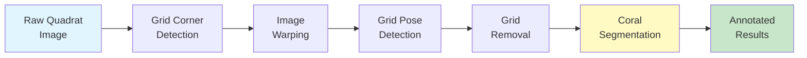

# QUADRATSEG Platform Documentation

Welcome to the comprehensive documentation for **QUADRATSEG**, the automated coral reef monitoring and segmentation platform developed by CRIOBE. This system enables researchers to process underwater photo quadrat images from capture through automated grid removal to species-level coral segmentation using state-of-the-art machine learning models.

<div class="grid cards" markdown>

-   :material-clock-fast:{ .lg .middle } **Quickstart**

    ---

    Get up and running quickly with our quickstart guides for end users and developers.

    [:octicons-arrow-right-24: Production Setup](quickstart/production-setup.md)
    [:octicons-arrow-right-24: Developer Setup](quickstart/developer-setup.md)

-   :material-cog:{ .lg .middle } **Setup**

    ---

    Complete installation and configuration guides for deploying the full system.

    [:octicons-arrow-right-24: Installation Guide](setup/installation/index.md)
    [:octicons-arrow-right-24: Configuration](setup/configuration/index.md)

-   :material-book-open-page-variant:{ .lg .middle } **User Guide**

    ---

    Create annotated datasets, train models, and deploy to production.

    [:octicons-arrow-right-24: Data Preparation](user-guide/data-preparation/index.md)
    [:octicons-arrow-right-24: Training & Deployment](user-guide/training-and-deployment/index.md)

-   :material-code-braces:{ .lg .middle } **Developer Guide**

    ---

    Technical documentation and development resources.

    [:octicons-arrow-right-24: Developer Guide](developer-guide/index.md)

</div>

## What is QUADRATSEG?

QUADRATSEG is a complete, automated platform for analyzing coral reef photo quadrats, developed by CRIOBE (Centre de Recherches Insulaires et Observatoire de l'Environnement). The platform:

- **Detects and corrects** grid corners for perspective normalization
- **Removes grid overlays** using advanced inpainting techniques
- **Segments coral species** using YOLO or DINOv2-based models
- **Integrates with CVAT** for annotation and quality control
- **Manages datasets** through FiftyOne for reproducible research

## Pipeline Overview



## Key Features

!!! tip "Production-Ready ML Models"
    - **YOLO-based**: Fast inference (~7s per image) with good accuracy
    - **DINOv2-based**: Superior accuracy (49.53% mIoU) for research applications
    - **Pre-trained models**: Download and deploy immediately

!!! success "Complete Automation"
    - **CVAT webhooks**: Trigger processing stages automatically
    - **Nuclio functions**: Deploy ML models as serverless functions
    - **FiftyOne integration**: Manage datasets with a single source of truth

!!! note "Flexible Taxonomies"
    - **Finegrained**: 16 coral genera (genus-level identification)
    - **Extended**: 10 classes (main genera + grouped minor genera as "Group1")
    - **Main families**: 7 major coral families
    - **Agnostic**: Binary coral vs. background

## Quick Navigation

### For New Users
1. Start with the [**First Annotation Tutorial**](quickstart/first-annotation.md) to see the system in action
2. Follow the [**Production Setup Guide**](quickstart/production-setup.md) to deploy the platform
3. Explore [**Data Preparation Guides**](user-guide/data-preparation/index.md) to create annotated datasets

### For Developers
1. Review [**System Requirements**](setup/requirements.md) for hardware and software needs
2. Follow the [**Installation Guide**](setup/installation/index.md) to deploy the system
3. Configure [**CVAT Projects and Webhooks**](setup/configuration/for-end-users/1-cvat-projects.md) for automation
4. Train and deploy models with [**Training & Deployment Guides**](user-guide/training-and-deployment/index.md)

## Supported Datasets

| Dataset | Classes | Description | Status |
|---------|---------|-------------|--------|
| **CRIOBE Finegrained** | 16 genera | Fine-grained coral classification at genus level | ✅ Available |
| **Banggai Extended** | 10 genera | Regional coral species (Banggai) | ✅ Available |

## Performance Benchmarks

| Module | Task | Inference Time | Accuracy |
|--------|------|----------------|----------|
| Grid Pose Detection | 117 keypoints | ~2s | High precision |
| Grid Inpainting | Removal | ~5-8s | Visual quality |
| YOLO Segmentation | Instance seg. | ~7.4s | mAP@0.5: 0.65-0.75 |
| DINOv2 + CoralSCoP | Two-stage seg. | ~15-25s | mIoU: 49.53% |

*Performance measured on NVIDIA GTX 1070 Mobile GPU with 1920x1920px images*

## Technology Stack

=== "Core ML Frameworks"
    - PyTorch 2.0+ with CUDA support
    - Ultralytics YOLO for detection/segmentation
    - MMSegmentation for semantic segmentation
    - DINOv2 vision transformer backbone

=== "Data & Orchestration"
    - CVAT for annotation and workflow management
    - FiftyOne for dataset curation and analysis
    - Nuclio for serverless ML function deployment
    - Docker Compose for service orchestration

=== "Development Tools"
    - Pixi for environment management
    - Python 3.9-3.11 depending on module
    - FastAPI for bridge service
    - MkDocs Material for documentation

## Getting Help

!!! question "Need Assistance?"
    - 📖 **Documentation**: Use the search bar or browse the [User Guide](user-guide/index.md)
    - 📧 **Contact**: taiamiti.edmunds@ml4everyone.com

## Acknowledgments

QUADRATSEG was developed by [CRIOBE](https://www.criobe.pf/) (Centre de Recherches Insulaires et Observatoire de l'Environnement) and partly funded by [Marepolis](https://www.marepolis.fr/).

!!! info "Funding & Support"
    - **Developed by**: CRIOBE Research Team
    - **Partly funded by**: Marepolis
    - **Contributors**: See individual module READMEs for complete contributor lists

## Citation

If you use this platform in your research, please cite:

```bibtex
@software{quadratseg_2025,
  author = {Edmunds, Taiamiti and CRIOBE Research Team},
  title = {QUADRATSEG: Automated Coral Reef Monitoring and Segmentation Platform},
  year = {2025},
  url = {https://github.com/criobe/coral-segmentation},
  note = {Developed by CRIOBE, partly funded by Marepolis}
}
```

## License

This project is licensed under the MIT License. See module-specific LICENSE files for details.

---

<div class="grid" markdown>

!!! example "Example Workflows"
    - [Create annotated datasets](user-guide/data-preparation/1-single-stage-segmentation.md)
    - [Train YOLO models](user-guide/training-and-deployment/yolo-segmentation.md)
    - [Deploy models to production](user-guide/training-and-deployment/model-deployment.md)

!!! info "Latest Updates"
    - **2025-10**: Documentation site launched
    - **2025-09**: DINOv2 integration complete
    - **2025-08**: YOLO v11 models released

</div>

**Ready to get started?** → [Quickstart Guide](quickstart/index.md){ .md-button .md-button--primary }
