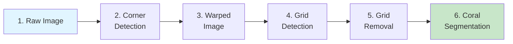

# 5-Minute Demo

Get the CRIOBE coral segmentation pipeline running in 5 minutes using pre-downloaded test data and pre-trained models.

!!! tip "What You'll Accomplish"
    - Download test images representing each pipeline stage
    - Download pre-trained ML models
    - Run inference for each module independently
    - See the complete pipeline output

**Time Required**: 5-10 minutes
**Prerequisites**: Git, Pixi installed

## Overview

This demo walks through each stage of the coral segmentation pipeline using sample data:



## Step 1: Clone Repository

```bash
# Clone the repository
git clone https://github.com/criobe/coral-segmentation.git
cd coral-segmentation
```

## Step 2: Download Test Data

All modules share the same test dataset. Download it once:

```bash
cd coral_seg_yolo  # or any other module

# Download test samples (contains all pipeline stages)
./download_test_samples.sh
```

This creates `data/test_samples/` with subdirectories:

| Directory | Stage | Content |
|-----------|-------|---------|
| `1-raw_jpg/` | Raw images | Original underwater quadrat photos |
| `2-quadrat_corner_export/` | Corner annotations | Corner keypoint labels |
| `3-image_warping/` | Warped images | Perspective-corrected quadrats |
| `4-grid_pose_export/` | Grid annotations | Grid intersection keypoints |
| `5-grid_removal/` | Clean images | Grid-removed coral images |

## Demo A: Complete YOLO Pipeline (Fastest)

Run the fastest end-to-end demo using YOLOv11 segmentation.

### Setup

```bash
cd coral_seg_yolo

# Install environment
pixi install -e coral-seg-yolo-dev

# Download models
./download_models.sh
```

### Run Inference

```bash
# Run coral segmentation on grid-removed images
pixi run -e coral-seg-yolo-dev python src/inference_demo.py \
    data/test_samples/5-grid_removal/ \
    results/demo_yolo/ \
    models/coralsegv4_yolo11m_best.pt \
    --method overlapping
```

**Expected Output**:
```
Loading model: models/coralsegv4_yolo11m_best.pt
Processing images from: data/test_samples/5-grid_removal/
Found 10 images
Processing: Tetiaroa_1994_01.jpg
  └─ Detected 58 coral instances in 7.4s
Processing: Tetiaroa_1994_02.jpg
  └─ Detected 42 coral instances in 6.8s
...
✅ Results saved to: results/demo_yolo/
```

**View Results**:
```bash
# Results include:
ls results/demo_yolo/
# - annotated_images/  (images with drawn polygons)
# - predictions.json    (raw predictions)
# - summary.txt        (statistics)
```

**Performance**: ~7s per image (1920x1920px on GTX 1070 Mobile)

## Demo B: Grid Detection & Removal

See how grid patterns are detected and removed.

### Grid Corner Detection (4 points)

```bash
cd ../grid_pose_detection

pixi install
./download_models.sh

# Detect 4 corner points on raw images
pixi run python src/gridpose_inference.py predict_as_yolo_txt \
    --test_dir data/test_samples/1-raw_jpg \
    --model_path assets/gridcorners_yolov11n_best.pt \
    --template_path assets/kp_template_corners.npy \
    --output_dir results/demo_corners \
    --max_cost 0.3
```

**Expected Output**:
```
Loading model and template...
Processing 10 images...
✅ Tetiaroa_1994_01.jpg: 4/4 corners detected (cost: 0.12)
✅ Tetiaroa_1994_02.jpg: 4/4 corners detected (cost: 0.15)
...
Results saved to: results/demo_corners/
```

### Grid Pose Detection (117 points)

```bash
# Detect all 117 grid intersection points on warped images
pixi run python src/gridpose_inference.py predict_as_yolo_txt \
    --test_dir data/test_samples/3-image_warping \
    --model_path assets/gridpose_yolov11n_best.pt \
    --template_path assets/kp_template.npy \
    --output_dir results/demo_gridpose \
    --max_cost 0.12
```

**Expected Output**:
```
Processing 10 images...
✅ Tetiaroa_1994_01.jpg: 117/117 keypoints detected (cost: 0.08)
...
```

### Grid Removal (Inpainting)

```bash
cd ../grid_inpainting

pixi install
./download_model.sh

# Remove grid lines using detected keypoints
pixi run python grid_rem_with_kp.py remove_grid_from_coco_dataset \
    --data_path data/test_samples/3-image_warping/ \
    --labels_path data/test_samples/4-grid_pose_export/person_keypoints_default.json \
    --output_dir results/demo_grid_removal
```

**Expected Output**:
```
Loading SimpleLama model...
Processing batch 1/1 (10 images)...
  ✓ Tetiaroa_1994_01.jpg inpainted (5.2s)
  ✓ Tetiaroa_1994_02.jpg inpainted (5.4s)
...
✅ Grid removed from 10 images
Results: results/demo_grid_removal/
```

**Performance**: ~5-8s per image

## Demo C: DINOv2 Two-Stage Segmentation (Highest Accuracy)

Run the most accurate segmentation approach.

### Setup

```bash
cd ../DINOv2_mmseg

pixi install -e dinov2-mmseg
./download_models.sh
./download_test_samples.sh  # If not already downloaded
```

### Run Two-Stage Inference

```bash
# Semantic segmentation + instance refinement
pixi run -e dinov2-mmseg python inference_with_coralscop.py \
    --input-dir data/test_samples/5-grid_removal/ \
    --segformer-config assets/dinov2_vitb14_coralsegv4_ms_config_segformer.py \
    --segformer-weights assets/best_mIoU_epoch_140.pth \
    --sam-checkpoint assets/pretrained_models/vit_b_coralscop.pth \
    --output-dir results/demo_dinov2/
```

**Expected Output**:
```
Loading DINOv2 SegFormer model...
Loading CoralSCoP (SAM) model...
Processing: Tetiaroa_1994_01.jpg
  Stage 1: Semantic segmentation (8.2s)
  Stage 2: Instance refinement (12.4s)
  └─ Generated 56 coral instances
...
✅ Results saved to: results/demo_dinov2/
```

**Performance**: ~15-25s per image
**Accuracy**: 49.53% mIoU (highest accuracy)

## Compare Results

All three demos process the same grid-removed images. Compare outputs:

```bash
# YOLO results (fastest)
ls coral_seg_yolo/results/demo_yolo/annotated_images/

# DINOv2 results (most accurate)
ls DINOv2_mmseg/results/demo_dinov2/annotated_images/

# View side-by-side
# Use any image viewer to compare quality and performance trade-offs
```

## Expected Results Summary

| Method | Inference Time | Accuracy | Instances Detected* |
|--------|----------------|----------|---------------------|
| YOLO Direct | ~7s | Good | 58 |
| DINOv2 + CoralSCoP | ~20s | Excellent | 56 |

*For Tetiaroa_1994_01.jpg sample image

## Performance Benchmarks

All timings on NVIDIA GTX 1070 Mobile GPU with 1920x1920px images:

- **Grid Corner Detection**: ~1s (4 points)
- **Grid Pose Detection**: ~2s (117 points)
- **Grid Removal**: ~5-8s (inpainting)
- **YOLO Segmentation**: ~7s (instance segmentation)
- **DINOv2 Segmentation**: ~15-25s (two-stage)

**Complete Pipeline**: ~15-35s per image (depending on segmentation method)

## Understanding the Output

### YOLO Output Structure

```
results/demo_yolo/
├── annotated_images/           # Visual results
│   ├── Tetiaroa_1994_01.jpg   # Polygons drawn on image
│   └── ...
├── predictions/                # Raw predictions
│   ├── Tetiaroa_1994_01.json  # Polygon coordinates + labels
│   └── ...
└── summary.txt                 # Overall statistics
```

### DINOv2 Output Structure

```
results/demo_dinov2/
├── annotated_images/           # Visual results
├── semantic_masks/             # Semantic segmentation masks
├── instance_masks/             # Instance segmentation masks
└── predictions.json            # Combined predictions
```

## Troubleshooting

### CUDA Out of Memory

```bash
# Reduce batch size or image size
# For YOLO:
pixi run python src/inference_demo.py ... --imgsz 1200

# For DINOv2: Edit config file to reduce image size
```

### Model Download Fails

```bash
# Manual download URLs are in download_models.sh
# Download manually and place in models/ directory
```

### Test Samples Not Found

```bash
# Ensure test samples are downloaded:
ls data/test_samples/
# Should show directories 1-raw_jpg through 5-grid_removal

# If missing, run:
./download_test_samples.sh
```

## Next Steps

!!! success "Demo Complete!"
    You've successfully run the CRIOBE coral segmentation pipeline!

**What to do next**:

1. **Understand the System**: Read [Pipeline Overview](../user-guide/concepts/pipeline-overview.md)
2. **Full Installation**: Follow [complete setup guide](../setup/installation/index.md)
3. **Create Your First Annotation**: [First Annotation Tutorial](first-annotation.md)
4. **Train Custom Models**: [Model Training Tutorial](../user-guide/tutorials/model-training.md)

## Quick Reference

```bash
# Download test data (run once from any module)
./download_test_samples.sh

# Download models for specific module
./download_models.sh

# Run YOLO inference
cd coral_seg_yolo
pixi run -e coral-seg-yolo-dev python src/inference_demo.py \
    data/test_samples/5-grid_removal/ results/ models/coralsegv4_yolo11m_best.pt

# Run DINOv2 inference
cd DINOv2_mmseg
pixi run -e dinov2-mmseg python inference_with_coralscop.py \
    --input-dir data/test_samples/5-grid_removal/ \
    --segformer-config assets/dinov2_vitb14_coralsegv4_ms_config_segformer.py \
    --segformer-weights assets/best_mIoU_epoch_140.pth \
    --sam-checkpoint assets/pretrained_models/vit_b_coralscop.pth \
    --output-dir results/
```

---

**Questions?** See [Getting Help](../community/getting-help.md) or open an issue on [GitHub](https://github.com/criobe/coral-segmentation/issues).
