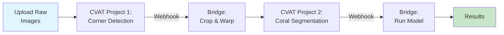

# First Annotation Tutorial

Create your first automated coral annotation workflow in CVAT with webhook-triggered processing.

!!! tip "What You'll Accomplish"
    - Create CVAT projects for the processing pipeline
    - Upload sample images
    - Configure webhooks to trigger automated processing
    - Run the complete pipeline from raw image to coral segmentation
    - Review and export results

**Time Required**: 15-20 minutes

**Prerequisites**:

!!! warning "Complete Production Setup First"
    This tutorial assumes you've completed the [Production Setup](production-setup.md) guide with:

    - [x] CVAT + Nuclio deployed and running
    - [x] Bridge service deployed and accessible
    - [x] All ML models deployed as Nuclio functions
    - [x] Services verified with health checks

    If you haven't set up the system yet, **[start with Production Setup](production-setup.md)** first.

## Overview

This tutorial sets up a simple two-stage automated pipeline:



## Prerequisites Check

Before starting, verify these services are running:

```bash
# Check CVAT is accessible
curl http://localhost:8080/api/server/about

# Check Nuclio dashboard
curl -I http://localhost:8070

# Check Bridge service
curl http://localhost:8000/health
```

All should return HTTP 200 responses.

## Step 1: Create CVAT Projects

You'll need two CVAT projects for this tutorial:

### Project 1: Corner Detection

1. **Open CVAT**: Navigate to http://localhost:8080
2. **Login** with your credentials (default: `admin` / password from setup)
3. **Create New Project**:
    - Click **"Projects"** → **"+"** (Create new project)
    - **Name**: `tutorial_corner_detection`
    - **Labels**: Use the **Raw** editor to paste:
        ```json
        [
          {
            "name": "quadrat_corner",
            "type": "skeleton",
            "sublabels": [
              {"name": "1", "type": "points"},
              {"name": "2", "type": "points"},
              {"name": "3", "type": "points"},
              {"name": "4", "type": "points"}
            ],
            "svg": ""
          }
        ]
        ```
    - **Subset**: Leave default (training/validation/test)
    - Click **Submit**

!!! tip "Label Configuration"
    Corner detection uses a **Skeleton** type with 4 numbered sublabels. This ensures proper point ordering (clockwise from top-left).

4. **Note the Project ID**: After creation, check the URL or project details. You'll see something like:
    ```
    http://localhost:8080/projects/1
    ```
    The project ID is `1`. **Write this down**.

### Project 2: Coral Segmentation

1. **Create New Project** again:
    - **Name**: `tutorial_coral_segmentation`
    - **Labels**: Create labels for coral species (each with type **Polygon**):
        - **Name**: `Acropora`, **Type**: **Polygon**
        - **Name**: `Pocillopora`, **Type**: **Polygon**
        - **Name**: `Porites`, **Type**: **Polygon**
        - **Name**: `Other`, **Type**: **Polygon**
    - Click **Submit**

2. **Note the Project ID**: Again, note the ID (likely `2`). **Write this down**.

!!! info "Label Type: Polygon"
    For coral segmentation, use **Polygon** type in CVAT to draw closed shapes around coral colonies. These polygons will be imported as polylines (with closed=true) in FiftyOne for dataset management and training.

## Step 2: Upload Test Images

Let's upload one test image to the corner detection project.

1. **Navigate to Project 1** (`tutorial_corner_detection`)
2. **Create New Task**:
    - Click **"+"** (Create new task)
    - **Name**: `test_task_001`
    - **Subset**: `training`
    - **Select files**: Upload one image from:
        - Option A: Your own coral quadrat image
        - Option B: Download sample: `https://storage.googleapis.com/data_criobe/test_samples/1-raw_jpg/Tetiaroa_1994_01.jpg`
    - **Image Quality**: 100
    - Click **Submit**

3. **Verify Task Created**: You should see the task in the task list with status "New"

## Step 3: Configure Webhooks

Now configure the automation that will process images when tasks complete.

### Webhook 1: Corner Detection → Coral Segmentation

1. **Open Project 1** (`tutorial_corner_detection`)
2. **Click Actions → Setup Webhooks**
3. **Click "+ Add webhook"**
4. **Configure**:
    - **Target URL**:
        ```
        http://bridge.gateway:8000/crop-quadrat-and-detect-corals-webhook?target_proj_id=2
        ```
        (Replace `2` with your Project 2 ID)
    - **Content type**: Select `application/json` from dropdown
    - **Secret**: Leave empty
    - **Enable SSL verification**: Unchecked (for local development)
    - **Active**: ✅ Checked
    - **Events**: Select **"Select individual events"** radio button
        - ✅ Check `task` event
        - ✅ Check `job` event
    - **Description**: `Auto-process to coral segmentation`

5. **Test Connection**:
    - Click **Ping** button
    - Should show "✅ Success (200)" in deliveries table
    - If failed, check bridge service logs and network configuration

6. **Click Submit** to save webhook

!!! warning "Important: Event Configuration"
    Make sure to select **"Select individual events"** and check both `task` and `job` events. The "Send everything" option may cause issues.

### Optional: Add Model Detection Webhook

If you want automatic model inference:

1. **Add another webhook** to Project 2 (`tutorial_coral_segmentation`)
2. **Configure**:
    - **Target URL**:
        ```
        http://bridge.gateway:8000/detect-model-webhook?model_name=pth-yolo-coralsegv4&conv_mask_to_poly=true
        ```
    - **Content type**: `application/json`
    - **Active**: ✅ Checked
    - **Events**: ✅ Check `job` event only
    - **Description**: `Auto-detect corals with YOLO`

3. **Ping** to test, then **Submit**

## Step 4: Annotate Corners (or Skip)

For this tutorial, you can either:

### Option A: Manual Annotation

1. **Open the task** in Project 1
2. **Start annotation**: Click "Open" on the job
3. **Annotate 4 corners**:
    - Use **Point** tool (or **Keypoint** if available)
    - Mark the 4 corners of the quadrat grid
    - Label each as `corner`
4. **Save** annotations
5. **Change task status**:
    - Click task menu → **Change task status**
    - Set to **Completed**

### Option B: Auto-Detection (Recommended)

If you deployed the corner detection Nuclio function:

1. **Add detection webhook** to Project 1:
    ```
    http://bridge.gateway:8000/detect-model-webhook?model_name=pth-yolo-gridcorners
    ```
2. **Open the task** → The job state changes to "in progress"
3. **Wait ~5 seconds** for auto-detection
4. **Refresh page** to see detected corners
5. **Verify corners** are correct
6. **Mark task as Completed**

## Step 5: Watch the Automation

Once you mark the task as **Completed**:

### What Happens Automatically:

1. **Task completion webhook fires**:
    - Bridge receives CVAT webhook
    - Downloads corner annotations
    - Crops and warps the quadrat image

2. **New task created in Project 2**:
    - Bridge creates task in `tutorial_coral_segmentation`
    - Uploads the warped image
    - Task status: "New"

3. **Job state change triggers model**:
    - When you open the job (state → "in progress")
    - Model detection webhook fires
    - YOLO model runs coral segmentation
    - Results uploaded to CVAT

### Verify the Pipeline:

```bash
# Check bridge logs
docker logs bridge -f

# You should see:
# INFO: Received task completion webhook from project 1
# INFO: Processing task: test_task_001
# INFO: Warping image with 4 corner points
# INFO: Creating new task in project 2
# INFO: Task created successfully (ID: 123)
```

### View Results:

1. **Navigate to Project 2** (`tutorial_coral_segmentation`)
2. **Open the newly created task**
3. **Open the job** (this triggers model inference)
4. **Wait 10-15 seconds**
5. **Refresh** the annotation page
6. **See auto-detected coral polygons!**

## Step 6: Review and Refine

The auto-detected coral annotations are now ready for review:

1. **Review each polygon**:
    - Check species labels are correct
    - Adjust boundaries if needed
    - Delete false positives
    - Add missing corals

2. **Export annotations**:
    - Click task menu → **Actions**
    - **Export task dataset**
    - Format: **COCO 1.0** or **CVAT for images 1.1**
    - Download ZIP file

3. **Mark task complete** when review is done

## Expected Results

After completion, you should have:

- ✅ One completed task in Project 1 (corner detection)
- ✅ One task in Project 2 with auto-detected coral polygons
- ✅ Webhook deliveries showing successful HTTP 200 responses
- ✅ Bridge logs showing processing steps

**Performance**:
- Corner detection (manual): ~1-2 minutes
- Corner detection (auto): ~5 seconds
- Image warping: ~2 seconds
- Coral segmentation: ~7-15 seconds (depending on model)

## Troubleshooting

### Webhook Not Firing

**Check**:
```bash
# Verify bridge is accessible from CVAT containers
docker exec cvat_server curl http://bridge.gateway:8000/health

# Check webhook configuration
# In CVAT: Project → Webhooks → View deliveries table
# Should show HTTP 200 responses
```

**Fix**:
- Ensure `bridge.gateway:host-gateway` is in CVAT container's `extra_hosts`
- Check Smokescreen allows the gateway IP: `SMOKESCREEN_OPTS="--allow-address=172.17.0.1"`
- Verify webhook URL is correct with proper project IDs

### Model Not Running

**Check**:
```bash
# List Nuclio functions
curl http://localhost:8070/api/functions?namespace=cvat

# Test function directly
echo '{"image":"'$(base64 -w0 test.jpg)'"}' | \
  curl -X POST -H "Content-Type: application/json" \
  -d @- http://localhost:<nuclio-port>
```

**Fix**:
- Verify Nuclio function is deployed and running
- Check function is on `cvat_cvat` network
- Model name in webhook URL matches deployed function name exactly

### No Task Created in Project 2

**Check Bridge Logs**:
```bash
docker logs bridge -f
```

**Common Issues**:
- Wrong `target_proj_id` in webhook URL
- Project 2 doesn't exist or is inaccessible
- Insufficient annotations (need 4 corner points minimum)
- Bridge lacks permissions to create tasks in CVAT

### Annotations Not Appearing

**Verify**:
1. Job state is "in progress" (required to trigger model webhook)
2. Wait 15-30 seconds after opening job
3. Refresh the annotation page (Ctrl+R)
4. Check CVAT webhook deliveries for errors

## Next Steps

!!! success "Tutorial Complete!"
    You've successfully set up an automated coral annotation pipeline!

**For End Users (Coral Researchers)**:

1. **Scale Up**: Process your coral quadrat image datasets
2. **Batch Processing**: Upload multiple images to process in parallel
3. **Export Results**: Get annotations for statistical analysis
4. **Refine Workflow**: Adjust confidence thresholds and model parameters

**For Developers (AI Researchers)**:

1. **Set Up Development Environment**: Follow [Developer Setup](developer-setup.md) to install Pixi
2. **Collect Training Data**: Use your reviewed annotations to create training datasets
3. **Train Custom Models**: Fine-tune models on your specific coral species
4. **Implement Continuous Learning**: Set up the feedback loop (annotate → review → retrain → deploy)

**Advanced Tutorials**:
- [Complete 3-Stage Pipeline](../user-guide/data-preparation/index.md)
- [Data Preparation](../user-guide/data-preparation/index.md) (for developers)
- [Model Training](../user-guide/training-and-deployment/index.md) (for developers)
- [Model Evaluation](../user-guide/training-and-deployment/yolo-segmentation.md) (for developers)

## Quick Reference

### Webhook URLs

```bash
# Direct corner → coral (simple 2-stage)
http://bridge.gateway:8000/crop-quadrat-and-detect-corals-webhook?target_proj_id=<ID>

# Corner → grid detection (3-stage part 1)
http://bridge.gateway:8000/crop-quadrat-and-detect-grid-webhook?target_proj_id=<ID>

# Grid → coral with removal (3-stage part 2)
http://bridge.gateway:8000/remove-grid-and-detect-corals-webhook?target_proj_id=<ID>

# Model detection (any project)
http://bridge.gateway:8000/detect-model-webhook?model_name=<MODEL_NAME>
```

### Available Models

| Model Name | Purpose | Parameters |
|------------|---------|------------|
| `pth-yolo-gridcorners` | Corner detection (4 points) | None |
| `pth-yolo-gridpose` | Grid pose (117 points) | None |
| `pth-lama` | Grid removal | Used internally |
| `pth-yolo-coralsegv4` | Coral segmentation (CRIOBE dataset) | `&conv_mask_to_poly=true` |
| `pth-yolo-coralsegbanggai` | Coral segmentation (Banggai) | `&conv_mask_to_poly=true` |
| `pth-mmseg-coralscopsegformer` | Two-stage segmentation | `&conv_mask_to_poly=true` |

### Health Checks

```bash
# CVAT
curl http://localhost:8080/api/server/about

# Nuclio
curl -I http://localhost:8070

# Bridge
curl http://localhost:8000/health

# Test webhook
curl -X POST http://localhost:8000/test-webhook?target_proj_id=1 \
  -H "Content-Type: application/json" -d '{"event":"ping"}'
```

---

**Questions?** See [Getting Help](../community/index.md) or check [Troubleshooting](../setup/installation/for-end-users/1-docker-deployment.md).
