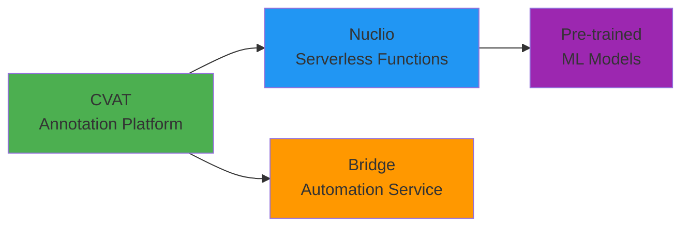

# Production Setup for End Users

Set up the QUADRATSEG platform for processing coral quadrat images in a production environment. This guide is for **coral researchers** who want to upload images and get automated segmentation results.

!!! info "For Coral Researchers"
    This setup uses **Docker only**—no Pixi required. All ML models are pre-packaged and served via Nuclio serverless functions.

**Time Required**: 20-30 minutes
**Target Users**: Coral researchers, marine biologists, reef monitoring teams

## What You'll Install



- **CVAT**: Web interface for viewing, annotating, and managing images
- **Nuclio**: Serverless platform that hosts ML models (downloaded during deployment)
- **Bridge**: Automation service that orchestrates the pipeline via webhooks
- **ML Models**: Pre-trained models for grid detection, removal, and coral segmentation

## Prerequisites

Before starting, ensure you have:

### System Requirements

- [x] **Operating System**: Linux (Ubuntu 20.04+ recommended) or macOS
- [x] **Docker**: Version 20.10+ ([install guide](https://docs.docker.com/engine/install/))
- [x] **Docker Compose**: Version 2.0+ (included with Docker Desktop)
- [x] **NVIDIA GPU**: 8GB+ VRAM recommended (GTX 1070 or better)
- [x] **NVIDIA Docker Runtime**: For GPU acceleration ([install guide](https://github.com/NVIDIA/nvidia-docker))
- [x] **Disk Space**: 20GB+ free space for Docker images and models
- [x] **Memory**: 16GB+ RAM recommended

### Verify GPU Support

```bash
# Test NVIDIA Docker runtime
docker run --rm --gpus all nvidia/cuda:12.0.0-base-ubuntu20.04 nvidia-smi

# Expected: GPU information displayed
# If error, install nvidia-docker2 package
```

### Docker Version Compatibility

!!! warning "Docker 29+ Users Required Action"
    If using Docker 29.0.1+, you must relax Docker's minimum API version **before** deployment.

    **Quick Fix**:
    ```bash
    # 1. Edit daemon config
    sudo nano /etc/docker/daemon.json
    # Add: {"min-api-version": "1.24"}

    # 2. Restart Docker
    sudo systemctl restart docker
    ```

    **Why?** CVAT 2.29.0 uses older Docker clients that are incompatible with Docker 29+ defaults.

    **Note**: Docker 27.x and earlier work without this workaround.

    See [detailed instructions](../setup/installation/for-end-users/1-docker-deployment.md) for more information.

## Step 1: Clone the Repository

```bash
# Clone the CRIOBE fork of CVAT (use criobe branch)
git clone --recurse-submodules -b criobe https://github.com/criobe/cvat.git
cd cvat

# Verify you're on the criobe branch
git branch
# Should show: * criobe

# The repository includes:
# - cvat/ - CVAT core platform
# - serverless/ - Nuclio serverless functions
# - bridge/ - Automation service
```

!!! warning "Important: Use criobe Branch"
    The CRIOBE platform **must** use the `criobe` branch of the CVAT repository, **not** the `main` branch. The criobe branch includes custom integrations for the bridge service and serverless components.

## Step 2: Deploy Basic CVAT

Deploy CVAT using the official pre-built images for version 2.29.0:

```bash
# Deploy CVAT 2.29.0
CVAT_VERSION=v2.29.0 docker compose up -d

# Check deployment status
docker compose ps
```

**Expected Output**:
```
[+] Running 10/10
 ✔ Network cvat_cvat                  Created
 ✔ Volume cvat_cvat_data              Created
 ✔ Container cvat_redis               Started
 ✔ Container cvat_db                  Started
 ✔ Container cvat_server              Started
 ✔ Container cvat_worker_webhooks     Started
 ...
```

**Deployment Time**: 3-5 minutes

## Step 3: Create Superuser

Create the admin user for CVAT. These credentials will be used to configure the Bridge service in the next step.

```bash
# Create superuser (interactive)
docker exec -it cvat_server bash -ic 'python3 ~/manage.py createsuperuser'
```

You'll be prompted to enter:
- **Username**: Choose a username (e.g., `admin`)
- **Email address**: Your email address
- **Password**: Choose a secure password
- **Password (again)**: Confirm password

!!! important "Remember These Credentials"
    Save the username and password you just created. You'll need them in the next step to configure the Bridge service.

## Step 4: Configure Bridge

Configure the Bridge service to connect to CVAT using the superuser credentials from Step 3:

```bash
# Navigate to bridge directory
cd bridge

# Copy example configuration
cp .env.example .env

# Edit bridge configuration
nano .env
```

**Bridge Configuration** (in `bridge/.env`):

```bash
# CVAT Connection
CVAT_URL=http://cvat_server:8080
CVAT_USERNAME=admin  # Use the username from Step 3
CVAT_PASSWORD=your_password_here  # Use the password from Step 3

# Nuclio Connection
NUCLIO_HOST=nuclio
NUCLIO_PORT=8070

# Bridge Server
BRIDGE_PORT=8000

# Logging
LOG_LEVEL=INFO
```

**Return to CVAT root directory:**

```bash
cd ..
pwd
# Should show: /path/to/cvat
```

## Step 5: Deploy Bridge and Nuclio

Deploy the Bridge automation service and Nuclio serverless platform:

```bash
# Build bridge and rebuild CVAT components
docker compose -f docker-compose.yml \
  -f bridge/docker-compose.bridge.yml \
  -f components/serverless/docker-compose.serverless.yml \
  up -d --build bridge cvat_server cvat_worker_webhooks

# Start all remaining services
docker compose -f docker-compose.yml \
  -f bridge/docker-compose.bridge.yml \
  -f components/serverless/docker-compose.serverless.yml \
  up -d
```

**Expected Output**:
```
[+] Running 12/12
 ✔ Container nuclio_dashboard         Started
 ✔ Container bridge                   Started
 ✔ Container cvat_server              Started
 ✔ Container cvat_worker_webhooks     Started
 ...
```

**Deployment Time**: 3-5 minutes

## Step 6: Verify Services

Check that all services are running:

```bash
# Check container status
docker compose ps

# All containers should show "Up" status
# Key services:
# - cvat_server (port 8080)
# - nuclio_dashboard (port 8070)
# - bridge (port 8000)
# - cvat_db (postgres)
# - cvat_redis
# - cvat_worker_webhooks (important for automation!)
```

**Health Checks**:

```bash
# Test CVAT
curl http://localhost:8080/api/server/about
# Expected: JSON response with CVAT version

# Test Nuclio Dashboard
curl -I http://localhost:8070
# Expected: "OK"

# Test Bridge
curl http://localhost:8000/health
# Expected: {"status": "healthy"}
```

If any service fails, check logs:

```bash
# View logs for specific service
docker compose logs cvat_server
docker compose logs bridge
docker compose logs nuclio_dashboard

# Follow logs in real-time
docker compose logs -f cvat_server
```

## Step 7: Deploy ML Models (Nuclio Functions)

Deploy the pre-trained models as Nuclio serverless functions. Models are automatically downloaded during deployment.

### 7.1: Install Nuclio CLI

```bash
# Download nuctl CLI
wget https://github.com/nuclio/nuclio/releases/download/1.13.0/nuctl-1.13.0-linux-amd64
chmod +x nuctl-1.13.0-linux-amd64
sudo mv nuctl-1.13.0-linux-amd64 /usr/local/bin/nuctl

# Verify installation
nuctl version
```

### 7.2: Create Nuclio Project

Before deploying functions, create the `cvat` project in Nuclio:

```bash
# Create the Nuclio project
nuctl create project cvat --platform local

# Verify project was created
nuctl get projects --platform local
# Expected output: cvat project listed
```

**Expected Output**:
```
Project 'cvat' created successfully
```

!!! warning "Required Prerequisite"
    All Nuclio functions must be deployed to a project. The `cvat` project must exist before running any `nuctl deploy --project-name cvat` commands. Without it, deployment will fail with:
    ```
    Error - Project does not exist
        ...//nuclio/pkg/platform/abstract/platform.go:459
    ```

### 7.3: Deploy Core Processing Functions

Each Nuclio function is packaged in `serverless/pytorch/<framework>/<function-name>/nuclio/` with nested organization (e.g., `yolo/`, `mmseg/`, `lama/`):
- Inference code
- `function.yaml` describing the Docker build
- Model download URLs (models downloaded during build)

**Deploy Grid Corner Detection**:

```bash
cd serverless/pytorch/yolo/gridcorners/nuclio

# Deploy function (model downloads during build)
nuctl deploy --project-name cvat \
  --path . \
  --file function.yaml \
  --platform local \
  --verbose

# Build time: 5-10 minutes (includes model download)
```

**Expected Output**:
```
Deploying function pth-yolo-gridcorners...
Building function image...
Downloading model: gridcorners_yolov11n_best.pt...
Function deployed successfully
Function URL: http://localhost:49152
```

**Deploy Additional Functions**:

```bash
# Grid Pose Detection (117 keypoints)
cd ../gridpose/nuclio
nuctl deploy --project-name cvat --path . --file function.yaml --platform local -v

# Grid Removal (Inpainting)
cd ../../lama/nuclio
nuctl deploy --project-name cvat --path . --file function.yaml --platform local -v

# Coral Segmentation (CRIOBE Finegrained)
cd ../yolo/coralsegv4/nuclio
nuctl deploy --project-name cvat --path . --file function.yaml --platform local -v

# Coral Segmentation (Banggai Extended)
cd ../coralsegbanggai/nuclio
nuctl deploy --project-name cvat --path . --file function.yaml --platform local -v

# Two-Stage Segmentation (Highest Accuracy)
cd ../../mmseg/coralscopsegformer/nuclio
nuctl deploy --project-name cvat --path . --file function.yaml --platform local -v
```

**Total Deployment Time**: 30-60 minutes (models download in parallel during builds)

### 7.4: Verify Deployed Functions

```bash
# List all deployed functions
nuctl get functions --platform local

# Expected output:
# NAME                              PROJECT  STATE  REPLICAS
# pth-yolo-gridcorners             cvat     ready  1/1
# pth-yolo-gridpose                cvat     ready  1/1
# pth-lama                         cvat     ready  1/1
# pth-yolo-coralsegv4              cvat     ready  1/1
# pth-yolo-coralsegbanggai         cvat     ready  1/1
# pth-mmseg-coralscopsegformer     cvat     ready  1/1
```

**Test a Function**:

```bash
# Get function details
nuctl get function pth-yolo-gridcorners --platform local

# Test with sample image (if you have one)
echo '{"image": "'$(base64 -w0 sample.jpg)'"}' | \
  curl -X POST -H "Content-Type: application/json" \
  -d @- http://localhost:49152  # Use port from function URL
```

## Step 8: Access CVAT

Your CVAT instance is now ready!

1. **Open Browser**: Navigate to http://localhost:8080
2. **Login**: Use the superuser credentials from Step 3
    - Username: (your chosen username)
    - Password: (your chosen password)
3. **Explore Interface**:
    - **Projects**: Create and manage annotation projects
    - **Tasks**: Upload images and create annotation tasks
    - **Jobs**: Annotate images and review results

## Step 9: Configure CVAT Projects

Set up the recommended 3-stage pipeline with separate projects:

### Project 1: Corner Detection

1. **Create Project**: Projects → + Create Project
2. **Name**: `corner_detection`
3. **Labels**: Add single label `corner` (type: points/skeleton)
4. **Save Project** → Note the Project ID (e.g., ID: 1)

### Project 2: Grid Detection

1. **Create Project**: Projects → + Create Project
2. **Name**: `grid_detection`
3. **Labels**: Add label `grid_point` or use skeleton with 117 keypoints
4. **Save Project** → Note the Project ID (e.g., ID: 2)

### Project 3: Coral Segmentation

1. **Create Project**: Projects → + Create Project
2. **Name**: `coral_segmentation`
3. **Labels**: Add coral genus/species labels:
    - `Acropora`
    - `Pocillopora`
    - `Porites`
    - `Montipora`
    - `Pavona`
    - (Add more based on your needs)
4. **Label Type**: Polygon or mask
5. **Save Project** → Note the Project ID (e.g., ID: 3)

## Step 10: Configure Webhooks

Connect projects to automation via webhooks:

### Webhook 1: Corner Detection → Grid Detection

1. Open **Project 1** (corner_detection)
2. **Actions** → **Setup Webhooks**
3. **Add Webhook**:
    - **URL**: `http://bridge.gateway:8000/crop-quadrat-and-create-new-task-webhook?target_proj_id=2`
    - **Content Type**: `application/json`
    - **Events**: Check `task` and `job`
    - **Active**: ✅ Enabled
4. **Ping** to test connection
5. **Submit** to save

### Webhook 2: Grid Detection → Coral Segmentation

1. Open **Project 2** (grid_detection)
2. **Actions** → **Setup Webhooks**
3. **Add Webhook**:
    - **URL**: `http://bridge.gateway:8000/remove-grid-and-create-new-task-webhook?target_proj_id=3`
    - **Content Type**: `application/json`
    - **Events**: Check `task` and `job`
    - **Active**: ✅ Enabled
4. **Ping** to test, then **Submit**

### Webhook 3: Automatic Model Detection

Add model inference webhooks to each project:

#### Project 1 - Auto-detect Corners

- **URL**: `http://bridge.gateway:8000/detect-model-webhook?model_name=pth-yolo-gridcorners`
- **Events**: Check `job` only
- **Description**: Auto-detect grid corners

#### Project 2 - Auto-detect Grid

- **URL**: `http://bridge.gateway:8000/detect-model-webhook?model_name=pth-yolo-gridpose`
- **Events**: Check `job` only
- **Description**: Auto-detect grid pose

#### Project 3 - Auto-segment Corals

- **URL**: `http://bridge.gateway:8000/detect-model-webhook?model_name=pth-yolo-coralsegv4&conv_mask_to_poly=true`
- **Events**: Check `job` only
- **Description**: Auto-segment corals

!!! tip "Webhook Testing"
    Use the **Ping** button to verify each webhook connects successfully before proceeding.

## Step 11: Test the Pipeline

Create a test task to verify the complete pipeline:

1. **Upload Test Image**:
    - Go to Project 1 (corner_detection)
    - Create new task: **+ Create Task**
    - Name: `test_001`
    - Upload 1-2 coral quadrat images
    - Submit

2. **Open Job**:
    - Job status → "In Progress" (triggers model webhook)
    - Wait 5-10 seconds
    - Refresh page
    - **4 corner points should appear automatically**

3. **Mark Task Complete**:
    - If corners look correct, mark task as **Completed**
    - This triggers the crop-and-create webhook
    - Check Project 2 for new task with warped image

4. **Grid Detection**:
    - Open new task in Project 2
    - Open job (triggers grid detection model)
    - Wait 10-15 seconds, refresh
    - **117 grid points should appear**
    - Mark task as **Completed**

5. **Coral Segmentation**:
    - Check Project 3 for new task with grid-removed image
    - Open job (triggers coral segmentation)
    - Wait 15-30 seconds, refresh
    - **Coral polygons should appear with species labels**

6. **Review Results**:
    - Verify species classifications
    - Adjust polygon boundaries if needed
    - Export annotations: Task Actions → Export Dataset

## Troubleshooting

### Webhooks Not Firing

**Symptoms**: Task completes but no new task created in target project

**Solutions**:
```bash
# Check bridge is accessible from CVAT
docker exec cvat_server curl http://bridge.gateway:8000/health

# Verify extra_hosts in docker-compose.yml includes:
extra_hosts:
  - "bridge.gateway:host-gateway"

# Check Smokescreen allows gateway IP
# In docker-compose.yml, cvat_server environment:
SMOKESCREEN_OPTS: "--allow-address=172.17.0.1"

# View webhook delivery logs in CVAT
# Project → Webhooks → View deliveries table
# Should show HTTP 200 responses
```

### Model Not Running

**Symptoms**: Job opens but no predictions appear

**Solutions**:
```bash
# List Nuclio functions
nuctl get functions --platform local

# Check function logs
docker logs <function-container-id>

# Test function directly
curl http://localhost:<function-port>

# Verify function is on cvat_cvat network
docker network inspect cvat_cvat
```

### GPU Not Available in Nuclio

**Symptoms**: Functions deployed but inference is very slow

**Solutions**:
```bash
# Verify GPU accessible in Docker
docker run --rm --gpus all nvidia/cuda:12.0.0-base-ubuntu20.04 nvidia-smi

# Check function.yaml has GPU configuration:
# spec:
#   runtime: python:3.9
#   resources:
#     limits:
#       nvidia.com/gpu: 1

# Redeploy function with GPU support
nuctl delete function <name> --platform local
nuctl deploy --project-name cvat --path . --file function.yaml --platform local -v
```

### Bridge Service Errors

**Symptoms**: Webhook returns HTTP 500 errors

**Solutions**:
```bash
# Check bridge logs
docker compose logs bridge -f

# Common issues:
# - CVAT credentials incorrect in bridge/.env
# - Target project ID doesn't exist
# - Insufficient annotations (need 4 corners minimum)
# - CVAT API changes (check bridge version)

# Restart bridge
docker compose restart bridge
```

## What's Next?

!!! success "Production Setup Complete!"
    Your QUADRATSEG platform is ready for processing coral quadrat images!

**Next Steps**:

1. **[Create Your First Annotation](first-annotation.md)** - Detailed walkthrough
2. **Upload Your Own Images** - Start processing your coral data
3. **Review Pipeline Results** - Learn to interpret and refine outputs
4. **Export Annotations** - Get data for statistical analysis

**For Production Use**:

- Set up regular database backups
- Configure SSL/TLS for external access
- Adjust resource limits based on load
- Monitor disk space for datasets and models

**For Developers**:

If you need to train custom models or experiment with architectures, proceed to the [Developer Setup](developer-setup.md) guide.

## Quick Reference

### Service URLs

- **CVAT**: http://localhost:8080
- **Nuclio Dashboard**: http://localhost:8070
- **Bridge API Docs**: http://localhost:8000/docs
- **Bridge Health**: http://localhost:8000/health

### Common Commands

```bash
# Start services
docker compose -f docker-compose.yml \
  -f components/serverless/docker-compose.serverless.yml \
  -f bridge/docker-compose.bridge.yml \
  up -d

# Stop services
docker compose down

# View logs
docker compose logs -f cvat_server
docker compose logs -f bridge

# Restart specific service
docker compose restart bridge

# List Nuclio functions
nuctl get functions --platform local

# Redeploy Nuclio function
cd serverless/pytorch/<framework>/<function-name>/nuclio
nuctl deploy --project-name cvat --path . --file function.yaml --platform local -v
```

### Webhook URL Templates

```bash
# Crop and create new task
http://bridge.gateway:8000/crop-quadrat-and-create-new-task-webhook?target_proj_id=<ID>

# Remove grid and create new task
http://bridge.gateway:8000/remove-grid-and-create-new-task-webhook?target_proj_id=<ID>

# Run model detection
http://bridge.gateway:8000/detect-model-webhook?model_name=<MODEL_NAME>&conv_mask_to_poly=<BOOL>
```

---

**Questions?** See [Getting Help](../community/index.md) or check the [first annotation tutorial](first-annotation.md).
