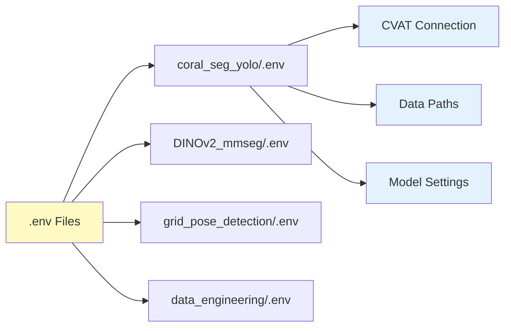

# Environment Variables

Configure module-specific environment variables for CVAT integration, data paths, and training settings.

!!! info "For Developers"
    This guide configures **`.env` files** for each module to connect to CVAT, set data paths, and configure module-specific settings for training and experimentation.

**Time Required**: 15-20 minutes
**Prerequisites**: [Module environments installed](../../installation/for-developers/2-module-environments.md)

## Environment Variables Overview

Each module uses a `.env` file for configuration:



## Common Environment Variables

These variables are used across multiple modules:

### CVAT Connection Settings

```bash
# CVAT server URL (local or remote)
FIFTYONE_CVAT_URL=http://localhost:8080

# CVAT credentials
FIFTYONE_CVAT_USERNAME=admin
FIFTYONE_CVAT_PASSWORD=your_password_here

# CVAT API token (alternative to username/password)
CVAT_API_TOKEN=your_token_here
```

### Data Path Settings

```bash
# Root directory for all data
DATA_ROOT=./data

# Media directory (images from CVAT)
MEDIA_DIR=data/media

# FiftyOne exports directory
PULLED_DIR=data/pulled_from_cvat

# Prepared training data directory
PREPARED_DIR=data/prepared_yolo
```

### Training Settings

```bash
# Device configuration
DEVICE=cuda  # or cpu
GPU_ID=0

# Number of workers for data loading
NUM_WORKERS=4

# Random seed for reproducibility
RANDOM_SEED=42
```

## Step 1: Configure data_engineering Module

This is the primary module for CVAT integration and dataset management:

### Create .env File

```bash
cd ~/Projects/coral-segmentation/data_engineering

# Copy example configuration
cp .env.example .env

# Edit with your settings
nano .env  # or your preferred editor
```

### data_engineering/.env Configuration

```bash
# =============================================================================
# CVAT Connection Settings
# =============================================================================
# CVAT server URL
FIFTYONE_CVAT_URL=http://localhost:8080

# CVAT credentials
FIFTYONE_CVAT_USERNAME=admin
FIFTYONE_CVAT_PASSWORD=your_secure_password

# Optional: API token (if using token authentication)
# CVAT_API_TOKEN=your_api_token_here

# =============================================================================
# FiftyOne Settings (Centralized MongoDB)
# =============================================================================
# MongoDB connection (recommended - shared across all Python environments)
FIFTYONE_DATABASE_URI=mongodb://localhost:27017
FIFTYONE_DATABASE_NAME=fiftyone

# FiftyOne dataset directory (persistent storage)
FIFTYONE_DATASET_DIR=./data/fiftyone_datasets

# Default app host/port
FIFTYONE_APP_HOST=localhost
FIFTYONE_APP_PORT=5151

# =============================================================================
# Data Paths
# =============================================================================
# Root data directory
DATA_ROOT=./data

# Media directory (images from CVAT)
MEDIA_DIR=data/media

# Pulled annotations directory
PULLED_DIR=data/pulled_from_cvat

# =============================================================================
# Dataset Settings
# =============================================================================
# Default annotation field name
GT_FIELD_NAME=gt_polylines

# Label taxonomies to use
LABEL_TAXONOMY=finegrained  # finegrained, extended, main_families, agnostic

# =============================================================================
# Processing Settings
# =============================================================================
# Number of parallel workers
NUM_WORKERS=4

# Verbose logging
VERBOSE=true
```

### Test CVAT Connection

```bash
cd ~/Projects/coral-segmentation/data_engineering

# Test connection
pixi run python -c "
import os
from dotenv import load_dotenv
from cvat_sdk import Client

# Load environment variables
load_dotenv()

# Connect to CVAT
url = os.getenv('FIFTYONE_CVAT_URL')
username = os.getenv('FIFTYONE_CVAT_USERNAME')
password = os.getenv('FIFTYONE_CVAT_PASSWORD')

client = Client(url)
client.login((username, password))

print(f'✓ Connected to CVAT at {url}')
print(f'✓ Logged in as {username}')

# List projects
projects = list(client.projects.list())
print(f'✓ Found {len(projects)} projects')
for p in projects[:5]:
    print(f'  - {p.name} (ID: {p.id})')
"
```

**Expected Output**:
```
✓ Connected to CVAT at http://localhost:8080
✓ Logged in as admin
✓ Found 8 projects
  - corner_detection (ID: 1)
  - grid_detection (ID: 2)
  - coral_segmentation (ID: 3)
  - criobe_finegrained_annotated (ID: 4)
  - banggai_extended_annotated (ID: 5)
```

## Step 2: Configure coral_seg_yolo Module

### Create .env File

```bash
cd ~/Projects/coral-segmentation/coral_seg_yolo

# Copy example
cp .env.example .env

# Edit
nano .env
```

### coral_seg_yolo/.env Configuration

```bash
# =============================================================================
# CVAT Connection (for dataset pulling)
# =============================================================================
FIFTYONE_CVAT_URL=http://localhost:8080
FIFTYONE_CVAT_USERNAME=admin
FIFTYONE_CVAT_PASSWORD=your_secure_password

# =============================================================================
# FiftyOne Settings (Centralized MongoDB)
# =============================================================================
FIFTYONE_DATABASE_URI=mongodb://localhost:27017
FIFTYONE_DATABASE_NAME=fiftyone

# =============================================================================
# Data Paths
# =============================================================================
DATA_ROOT=./data
MEDIA_DIR=data/media
PULLED_DIR=data/pulled_from_cvat
PREPARED_DIR=data/prepared_yolo

# =============================================================================
# Training Settings
# =============================================================================
# Device
DEVICE=cuda
GPU_ID=0

# Training hyperparameters (can be overridden in config files)
BATCH_SIZE=8
NUM_WORKERS=4
EPOCHS=100

# Image size
IMGSZ=1920

# Random seed
RANDOM_SEED=42

# =============================================================================
# Model Settings
# =============================================================================
# Model architecture
MODEL_SIZE=m  # n, s, m, l, x

# Pre-trained weights path
PRETRAINED_WEIGHTS=models/coralsegv4_yolo11m_best.pt

# =============================================================================
# Logging and Checkpoints
# =============================================================================
# Experiment name
EXPERIMENT_NAME=coral_seg_yolo

# Output directory
OUTPUT_DIR=runs

# Checkpoint directory
CHECKPOINT_DIR=runs/checkpoints

# Tensorboard logs
TENSORBOARD_DIR=runs/tensorboard

# Save checkpoints every N epochs
SAVE_PERIOD=10

# =============================================================================
# Evaluation Settings
# =============================================================================
# Confidence threshold for evaluation
CONF_THRESHOLD=0.25

# IoU threshold for NMS
IOU_THRESHOLD=0.7

# Maximum detections per image
MAX_DET=300
```

### Test Configuration

```bash
cd ~/Projects/coral-segmentation/coral_seg_yolo

# Test configuration loading
pixi run python -c "
import os
from dotenv import load_dotenv
from pathlib import Path

load_dotenv()

print('✓ Environment variables loaded:')
print(f'  DATA_ROOT: {os.getenv(\"DATA_ROOT\")}')
print(f'  DEVICE: {os.getenv(\"DEVICE\")}')
print(f'  BATCH_SIZE: {os.getenv(\"BATCH_SIZE\")}')
print(f'  MODEL_SIZE: {os.getenv(\"MODEL_SIZE\")}')

# Check paths exist
data_root = Path(os.getenv('DATA_ROOT'))
if data_root.exists():
    print(f'✓ Data root exists: {data_root}')
else:
    print(f'✗ Data root not found: {data_root}')
    data_root.mkdir(parents=True, exist_ok=True)
    print(f'✓ Created data root: {data_root}')
"
```

## Step 3: Configure DINOv2_mmseg Module

### Create .env File

```bash
cd ~/Projects/coral-segmentation/DINOv2_mmseg

# Copy example
cp .env.example .env

# Edit
nano .env
```

### DINOv2_mmseg/.env Configuration

```bash
# =============================================================================
# CVAT Connection
# =============================================================================
FIFTYONE_CVAT_URL=http://localhost:8080
FIFTYONE_CVAT_USERNAME=admin
FIFTYONE_CVAT_PASSWORD=your_secure_password

# =============================================================================
# FiftyOne Settings (Centralized MongoDB)
# =============================================================================
FIFTYONE_DATABASE_URI=mongodb://localhost:27017
FIFTYONE_DATABASE_NAME=fiftyone

# =============================================================================
# Data Paths
# =============================================================================
DATA_ROOT=./data
MEDIA_DIR=data/media
PULLED_DIR=data/pulled_from_cvat
PREPARED_DIR=data/prepared_mmseg

# =============================================================================
# Training Settings
# =============================================================================
DEVICE=cuda
GPU_ID=0
BATCH_SIZE=4  # Smaller for DINOv2 (large model)
NUM_WORKERS=4
EPOCHS=150

# =============================================================================
# Model Settings
# =============================================================================
# DINOv2 backbone
DINOV2_MODEL=vitb14  # vits14, vitb14, vitl14, vitg14

# Segmentation head
SEG_HEAD=segformer  # segformer, upernet

# Pre-trained weights
DINOV2_WEIGHTS=assets/pretrained_models/dinov2_vitb14_pretrain.pth
SEGFORMER_WEIGHTS=assets/best_mIoU_epoch_140.pth
SAM_WEIGHTS=assets/pretrained_models/vit_b_coralscop.pth

# =============================================================================
# Two-Stage Settings (CoralSCoP)
# =============================================================================
# Enable two-stage inference
USE_CORALSCOP=true

# SAM refinement settings
SAM_STABILITY_SCORE_THRESH=0.92
SAM_PRED_IOU_THRESH=0.88

# =============================================================================
# Output Settings
# =============================================================================
OUTPUT_DIR=work_dirs
CHECKPOINT_DIR=work_dirs/checkpoints
LOG_DIR=work_dirs/logs
```

## Step 4: Configure grid_pose_detection Module

### Create .env File

```bash
cd ~/Projects/coral-segmentation/grid_pose_detection

# Copy example
cp .env.example .env

# Edit
nano .env
```

### grid_pose_detection/.env Configuration

```bash
# =============================================================================
# CVAT Connection
# =============================================================================
FIFTYONE_CVAT_URL=http://localhost:8080
FIFTYONE_CVAT_USERNAME=admin
FIFTYONE_CVAT_PASSWORD=your_secure_password

# =============================================================================
# FiftyOne Settings (Centralized MongoDB)
# =============================================================================
FIFTYONE_DATABASE_URI=mongodb://localhost:27017
FIFTYONE_DATABASE_NAME=fiftyone

# =============================================================================
# Data Paths
# =============================================================================
DATA_ROOT=./data
MEDIA_DIR=data/media
PULLED_DIR=data/pulled_from_cvat
PREPARED_DIR=data/prepared_yolo

# =============================================================================
# Training Settings
# =============================================================================
DEVICE=cuda
GPU_ID=0
BATCH_SIZE=16  # Smaller model, larger batch size
NUM_WORKERS=4
EPOCHS=100

# =============================================================================
# Model Settings
# =============================================================================
# Task type
TASK=gridcorners  # gridcorners or gridpose

# Model size
MODEL_SIZE=n  # n (nano) for efficiency

# Pre-trained weights
GRIDCORNERS_WEIGHTS=assets/gridcorners_yolov11n_best.pt
GRIDPOSE_WEIGHTS=assets/gridpose_yolov11n_best.pt

# Keypoint templates
KP_TEMPLATE_CORNERS=assets/kp_template_corners.npy
KP_TEMPLATE_POSE=assets/kp_template_pose.npy

# =============================================================================
# Inference Settings
# =============================================================================
# Confidence threshold
CONF_THRESHOLD=0.5

# Hungarian matching threshold (for corners)
HUNGARIAN_THRESH=0.3

# =============================================================================
# Output Settings
# =============================================================================
OUTPUT_DIR=runs
CHECKPOINT_DIR=runs/checkpoints
```

## Step 5: Configure grid_inpainting Module

### Create .env File

```bash
cd ~/Projects/coral-segmentation/grid_inpainting

# Copy example
cp .env.example .env

# Edit
nano .env
```

### grid_inpainting/.env Configuration

```bash
# =============================================================================
# Data Paths
# =============================================================================
DATA_ROOT=./data
INPUT_DIR=data/input
OUTPUT_DIR=data/output

# =============================================================================
# Model Settings
# =============================================================================
# SimpleLama model path
LAMA_WEIGHTS=assets/big-lama

# Device
DEVICE=cuda
GPU_ID=0

# =============================================================================
# Inpainting Settings
# =============================================================================
# Grid line thickness for mask generation
GRID_LINE_THICKNESS=8

# Dilation iterations for mask
MASK_DILATION=2

# Number of keypoints expected
NUM_KEYPOINTS=117

# =============================================================================
# Processing Settings
# =============================================================================
# Batch processing
BATCH_SIZE=1  # Inpainting is memory-intensive

# Number of workers
NUM_WORKERS=2
```

## Centralized FiftyOne Database with MongoDB

When FiftyOne is installed across multiple Python environments (e.g., different Pixi modules), each environment may create its own local database. This can lead to:

- Dataset fragmentation across environments
- MongoDB version conflicts between environments
- Difficulty sharing datasets between modules

**Solution**: Deploy a centralized MongoDB database using Docker that all environments connect to.

### Deploy MongoDB with Docker

```bash
# Create and run a MongoDB container
# - No authentication required (FiftyOne connects without password)
# - Restarts automatically on system boot (Linux) or Docker Desktop start (Windows/macOS)
docker run -d \
  --name fiftyone-mongodb \
  --restart unless-stopped \
  -p 27017:27017 \
  -v fiftyone-mongo-data:/data/db \
  mongo:latest

# Verify it's running
docker ps | grep fiftyone-mongodb
```

!!! info "Automatic Restart"
    The `--restart unless-stopped` flag ensures MongoDB starts automatically:

    - **Linux**: Container restarts when the system boots
    - **Windows/macOS**: Container restarts when Docker Desktop starts

### Configure Environment Variables

Add these variables to each module's `.env` file:

```bash
# MongoDB connection for FiftyOne
FIFTYONE_DATABASE_URI=mongodb://localhost:27017
FIFTYONE_DATABASE_NAME=fiftyone
```

### Benefits

- **Single database**: All datasets accessible from any Python environment
- **Version consistency**: Avoids MongoDB version conflicts between Pixi environments
- **Easy sharing**: Datasets created in one module are immediately available in others
- **Persistent storage**: Data persists in Docker volume across container restarts

### Verify Connection

```bash
pixi run python -c "
import fiftyone as fo

# This will use the MongoDB specified in FIFTYONE_DATABASE_URI
datasets = fo.list_datasets()
print(f'✓ Connected to centralized MongoDB')
print(f'✓ Found {len(datasets)} datasets')
for ds in datasets[:5]:
    print(f'  - {ds}')
"
```

## Environment Variables Reference

### Complete Variable List

| Variable | Purpose | Default | Used In |
|----------|---------|---------|---------|
| **CVAT Connection** | | | |
| `FIFTYONE_CVAT_URL` | CVAT server URL | `http://localhost:8080` | All modules with CVAT |
| `FIFTYONE_CVAT_USERNAME` | CVAT username | `admin` | All modules with CVAT |
| `FIFTYONE_CVAT_PASSWORD` | CVAT password | Required | All modules with CVAT |
| `CVAT_API_TOKEN` | Alternative auth | Optional | All modules with CVAT |
| **FiftyOne Settings** | | | |
| `FIFTYONE_DATABASE_URI` | MongoDB connection URI | `mongodb://localhost:27017` | All modules |
| `FIFTYONE_DATABASE_NAME` | MongoDB database name | `fiftyone` | All modules |
| **Data Paths** | | | |
| `DATA_ROOT` | Root data directory | `./data` | All modules |
| `MEDIA_DIR` | Images from CVAT | `data/media` | All modules |
| `PULLED_DIR` | FiftyOne exports | `data/pulled_from_cvat` | All modules |
| `PREPARED_DIR` | Training data | `data/prepared_*` | Training modules |
| **Training Settings** | | | |
| `DEVICE` | Device to use | `cuda` | All training modules |
| `GPU_ID` | GPU device ID | `0` | All training modules |
| `BATCH_SIZE` | Training batch size | Varies | All training modules |
| `NUM_WORKERS` | Data loader workers | `4` | All training modules |
| `EPOCHS` | Training epochs | Varies | All training modules |
| `RANDOM_SEED` | Random seed | `42` | All training modules |
| **Model Settings** | | | |
| `MODEL_SIZE` | Model architecture | Varies | YOLO modules |
| `PRETRAINED_WEIGHTS` | Model checkpoint | Module-specific | All modules |
| **Output Settings** | | | |
| `OUTPUT_DIR` | Output directory | `runs/` or `work_dirs/` | All training modules |
| `CHECKPOINT_DIR` | Checkpoint storage | `runs/checkpoints/` | All training modules |

## Advanced Configuration

### Using Environment-Specific .env Files

For different environments (dev, staging, prod):

```bash
# Create environment-specific files
.env.dev
.env.staging
.env.prod

# Load specific environment
export ENV=dev
cp .env.$ENV .env

# Or use in scripts
pixi run python train.py --env-file .env.dev
```

### Using .env in Python Scripts

```python
from dotenv import load_dotenv
import os

# Load .env file
load_dotenv()

# Access variables
cvat_url = os.getenv('FIFTYONE_CVAT_URL')
batch_size = int(os.getenv('BATCH_SIZE', '8'))
device = os.getenv('DEVICE', 'cuda')

print(f'Training on {device} with batch size {batch_size}')
```

### Override from Command Line

```bash
# Override environment variable for single run
BATCH_SIZE=16 pixi run python train.py

# Multiple overrides
BATCH_SIZE=16 EPOCHS=50 DEVICE=cpu pixi run python train.py
```

## Security Best Practices

### Protecting Credentials

**1. Never commit .env files**:
```bash
# Ensure .env is in .gitignore
echo ".env" >> .gitignore
echo ".env.*" >> .gitignore
git add .gitignore
```

**2. Use .env.example as template**:
```bash
# Create example with placeholder values
cp .env .env.example

# Edit .env.example to remove sensitive values
# Replace with placeholders:
# FIFTYONE_CVAT_PASSWORD=your_password_here
```

**3. Use API tokens instead of passwords** (when possible):
```bash
# Generate token in CVAT UI: User menu → Settings → API Tokens
CVAT_API_TOKEN=your_generated_token
# Remove username/password
```

**4. Restrict file permissions**:
```bash
# Make .env readable only by owner
chmod 600 .env
```

## Troubleshooting

### .env File Not Loaded

**Symptoms**: Variables not accessible in scripts

**Solutions**:
```python
# Ensure load_dotenv() is called
from dotenv import load_dotenv
load_dotenv()  # Add this at the top of your script

# Or specify path explicitly
from pathlib import Path
env_path = Path('.') / '.env'
load_dotenv(dotenv_path=env_path)

# Debug: print loaded variables
import os
print(f"CVAT_URL: {os.getenv('FIFTYONE_CVAT_URL')}")
```

### CVAT Connection Fails

**Symptoms**: `cvat_sdk.exceptions.UnauthorizedError`

**Solutions**:
```bash
# Verify credentials in .env
cat .env | grep CVAT

# Test connection manually
cd data_engineering
pixi run python -c "
from dotenv import load_dotenv
import os
load_dotenv()

from cvat_sdk import Client
url = os.getenv('FIFTYONE_CVAT_URL')
username = os.getenv('FIFTYONE_CVAT_USERNAME')
password = os.getenv('FIFTYONE_CVAT_PASSWORD')

print(f'Connecting to: {url}')
print(f'Username: {username}')

try:
    client = Client(url)
    client.login((username, password))
    print('✓ Connection successful')
except Exception as e:
    print(f'✗ Connection failed: {e}')
"

# Common issues:
# - Wrong URL (check http:// vs https://)
# - Wrong credentials
# - CVAT server not running
# - Network firewall blocking connection
```

### Path Not Found Errors

**Symptoms**: `FileNotFoundError: [Errno 2] No such file or directory`

**Solutions**:
```bash
# Check if paths in .env are correct
cat .env | grep DIR

# Paths should be relative to module root
# ✓ Correct: DATA_ROOT=./data
# ✗ Wrong: DATA_ROOT=/absolute/path/data

# Create missing directories
mkdir -p data/media data/pulled_from_cvat data/prepared_yolo

# Verify from Python
pixi run python -c "
from dotenv import load_dotenv
from pathlib import Path
import os

load_dotenv()
data_root = Path(os.getenv('DATA_ROOT'))
print(f'Data root: {data_root.absolute()}')
print(f'Exists: {data_root.exists()}')

if not data_root.exists():
    data_root.mkdir(parents=True, exist_ok=True)
    print(f'✓ Created: {data_root}')
"
```

### Variable Not Substituting

**Symptoms**: Literal string `${VARIABLE}` instead of value

**Solutions**:
```bash
# .env files don't support variable substitution by default
# ✗ Wrong:
# MEDIA_DIR=${DATA_ROOT}/media

# ✓ Correct:
# DATA_ROOT=./data
# MEDIA_DIR=./data/media

# Or use python-dotenv with interpolation:
pip install "python-dotenv[cli]"
```

## Best Practices

### Organization

1. **Keep .env.example updated**: Document all required variables
2. **Use consistent naming**: Follow `CATEGORY_NAME` pattern
3. **Group by purpose**: Use comments to separate sections
4. **Document defaults**: Comment expected values

### Security

1. **Never commit secrets**: Use .gitignore
2. **Use tokens when possible**: Avoid passwords in .env
3. **Restrict permissions**: `chmod 600 .env`
4. **Rotate credentials**: Change passwords periodically

### Maintenance

1. **Validate on load**: Check required variables exist
2. **Provide defaults**: Use `os.getenv('VAR', 'default')`
3. **Document changes**: Update .env.example when adding variables
4. **Test configurations**: Verify .env works before committing code

## Next Steps

!!! success "Environment Variables Configured!"
    All modules are configured with proper credentials and paths!

**What's next**:

1. **[Configure CVAT Integration](2-cvat-integration.md)** - Test pulling datasets from CVAT
2. **[Configure Training](3-training-config.md)** - Set up training configuration files
3. **Start Development** - Begin training and experimentation!

## Quick Reference

### Essential Variables

```bash
# Minimal .env for CVAT integration
FIFTYONE_CVAT_URL=http://localhost:8080
FIFTYONE_CVAT_USERNAME=admin
FIFTYONE_CVAT_PASSWORD=your_password

# Minimal .env for training
DATA_ROOT=./data
DEVICE=cuda
BATCH_SIZE=8
NUM_WORKERS=4
```

### Testing Commands

```bash
# Test CVAT connection
cd data_engineering
pixi run python -c "from dotenv import load_dotenv; load_dotenv(); from cvat_sdk import Client; import os; Client(os.getenv('FIFTYONE_CVAT_URL')).login((os.getenv('FIFTYONE_CVAT_USERNAME'), os.getenv('FIFTYONE_CVAT_PASSWORD'))); print('✓ Connected')"

# Test environment loading
pixi run python -c "from dotenv import load_dotenv; load_dotenv(); import os; print(f'DATA_ROOT: {os.getenv(\"DATA_ROOT\")}')"
```

### Configuration Checklist

- [ ] data_engineering/.env created and tested
- [ ] coral_seg_yolo/.env created
- [ ] DINOv2_mmseg/.env created
- [ ] grid_pose_detection/.env created
- [ ] grid_inpainting/.env created
- [ ] CVAT connection successful
- [ ] All data directories exist
- [ ] .env files in .gitignore
- [ ] .env.example files updated

---

**Questions?** See [CVAT integration guide](2-cvat-integration.md) or [Getting Help](../../../community/index.md).
