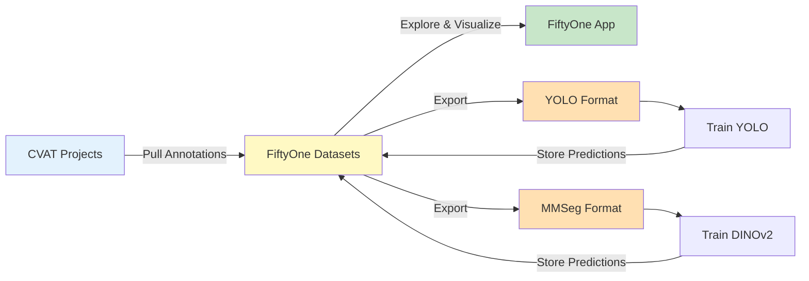

# CVAT Integration

Pull, manage, and version coral annotation datasets using CVAT and FiftyOne.

!!! info "For Developers"
    This guide configures **CVAT-FiftyOne integration** for pulling annotated datasets, managing them locally with FiftyOne, and exporting to training formats (YOLO, MMSegmentation).

**Time Required**: 25-30 minutes
**Prerequisites**: [Environment variables configured](1-environment-variables.md)

## Overview

QUADRATSEG uses a **FiftyOne-first workflow** for dataset management:



**Benefits**:

- Single source of truth (FiftyOne dataset)
- Avoid repeated CVAT downloads
- Easy dataset versioning and merging
- Interactive visualization and error analysis
- Comparative model evaluation

## CVAT Dataset Structure

### Available Projects

QUADRATSEG uses multiple CVAT projects for different pipeline stages:

| Project Name | Purpose | Annotations | Classes | Module |
|--------------|---------|-------------|---------|--------|
| **criobe_finegrained_annotated** | Coral segmentation | Polylines | 18 species | coral_seg_yolo, DINOv2_mmseg |
| **banggai_extended_annotated** | Coral segmentation | Polylines | 10 genera | coral_seg_yolo, DINOv2_mmseg |
| **criobe_corner_annotation** | Grid corners | 4 keypoints | 1 class | grid_pose_detection |
| **criobe_grid_annotation** | Grid pose | 117 keypoints | 1 class | grid_pose_detection |

### Task Organization

Each CVAT project contains tasks organized by subset:

```
CVAT Project: criobe_finegrained_annotated
├── Task 1: train_batch_01 (subset: train, status: completed)
├── Task 2: train_batch_02 (subset: train, status: completed)
├── Task 3: val_batch_01 (subset: val, status: completed)
└── Task 4: test_batch_01 (subset: test, status: completed)
```

!!! tip "Task Naming Convention"
    Use descriptive task names with subset prefix (e.g., `train_batch_01`, `val_moorea`). The `subset` field (train/val/test) determines data splits.

## Step 1: Test CVAT Connection

Before pulling datasets, verify CVAT credentials:

### Test Connection

```bash
cd ~/Projects/coral-segmentation/data_engineering

# Test CVAT connection
pixi run python -c "
import os
from dotenv import load_dotenv
from cvat_sdk import Client

# Load environment variables
load_dotenv()

# Connect to CVAT
url = os.getenv('FIFTYONE_CVAT_URL')
username = os.getenv('FIFTYONE_CVAT_USERNAME')
password = os.getenv('FIFTYONE_CVAT_PASSWORD')

print(f'Connecting to: {url}')
print(f'Username: {username}')

client = Client(url)
client.login((username, password))

print(f'✓ Connected to CVAT at {url}')
print(f'✓ Logged in as {username}')

# List projects
projects = list(client.projects.list())
print(f'✓ Found {len(projects)} projects:')
for p in projects[:10]:
    print(f'  - {p.name} (ID: {p.id})')
"
```

**Expected Output**:

```
Connecting to: http://localhost:8080
Username: admin
✓ Connected to CVAT at http://localhost:8080
✓ Logged in as admin
✓ Found 8 projects:
  - criobe_corner_annotation (ID: 1)
  - criobe_grid_annotation (ID: 2)
  - criobe_finegrained_annotated (ID: 4)
  - banggai_extended_annotated (ID: 5)
  ...
```

!!! warning "Connection Failed?"
    If connection fails, see [Troubleshooting](#cvat-connection-errors) section.

### List Project Tasks

```bash
cd ~/Projects/coral-segmentation/data_engineering

# List tasks in a project
pixi run python -c "
import os
from dotenv import load_dotenv
from cvat_sdk import Client

load_dotenv()

client = Client(os.getenv('FIFTYONE_CVAT_URL'))
client.login((os.getenv('FIFTYONE_CVAT_USERNAME'),
              os.getenv('FIFTYONE_CVAT_PASSWORD')))

# Find project
projects = {p.name: p for p in client.projects.list()}
project = projects['criobe_finegrained_annotated']

print(f'Project: {project.name} (ID: {project.id})')
print(f'Tasks:')

for task in client.tasks.list(project_id=project.id):
    print(f'  - {task.name}')
    print(f'    Subset: {task.subset}')
    print(f'    Status: {task.status}')
    print(f'    Size: {task.size} images')
    print()
"
```

## Step 2: Pull Dataset from CVAT

The primary script for pulling datasets is `create_fiftyone_dataset.py`, available in three modules:

- `/home/taiamiti/Projects/criobe/data_engineering/create_fiftyone_dataset.py`
- `/home/taiamiti/Projects/criobe/coral_seg_yolo/src/create_fiftyone_dataset.py`
- `/home/taiamiti/Projects/criobe/DINOv2_mmseg/create_fiftyone_dataset.py`

All three are identical. We'll use `data_engineering/` for dataset management.

### Pull CRIOBE Finegrained Dataset

```bash
cd ~/Projects/coral-segmentation/data_engineering

# Pull dataset from CVAT
pixi run python create_fiftyone_dataset.py \
    criobe_finegrained_annotated \
    --mode task_tracking

# This creates:
# 1. FiftyOne persistent dataset (global)
# 2. Images: data/media/criobe_finegrained_annotated/
# 3. Export: data/pulled_from_cvat/criobe_finegrained_annotated/
```

**What happens**:

1. Connects to CVAT project `criobe_finegrained_annotated`
2. Filters for completed tasks in train/val/test subsets
3. Downloads images to `data/media/criobe_finegrained_annotated/`
4. Imports polyline annotations as `gt_polylines` field
5. Adds metadata: `cvat_task_id`, `cvat_task_name`, `cvat_subset`, `area`, `year`, `quadrat_id`
6. Tags samples by split: `train`, `val`, `test`
7. Exports to `data/pulled_from_cvat/criobe_finegrained_annotated/` as FiftyOne format

**Output**:

```
Created new dataset: criobe_finegrained_annotated
Retrieving task metadata for project: criobe_finegrained_annotated
Filtering for subsets: ['train', 'test', 'validation', 'val'] (status: completed)
Found 5 matching tasks: ['train_batch_01', 'train_batch_02', 'val_batch_01', 'test_batch_01']
Importing task: train_batch_01 (ID: 42)
  Imported 100 samples, 100 have annotations
  Added 100 samples
Importing task: train_batch_02 (ID: 43)
  Imported 120 samples, 120 have annotations
  Added 120 samples
Importing task: val_batch_01 (ID: 44)
  Imported 50 samples, 50 have annotations
  Added 50 samples
Importing task: test_batch_01 (ID: 45)
  Imported 30 samples, 30 have annotations
  Added 30 samples
Import completed: added 300 new samples
Found 18 classes: ['Acropora', 'Acanthastrea', 'Astreopora', ...]
Dataset created with 300 samples across 4 tasks
Tasks: ['train_batch_01', 'train_batch_02', 'val_batch_01', 'test_batch_01']
Subsets: ['train', 'val', 'test']
```

### Pull Banggai Extended Dataset

```bash
cd ~/Projects/coral-segmentation/data_engineering

# Pull Banggai dataset
pixi run python create_fiftyone_dataset.py \
    banggai_extended_annotated \
    --mode task_tracking
```

### Import Modes

The `create_fiftyone_dataset.py` script supports four import modes:

| Mode | Behavior | Use Case |
|------|----------|----------|
| `task_tracking` | Only import new tasks (default) | Incremental updates, most efficient |
| `skip_existing` | Skip samples with existing filepaths | Merge from multiple sources |
| `force_refresh` | Clear dataset and re-import all | Fix corrupted data, major updates |
| `skip_if_exist` | Load existing or error | Merged datasets (not for CVAT pull) |

**Examples**:

```bash
# Incremental update (default)
pixi run python create_fiftyone_dataset.py criobe_finegrained_annotated

# Force complete refresh
pixi run python create_fiftyone_dataset.py criobe_finegrained_annotated --mode force_refresh

# Skip duplicate filepaths
pixi run python create_fiftyone_dataset.py criobe_finegrained_annotated --mode skip_existing
```

### Filter by Subset

By default, only completed tasks in train/val/test subsets are imported. To customize:

```bash
# Import only train and val (skip test)
pixi run python create_fiftyone_dataset.py \
    criobe_finegrained_annotated \
    --allowed_subsets train val

# Import all subsets (including custom subsets)
pixi run python create_fiftyone_dataset.py \
    criobe_finegrained_annotated \
    --allowed_subsets train val test custom_subset
```

## Step 3: Explore with FiftyOne

FiftyOne provides an interactive web app for dataset exploration.

### Launch FiftyOne App

```bash
# Start FiftyOne app (from any directory)
pixi run -e <environment-name> fiftyone app launch

# Browser opens at http://localhost:5151
```

Available in these environments:

- `data_engineering/`: `pixi run fiftyone app launch`
- `coral_seg_yolo/`: `pixi run -e coral-seg-yolo-dev fiftyone app launch`
- `DINOv2_mmseg/`: `pixi run -e dinov2-mmseg fiftyone app launch`

### List Available Datasets

```bash
cd ~/Projects/coral-segmentation/data_engineering

# List all FiftyOne datasets
pixi run python -c "
import fiftyone as fo
datasets = fo.list_datasets()
print(f'Available datasets ({len(datasets)}):')
for ds in datasets:
    print(f'  - {ds}')
"
```

**Expected Output**:

```
Available datasets (2):
  - criobe_finegrained_annotated
  - banggai_extended_annotated
```

### Load and Inspect Dataset

```bash
cd ~/Projects/coral-segmentation/data_engineering

# Activate pixi shell for interactive work
pixi shell

# Launch Python
python
```

**In Python**:

```python
import fiftyone as fo

# List datasets
fo.list_datasets()
# ['criobe_finegrained_annotated', 'banggai_extended_annotated']

# Load dataset
dataset = fo.load_dataset("criobe_finegrained_annotated")

# Print summary
print(dataset)
```

**Output**:

```
Name:           criobe_finegrained_annotated
Media type:     image
Num samples:    300
Persistent:     True
Tags:           ['train', 'val', 'test']
Sample fields:
    id:                  fiftyone.core.fields.ObjectIdField
    filepath:            fiftyone.core.fields.StringField
    tags:                fiftyone.core.fields.ListField(fiftyone.core.fields.StringField)
    metadata:            fiftyone.core.fields.EmbeddedDocumentField(fiftyone.core.metadata.ImageMetadata)
    gt_polylines:        fiftyone.core.fields.EmbeddedDocumentField(fiftyone.core.labels.Polylines)
    cvat_task_id:        fiftyone.core.fields.IntField
    cvat_task_name:      fiftyone.core.fields.StringField
    cvat_subset:         fiftyone.core.fields.StringField
    cvat_project_name:   fiftyone.core.fields.StringField
    area:                fiftyone.core.fields.StringField
    year:                fiftyone.core.fields.IntField
    quadrat_id:          fiftyone.core.fields.IntField
```

### Dataset Statistics

```python
# Count by split
train_count = len(dataset.match_tags("train"))
val_count = len(dataset.match_tags("val"))
test_count = len(dataset.match_tags("test"))

print(f"Train: {train_count}, Val: {val_count}, Test: {test_count}")
# Train: 220, Val: 50, Test: 30

# Count by area
areas = dataset.count_values("area")
print(f"Areas: {areas}")
# Areas: {'Moorea Entre 2 Baies': 120, 'Moorea Tiahura 1-2': 80, ...}

# Count by year
years = dataset.count_values("year")
print(f"Years: {years}")
# Years: {2020: 100, 2021: 120, 2022: 80}

# Class distribution
classes = dataset.default_classes
print(f"Classes ({len(classes)}): {classes}")
# Classes (18): ['Acropora', 'Acanthastrea', 'Astreopora', ...]

# Annotation statistics
num_polylines = sum(dataset.count_values(f"gt_polylines.polylines").values())
print(f"Total coral annotations: {num_polylines}")
# Total coral annotations: 4523
```

### Launch FiftyOne App with Dataset

```python
# Launch app with dataset loaded
session = fo.launch_app(dataset)

# Browser opens with dataset visualization
# Navigate, filter, inspect annotations interactively
```

**In FiftyOne App**:

1. **Browse samples**: Click through images
2. **Filter by tags**: Select `train`, `val`, or `test`
3. **Filter by metadata**: Area, year, quadrat_id
4. **View annotations**: Polylines with class labels
5. **Search**: Find specific samples
6. **Statistics**: View class distributions
7. **Export subsets**: Export filtered views

!!! tip "FiftyOne App Features"
    - **Sidebar**: Filter by tags, labels, metadata
    - **Sample grid**: Browse all images
    - **Sample view**: Inspect individual samples with annotations
    - **Plots**: Visualize distributions and statistics
    - **Tagging**: Add/remove tags for organization

### Filter and Create Views

```python
# Filter by split
train_view = dataset.match_tags("train")
print(f"Train samples: {len(train_view)}")

# Filter by area
moorea_view = dataset.match(F("area") == "Moorea Entre 2 Baies")
print(f"Moorea samples: {len(moorea_view)}")

# Filter by year range
recent_view = dataset.match(F("year") >= 2021)
print(f"2021+ samples: {len(recent_view)}")

# Complex filter: Train set from Moorea in 2021
complex_view = dataset.match_tags("train") \
    .match(F("area") == "Moorea Entre 2 Baies") \
    .match(F("year") == 2021)
print(f"Complex filter: {len(complex_view)} samples")

# Filter samples with specific class
acropora_view = dataset.filter_labels("gt_polylines",
    F("label") == "Acropora")
print(f"Samples with Acropora: {len(acropora_view)}")
```

### Dataset Operations

```python
from fiftyone import ViewField as F

# Check for missing annotations
no_annotations = dataset.match(~F("gt_polylines").exists())
print(f"Samples without annotations: {len(no_annotations)}")

# Samples with many corals
dense_samples = dataset.match(
    F("gt_polylines.polylines").length() > 20
)
print(f"Dense samples (>20 corals): {len(dense_samples)}")

# Get unique task names
tasks = dataset.distinct("cvat_task_name")
print(f"Tasks: {tasks}")
```

## Step 4: Export to Training Formats

FiftyOne datasets must be converted to framework-specific formats for training.

### Export to YOLO Format

For `coral_seg_yolo/` and `grid_pose_detection/` modules:

```bash
cd ~/Projects/coral-segmentation/coral_seg_yolo

# Export FiftyOne dataset to YOLO format
pixi run -e coral-seg-yolo-dev python src/prepare_data.py \
    criobe_finegrained_annotated

# This creates: data/coral_annotation_yolo_seg/criobe_finegrained_annotated/
#   ├── images/
#   │   ├── train/
#   │   ├── val/
#   │   └── test/
#   ├── labels/
#   │   ├── train/
#   │   ├── val/
#   │   └── test/
#   └── data.yaml
```

**YOLO data.yaml**:

```yaml
# Auto-generated by FiftyOne exporter
path: /home/user/coral-segmentation/coral_seg_yolo/data/coral_annotation_yolo_seg/criobe_finegrained_annotated
train: images/train
val: images/val
test: images/test

nc: 18
names:
  0: Acropora
  1: Acanthastrea
  2: Astreopora
  3: Fungia
  4: Goniastrea
  5: Leptastrea
  6: Leptoseris
  7: Merulinidae
  8: Millepora
  9: Montastrea
  10: Montipora
  11: Other
  12: Pavona
  13: Pavona/Leptoseris
  14: Pocillopora
  15: Porites
  16: Psammocora
  17: Turbinaria
```

**YOLO label format** (txt files):

```
# labels/train/MooreaE2B_2020_05.txt
# class_id x1 y1 x2 y2 x3 y3 ... (normalized coordinates)
0 0.123 0.456 0.234 0.567 0.345 0.678 ...
14 0.456 0.789 0.567 0.890 0.678 0.901 ...
```

### Export to MMSegmentation Format

For `DINOv2_mmseg/` module:

```bash
cd ~/Projects/coral-segmentation/DINOv2_mmseg

# Export FiftyOne dataset to MMSegmentation format
pixi run -e dinov2-mmseg python prepare_data.py \
    criobe_finegrained_annotated

# This creates: data/coral_annotation_dinov2_mmseg/criobe_finegrained_annotated/
#   ├── train/
#   │   ├── images/
#   │   └── masks/
#   ├── val/
#   │   ├── images/
#   │   └── masks/
#   └── test/
#       ├── images/
#       └── masks/
```

**MMSeg mask format**: PNG semantic segmentation masks with class indices (0-17).

### Verify Export

```bash
# Verify YOLO export
cd ~/Projects/coral-segmentation/coral_seg_yolo

pixi run -e coral-seg-yolo-dev python -c "
from pathlib import Path
import yaml

# Load data.yaml
with open('data/coral_annotation_yolo_seg/criobe_finegrained_annotated/data.yaml') as f:
    config = yaml.safe_load(f)
    print('Dataset:', config['path'])
    print('Classes:', config['nc'])
    print('Names:', list(config['names'].values())[:5], '...')

# Count images and labels
train_imgs = list(Path('data/coral_annotation_yolo_seg/criobe_finegrained_annotated/images/train').glob('*.jpg'))
train_lbls = list(Path('data/coral_annotation_yolo_seg/criobe_finegrained_annotated/labels/train').glob('*.txt'))
print(f'Train images: {len(train_imgs)}')
print(f'Train labels: {len(train_lbls)}')

# Verify pairing
img_stems = {p.stem for p in train_imgs}
lbl_stems = {p.stem for p in train_lbls}
print(f'Paired correctly: {img_stems == lbl_stems}')
"
```

**Expected Output**:

```
Dataset: /home/user/coral-segmentation/coral_seg_yolo/data/coral_annotation_yolo_seg/criobe_finegrained_annotated
Classes: 18
Names: ['Acropora', 'Acanthastrea', 'Astreopora', 'Fungia', 'Goniastrea'] ...
Train images: 220
Train labels: 220
Paired correctly: True
```

## Step 5: Label Taxonomy Management

QUADRATSEG supports multiple label hierarchies for different granularity levels.

### Available Taxonomies

Defined in `/home/taiamiti/Projects/criobe/data_engineering/tools.py`:

| Taxonomy | Classes | Description | Use Case |
|----------|---------|-------------|----------|
| **Finegrained** | 20 | All coral genera (Acropora, Pocillopora, etc.) | Species-level classification |
| **Extended** | 11 | Main genera + Group1 (merged minor) | Balanced dataset |
| **Main Families** | 7 | Major coral families only | High-level classification |
| **Agnostic** | 1 | Binary coral vs background | Detection only |

### Taxonomy Definitions

```python
# From data_engineering/tools.py

# Finegrained (20 classes) - Identity mapping
MERGE_MAP_FINEGRAINED = {
    'Acropora': "Acropora",
    'Pocillopora': "Pocillopora",
    'Porites': "Porites",
    'Montipora': "Montipora",
    'Pavona': "Pavona/Leptoseris",
    'Leptoseris': "Pavona/Leptoseris",
    'Fungia': "Fungia",
    'Millepora': "Millepora",
    'Acanthastrea': "Acanthastrea",
    'Astreopora': "Astreopora",
    'Goniastrea': "Goniastrea",
    'Leptastrea': "Leptastrea",
    'Merulinidae': "Merulinidae",
    'Montastrea': "Montastrea",
    'Psammocora': "Psammocora",
    'Atrea': "Atrea",
    'Other': "Other",
    'Corail mou': "Other",
    'Empty': None,  # Remove
}

# Extended (11 classes) - Groups minor genera
MERGE_MAP_EXTENDED = {
    'Acropora': "Acropora",
    'Astreopora': "Astreopora",
    'Fungia': "Fungia",
    'Millepora': "Millepora",
    'Montipora': "Montipora",
    'Pavona': "Pavona/Leptoseris",
    'Leptoseris': "Pavona/Leptoseris",
    'Pocillopora': "Pocillopora",
    'Porites': "Porites",
    'Acanthastrea': "Group1",
    'Goniastrea': "Group1",
    'Leptastrea': "Group1",
    'Merulinidae': "Group1",
    'Atrea': "Group1",
    'Other': "Other",
    'Montastrea': "Other",
    'Psammocora': "Other",
    'Corail mou': "Other",
    'Empty': None,
}

# Main Families (7 classes) - Major groups only
MERGE_MAP_MAIN_FAMILYS = {
    'Acropora': "Acropora",
    'Atrea': "Atrea",
    'Montipora': "Montipora",
    'Pavona': "Pavona/Leptoseris",
    'Leptoseris': "Pavona/Leptoseris",
    'Pocillopora': "Pocillopora",
    'Porites': "Porites",
    'Other': "Other",
    # All others map to "Other"
}

# Agnostic (1 class) - Binary coral detection
MERGE_MAP_AGNOSTIC = {
    # All coral classes map to "coral"
    'Acropora': "coral",
    'Pocillopora': "coral",
    # ... all map to "coral"
    'Empty': None,
}
```

### Apply Taxonomy to Dataset

To create a dataset with a different taxonomy:

```bash
cd ~/Projects/coral-segmentation/data_engineering

# Create extended taxonomy dataset
pixi run python create_cvat_annotation_tasks.py \
    create_and_upload_extended \
    criobe_finegrained_annotated \
    criobe_extended_annotated

# Create main families dataset
pixi run python create_cvat_annotation_tasks.py \
    create_and_upload_main_familys \
    criobe_finegrained_annotated \
    criobe_main_families_annotated
```

**What this does**:

1. Loads source FiftyOne dataset
2. Clones dataset
3. Merges labels according to taxonomy map
4. Creates new CVAT project with merged labels
5. Uploads tasks to CVAT

!!! info "Taxonomy in Training"
    When exporting to YOLO/MMSeg format, the taxonomy is preserved from the FiftyOne dataset. Use taxonomy-specific datasets for training with different class granularities.

### Custom Taxonomy

To create a custom taxonomy, edit `data_engineering/tools.py`:

```python
# Add custom merge map
MERGE_MAP_CUSTOM = {
    'Acropora': "Hard Coral",
    'Pocillopora': "Hard Coral",
    'Porites': "Hard Coral",
    'Millepora': "Fire Coral",
    'Corail mou': "Soft Coral",
    'Other': "Other",
    'Empty': None,
}

# Add to exports
CLASS_LABELS_CUSTOM = sorted(list(set([v for k, v in MERGE_MAP_CUSTOM.items() if v is not None])))
```

Then use in `create_cvat_annotation_tasks.py` by adding a new function.

## Step 6: Dataset Versioning and Merging

FiftyOne supports dataset versioning and merging for experimentation.

### Clone Dataset

```python
import fiftyone as fo

# Load original dataset
original = fo.load_dataset("criobe_finegrained_annotated")

# Clone for experimentation
clone = original.clone("criobe_finegrained_experiment_v2")

print(f"Cloned {len(clone)} samples")
# Cloned 300 samples
```

### Merge Datasets

```python
import fiftyone as fo

# Load two datasets
dataset1 = fo.load_dataset("criobe_finegrained_annotated")
dataset2 = fo.load_dataset("banggai_extended_annotated")

# Create merged dataset
merged = dataset1.clone("merged_coral_dataset")
merged.merge_samples(dataset2)

print(f"Merged dataset: {len(merged)} samples")
# Merged dataset: 550 samples
```

### Version Control with Tags

```python
import fiftyone as fo

dataset = fo.load_dataset("criobe_finegrained_annotated")

# Tag samples for version tracking
dataset.match_tags("train").tag_samples("v1_train")
dataset.match_tags("val").tag_samples("v1_val")

# Later, add new data
new_samples = dataset.match(F("year") == 2023)
new_samples.tag_samples("v2_addition")

# Filter by version
v1_train = dataset.match_tags("v1_train")
v2_samples = dataset.match_tags("v2_addition")
```

### Save Dataset State

```python
# Export dataset for backup
dataset.export(
    export_dir="backups/criobe_finegrained_v1",
    dataset_type=fo.types.FiftyOneDataset,
    export_media=False,  # Images already in media_dir
    rel_dir=cfg.media_dir
)

# Load from backup
backup = fo.Dataset.from_dir(
    dataset_dir="backups/criobe_finegrained_v1",
    dataset_type=fo.types.FiftyOneDataset,
    name="criobe_finegrained_restored"
)
```

## Step 7: Common Workflows

### Workflow 1: Pull → Explore → Export → Train

```bash
# 1. Pull from CVAT
cd ~/Projects/coral-segmentation/data_engineering
pixi run python create_fiftyone_dataset.py criobe_finegrained_annotated

# 2. Explore with FiftyOne
pixi shell
python
>>> import fiftyone as fo
>>> dataset = fo.load_dataset("criobe_finegrained_annotated")
>>> session = fo.launch_app(dataset)
>>> # Inspect annotations, verify quality
>>> exit()
exit

# 3. Export to YOLO format
cd ~/Projects/coral-segmentation/coral_seg_yolo
pixi run -e coral-seg-yolo-dev python src/prepare_data.py criobe_finegrained_annotated

# 4. Train model
pixi run -e coral-seg-yolo yolo \
    cfg=experiments/train_cfg_yolo_criobe.yaml \
    model=yolo11m-seg.pt \
    epochs=100
```

### Workflow 2: Incremental Updates

```bash
# Initial pull
cd ~/Projects/coral-segmentation/data_engineering
pixi run python create_fiftyone_dataset.py criobe_finegrained_annotated

# ... time passes, new tasks added to CVAT ...

# Update with new tasks only (task_tracking mode)
pixi run python create_fiftyone_dataset.py criobe_finegrained_annotated --mode task_tracking

# Re-export to training format
cd ~/Projects/coral-segmentation/coral_seg_yolo
pixi run -e coral-seg-yolo-dev python src/prepare_data.py criobe_finegrained_annotated

# Resume training with updated data
pixi run -e coral-seg-yolo yolo \
    cfg=experiments/train_cfg_yolo_criobe.yaml \
    model=runs/train/weights/last.pt \
    resume=True
```

### Workflow 3: Multi-Taxonomy Training

```bash
# Pull base dataset
cd ~/Projects/coral-segmentation/data_engineering
pixi run python create_fiftyone_dataset.py criobe_finegrained_annotated

# Create extended taxonomy version
pixi run python create_cvat_annotation_tasks.py \
    create_and_upload_extended \
    criobe_finegrained_annotated \
    criobe_extended_annotated

# Export both to YOLO
cd ~/Projects/coral-segmentation/coral_seg_yolo
pixi run -e coral-seg-yolo-dev python src/prepare_data.py criobe_finegrained_annotated
pixi run -e coral-seg-yolo-dev python src/prepare_data.py criobe_extended_annotated

# Train separate models
pixi run -e coral-seg-yolo yolo cfg=experiments/train_cfg_yolo_criobe.yaml model=yolo11m-seg.pt
pixi run -e coral-seg-yolo yolo cfg=experiments/train_cfg_yolo_extended.yaml model=yolo11m-seg.pt

# Compare in FiftyOne
pixi run -e coral-seg-yolo-dev python src/fiftyone_evals.py \
    --dataset_name criobe_finegrained_annotated \
    --model_path runs/train_finegrained/weights/best.pt \
    --predicted_field_name preds_finegrained

pixi run -e coral-seg-yolo-dev python src/fiftyone_evals.py \
    --dataset_name criobe_extended_annotated \
    --model_path runs/train_extended/weights/best.pt \
    --predicted_field_name preds_extended
```

### Workflow 4: Quality Control

```bash
# Pull dataset
cd ~/Projects/coral-segmentation/data_engineering
pixi run python create_fiftyone_dataset.py criobe_finegrained_annotated

# Launch FiftyOne for QC
pixi shell
python
```

**In Python**:

```python
import fiftyone as fo
from fiftyone import ViewField as F

dataset = fo.load_dataset("criobe_finegrained_annotated")

# Find samples with no annotations
no_annot = dataset.match(~F("gt_polylines").exists())
print(f"Missing annotations: {len(no_annot)}")

# Find samples with very few annotations
sparse = dataset.match(F("gt_polylines.polylines").length() < 3)
print(f"Sparse annotations (<3 corals): {len(sparse)}")

# Find samples with many annotations (potential over-annotation)
dense = dataset.match(F("gt_polylines.polylines").length() > 50)
print(f"Dense annotations (>50 corals): {len(dense)}")

# Tag problematic samples
no_annot.tag_samples("needs_annotation")
sparse.tag_samples("sparse_check")
dense.tag_samples("dense_check")

# Launch app to review
session = fo.launch_app(dataset)

# Filter to "needs_annotation" tag in app sidebar
# Review and fix in CVAT, then re-pull
```

## Troubleshooting

### CVAT Connection Errors

**Symptom**: `cvat_sdk.exceptions.UnauthorizedError` or connection timeout

**Solutions**:

```bash
# 1. Verify CVAT is running
curl http://localhost:8080/api/server/about

# 2. Check credentials
cd ~/Projects/coral-segmentation/data_engineering
cat .env | grep CVAT

# 3. Test login manually
pixi run python -c "
from cvat_sdk import Client
client = Client('http://localhost:8080')
try:
    client.login(('admin', 'password'))
    print('✓ Login successful')
except Exception as e:
    print(f'✗ Login failed: {e}')
"

# 4. Regenerate API token (if using tokens)
# CVAT UI → User menu → Settings → API Tokens → Create new token
# Update .env: CVAT_API_TOKEN=<new_token>
```

**Common Issues**:

- Wrong URL (check http:// vs https://)
- Incorrect credentials
- CVAT server not running
- Network/firewall blocking connection
- Expired API token

### Project Not Found

**Symptom**: `ValueError: Project 'project_name' not found`

**Solutions**:

```bash
# List available projects
cd ~/Projects/coral-segmentation/data_engineering
pixi run python -c "
from cvat_sdk import Client
import os
from dotenv import load_dotenv

load_dotenv()
client = Client(os.getenv('FIFTYONE_CVAT_URL'))
client.login((os.getenv('FIFTYONE_CVAT_USERNAME'),
              os.getenv('FIFTYONE_CVAT_PASSWORD')))

projects = {p.name: p.id for p in client.projects.list()}
print('Available projects:')
for name, pid in projects.items():
    print(f'  - {name} (ID: {pid})')
"

# Use exact project name (case-sensitive)
pixi run python create_fiftyone_dataset.py "criobe_finegrained_annotated"
```

### No Annotations Imported

**Symptom**: `Warning: No classes found in 'gt_polylines' field`

**Solutions**:

1. **Check task status**: Only completed tasks are imported
    ```bash
    # Verify task status in CVAT
    # UI → Project → Tasks → Check "Status" column
    ```

2. **Check task subsets**: Default imports only train/val/test
    ```bash
    # Import custom subsets
    pixi run python create_fiftyone_dataset.py project_name --allowed_subsets train val test custom
    ```

3. **Check annotation format**: FiftyOne imports polylines by default
    ```bash
    # Verify CVAT annotations are polylines (not rectangles/points)
    # UI → Task → Job → Check annotation type
    ```

4. **Force refresh**: Clear and re-import
    ```bash
    pixi run python create_fiftyone_dataset.py project_name --mode force_refresh
    ```

### Export Format Issues

**Symptom**: Training fails with "cannot find images" or "invalid annotations"

**Solutions**:

```bash
# Verify YOLO export structure
cd ~/Projects/coral-segmentation/coral_seg_yolo
tree data/coral_annotation_yolo_seg/criobe_finegrained_annotated/ -L 2

# Should show:
# images/train/, images/val/, images/test/
# labels/train/, labels/val/, labels/test/
# data.yaml

# Check image-label pairing
pixi run -e coral-seg-yolo-dev python -c "
from pathlib import Path
imgs = {p.stem for p in Path('data/coral_annotation_yolo_seg/criobe_finegrained_annotated/images/train').glob('*.jpg')}
lbls = {p.stem for p in Path('data/coral_annotation_yolo_seg/criobe_finegrained_annotated/labels/train').glob('*.txt')}
print(f'Images: {len(imgs)}, Labels: {len(lbls)}')
print(f'Unpaired images: {imgs - lbls}')
print(f'Unpaired labels: {lbls - imgs}')
"

# Re-export if mismatch found
pixi run -e coral-seg-yolo-dev python src/prepare_data.py criobe_finegrained_annotated
```

### FiftyOne Dataset Corruption

**Symptom**: `fiftyone.core.odm.database.DatabaseError` or dataset won't load

**Solutions**:

```bash
# 1. Restart FiftyOne database
pixi run fiftyone app stop
pixi run fiftyone app launch

# 2. Clear FiftyOne cache
rm -rf ~/.fiftyone/cache/

# 3. Delete corrupted dataset and re-pull
pixi run python -c "
import fiftyone as fo
fo.delete_dataset('criobe_finegrained_annotated')
"

cd ~/Projects/coral-segmentation/data_engineering
pixi run python create_fiftyone_dataset.py criobe_finegrained_annotated --mode force_refresh

# 4. Nuclear option: Reset FiftyOne database (WARNING: deletes ALL datasets)
pixi run python -c "import fiftyone as fo; fo.delete_datasets('*')"
```

### Slow CVAT Downloads

**Symptom**: Dataset pull takes very long time

**Solutions**:

1. **Use task_tracking mode**: Only import new tasks
    ```bash
    pixi run python create_fiftyone_dataset.py project_name --mode task_tracking
    ```

2. **Filter subsets**: Skip unnecessary subsets
    ```bash
    pixi run python create_fiftyone_dataset.py project_name --allowed_subsets train val
    ```

3. **Check network**: Slow connection to CVAT server
    ```bash
    # Test download speed
    curl -o /dev/null http://localhost:8080/api/tasks/1/data -w "%{speed_download}\n"
    ```

4. **Optimize CVAT**: Ensure CVAT server has adequate resources

### Memory Issues

**Symptom**: `MemoryError` or OOM during export

**Solutions**:

```bash
# Export in smaller batches (modify prepare_data.py batch_size)
# Or export subsets separately:

cd ~/Projects/coral-segmentation/coral_seg_yolo
pixi shell -e coral-seg-yolo-dev

python
>>> import fiftyone as fo
>>> dataset = fo.load_dataset("criobe_finegrained_annotated")
>>>
>>> # Export train only
>>> train = dataset.match_tags("train")
>>> train.export(
...     export_dir="data/coral_annotation_yolo_seg/criobe_finegrained_annotated_train",
...     dataset_type=fo.types.YOLOv5Dataset,
...     label_field="gt_polylines",
...     split="train"
... )
>>>
>>> # Repeat for val, test
```

## Best Practices

### Dataset Management

1. **Use task_tracking mode**: Most efficient for incremental updates
2. **Tag samples**: Use tags for organization and filtering
3. **Backup datasets**: Export FiftyOne datasets regularly
4. **Version datasets**: Use descriptive names and cloning
5. **Document changes**: Add dataset.info metadata

### CVAT Organization

1. **Consistent task naming**: Use `{subset}_{description}` format
2. **Set task subsets**: Use train/val/test for automatic splitting
3. **Complete tasks**: Only completed tasks are imported
4. **Verify annotations**: Check in FiftyOne before training
5. **Use labels consistently**: Maintain label taxonomy

### FiftyOne Workflow

1. **Persistent datasets**: Always use `persistent=True`
2. **Explore before training**: Use FiftyOne app for QC
3. **Filter views**: Use tags and metadata for subsets
4. **Store predictions**: Add model predictions to dataset for comparison
5. **Cleanup old datasets**: Delete unused datasets to save space

### Performance

1. **Skip unnecessary downloads**: Use task_tracking mode
2. **Export media=False**: Link images instead of copying
3. **Use relative paths**: Portable dataset exports
4. **Batch operations**: Process samples in batches
5. **Close sessions**: Call `session.close()` when done

## Next Steps

!!! success "CVAT Integration Configured!"
    You can now pull datasets from CVAT, manage them with FiftyOne, and export to training formats!

**What's next**:

1. **[Configure Training](3-training-config.md)** - Set up training configuration files
2. **Start Training** - Train your first model with prepared datasets!
3. **Evaluate Models** - Use FiftyOne for model comparison and error analysis

## Quick Reference

### Essential Commands

```bash
# Pull dataset from CVAT
cd ~/Projects/coral-segmentation/data_engineering
pixi run python create_fiftyone_dataset.py <project_name>

# List FiftyOne datasets
pixi run python -c "import fiftyone as fo; print(fo.list_datasets())"

# Launch FiftyOne app
pixi run fiftyone app launch

# Export to YOLO format
cd ~/Projects/coral-segmentation/coral_seg_yolo
pixi run -e coral-seg-yolo-dev python src/prepare_data.py <dataset_name>

# Export to MMSeg format
cd ~/Projects/coral-segmentation/DINOv2_mmseg
pixi run -e dinov2-mmseg python prepare_data.py <dataset_name>
```

### Python Quick Start

```python
import fiftyone as fo

# List datasets
fo.list_datasets()

# Load dataset
dataset = fo.load_dataset("criobe_finegrained_annotated")

# Dataset info
print(dataset)
print(f"Classes: {dataset.default_classes}")
print(f"Train: {len(dataset.match_tags('train'))}")

# Launch app
session = fo.launch_app(dataset)
```

### Import Modes

| Mode | Command | Use Case |
|------|---------|----------|
| Task tracking (default) | `--mode task_tracking` | Incremental updates |
| Skip existing | `--mode skip_existing` | Merge datasets |
| Force refresh | `--mode force_refresh` | Complete re-import |

### Dataset Locations

| Module | FiftyOne Dataset | Media | Export | Training Data |
|--------|------------------|-------|--------|---------------|
| `data_engineering/` | Global | `data/media/` | `data/pulled_from_cvat/` | N/A |
| `coral_seg_yolo/` | Global | `data/media/` | `data/pulled_from_cvat/` | `data/coral_annotation_yolo_seg/` |
| `DINOv2_mmseg/` | Global | `data/media/` | `data/pulled_from_cvat/` | `data/coral_annotation_dinov2_mmseg/` |

### Available Datasets

- `criobe_finegrained_annotated` - 18 coral species (finegrained)
- `banggai_extended_annotated` - 10 coral genera (extended)

### Troubleshooting Checklist

- [ ] CVAT credentials in .env are correct
- [ ] CVAT server is running and accessible
- [ ] Project name is exact (case-sensitive)
- [ ] Tasks are completed in CVAT
- [ ] Task subsets are set (train/val/test)
- [ ] Annotations are polylines (not rectangles)
- [ ] FiftyOne database is running
- [ ] Sufficient disk space available
- [ ] Export paths exist and are writable

---

**Questions?** See [Training configuration guide](3-training-config.md) or [Getting Help](../../../community/index.md).
