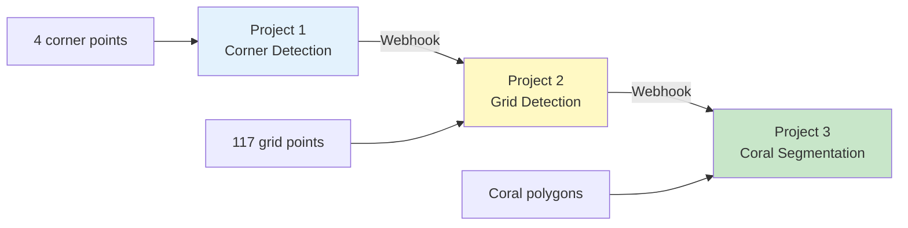

# CVAT Projects Configuration

Create and configure CVAT projects for the automated coral processing pipeline.

!!! info "For End Users"
    This guide sets up the **3-stage processing pipeline**: Corner Detection → Grid Detection → Coral Segmentation. Each stage has its own CVAT project.

**Time Required**: 15-20 minutes
**Prerequisites**: [Installation verified](../../installation/for-end-users/3-verification.md)

## Pipeline Overview

The QUADRATSEG platform uses a 3-stage pipeline with separate CVAT projects:



**Why 3 projects?**
- Each stage processes different annotations
- Webhooks automatically move images between stages
- Keeps workflow organized and modular
- Allows parallel processing of different stages

## Access CVAT

Before creating projects, log in to CVAT:

1. **Open Browser**: http://localhost:8080
2. **Login** with admin credentials:
    - Username: `admin`
    - Password: (from your `.env` configuration)

## Project 1: Corner Detection

This project is for detecting the 4 corners of coral quadrat images.

### Create Project

1. **Navigate**: Click **Projects** in the top menu
2. **Create**: Click **+** button (Create new project)
3. **Fill Project Details**:
    - **Name**: `corner_detection`
    - **Labels**: Use the **Raw** editor and paste:
        ```json
        [
          {
            "name": "quadrat_corner",
            "type": "skeleton",
            "sublabels": [
              {"name": "1", "type": "points"},
              {"name": "2", "type": "points"},
              {"name": "3", "type": "points"},
              {"name": "4", "type": "points"}
            ],
            "svg": ""
          }
        ]
        ```
    - **Bug tracker**: (optional)
    - **Source storage**: (leave default)
    - **Target storage**: (leave default)
4. **Advanced Settings** (optional):
    - **Task subsets**: training, validation, test (default)
    - **Task size**: 10 (images per task, adjust as needed)
5. **Submit**: Click **Submit** button

### Note Project ID

After creation, you'll be redirected to the project page. Note the **Project ID** from the URL:

```
http://localhost:8080/projects/1
                                ^-- Project ID is 1
```

**Write this down**: Project 1 ID = `____`

!!! warning "Project IDs Are Important"
    You'll need these IDs when configuring webhooks in the next step. Keep track of all three project IDs.

### Understanding Labels

**Corner Detection Labels**:
- **Type**: Skeleton (structured keypoints)
- **Count**: 4 numbered sublabels (1, 2, 3, 4)
- **Purpose**: Mark the 4 corners of the quadrat grid for perspective correction in clockwise order

**Label Configuration**:
```
Name: quadrat_corner
Type: skeleton
Sublabels: 4 numbered points (1-4)
Attributes: (none needed)
```

## Project 2: Grid Detection

This project is for detecting all 117 intersection points of the grid overlay.

### Create Project

1. **Navigate**: Projects → **+** (Create new project)
2. **Fill Project Details**:
    - **Name**: `grid_detection`
    - **Labels**: Use the **Raw** editor. For the full 117-point skeleton configuration, see:
        [grid_annotation_example.json](../../../assets/cvat_project_label_config/grid_annotation_example.json)

    Or use this simplified structure (paste into Raw editor):
    ```json
    [
      {
        "name": "grid",
        "type": "skeleton",
        "sublabels": [
          {"name": "1", "type": "points"},
          {"name": "2", "type": "points"},
          ...
          {"name": "117", "type": "points"}
        ],
        "svg": ""
      }
    ]
    ```
3. **Submit**

!!! tip "Skeleton Configuration"
    Grid detection uses a **Skeleton** type with 117 numbered sublabels. This ensures proper grid structure and point ordering.

### Note Project ID

From URL: `http://localhost:8080/projects/2`

**Write this down**: Project 2 ID = `____`

### Understanding Labels

**Grid Detection Labels**:
- **Type**: Skeleton (structured keypoints)
- **Count**: 117 numbered sublabels (1-117)
- **Purpose**: Mark all grid intersections for precise grid removal
- **Pattern**: 9 rows × 13 columns = 117 intersection points

**Label Configuration**:
```
Name: grid
Type: skeleton
Sublabels: 117 numbered points (1-117)
Attributes: (none needed)
```

## Project 3: Coral Segmentation

This project is for segmenting and classifying coral species.

### Create Project

1. **Navigate**: Projects → **+** (Create new project)
2. **Fill Project Details**:
    - **Name**: `coral_segmentation`
    - **Labels**: Add multiple labels for coral species

### Add Coral Species Labels

For each coral genus/species, click "Add label" and configure:

**Recommended Labels** (CRIOBE Finegrained dataset):

1. **Acropora**
    - Type: **Polygon**
    - Color: Auto-assigned

2. **Pocillopora**
    - Type: **Polygon**

3. **Porites**
    - Type: **Polygon**

4. **Montipora**
    - Type: **Polygon**

5. **Pavona**
    - Type: **Polygon**

6. **Fungia**
    - Type: **Polygon**

7. **Millepora**
    - Type: **Polygon**

8. **Leptastrea**
    - Type: **Polygon**

9. **Goniastrea**
    - Type: **Polygon**

10. **Psammocora**
    - Type: **Polygon**

11. **Other**
    - Type: **Polygon**
    - Purpose: For corals not matching above categories

!!! tip "Customize Labels"
    Add or remove labels based on your specific research needs. The platform supports any coral classification scheme.

### Why Polygon Type?

**Polygon** is the correct annotation type for coral instance segmentation:
- Draws closed shapes around individual coral colonies
- Easy to edit vertices and boundaries
- Efficient file size for storage and training
- Compatible with YOLO and MMSegmentation training pipelines
- Imports to FiftyOne as "Polylines" (closed=true, filled=true)

**How to annotate:**
1. Select the Polygon tool in CVAT
2. Click points around the coral colony boundary
3. Close the polygon by pressing `N` or clicking the first point
4. Adjust vertices as needed for accuracy

### Submit and Note ID

After adding all labels, click **Submit**.

From URL: `http://localhost:8080/projects/3`

**Write this down**: Project 3 ID = `____`

## Project Summary

After creating all three projects, you should have:

| Project | Name | ID | Labels | Type |
|---------|------|----| -------|------|
| 1 | corner_detection | (note your ID) | corner | Points |
| 2 | grid_detection | (note your ID) | grid_point | Points |
| 3 | coral_segmentation | (note your ID) | Acropora, Pocillopora, etc. | Polygon |

## Verify Projects

Check that all projects are created correctly:

```bash
# Using CVAT API
curl http://localhost:8080/api/projects \
  -H "Authorization: Token YOUR_TOKEN" \
  | python3 -m json.tool

# Or simply open in browser and navigate to Projects page
```

**In Browser**:
1. Go to http://localhost:8080/projects
2. You should see 3 projects listed
3. Each project should show correct labels

## Project Settings (Optional)

### Task Size

Configure default task size (number of images per task):

1. Open project
2. **Actions** → **Edit**
3. **Advanced** → Task size: 10 (adjust as needed)
4. **Submit**

### Subsets

Configure data subsets for training/validation/test splits:

1. Open project
2. **Actions** → **Edit**
3. **Subsets**: training, validation, test
4. **Submit**

Tasks can be assigned to subsets when created.

## Label Hierarchies (Advanced)

For complex taxonomies, you can define label hierarchies:

### Example: Coral Family Hierarchy

```
Acroporidae
├── Acropora
└── Montipora

Pocilloporidae
└── Pocillopora

Poritidae
└── Porites

Other
```

**To implement**:
1. Use label attributes
2. Add "family" attribute to each species label
3. Set values: "Acroporidae", "Pocilloporidae", etc.

This allows filtering and analysis by family later.

## Best Practices

### Naming Conventions

- Use lowercase with underscores: `corner_detection`
- Be descriptive: `coral_segmentation_banggai_2024`
- Include dataset name if multiple: `criobe_finegrained`

### Label Consistency

- Use scientific names: `Acropora` not "acr" or "Acropora sp."
- Consistent capitalization
- Match training dataset labels exactly

### Organization

- One project per pipeline stage
- Group related tasks in same project
- Use meaningful task names: `moorea_2024_batch1`

## Troubleshooting

### Cannot Create Project

**Symptoms**: Submit button disabled or error message

**Solutions**:
```bash
# Check CVAT server logs
docker compose logs cvat_server

# Common issues:
# - Database connection error
# - Insufficient permissions
# - Invalid label configuration

# Verify user permissions
# Admin users should have full project creation rights
```

### Labels Not Saving

**Symptoms**: Labels disappear after saving

**Solutions**:
- Ensure label name is not empty
- Label type must be selected
- Refresh page and try again
- Check browser console for JavaScript errors

### Project ID Not Visible

**Symptoms**: Can't find project ID

**Solutions**:
- Look at URL: `http://localhost:8080/projects/ID`
- Or use API:
```bash
curl http://localhost:8080/api/projects \
  -H "Authorization: Token YOUR_TOKEN" \
  | grep -A 5 "corner_detection"
```

## Common Label Configurations

### CRIOBE Finegrained (18 species)

```
Acropora, Acanthastrea, Astreopora, Fungia, Goniastrea,
Leptastrea, Leptoseris, Merulinidae, Millepora, Montastrea,
Montipora, Pavona, Pocillopora, Porites, Psammocora,
Turbinaria, Other
```

### Banggai Extended (10 genera)

```
Acropora, Astreopora, Fungia, Millepora, Montastrea,
Montipora, Pavona, Pocillopora, Porites, Psammocora, Other
```

### Simplified (Family Level)

```
Acroporidae, Poritidae, Pocilloporidae, Merulinidae,
Fungiidae, Other
```

## Next Steps

!!! success "Projects Created!"
    You've successfully created all three CVAT projects for the pipeline!

**What's next**:

1. **[Configure Webhooks](2-webhooks-setup.md)** - Set up automation between projects
2. **[Test Workflow](3-workflow-testing.md)** - Upload images and test the pipeline
3. **[First Annotation Tutorial](../../../quickstart/first-annotation.md)** - Detailed walkthrough

## Quick Reference

### Project IDs

Keep these handy for webhook configuration:

```
Project 1 (Corner Detection):  ID = ____
Project 2 (Grid Detection):    ID = ____
Project 3 (Coral Segmentation): ID = ____
```

### Label Quick Add

For coral segmentation, copy-paste these label names:

```
Acropora
Pocillopora
Porites
Montipora
Pavona
Other
```

---

**Questions?** See [webhooks setup guide](2-webhooks-setup.md) or [Getting Help](../../../community/index.md).
