# Webhooks Setup

Configure CVAT webhooks to automate the coral processing pipeline with the Bridge service.

!!! info "For End Users"
    Webhooks enable **automatic processing** between pipeline stages. When a task is completed in one project, webhooks trigger the Bridge to process images and create tasks in the next project.

**Time Required**: 20-30 minutes
**Prerequisites**: [CVAT projects created](1-cvat-projects.md) with Project IDs noted

## Webhook Architecture

Understanding how webhooks automate the pipeline through a repeatable cycle:

### Generic Pipeline Flow

The webhook system creates a repeatable automation cycle that can chain multiple annotation stages:

```mermaid
graph TB
    A[Create Task in<br/>Project A] --> B[Status: new → in progress]
    B --> C[Model Detection<br/>Webhook Triggered]
    C --> D[Auto-annotations<br/>Generated]
    D --> E[User Reviews &<br/>Corrects Annotations]
    E --> F[Status: in progress → completed]
    F --> G[Task Completion<br/>Webhook Triggered]
    G --> H[Bridge Processes Images<br/>& Creates Task in Project B]
    H --> I[Status: new → in progress]
    I --> J{More Stages?}
    J -->|Yes| C
    J -->|No| K[Pipeline Complete]

    style A fill:#4CAF50
    style B fill:#4CAF50
    style E fill:#4CAF50
    style F fill:#4CAF50
    style C fill:#FF9800
    style G fill:#FF9800
    style H fill:#2196F3
```



**Key Stages in Each Cycle**:

1. **Task Creation**: New task created in CVAT project
2. **Model Detection**: Status changes to "in progress" → triggers ML inference webhook
3. **User Validation**: User reviews and corrects auto-generated annotations
4. **Task Completion**: User marks task as "completed" → triggers processing webhook
5. **Next Stage**: Bridge processes images and creates task in next project
6. **Repeat**: Cycle continues until all pipeline stages complete

**Legend**:

- 🟢 **Green** = Manual user actions
- 🟠 **Orange** = Model detection webhook (automated ML inference)
- 🔵 **Blue** = Task completion webhook (automated processing)
- ⚪ **Light Blue** = Automatic system actions

### Two Types of Webhooks

**1. Model Detection Webhooks**: Triggered when job state = "in progress"
   - Runs ML model inference
   - Auto-annotates images for user review

**2. Task Completion Webhooks**: Triggered when task status = "completed"
   - Processes images (crop, warp, grid removal)
   - Creates task in next project
   - Links projects in the pipeline

### Example: 2-Stage Pipeline (Corner → Coral)

Skip grid detection for faster processing. This pipeline uses two webhooks:

1. **Task completion webhook** in Corner Detection project → creates task in Coral project
2. **Model detection webhook** in Coral Segmentation project → auto-segments corals


**Pipeline**: Corner Detection → Crop/Warp → Coral Segmentation

### Example: 3-Stage Pipeline (Corner → Grid → Coral)

Full processing with grid removal for cleaner images:


**Pipeline**: Corner Detection → Crop/Warp → Grid Detection → Grid Removal → Coral Segmentation

## Webhook URLs Reference

Before configuring, here are the webhook URLs you'll use:

### Task Completion Webhooks

```bash
# Corner → Grid Detection (3-stage pipeline)
http://bridge.gateway:8000/crop-quadrat-and-create-new-task-webhook?target_proj_id=<PROJECT_2_ID>

# Corner → Coral Segmentation (2-stage pipeline)
http://bridge.gateway:8000/crop-quadrat-and-create-new-task-webhook?target_proj_id=<PROJECT_3_ID>

# Grid → Coral Segmentation (with grid removal, 3-stage pipeline)
http://bridge.gateway:8000/remove-grid-and-create-new-task-webhook?target_proj_id=<PROJECT_3_ID>
```

### Model Detection Webhooks

```bash
# Corner Detection
http://bridge.gateway:8000/detect-model-webhook?model_name=pth-yolo-gridcorners

# Grid Pose Detection
http://bridge.gateway:8000/detect-model-webhook?model_name=pth-yolo-gridpose

# Coral Segmentation (CRIOBE)
http://bridge.gateway:8000/detect-model-webhook?model_name=pth-yolo-coralsegv4&conv_mask_to_poly=true

# Coral Segmentation (Banggai)
http://bridge.gateway:8000/detect-model-webhook?model_name=pth-yolo-coralsegbanggai&conv_mask_to_poly=true

# Two-Stage Segmentation
http://bridge.gateway:8000/detect-model-webhook?model_name=pth-mmseg-coralscopsegformer&conv_mask_to_poly=true
```

## Step 1: Access Webhook Configuration

For each project, you'll configure webhooks through the CVAT interface:

1. **Login to CVAT**: http://localhost:8080
2. **Navigate to Projects**
3. **Select a project** (e.g., corner_detection)
4. **Click**: **Actions** → **Setup Webhooks**

You'll see the webhook management interface with:
- List of existing webhooks
- "+" button to add new webhooks
- Deliveries table showing webhook history

## Step 2: Configure Task Completion Webhooks

These webhooks automatically process images when tasks are marked complete.

### Webhook 1: Corner Detection → Grid Detection

**Purpose**: When corner detection task completes, crop/warp image and create grid detection task

1. **Open Project 1** (corner_detection)
2. **Actions** → **Setup Webhooks**
3. **Click** "+ Add webhook"
4. **Configure**:
    - **Target URL**:
        ```
        http://bridge.gateway:8000/crop-quadrat-and-create-new-task-webhook?target_proj_id=2
        ```
        (Replace `2` with your Project 2 ID from previous step)
    - **Content type**: Select `application/json` from dropdown
    - **Secret**: Leave empty
    - **Enable SSL verification**: ☐ Unchecked (for local development)
    - **Active**: ☑ Checked
    - **Events**: Select **"Select individual events"** radio button
        - ☑ Check `task` event
        - ☑ Check `job` event
    - **Description**: `Auto-process corner detection to grid detection`
5. **Test Connection**: Click **Ping** button
    - Should show "✅ Success (200)" in deliveries table
6. **Submit**: Click **Submit** to save

!!! warning "Important: Event Selection"
    Make sure to select **"Select individual events"** and check both `task` and `job`. The "Send everything" option may cause issues with unnecessary webhook triggers.

### Webhook 2: Grid Detection → Coral Segmentation

**Purpose**: When grid detection completes, remove grid and create coral segmentation task

1. **Open Project 2** (grid_detection)
2. **Actions** → **Setup Webhooks**
3. **Click** "+ Add webhook"
4. **Configure**:
    - **Target URL**:
        ```
        http://bridge.gateway:8000/remove-grid-and-create-new-task-webhook?target_proj_id=3
        ```
        (Replace `3` with your Project 3 ID)
    - **Content type**: `application/json`
    - **Secret**: Leave empty
    - **Enable SSL verification**: ☐ Unchecked
    - **Active**: ☑ Checked
    - **Events**: Select **"Select individual events"**
        - ☑ Check `task` event
        - ☑ Check `job` event
    - **Description**: `Auto-process grid detection to coral segmentation`
5. **Test**: Click **Ping** → Should show "✅ Success (200)"
6. **Submit**

## Step 3: Configure Model Detection Webhooks

These webhooks automatically run ML inference when jobs are opened.

### Webhook 3: Auto-detect Corners (Project 1)

**Purpose**: Automatically detect corners when job is opened

1. **Open Project 1** (corner_detection)
2. **Add another webhook** (click "+ Add webhook")
3. **Configure**:
    - **Target URL**:
        ```
        http://bridge.gateway:8000/detect-model-webhook?model_name=pth-yolo-gridcorners
        ```
    - **Content type**: `application/json`
    - **Secret**: Leave empty
    - **Enable SSL verification**: ☐ Unchecked
    - **Active**: ☑ Checked
    - **Events**: Select **"Select individual events"**
        - ☐ Uncheck `task` event
        - ☑ Check `job` event only
    - **Description**: `Auto-detect grid corners`
4. **Test**: Click **Ping**
5. **Submit**

!!! tip "Job Event Only"
    Model detection webhooks should **only** trigger on `job` events (when job state changes to "in progress"), not on task completion.

### Webhook 4: Auto-detect Grid (Project 2)

1. **Open Project 2** (grid_detection)
2. **Add webhook**
3. **Configure**:
    - **Target URL**:
        ```
        http://bridge.gateway:8000/detect-model-webhook?model_name=pth-yolo-gridpose
        ```
    - **Content type**: `application/json`
    - **Active**: ☑ Checked
    - **Events**: ☑ Check `job` only
    - **Description**: `Auto-detect grid pose`
4. **Test**: Ping
5. **Submit**

### Webhook 5: Auto-segment Corals (Project 3)

1. **Open Project 3** (coral_segmentation)
2. **Add webhook**
3. **Configure**:
    - **Target URL**:
        ```
        http://bridge.gateway:8000/detect-model-webhook?model_name=pth-yolo-coralsegv4&conv_mask_to_poly=true
        ```
    - **Content type**: `application/json`
    - **Active**: ☑ Checked
    - **Events**: ☑ Check `job` only
    - **Description**: `Auto-segment corals (CRIOBE dataset)`
4. **Test**: Ping
5. **Submit**

!!! info "conv_mask_to_poly Parameter"
    The `&conv_mask_to_poly=true` parameter converts model mask outputs to polygon format for easier editing in CVAT.

## Step 4: Verify Webhook Configuration

Check that all webhooks are properly configured:

### View Configured Webhooks

For each project:

1. **Open project**
2. **Actions** → **Setup Webhooks**
3. **Verify** you see:
    - Project 1: 2 webhooks (task completion + model detection)
    - Project 2: 2 webhooks (task completion + model detection)
    - Project 3: 1 webhook (model detection only)

### Test Webhook Connectivity

Each webhook should show successful ping:

1. **Click** on a webhook to view details
2. **Click** **Ping** button
3. **Verify** delivery shows:
    - Status: 200
    - Response: Success message
    - Timestamp: Recent

**Deliveries Table**:
```
ID | URL                           | Event | Status | Timestamp
1  | http://bridge.gateway:8000... | ping  | 200    | 2025-10-28 15:30:00
```

## Webhook Behavior Reference

### When Are Webhooks Triggered?

| Webhook Type | Event | Trigger Condition | Action |
|--------------|-------|-------------------|--------|
| Task Completion | `task` | Task status = "completed" | Process and create new task |
| Model Detection | `job` | Job state = "in progress" | Run ML inference |

### What Happens When Triggered?

**Task Completion Webhook**:
1. CVAT sends POST request to Bridge with task data
2. Bridge downloads annotations and images from CVAT
3. Bridge processes images (crop, warp, or grid removal)
4. Bridge calls Nuclio function if needed
5. Bridge creates new task in target project
6. Bridge uploads processed images to new task

**Model Detection Webhook**:
1. CVAT sends POST request to Bridge with job data
2. Bridge downloads images from CVAT
3. Bridge calls Nuclio function with images
4. Nuclio function runs inference
5. Bridge uploads predictions to CVAT job
6. Annotations appear in CVAT interface

## Advanced Webhook Configurations

### Multiple Model Options

Configure multiple model detection webhooks in Project 3:

**Option 1: YOLO (Fast)**:
```
http://bridge.gateway:8000/detect-model-webhook?model_name=pth-yolo-coralsegv4&conv_mask_to_poly=true
```

**Option 2: DINOv2 (Accurate)**:
```
http://bridge.gateway:8000/detect-model-webhook?model_name=pth-mmseg-coralscopsegformer&conv_mask_to_poly=true
```

!!! warning "One Active at a Time"
    Only enable one model detection webhook at a time, or both models will run sequentially.

### Webhook Secrets (Production)

For production deployments, add webhook secrets:

1. Generate secret:
    ```bash
    openssl rand -hex 32
    ```
2. Add to webhook configuration:
    - **Secret**: Paste generated secret
3. Configure same secret in Bridge `.env`:
    ```bash
    WEBHOOK_SECRET=your_secret_here
    ```

## Troubleshooting

### Webhook Returns Error (Non-200 Status)

**Symptoms**: Ping shows HTTP 400, 404, 500, or connection error

**Solutions**:
```bash
# Check Bridge is running and accessible
docker compose ps bridge
docker exec cvat_server curl http://bridge.gateway:8000/health

# Check Bridge logs
docker compose logs bridge -f

# Common issues:
# 1. Wrong target_proj_id (project doesn't exist)
# 2. Bridge not accessible from CVAT
# 3. Invalid webhook URL format

# Verify target project exists
curl http://localhost:8080/api/projects/3 \
  -H "Authorization: Token YOUR_TOKEN"
```

### Webhook Not Firing

**Symptoms**: Task completed but no webhook triggered

**Solutions**:
```bash
# Check cvat_worker_webhooks is running
docker compose ps cvat_worker_webhooks

# Restart webhook worker
docker compose restart cvat_worker_webhooks

# Check worker logs
docker compose logs cvat_worker_webhooks -f

# Verify webhook is Active (checked)
# Verify correct events are selected
```

### Bridge Returns "Project Not Found"

**Symptoms**: Webhook fires but Bridge returns error

**Solutions**:
- Verify `target_proj_id` matches actual project ID
- Check project exists: Projects page in CVAT
- Ensure Bridge has correct CVAT credentials in `.env`

### Model Detection Takes Too Long

**Symptoms**: Job opens but annotations don't appear

**Solutions**:
```bash
# Check Nuclio function status
nuctl get function <function-name> --platform local

# Check function logs
nuctl get logs <function-name> --platform local

# Verify GPU available
nvidia-smi

# Wait longer (15-30 seconds for large images)
# Refresh CVAT page (Ctrl+R)
```

### Annotations Not Appearing After Model Run

**Symptoms**: Webhook successful but no annotations visible

**Solutions**:
1. **Wait**: Inference takes 5-30s depending on model
2. **Refresh**: Press Ctrl+R to reload CVAT page
3. **Check Logs**:
    ```bash
    docker compose logs bridge -f
    nuctl get logs <function-name> --platform local
    ```
4. **Verify** function completed successfully
5. **Check** job status didn't change during inference

### Webhook Deliveries Not Showing

**Symptoms**: Delivery history table is empty

**Solutions**:
- Webhooks only show deliveries after they fire
- Trigger an event (complete task or open job)
- Check "Deliveries" tab in webhook details
- Verify webhook is Active

## Webhook Payload Reference

### Task Completion Webhook Payload

CVAT sends this JSON to Bridge:

```json
{
  "event": "update:task",
  "task": {
    "id": 123,
    "name": "test_task_001",
    "project_id": 1,
    "status": "completed",
    "size": 10
  },
  "sender": "admin"
}
```

### Job State Webhook Payload

```json
{
  "event": "update:job",
  "job": {
    "id": 456,
    "task_id": 123,
    "project_id": 1,
    "state": "in progress"
  },
  "sender": "admin"
}
```

## Best Practices

### Webhook Organization

- Use descriptive webhook descriptions
- Test each webhook after creation (Ping)
- Monitor deliveries tab regularly
- Disable unused webhooks instead of deleting

### Error Handling

- Check webhook deliveries daily
- Set up monitoring for failed webhooks
- Keep Bridge logs accessible
- Document webhook configuration

### Performance

- Limit number of concurrent tasks
- Use appropriate models (YOLO for speed, DINOv2 for accuracy)
- Monitor GPU memory usage
- Scale Nuclio functions if needed

## Next Steps

!!! success "Webhooks Configured!"
    Your automation pipeline is now set up! Images will automatically flow through the processing stages.

**What's next**:

1. **[Test Workflow](3-workflow-testing.md)** - Upload test images and verify automation
2. **[First Annotation Tutorial](../../../quickstart/first-annotation.md)** - Detailed walkthrough
3. Start processing your coral reef images!

## Quick Reference

### Complete Webhook Configuration

**Project 1 (Corner Detection)**:
- Task completion: `crop-quadrat-and-create-new-task-webhook?target_proj_id=2`
- Model detection: `detect-model-webhook?model_name=pth-yolo-gridcorners`

**Project 2 (Grid Detection)**:
- Task completion: `remove-grid-and-create-new-task-webhook?target_proj_id=3`
- Model detection: `detect-model-webhook?model_name=pth-yolo-gridpose`

**Project 3 (Coral Segmentation)**:
- Model detection: `detect-model-webhook?model_name=pth-yolo-coralsegv4&conv_mask_to_poly=true`

### Health Check Commands

```bash
# Check Bridge accessible
docker exec cvat_server curl http://bridge.gateway:8000/health

# Check webhook worker
docker compose ps cvat_worker_webhooks

# View Bridge logs
docker compose logs bridge -f

# Test webhook manually
curl -X POST http://bridge.gateway:8000/health \
  -H "Content-Type: application/json" \
  -d '{"event":"ping"}'
```

---

**Questions?** See [workflow testing](3-workflow-testing.md) or [Getting Help](../../../community/index.md).
