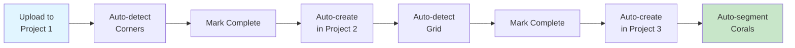

# Workflow Testing

Test the complete automated coral processing pipeline end-to-end.

!!! info "For End Users"
    This guide walks you through **uploading a test image** and verifying that all automation works correctly through the 3-stage pipeline.

**Time Required**: 20-30 minutes
**Prerequisites**: [Projects created](1-cvat-projects.md) and [webhooks configured](2-webhooks-setup.md)

## Test Overview

You'll upload one test image and watch it automatically flow through the pipeline:



**Expected Behavior**:
- Corner detection runs automatically when job opens
- Task completion creates new task in next project
- Grid detection runs automatically
- Grid removal happens automatically
- Coral segmentation runs automatically

**Total Pipeline Time**: 2-3 minutes per image

## Step 1: Prepare Test Image

### Option A: Download Sample Image

```bash
# Download test image from CRIOBE
wget https://storage.googleapis.com/criobe_public/test_samples/1-raw_jpg/sample_quadrat.jpg

# Or use curl
curl -O https://storage.googleapis.com/criobe_public/test_samples/1-raw_jpg/sample_quadrat.jpg
```

### Option B: Use Your Own Image

Use any coral quadrat image with:
- Visible grid overlay with 4 corners
- Resolution: 1920x1920px or similar
- Format: JPG or PNG
- Clear grid lines and coral details

## Step 2: Create Task in Project 1

Upload your test image to the corner detection project:

1. **Login to CVAT**: http://localhost:8080
2. **Navigate**: Projects → **corner_detection**
3. **Create Task**: Click **+** (Create new task button)
4. **Configure Task**:
    - **Name**: `test_workflow_001`
    - **Subset**: training (or leave default)
    - **Select files**: Click to upload
        - Browse and select your test image
        - Or drag and drop image
    - **Image quality**: 100 (maximum quality)
    - **Advanced** (optional):
        - Overlap size: 0
        - Segment size: 0 (single image)
        - Start frame: 0
        - Stop frame: 0
        - Frame filter: (leave empty)
    - **Data format**: (auto-detected)
5. **Submit**: Click **Submit** button

**Expected**: Task created with status "New", showing 1 frame

## Step 3: Test Corner Detection

Open the job to trigger automatic corner detection:

1. **Open Task**: Click on `test_workflow_001`
2. **Open Job**: Click **Open** button (or Job #1 link)
3. **Change job state to "in progress"** to trigger the automatic detection
4. **Wait for Auto-detection**:
    - This triggers the model detection webhook
    - Wait 5-10 seconds
5. **Refresh Page**: Press Ctrl+R or F5
6. **Verify**: You should see **4 corner points** automatically placed on the image

**If corners appear**:
- ✅ Model detection webhook working
- ✅ Nuclio function accessible
- ✅ Bridge automation working

### Manual Corner Annotation (Fallback)

If auto-detection doesn't work, manually annotate corners:

1. **Select Tool**: Click **Point** tool in left toolbar
2. **Select Label**: Choose "corner" label
3. **Click**: Click on each of the 4 corners of the grid
    - Top-left corner
    - Top-right corner
    - Bottom-right corner
    - Bottom-left corner
4. **Save**: Ctrl+S or click save button

!!! tip "Corner Order"
    Corner order doesn't matter for detection, but consistent ordering helps with debugging.

## Step 4: Complete Task and Watch Automation

Mark the task as complete to trigger the next stage:

1. **Return to Task View**: Click task name or back button
2. **Actions**: Click three-dot menu on task
3. **Change Status**: Select **"Completed"**
4. **Confirm**: Click confirm

**What happens next (automatically)**:
1. Task completion webhook fires
2. Bridge receives webhook notification
3. Bridge downloads corner annotations
4. Bridge downloads image
5. Bridge crops and warps image using corners
6. Bridge creates new task in Project 2 (grid_detection)
7. Bridge uploads warped image to new task

**Monitor Bridge Logs**:
```bash
# In another terminal, watch Bridge logs
docker compose logs bridge -f

# You should see:
# INFO: Received webhook from project 1
# INFO: Processing task test_workflow_001
# INFO: Downloading annotations and images
# INFO: Warping image with 4 corner points
# INFO: Creating task in project 2
# INFO: Task created successfully (ID: xxx)
```

## Step 5: Verify Grid Detection Stage

Check that task was created in Project 2:

1. **Navigate**: Projects → **grid_detection**
2. **Verify**: You should see a new task (automatically created)
    - Name: Based on original task name
    - Status: "New"
    - Frames: 1 (the warped image)
3. **Open Task**: Click on the new task
4. **Open Job**: Click **Open** (job state is automatically set to "in progress" by the webhook)
5. **Wait for Auto-detection**:
    - Wait 10-15 seconds
6. **Refresh Page**: Ctrl+R
7. **Verify**: You should see **117 grid intersection points**

**If grid points appear**:
- ✅ Task completion webhook working
- ✅ Image warping successful
- ✅ Grid detection model working

### Manual Grid Annotation (Fallback)

If auto-detection fails, you can manually add grid points (tedious but possible):

1. Select **Point** tool
2. Select "grid_point" label
3. Click on each of the 117 grid intersections
4. Save

!!! warning "Manual Grid Annotation is Tedious"
    This is not recommended - better to debug auto-detection. See [troubleshooting](#troubleshooting) below.

## Step 6: Complete Grid Detection

Mark grid detection task as complete:

1. **Return to Task View**
2. **Actions** → **Change Status** → **"Completed"**
3. **Confirm**

**What happens next (automatically)**:
1. Task completion webhook fires
2. Bridge downloads grid annotations
3. Bridge removes grid lines via inpainting (Nuclio function)
4. Bridge creates new task in Project 3 (coral_segmentation)
5. Bridge uploads grid-removed image

**Monitor Bridge Logs**:
```bash
docker compose logs bridge -f

# Expected:
# INFO: Received webhook from project 2
# INFO: Processing grid detection task
# INFO: Calling grid removal function
# INFO: Grid removed successfully
# INFO: Creating task in project 3
```

## Step 7: Verify Coral Segmentation Stage

Check that task was created in Project 3:

1. **Navigate**: Projects → **coral_segmentation**
2. **Verify**: New task created (grid-removed image)
3. **Open Task**
4. **Open Job**
5. **Wait for Auto-segmentation**:
    - Wait 15-30 seconds (coral segmentation takes longer)
6. **Refresh Page**: Ctrl+R
7. **Verify**: You should see **coral polygons with species labels**

**If coral polygons appear**:
- ✅ Grid removal successful
- ✅ Coral segmentation model working
- ✅ Complete pipeline working end-to-end!

## Step 8: Review and Refine Results

Now that you have auto-generated annotations, review them:

1. **Check Species Labels**:
    - Are corals labeled with correct species?
    - Are there false positives?
    - Are there missed corals?
2. **Adjust Boundaries**:
    - Select polygon tool
    - Click on polygon to edit
    - Drag points to adjust boundaries
    - Add/remove points as needed
3. **Delete False Positives**:
    - Select polygon
    - Press Delete key
4. **Add Missing Corals**:
    - Use polygon tool
    - Draw around missed corals
    - Assign correct label
5. **Save**: Ctrl+S

## Step 9: Export Results

Export annotations for analysis:

1. **Task Actions**: Click three-dot menu
2. **Export Task Dataset**
3. **Select Format**:
    - **COCO 1.0**: For analysis, training
    - **CVAT for images 1.1**: For backup, re-import
4. **Export**: Click **Export**
5. **Download**: Download ZIP file

**Export Contents**:
- `annotations.json`: COCO format annotations
- `images/`: Original images (optional)
- Metadata files

## Pipeline Performance Metrics

Expected timing for typical hardware (GTX 1070, 16GB RAM):

| Stage | Operation | Expected Time |
|-------|-----------|---------------|
| 1 | Upload image | 1-2s |
| 2 | Corner detection | 5-10s |
| 3 | Task completion webhook | 2-3s |
| 4 | Image warping | 2-3s |
| 5 | Grid detection | 10-15s |
| 6 | Task completion webhook | 2-3s |
| 7 | Grid removal (inpainting) | 5-8s |
| 8 | Coral segmentation | 15-30s |
| **Total** | **Complete pipeline** | **~2-3 minutes** |

## Troubleshooting

### Corner Detection Doesn't Run

**Symptoms**: Job opens but no corners appear

**Solutions**:
```bash
# Check model detection webhook configured
# In CVAT: Project 1 → Actions → Setup Webhooks
# Verify webhook exists for detect-model-webhook

# Check Nuclio function running
nuctl get function pth-yolo-gridcorners --platform local
# Should show STATE: ready

# Check function logs
nuctl get logs pth-yolo-gridcorners --platform local --tail 20

# Test function directly
curl http://localhost:<function-port> -d '{"image":"test"}' \
  -H "Content-Type: application/json"

# Check Bridge logs
docker compose logs bridge -f
```

### No Task Created in Project 2

**Symptoms**: Mark task complete but nothing happens

**Solutions**:
```bash
# Check webhook configured correctly
# Project 1 → Setup Webhooks
# Verify target_proj_id matches Project 2 ID

# Check webhook deliveries
# Click on webhook → View deliveries
# Should show successful delivery (HTTP 200)

# Check Bridge logs
docker compose logs bridge -f
# Look for errors or "task completed" message

# Verify cvat_worker_webhooks running
docker compose ps cvat_worker_webhooks
docker compose restart cvat_worker_webhooks

# Check Project 2 exists
curl http://localhost:8080/api/projects/2 \
  -H "Authorization: Token YOUR_TOKEN"
```

### Grid Detection Very Slow

**Symptoms**: Wait >1 minute, still no grid points

**Solutions**:
```bash
# Check GPU available
nvidia-smi

# Check function status
nuctl get function pth-yolo-gridpose --platform local

# Check function logs for errors
nuctl get logs pth-yolo-gridpose --platform local

# Try refreshing page multiple times
# Sometimes annotations don't render immediately

# Check image size (very large images take longer)
# Recommended: 1920x1920px or smaller
```

### Annotations Don't Appear After Refresh

**Symptoms**: Refresh but page still empty

**Solutions**:
1. **Clear browser cache**: Ctrl+Shift+R (hard refresh)
2. **Check job status**: Should be "in progress"
3. **Wait longer**: Some models take 30+ seconds
4. **Check logs**:
    ```bash
    docker compose logs bridge -f
    nuctl get logs <function-name> --platform local
    ```
5. **Verify function completed**: Check Nuclio dashboard

### Grid Removal Fails

**Symptoms**: Error in Bridge logs during grid removal

**Solutions**:
```bash
# Check grid removal function
nuctl get function pth-lama --platform local

# Check function logs
nuctl get logs pth-lama --platform local

# Verify GPU memory available
nvidia-smi
# Grid removal needs ~4GB GPU memory

# Check grid annotations are valid
# Need exactly 117 points
# Points should be within image bounds
```

### Coral Segmentation Returns No Results

**Symptoms**: Job opens but no polygons appear

**Solutions**:
```bash
# Check correct model name in webhook
# Should be: pth-yolo-coralsegv4
# With: &conv_mask_to_poly=true

# Check function running
nuctl get function pth-yolo-coralsegv4 --platform local

# Check function logs
nuctl get logs pth-yolo-coralsegv4 --platform local --tail 50

# Verify image has corals visible
# Model may return empty if no corals detected

# Check GPU memory (needs 4-6GB)
nvidia-smi
```

## Success Criteria

After completing the workflow test, verify:

- [ ] Corner detection ran automatically
- [ ] Task completion created task in Project 2
- [ ] Grid detection ran automatically
- [ ] Task completion created task in Project 3
- [ ] Coral segmentation ran automatically
- [ ] Results are visible and editable in CVAT
- [ ] Bridge logs show no errors
- [ ] Pipeline completed in <5 minutes

!!! success "Workflow Test Complete!"
    If all criteria are met, your QUADRATSEG platform is fully operational!

## Next Steps

!!! success "Platform Ready for Production!"
    Your automated coral processing pipeline is configured and tested!

**What's next**:

1. **Process Your Data**: Upload your coral quadrat images
2. **Batch Processing**: Create tasks with multiple images
3. **Review Workflow**: Regularly check and refine predictions
4. **Export Data**: Export annotations for statistical analysis
5. **Monitor Performance**: Keep track of processing times and accuracy

**Advanced Usage**:
- [First Annotation Tutorial](../../../quickstart/first-annotation.md) - Detailed walkthrough
- Scale up processing with multiple tasks
- Fine-tune models with your annotations ([Developer Setup](../../installation/for-developers/1-pixi-setup.md))

## Quick Reference

### Workflow Checklist

```
1. Upload image to Project 1
2. Open job → corners auto-detect (5-10s)
3. Mark task complete
4. Verify task created in Project 2
5. Open job → grid auto-detects (10-15s)
6. Mark task complete
7. Verify task created in Project 3
8. Open job → corals auto-segment (15-30s)
9. Review and refine results
10. Export annotations
```

### Debug Commands

```bash
# Check all services
docker compose ps

# Watch Bridge logs
docker compose logs bridge -f

# Check webhooks
# CVAT → Projects → Actions → Setup Webhooks

# Check functions
nuctl get functions --platform local

# Check GPU
nvidia-smi

# Restart webhook worker
docker compose restart cvat_worker_webhooks
```

---

**Questions?** See [Getting Help](../../../community/index.md) or [troubleshooting guides](../../installation/for-end-users/3-verification.md#troubleshooting).
