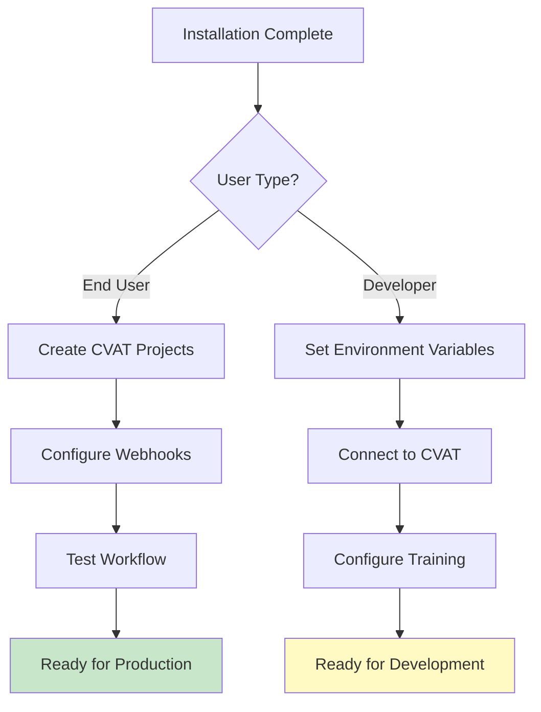

# Configuration Guide

Configure the QUADRATSEG platform after installation. Choose your configuration path based on your role.

## Configuration Paths

After installing the platform, you need to configure it for your specific use case:

-   :material-cog:{ .lg .middle } **End User Configuration**

    ---

    Configure **CVAT projects, webhooks, and automation** for processing coral images.

    **Use Case**: Set up the platform for production use

    [:octicons-arrow-right-24: Platform Configuration](for-end-users/1-cvat-projects.md)

-   :material-code-json:{ .lg .middle } **Developer Configuration**

    ---

    Configure **development environments, CVAT integration, and training setups** for model development.

    **Use Case**: Set up for training and experimentation

    [:octicons-arrow-right-24: Development Configuration](for-developers/1-environment-variables.md)

## Configuration Comparison

| Aspect | Platform Configuration | Development Configuration |
|--------|----------------------|--------------------------|
| **Target Users** | Coral researchers | AI researchers, developers |
| **Purpose** | Set up automation workflow | Set up training environment |
| **Components** | CVAT projects, webhooks | Environment variables, datasets |
| **Time Estimate** | 30-45 minutes | 45-60 minutes |
| **Complexity** | ⭐⭐ Moderate | ⭐⭐⭐ Advanced |

## Platform Configuration (End Users)

For users who deployed the platform and want to configure it for coral image processing:

### Configuration Steps

1. **[CVAT Projects](for-end-users/1-cvat-projects.md)** - Create annotation projects
    - Create 3 projects (Corner, Grid, Coral)
    - Configure labels for each project
    - Set up project settings
    - **Time**: 15-20 minutes

2. **[Webhooks Setup](for-end-users/2-webhooks-setup.md)** - Configure automation
    - Task completion webhooks
    - Model detection webhooks
    - Test webhook connectivity
    - **Time**: 20-30 minutes

3. **[Workflow Testing](for-end-users/3-workflow-testing.md)** - Test complete pipeline
    - Upload test image
    - Verify automation triggers
    - Review results
    - **Time**: 20-30 minutes

### Prerequisites

- [x] [Platform installation](../installation/for-end-users/1-docker-deployment.md) completed
- [x] [ML models deployed](../installation/for-end-users/2-ml-models-deployment.md)
- [x] [Installation verified](../installation/for-end-users/3-verification.md)

---

## Development Configuration (Developers)

For developers who installed the development environment and want to configure it for training:

### Configuration Steps

1. **[Environment Variables](for-developers/1-environment-variables.md)** - Configure .env files
    - Set up CVAT credentials
    - Configure data paths
    - Module-specific settings
    - **Time**: 10-15 minutes

2. **[CVAT Integration](for-developers/2-cvat-integration.md)** - Connect to CVAT
    - Test CVAT SDK connection
    - Pull datasets from CVAT
    - Configure FiftyOne
    - **Time**: 20-30 minutes

3. **[Training Configuration](for-developers/3-training-config.md)** - Set up training
    - Understand experiment configs
    - Modify hyperparameters
    - Set up logging and tracking
    - **Time**: 30-45 minutes

### Prerequisites

- [x] [Pixi installation](../installation/for-developers/1-pixi-setup.md) completed
- [x] [Module environments](../installation/for-developers/2-module-environments.md) set up
- [x] [Data preparation](../installation/for-developers/3-data-preparation.md) completed
- [x] [GPU configuration](../installation/for-developers/4-gpu-configuration.md) done

---

## Configuration Workflow

## Quick Decision Guide

**Choose Platform Configuration if you want to**:
- Process coral images through the automated pipeline
- Set up annotation projects and tasks
- Configure webhooks for automation
- Use the platform for research data collection

**Choose Development Configuration if you want to**:
- Train custom models on your data
- Experiment with different architectures
- Modify the ML pipeline
- Contribute to model development

## Getting Help

!!! question "Need Configuration Help?"
    - **Platform Configuration Issues**: Check [workflow testing troubleshooting](for-end-users/3-workflow-testing.md#troubleshooting)
    - **Development Configuration Issues**: Check [training config guide](for-developers/3-training-config.md#troubleshooting)
    - **General Help**: See [Getting Help](../../community/index.md)

## Next Steps

**Choose your configuration path above and start configuring!**

After configuration, you can:
- **End Users**: Start processing your coral reef images
- **Developers**: Begin training and experimentation
