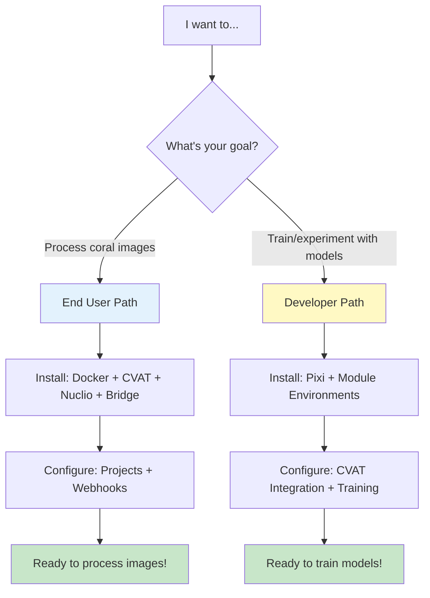
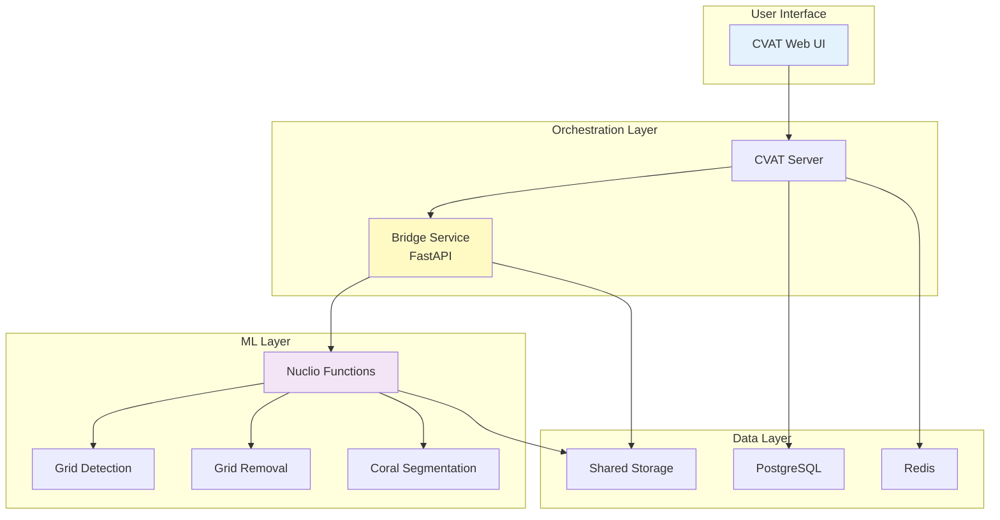

# Setup Guide

Complete installation and configuration guide for the QUADRATSEG platform—developed by CRIOBE (Centre de Recherches Insulaires et Observatoire de l'Environnement)—for coral researchers and AI developers.

## Choose Your Setup Path

The QUADRATSEG platform supports two distinct use cases with different setup requirements:

## Setup Paths

-   :material-image-multiple:{ .lg .middle } **End User Path**

    ---

    **For coral researchers who want to process images**

    Install the platform stack (CVAT + Nuclio + Bridge) to automatically process coral quadrat images through the complete pipeline.

    **What you'll install**:
    - Docker containers (CVAT, Nuclio, Bridge)
    - Pre-trained ML models as serverless functions
    - Automated workflow with webhooks

    **No Pixi or Python environments needed!**

    [:octicons-arrow-right-24: End User Setup](installation/for-end-users/1-docker-deployment.md)

-   :material-code-braces:{ .lg .middle } **Developer Path**

    ---

    **For AI researchers who want to train models**

    Set up Pixi-managed Python environments to train, evaluate, and experiment with ML models using your own datasets.

    **What you'll install**:
    - Pixi package manager
    - Module-specific environments
    - Training frameworks and tools
    - Optional: CVAT integration for dataset management

    **For continuous learning and experimentation!**

    [:octicons-arrow-right-24: Developer Setup](installation/for-developers/1-pixi-setup.md)

## Setup Comparison

| Aspect | End User Path | Developer Path |
|--------|--------------|----------------|
| **Target Users** | Coral researchers | AI researchers, developers |
| **Purpose** | Process coral images | Train/experiment with models |
| **Installation** | Docker deployment | Pixi environments |
| **Components** | CVAT + Nuclio + Bridge | Python modules + training tools |
| **Prerequisites** | Docker, nvidia-docker | Docker, Pixi, CUDA |
| **Time Estimate** | 1-2 hours | 1.5-2.5 hours |
| **Complexity** | ⭐⭐ Moderate | ⭐⭐⭐ Advanced |

## Quick Navigation

-   :material-clipboard-check:{ .lg .middle } **Requirements**

    ---

    Review system requirements for hardware, software, and network infrastructure.

    [:octicons-arrow-right-24: Check Requirements](requirements.md)

-   :material-download:{ .lg .middle } **Installation**

    ---

    Install components based on your chosen path: platform deployment or development environment.

    [:octicons-arrow-right-24: Installation Guide](installation/index.md)

-   :material-cog:{ .lg .middle } **Configuration**

    ---

    Configure your installation: projects and webhooks for end users, or training configs for developers.

    [:octicons-arrow-right-24: Configuration Guide](configuration/index.md)

## Quick Setup Checklist

=== "End User Checklist"

    Track your platform deployment progress:

    **Prerequisites**:
    - [ ] Verify hardware meets minimum requirements
    - [ ] Install Docker and Docker Compose
    - [ ] Install nvidia-docker for GPU support
    - [ ] Clone CRIOBE's CVAT repository

    **Installation**:
    - [ ] Deploy Docker stack (CVAT + Nuclio + Bridge)
    - [ ] Deploy 6 ML models as Nuclio functions
    - [ ] Verify all services are running

    **Configuration**:
    - [ ] Create 3 CVAT projects (Corner, Grid, Coral)
    - [ ] Configure 5 webhooks for automation
    - [ ] Test complete workflow with sample image

    **Total Time**: 1-2 hours

=== "Developer Checklist"

    Track your development environment setup:

    **Prerequisites**:
    - [ ] Verify hardware meets minimum requirements
    - [ ] Install Docker and Docker Compose (optional)
    - [ ] Install CUDA toolkit and drivers
    - [ ] Install Pixi package manager
    - [ ] Clone the coral-segmentation repository

    **Installation**:
    - [ ] Set up module environments with Pixi
    - [ ] Download pre-trained models
    - [ ] Prepare datasets
    - [ ] Verify GPU configuration

    **Configuration**:
    - [ ] Create `.env` files for each module
    - [ ] Configure CVAT integration (optional)
    - [ ] Set up training configurations
    - [ ] Test training and inference

    **Total Time**: 1.5-2.5 hours

## Architecture Overview

Understanding the system architecture helps with setup:

## Platform Deployment Scenarios

For end users deploying the platform:

=== "Single Machine"
    - Deploy all services on one server
    - All services on same host
    - Shared GPU for all ML functions
    - **Best for**: Individual researchers, testing, small-scale use

=== "Multi-User Production"
    - Distributed deployment across servers
    - Separate hosts for CVAT, Nuclio, storage
    - Dedicated GPUs for ML inference
    - **Best for**: Research teams, lab deployments

=== "Cloud Deployment"
    - Kubernetes or cloud-native deployment
    - Auto-scaling for ML functions
    - Managed databases and storage
    - **Best for**: Large-scale operations, high availability

## System Support Matrix

| Component | Linux | macOS | Windows | Notes |
|-----------|-------|-------|---------|-------|
| **End User Path** | | | | |
| CVAT + Nuclio | ✅ | ✅ | ✅* | Docker required |
| Bridge Service | ✅ | ✅ | ✅ | Docker recommended |
| GPU Support | ✅ CUDA | ❌ | ✅ CUDA | nvidia-docker required |
| **Developer Path** | | | | |
| Pixi Environments | ✅ | ✅ | ⚠️** | Native or WSL2 |
| Training Tools | ✅ | ⚠️*** | ❌ | CUDA required for GPU |
| FiftyOne/Jupyter | ✅ | ✅ | ✅ | CPU compatible |

*Windows: Use WSL2 for best experience
**Windows: WSL2 recommended for Pixi
***macOS: CPU-only training, no CUDA support

## Getting Help

!!! question "Need Assistance with Setup?"
    - **Documentation**: Read through each section carefully
    - **Installation Issues**: Check the troubleshooting sections in each guide
    - **Community**: See [Getting Help](../community/index.md)
    - **GitHub Issues**: Report problems on [GitHub](https://github.com/criobe/coral-segmentation/issues)

## Next Steps

**Choose your path and get started**:

=== "End User Path"
    1. **[Review Requirements](requirements.md)** - Check your hardware
    2. **[Install Platform](installation/for-end-users/1-docker-deployment.md)** - Deploy CVAT + Nuclio + Bridge
    3. **[Configure Workflow](configuration/for-end-users/1-cvat-projects.md)** - Set up projects and webhooks
    4. **[Try First Annotation](../quickstart/first-annotation.md)** - Process your first image

=== "Developer Path"
    1. **[Review Requirements](requirements.md)** - Check your hardware and CUDA
    2. **[Install Development Environment](installation/for-developers/1-pixi-setup.md)** - Set up Pixi and modules
    3. **[Configure Training](configuration/for-developers/1-environment-variables.md)** - Set up CVAT integration
    4. **[Start Training](../quickstart/developer-setup.md)** - Train your first model

---

!!! tip "Bookmark This Page"
    This page helps you navigate the complete setup process. Bookmark it for easy reference during installation and configuration.
