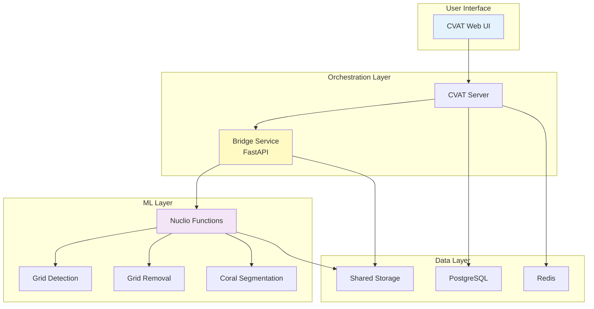

# Setup Guide

Complete installation and configuration guide for deploying the CRIOBE coral segmentation pipeline in production or development environments.

## Setup Overview

The setup process consists of three main stages:

## Setup Sections

-   :material-clipboard-check:{ .lg .middle } **Requirements**

    ---

    Review system requirements for hardware, software, and network infrastructure.

    [:octicons-arrow-right-24: Check Requirements](requirements.md)

-   :material-download:{ .lg .middle } **Installation**

    ---

    Install all components: Pixi environments, CVAT + Nuclio, bridge service, and ML models.

    [:octicons-arrow-right-24: Install System](installation/index.md)

-   :material-cog:{ .lg .middle } **Configuration**

    ---

    Configure environment variables, CVAT projects, webhooks, and Nuclio functions.

    [:octicons-arrow-right-24: Configure System](configuration/index.md)

-   :material-rocket-launch:{ .lg .middle } **Deployment**

    ---

    Deploy with Docker Compose, configure networking, and verify the installation.

    [:octicons-arrow-right-24: Deploy System](deployment/index.md)

## Quick Setup Checklist

Use this checklist to track your setup progress:

### Phase 1: Pre-Installation
- [ ] Verify hardware meets minimum requirements
- [ ] Install Docker and Docker Compose
- [ ] Install Pixi package manager
- [ ] Clone the repository

### Phase 2: Installation
- [ ] Install CVAT with Nuclio
- [ ] Set up module environments with Pixi
- [ ] Download pre-trained ML models
- [ ] Deploy bridge service

### Phase 3: Configuration
- [ ] Create `.env` files for each module
- [ ] Set up CVAT projects
- [ ] Configure webhooks
- [ ] Deploy Nuclio functions

### Phase 4: Verification
- [ ] Test CVAT accessibility
- [ ] Verify Nuclio dashboard
- [ ] Test bridge service health check
- [ ] Run end-to-end pipeline test

## Estimated Setup Time

| Component | Time | Difficulty |
|-----------|------|------------|
| Requirements Review | 15 min | ⭐ Easy |
| CVAT + Nuclio Installation | 30-60 min | ⭐⭐⭐ Advanced |
| Module Installation | 20-30 min | ⭐⭐ Moderate |
| Configuration | 30-45 min | ⭐⭐ Moderate |
| Deployment & Testing | 20-30 min | ⭐⭐ Moderate |
| **Total** | **2-3 hours** | |

## Architecture Overview

Understanding the system architecture helps with setup:

## Deployment Scenarios

Choose the deployment scenario that matches your needs:

=== "Development / Single User"
    - Deploy on local machine or single server
    - All services on same host
    - Shared GPU for all ML functions
    - **Best for**: Testing, development, small-scale use

=== "Production / Multi-User"
    - Distributed deployment across multiple servers
    - Separate hosts for CVAT, Nuclio, and storage
    - Dedicated GPUs for ML inference
    - **Best for**: Research teams, production workflows

=== "Cloud Deployment"
    - Kubernetes or cloud-native deployment
    - Auto-scaling for ML functions
    - Managed databases and storage
    - **Best for**: Large-scale operations, high availability

## Support Matrix

| Component | Linux | macOS | Windows | Docker |
|-----------|-------|-------|---------|--------|
| CVAT + Nuclio | ✅ | ✅ | ✅* | ✅ Required |
| Bridge Service | ✅ | ✅ | ✅ | ✅ Recommended |
| ML Modules | ✅ | ✅** | ❌ | ✅ Recommended |
| GPU Support | ✅ CUDA | ❌ | ✅ CUDA | ✅ nvidia-docker |

*Windows: Use WSL2 for best experience
**macOS: CPU only, no CUDA support

## Getting Help

!!! question "Need Assistance with Setup?"
    - **Documentation**: Read through each setup section carefully
    - **Issues**: Check [troubleshooting guides](deployment/index.md#troubleshooting)
    - **Community**: See [Getting Help](../community/getting-help.md)
    - **GitHub Issues**: Report setup problems on [GitHub](https://github.com/criobe/coral-segmentation/issues)

## Next Steps

1. **Start Here**: [Review Requirements](requirements.md)
2. **Then**: Follow the [Installation Guide](installation/index.md)
3. **After Setup**: Try the [Quickstart Demo](../quickstart/5-minute-demo.md)

---

!!! tip "Bookmark This Page"
    You'll refer back to setup documentation during configuration and troubleshooting. Bookmark this page for easy access.
