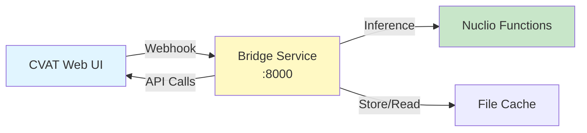

# Bridge Service Installation

The Bridge service is automatically deployed as part of the CVAT installation. This page provides additional details and verification steps.

!!! info "Already Installed?"
    If you completed the [CVAT + Nuclio Installation](cvat-nuclio.md), the Bridge service is already running. This page explains its configuration and how to verify it works.

## Overview

The Bridge service is a FastAPI application that automates the coral annotation pipeline by:

1. **Receiving webhooks** from CVAT when tasks are completed
2. **Processing images** through different pipeline stages
3. **Creating new tasks** in CVAT projects automatically
4. **Triggering ML models** via Nuclio functions

**Architecture**:


## Installation Context

The Bridge service was deployed as part of the CVAT stack in [Step 3 of CVAT installation](cvat-nuclio.md#step-3-deploy-the-stack):

```bash
docker compose \
  -f docker-compose.yml \
  -f bridge/docker-compose.bridge.yml \
  -f components/serverless/docker-compose.serverless.yml \
  up -d --build bridge cvat_server cvat_worker_webhooks
```

## Service Configuration

### Docker Compose File

The bridge is configured in `bridge/docker-compose.bridge.yml`:

```yaml
services:
  bridge:
    build: ./bridge
    container_name: bridge
    env_file: [./bridge/.env]
    restart: always
    networks:
      - cvat
    ports:
      - '8000:8000'
    depends_on:
      - "cvat_server"
      - "cvat_worker_webhooks"

  # Overrides for CVAT services (network configuration)
  cvat_server:
    environment:
      SMOKESCREEN_OPTS: "--allow-address=172.17.0.1"
      ALLOWED_HOSTS: "localhost,127.0.0.1,cvat-server"
    extra_hosts:
      - "bridge.gateway:host-gateway"

  cvat_worker_webhooks:
    environment:
      SMOKESCREEN_OPTS: "--allow-address=172.17.0.1"
    extra_hosts:
      - "bridge.gateway:host-gateway"
```

### Environment Variables

The bridge uses environment variables defined in `bridge/.env`:

```bash
# CVAT Connection
CVAT_URL=http://cvat-server:8080
CVAT_USER=admin
CVAT_PWD=your_admin_password

# Optional: Webhook authentication
WEBHOOK_SECRET=

# Cache and timeout settings
CACHE_DIR=/tmp/cvat_cache
AUTO_ANN_TIMEOUT=900
```

See [Environment Variables](../configuration/environment-variables.md#bridge) for detailed configuration options.

## Verify Installation

### Check Service is Running

```bash
# Check container status
docker ps | grep bridge

# Expected output:
# bridge   Up 10 minutes   0.0.0.0:8000->8000/tcp
```

### Test Health Endpoint

```bash
# Test from host
curl http://localhost:8000/health

# Expected: {"status":"healthy"}
```

### Test CVAT Connection

```bash
# Test bridge can reach CVAT
docker exec -it bridge curl -I http://cvat-server:8080/api/server/about

# Expected: HTTP/1.1 200 OK
```

### Test Nuclio Connection

```bash
# Test bridge can reach Nuclio functions
docker exec -it bridge curl -I http://nuclio-nuclio-pth-yolo-gridpose:8080

# Expected: HTTP/1.1 200 OK (or 405 Method Not Allowed for GET)
```

### View API Documentation

Open browser to `http://localhost:8000/docs` to see FastAPI interactive documentation.

**Available endpoints**:
- `/health` - Health check
- `/crop-quadrat-and-create-new-task-webhook` - Stage 1→2
- `/remove-grid-and-create-new-task-webhook` - Stage 2→3
- `/detect-model-webhook` - Run ML model
- `/test-webhook` - Test webhook functionality

## How the Bridge Works

### Webhook Flow

1. **Task Completion**: User marks CVAT task as "completed"
2. **CVAT Sends Webhook**: CVAT POSTs JSON payload to bridge webhook URL
3. **Bridge Processes**:
    - Downloads task annotations from CVAT
    - Downloads images from CVAT
    - Processes images (crop, warp, or remove grid)
    - Optionally runs ML model via Nuclio
4. **Bridge Creates Task**: Uploads processed images to new CVAT task
5. **Webhook Response**: Returns HTTP 200 to CVAT

### Webhook URLs

The bridge exposes several webhook endpoints:

```bash
# Corner detection → Grid detection
http://bridge.gateway:8000/crop-quadrat-and-detect-grid-webhook?target_proj_id=2

# Corner detection → Coral segmentation (skip grid)
http://bridge.gateway:8000/crop-quadrat-and-detect-corals-webhook?target_proj_id=3

# Grid detection → Coral segmentation
http://bridge.gateway:8000/remove-grid-and-detect-corals-webhook?target_proj_id=3

# Model detection (any project)
http://bridge.gateway:8000/detect-model-webhook?model_name=pth-yolo-coralsegv4
```

See [Webhooks Configuration](../configuration/webhooks.md) for complete webhook setup instructions.

## Manage the Bridge Service

### View Logs

```bash
# Follow real-time logs
docker logs bridge -f

# View last 100 lines
docker logs bridge --tail 100

# Search logs for errors
docker logs bridge | grep ERROR
```

**Common log entries**:
```
INFO: Received task completion webhook from project 1
INFO: Processing task: test_task_001
INFO: Warping image with 4 corner points
INFO: Creating new task in project 2
INFO: Task created successfully (ID: 123)
```

### Restart Service

```bash
# Restart bridge only
docker restart bridge

# Or rebuild and restart
cd ~/criobe-platform/cvat
docker compose \
  -f docker-compose.yml \
  -f bridge/docker-compose.bridge.yml \
  -f components/serverless/docker-compose.serverless.yml \
  up -d --build bridge
```

### Update Bridge Code

If you modify bridge source code:

```bash
cd ~/criobe-platform/cvat

# Rebuild and restart
docker compose \
  -f docker-compose.yml \
  -f bridge/docker-compose.bridge.yml \
  -f components/serverless/docker-compose.serverless.yml \
  up -d --build bridge

# Verify
docker logs bridge --tail 20
```

## Troubleshooting

### Bridge Not Accessible

**Test**:
```bash
curl http://localhost:8000/health
```

**If fails**:
```bash
# Check container is running
docker ps | grep bridge

# Check container logs
docker logs bridge --tail 50

# Restart if needed
docker restart bridge
```

### Webhook Not Working

**Error**: CVAT webhook ping fails

**Check network configuration**:
```bash
# From CVAT container, test bridge accessibility
docker exec -it cvat_server curl http://bridge.gateway:8000/health
```

**If fails**, check:
1. Gateway IP is correct for your platform (see [CVAT installation](cvat-nuclio.md#step-8-configure-network-advanced))
2. Smokescreen allows gateway IP
3. Port 8000 is exposed

**Check Smokescreen**:
```bash
# View CVAT server environment
docker exec -it cvat_server env | grep SMOKESCREEN

# Expected: SMOKESCREEN_OPTS=--allow-address=172.17.0.1
```

### Bridge Can't Reach CVAT

**Error**: Logs show `Connection refused` or `404 Not Found` when accessing CVAT

**Check**:
```bash
# Test from bridge container
docker exec -it bridge curl http://cvat-server:8080/api/server/about
```

**If fails**:
1. Check `ALLOWED_HOSTS` includes `cvat-server`
2. Verify `CVAT_URL` in bridge `.env` is `http://cvat-server:8080`

**Check ALLOWED_HOSTS**:
```bash
docker exec -it cvat_server env | grep ALLOWED_HOSTS

# Expected: ALLOWED_HOSTS=localhost,127.0.0.1,cvat-server
```

### Bridge Can't Reach Nuclio

**Error**: Logs show `Connection refused` when calling Nuclio functions

**Check**:
```bash
# List Nuclio functions
curl http://localhost:8070/api/functions?namespace=cvat

# Test from bridge container
docker exec -it bridge curl http://nuclio-nuclio-pth-yolo-gridpose:8080
```

**If fails**:
1. Verify Nuclio functions are deployed on `cvat_cvat` network
2. Check function names match exactly (case-sensitive)

**Verify network**:
```bash
# Check bridge network
docker inspect bridge | grep -A10 Networks

# Check Nuclio function network
docker inspect nuclio-nuclio-pth-yolo-gridpose | grep -A10 Networks

# Both should show "cvat_cvat" network
```

### Permission Errors

**Error**: Logs show `403 Forbidden` when creating CVAT tasks

**Check**:
1. `CVAT_USER` has admin permissions
2. `CVAT_PWD` is correct in bridge `.env`

**Test credentials**:
```bash
# From bridge container
docker exec -it bridge python -c "
from cvat_sdk import Client
client = Client('http://cvat-server:8080')
client.login(('admin', 'your_password'))
print('✅ Login successful')
"
```

## Development Mode

For local development outside Docker:

### Setup Virtual Environment

```bash
cd ~/criobe-platform/cvat/bridge

# Create virtual environment
python3.11 -m venv venv
source venv/bin/activate

# Install dependencies
pip install -r requirements.txt
```

### Run Locally

```bash
# Set environment variables
export CVAT_URL=http://localhost:8080
export CVAT_USER=admin
export CVAT_PWD=your_password

# Run development server
uvicorn app:app --host 0.0.0.0 --port 8000 --reload
```

**Access**: `http://localhost:8000/docs`

## Next Steps

!!! success "Bridge Service Verified!"
    The bridge service is running and ready to automate your annotation workflows.

**Continue with**:

- [Webhooks Configuration](../configuration/webhooks.md) - Set up CVAT webhooks
- [First Annotation Tutorial](../../quickstart/first-annotation.md) - Test bridge automation
- [Environment Variables](../configuration/environment-variables.md) - Customize bridge settings

## Quick Reference

### Service Endpoints

```bash
# Health check
curl http://localhost:8000/health

# API documentation
http://localhost:8000/docs

# Webhook endpoints
http://bridge.gateway:8000/crop-quadrat-and-create-new-task-webhook?target_proj_id=<ID>
http://bridge.gateway:8000/remove-grid-and-create-new-task-webhook?target_proj_id=<ID>
http://bridge.gateway:8000/detect-model-webhook?model_name=<MODEL>
```

### Management Commands

```bash
# View logs
docker logs bridge -f

# Restart service
docker restart bridge

# Rebuild and restart
docker compose -f docker-compose.yml -f bridge/docker-compose.bridge.yml \
  -f components/serverless/docker-compose.serverless.yml up -d --build bridge

# Test from inside container
docker exec -it bridge curl http://cvat-server:8080/api/server/about
```

---

**Questions?** See [Getting Help](../../community/getting-help.md) or [Webhooks Troubleshooting](../configuration/webhooks.md#troubleshooting).
