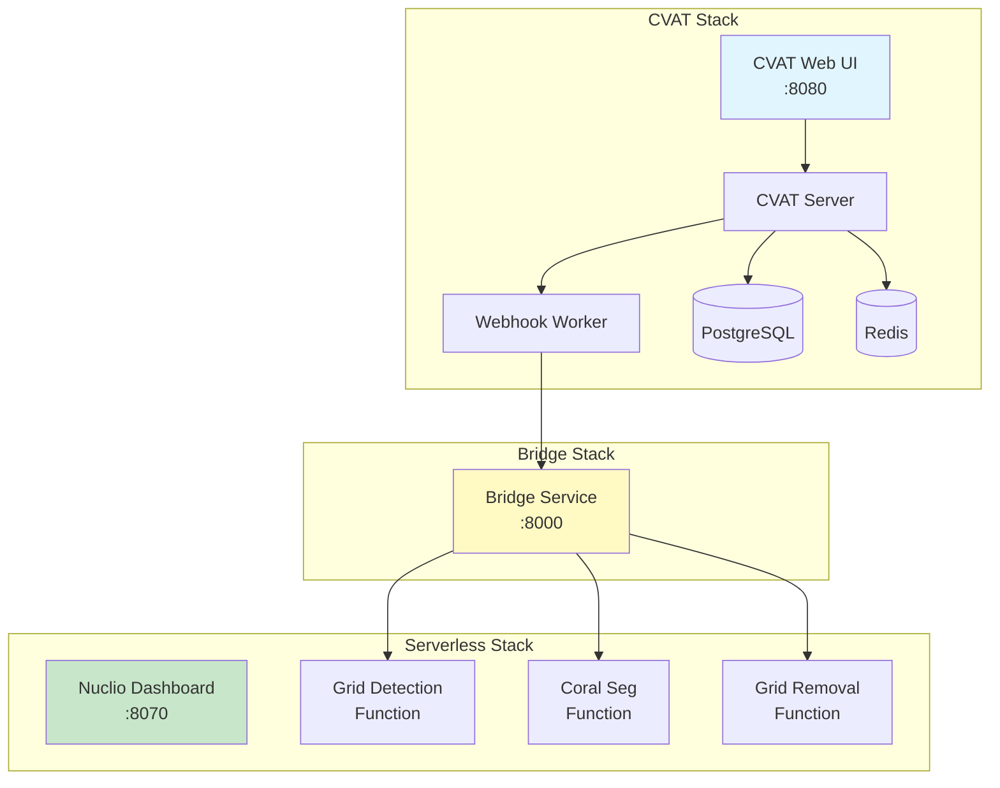

# CVAT + Nuclio Installation

Install and configure CVAT (Computer Vision Annotation Tool) with Nuclio serverless functions for automated coral annotation workflows.

!!! tip "What You'll Deploy"
    - **CVAT**: Web-based annotation platform with PostgreSQL database and Redis cache
    - **Nuclio**: Serverless ML function platform for running inference models
    - **Bridge Service**: Webhook automation service for pipeline orchestration
    - **Docker Network**: Configured networking for service communication

**Time Required**: 30-45 minutes
**Prerequisites**: [System requirements](../requirements.md) met, Docker and Git installed

## Overview

This installation deploys the complete CRIOBE annotation stack on a single host using Docker Compose:



## Prerequisites Check

Before proceeding, verify:

```bash
# Check Docker is running
docker --version
docker compose version

# Check available disk space (need 40+ GB)
df -h

# Check required ports are available
netstat -tuln | grep -E ':(8080|8070|8000|5432|6379)'
# Should return no results (ports free)
```

## Step 1: Clone CVAT with Bridge Integration

The CRIOBE project uses a forked version of CVAT v2.29.0 with bridge service integration.

```bash
# Create project workspace
mkdir -p ~/criobe-platform
cd ~/criobe-platform

# Clone CVAT fork with bridge
git clone https://github.com/Criobe/bridge.git cvat
cd cvat
```

!!! info "Repository Structure"
    The cloned repository contains:
    - `docker-compose.yml` - Base CVAT services
    - `components/serverless/docker-compose.serverless.yml` - Nuclio configuration
    - `bridge/` - Bridge service code and configuration
    - `bridge/docker-compose.bridge.yml` - Bridge Docker Compose override

## Step 2: Configure Bridge Service

Create environment configuration for the bridge service:

```bash
# Navigate to bridge directory
cd bridge

# Create .env file
cat > .env << 'EOF'
# CVAT Connection (internal Docker network)
CVAT_URL=http://cvat-server:8080
CVAT_USER=admin
CVAT_PWD=change_me_to_secure_password

# Optional: Webhook authentication
WEBHOOK_SECRET=

# Cache and timeout settings
CACHE_DIR=/tmp/cvat_cache
AUTO_ANN_TIMEOUT=900
EOF

# Return to CVAT root
cd ..
```

!!! warning "Security: Change Default Password"
    Replace `change_me_to_secure_password` with a strong password. This will be your CVAT admin user password.

**Environment Variables Explained**:

| Variable | Purpose | Default | Notes |
|----------|---------|---------|-------|
| `CVAT_URL` | CVAT server URL | `http://cvat-server:8080` | Internal Docker network address |
| `CVAT_USER` | Admin username | `admin` | Created in next step |
| `CVAT_PWD` | Admin password | - | **Required** - set a strong password |
| `WEBHOOK_SECRET` | HMAC signature key | (empty) | Optional - for webhook authentication |
| `CACHE_DIR` | Temporary file storage | `/tmp/cvat_cache` | Stores downloaded images/annotations |
| `AUTO_ANN_TIMEOUT` | Model timeout (seconds) | `900` | Max time for model inference |

## Step 3: Deploy the Stack

Deploy all services using Docker Compose with multiple configuration files:

### Build Core Services

First, build the bridge, CVAT server, and webhook worker:

```bash
docker compose \
  -f docker-compose.yml \
  -f bridge/docker-compose.bridge.yml \
  -f components/serverless/docker-compose.serverless.yml \
  up -d --build bridge cvat_server cvat_worker_webhooks
```

This builds:
- `bridge` - FastAPI webhook service
- `cvat_server` - Main CVAT backend
- `cvat_worker_webhooks` - Webhook processing worker

**Expected output**:
```
[+] Building 45.2s (23/23) FINISHED
[+] Running 3/3
 ✔ Container bridge                Started
 ✔ Container cvat_server           Started
 ✔ Container cvat_worker_webhooks  Started
```

### Start Remaining Services

Now start all other services (database, Redis, Nuclio, etc.):

```bash
docker compose \
  -f docker-compose.yml \
  -f bridge/docker-compose.bridge.yml \
  -f components/serverless/docker-compose.serverless.yml \
  up -d
```

**Expected services running**:
```bash
docker ps --format "table {{.Names}}\t{{.Status}}\t{{.Ports}}"
```

| Container | Status | Ports |
|-----------|--------|-------|
| `cvat_server` | Up | 8080:8080 |
| `cvat_ui` | Up | (internal) |
| `cvat_db` | Up | 5432:5432 |
| `cvat_redis` | Up | 6379:6379 |
| `cvat_worker_webhooks` | Up | - |
| `bridge` | Up | 8000:8000 |
| `nuclio` | Up | 8070:8070 |

!!! tip "Docker Compose File Merging"
    When multiple compose files are specified, they merge in order:
    - **Mappings** (like `environment`) are deep-merged
    - **Sequences** (like `volumes`) are appended
    - **Scalars** (like `image`) are replaced by later files

    This allows `bridge/docker-compose.bridge.yml` to override CVAT settings for network configuration.

## Step 4: Create Admin User

Create the first CVAT administrative user:

```bash
docker exec -it cvat_server \
  bash -ic 'python3 ~/manage.py createsuperuser'
```

**Interactive prompts**:
```
Username: admin
Email address: admin@criobe.local
Password: <enter password from bridge/.env>
Password (again): <confirm password>
Superuser created successfully.
```

!!! warning "Password Must Match"
    Use the **same password** you set in `bridge/.env` for `CVAT_PWD`. This ensures the bridge service can authenticate with CVAT.

## Step 5: Verify CVAT Access

Test CVAT is accessible:

```bash
# Check CVAT web UI is responding
curl -I http://localhost:8080/

# Should return:
# HTTP/1.1 200 OK
```

**Open CVAT in browser**:
1. Navigate to `http://localhost:8080/`
2. Login with credentials (default: `admin` / your password)
3. You should see the CVAT dashboard

## Step 6: Deploy Nuclio Functions

Deploy ML inference functions using `nuctl` CLI tool.

### Platform-Specific Instructions

=== "Linux / macOS"

    Install `nuctl` if not already installed:

    ```bash
    # Download nuctl
    curl -L https://github.com/nuclio/nuclio/releases/download/1.13.0/nuctl-1.13.0-linux-amd64 \
      -o nuctl

    # Make executable and move to PATH
    chmod +x nuctl
    sudo mv nuctl /usr/local/bin/

    # Verify installation
    nuctl version
    ```

    Deploy required functions:

    ```bash
    cd ~/criobe-platform/cvat

    # Grid corner detection (4 points)
    nuctl deploy --project-name cvat \
      --path "./serverless/pytorch/yolo/gridcorners/nuclio/" \
      --platform local -v

    # Grid pose detection (117 points)
    nuctl deploy --project-name cvat \
      --path "./serverless/pytorch/yolo/gridpose/nuclio/" \
      --platform local -v

    # Grid removal (LaMa inpainting)
    nuctl deploy --project-name cvat \
      --path "./serverless/pytorch/lama/nuclio/" \
      --platform local -v

    # Coral segmentation (YOLO)
    nuctl deploy --project-name cvat \
      --path "./serverless/pytorch/yolo/coralsegv4/nuclio/" \
      --file "./serverless/pytorch/yolo/coralsegv4/nuclio/function.yaml" \
      --platform local -v

    # Optional: Segment Anything Model (SAM)
    nuctl deploy --project-name cvat \
      --path "./serverless/pytorch/facebookresearch/sam/nuclio/" \
      --file "./serverless/pytorch/facebookresearch/sam/nuclio/function-gpu.yaml" \
      --platform local -v
    ```

    **Each deployment should show**:
    ```
    21.11.07 15:30:03.123   nuctl.platform.docker (I) Deploying function {"name": "pth-yolo-gridpose"}
    21.11.07 15:30:15.456   nuctl.platform.docker (I) Function deployed {"name": "pth-yolo-gridpose"}
    ```

=== "Windows"

    `nuctl` is not available on Windows. Use the Nuclio dashboard instead:

    **Option 1: Import Function YAML (for downloadable models)**

    1. Open Nuclio dashboard: `http://localhost:8070/`
    2. Click **Projects** → **cvat** → **New Function**
    3. Click **Import** tab
    4. Upload `function-gpu.yaml` or `function.yaml` from function directory
    5. Click **Deploy**

    **Option 2: Use Prebuilt Images (for custom models)**

    If models were built on Linux:

    ```powershell
    # On Linux machine: export image
    docker save -o coralsegv4.tar cvat.pth.yolo.coralsegv4:latest-gpu

    # Transfer to Windows, then load:
    docker load -i coralsegv4.tar
    ```

    Then in Nuclio dashboard:
    1. Import `function_no_build.yaml`
    2. In **Code** tab, set **Code Entry Type** to `Image`
    3. Enter image name: `cvat.pth.yolo.coralsegv4:latest-gpu`
    4. Click **Deploy**

### Verify Function Deployment

Check deployed functions:

```bash
# List all Nuclio functions
curl http://localhost:8070/api/functions?namespace=cvat | jq '.[] | {name: .metadata.name, status: .status.state}'
```

**Or visit Nuclio dashboard**: `http://localhost:8070/projects/cvat/functions`

Expected functions:

| Function Name | Purpose | Status |
|---------------|---------|--------|
| `pth-yolo-gridcorners` | 4-point corner detection | ready |
| `pth-yolo-gridpose` | 117-point grid detection | ready |
| `pth-lama` | Grid line removal | ready |
| `pth-yolo-coralsegv4` | Coral segmentation (CRIOBE) | ready |
| `pth-facebookresearch-sam-vit-h` | Segment Anything (optional) | ready |

!!! danger "Critical: Network Configuration"
    All Nuclio functions **must** be deployed on the `cvat_cvat` Docker network. Verify with:

    ```bash
    # Check function network
    docker inspect nuclio-nuclio-pth-yolo-gridpose | grep -A5 Networks

    # Should show "cvat_cvat" network
    ```

    If missing, add to `function.yaml` or `function_no_build.yaml`:
    ```yaml
    spec:
      platform:
        attributes:
          network: cvat_cvat
    ```

## Step 7: Test Bridge Service

Verify the bridge service can communicate with CVAT and Nuclio:

```bash
# Test bridge health
curl http://localhost:8000/health

# Expected: {"status":"healthy"}

# Test CVAT connection from bridge container
docker exec -it bridge curl -I http://cvat-server:8080/api/server/about

# Expected: HTTP/1.1 200 OK

# Test Nuclio function from bridge container
docker exec -it bridge curl -I http://nuclio-nuclio-pth-yolo-gridpose:8080

# Expected: HTTP/1.1 200 OK (or 405 for GET on POST endpoint)
```

## Step 8: Configure Network (Advanced)

The bridge service requires special network configuration to bypass CVAT's Smokescreen firewall.

### Why Network Configuration is Needed

CVAT's webhook system uses Smokescreen to prevent Server-Side Request Forgery (SSRF) attacks. By default, Smokescreen blocks requests to private IP addresses, including Docker container IPs. This prevents CVAT webhooks from reaching the bridge service.

**Solution**: Map the bridge service to the Docker host gateway and whitelist it in Smokescreen.

### Verify Configuration

The bridge Docker Compose file (`bridge/docker-compose.bridge.yml`) already includes the required configuration:

```yaml
services:
  bridge:
    ports:
      - "8000:8000"  # Expose to host

  cvat_server:
    environment:
      SMOKESCREEN_OPTS: "--allow-address=172.17.0.1"  # Linux gateway
      ALLOWED_HOSTS: "localhost,127.0.0.1,cvat-server"
    extra_hosts:
      - "bridge.gateway:host-gateway"  # Map host gateway

  cvat_worker_webhooks:
    environment:
      SMOKESCREEN_OPTS: "--allow-address=172.17.0.1"  # Linux gateway
    extra_hosts:
      - "bridge.gateway:host-gateway"  # Map host gateway
```

### Platform-Specific Gateway IPs

The gateway IP varies by platform:

| Platform | Gateway IP | SMOKESCREEN_OPTS |
|----------|------------|------------------|
| **Linux** | `172.17.0.1` | `--allow-address=172.17.0.1` |
| **Windows (WSL2)** | `192.168.65.254` | `--allow-address=192.168.65.254` |
| **macOS** | `192.168.65.1` | `--allow-address=192.168.65.1` |

!!! warning "Windows/macOS Users"
    If on Windows or macOS, edit `bridge/docker-compose.bridge.yml` to use the correct gateway IP:

    ```yaml
    cvat_server:
      environment:
        SMOKESCREEN_OPTS: "--allow-address=192.168.65.254"  # Windows
        # SMOKESCREEN_OPTS: "--allow-address=192.168.65.1"  # macOS
    ```

### Test Network Configuration

From inside CVAT container, verify bridge is reachable:

```bash
# Check gateway IP resolution
docker exec -it cvat_server getent hosts bridge.gateway

# Linux: Should return 172.17.0.1
# Windows: Should return 192.168.65.254

# Test bridge accessibility
docker exec -it cvat_server curl http://bridge.gateway:8000/health

# Expected: {"status":"healthy"}
```

## Post-Installation Verification

Run through this checklist to confirm successful installation:

### Service Health Checks

```bash
# CVAT API
curl http://localhost:8080/api/server/about
# Expected: {"name":"CVAT","version":"2.29.0",...}

# Nuclio Dashboard
curl http://localhost:8070/api/healthz
# Expected: OK

# Bridge Service
curl http://localhost:8000/health
# Expected: {"status":"healthy"}
```

### Access Web Interfaces

| Service | URL | Purpose |
|---------|-----|---------|
| **CVAT** | http://localhost:8080/ | Annotation interface |
| **Nuclio** | http://localhost:8070/projects/cvat/functions | Function management |
| **Bridge API Docs** | http://localhost:8000/docs | API documentation |

### Network Connectivity Test

```bash
# Test CVAT → Bridge via webhook ping
# 1. Login to CVAT: http://localhost:8080/
# 2. Create a test project
# 3. Go to: Actions → Setup Webhooks
# 4. Add webhook:
#    URL: http://bridge.gateway:8000/health
#    Content-Type: application/json
#    Events: Select "ping" or "task"
# 5. Click "Ping" button
# 6. Should show "✅ Success (200)" in deliveries table
```

## Managing the Stack

### Daily Operations

**Start all services**:
```bash
cd ~/criobe-platform/cvat
docker compose \
  -f docker-compose.yml \
  -f bridge/docker-compose.bridge.yml \
  -f components/serverless/docker-compose.serverless.yml \
  up -d
```

**Stop all services** (conserve resources):
```bash
docker compose \
  -f docker-compose.yml \
  -f bridge/docker-compose.bridge.yml \
  -f components/serverless/docker-compose.serverless.yml \
  down
```

**Restart single service**:
```bash
docker compose \
  -f docker-compose.yml \
  -f bridge/docker-compose.bridge.yml \
  -f components/serverless/docker-compose.serverless.yml \
  restart bridge
```

**View logs**:
```bash
# Bridge service logs
docker logs bridge -f

# CVAT server logs
docker logs cvat_server -f

# All webhook events
docker logs cvat_worker_webhooks -f
```

### Auto-Start on Boot

=== "Linux (systemd)"

    Create systemd service for auto-start:

    ```bash
    sudo nano /etc/systemd/system/cvat-stack.service
    ```

    ```ini
    [Unit]
    Description=CVAT Annotation Stack
    After=docker.service
    Requires=docker.service

    [Service]
    Type=oneshot
    RemainAfterExit=yes
    WorkingDirectory=/home/YOUR_USER/criobe-platform/cvat
    ExecStart=/usr/bin/docker compose -f docker-compose.yml -f bridge/docker-compose.bridge.yml -f components/serverless/docker-compose.serverless.yml up -d
    ExecStop=/usr/bin/docker compose -f docker-compose.yml -f bridge/docker-compose.bridge.yml -f components/serverless/docker-compose.serverless.yml down

    [Install]
    WantedBy=multi-user.target
    ```

    Enable and start:
    ```bash
    sudo systemctl enable cvat-stack.service
    sudo systemctl start cvat-stack.service
    ```

=== "Windows / macOS"

    Docker Desktop auto-starts containers marked with `restart: always` (already configured in compose files). Containers will restart when Docker Desktop launches.

## Troubleshooting

### Service Won't Start

**Check logs**:
```bash
docker logs cvat_server --tail 100
docker logs bridge --tail 100
```

**Common issues**:
- **Port conflicts**: Another service using 8080/8070/8000
  - Solution: Stop conflicting service or change ports in compose files
- **Out of memory**: Docker not allocated enough RAM
  - Solution: Increase Docker memory limit (Docker Desktop settings)
- **Permission errors**: User not in docker group
  - Solution: `sudo usermod -aG docker $USER` and re-login

### Webhook Not Reaching Bridge

**Test from CVAT container**:
```bash
docker exec -it cvat_server curl -v http://bridge.gateway:8000/health
```

**If fails**:
1. Check gateway IP is correct for your platform (see Network Configuration)
2. Verify SMOKESCREEN_OPTS allows gateway IP
3. Check bridge service is running: `docker ps | grep bridge`
4. Check firewall rules allow traffic on port 8000

**Check webhook deliveries**:
- CVAT → Project → Webhooks → View deliveries table
- Look for error status codes (400, 500, etc.)
- Click delivery ID to see request/response details

### Nuclio Function Fails to Deploy

**Check function logs**:
```bash
docker logs nuclio-nuclio-pth-yolo-gridpose
```

**Common issues**:
- **Model files missing**: Download models first (see [ML Models Installation](ml-models.md))
- **Out of GPU memory**: Reduce batch size or use CPU
- **Network not attached**: Add `network: cvat_cvat` to function.yaml
- **Build timeout**: Increase Docker build timeout or use prebuilt images

**Re-deploy function**:
```bash
# Delete existing function
nuctl delete function pth-yolo-gridpose --platform local

# Deploy again
nuctl deploy --project-name cvat \
  --path "./serverless/pytorch/yolo/gridpose/nuclio/" \
  --platform local -v
```

### Database Connection Issues

**Reset database** (⚠️ deletes all data):
```bash
docker compose \
  -f docker-compose.yml \
  -f bridge/docker-compose.bridge.yml \
  -f components/serverless/docker-compose.serverless.yml \
  down -v

# -v flag removes volumes (database data)
```

### Performance Issues

**Check resource usage**:
```bash
docker stats
```

**Optimize**:
- Reduce number of running Nuclio functions (stop unused models)
- Increase Docker memory/CPU allocation
- Use SSD for Docker storage
- Consider multi-server deployment for production

## Maintenance

### Update CVAT/Bridge

```bash
cd ~/criobe-platform/cvat

# Pull latest changes
git pull origin main

# Rebuild and restart
docker compose \
  -f docker-compose.yml \
  -f bridge/docker-compose.bridge.yml \
  -f components/serverless/docker-compose.serverless.yml \
  up -d --build
```

### Backup Data

**Backup volumes**:
```bash
# Create backup directory
mkdir -p ~/cvat-backups/$(date +%Y%m%d)

# Backup database
docker exec cvat_db pg_dump -U root cvat > \
  ~/cvat-backups/$(date +%Y%m%d)/cvat_db.sql

# Backup CVAT data volume
docker run --rm \
  -v cvat_cvat_data:/data \
  -v ~/cvat-backups/$(date +%Y%m%d):/backup \
  ubuntu tar czf /backup/cvat_data.tar.gz /data
```

### Clean Up Old Data

```bash
# Remove stopped containers
docker container prune

# Remove unused images
docker image prune -a

# Remove unused volumes (⚠️ careful - may delete data)
docker volume prune
```

## Next Steps

!!! success "Installation Complete!"
    CVAT, Nuclio, and Bridge are now installed and configured.

**Continue with**:

- [ML Models Installation](ml-models.md) - Download and deploy pre-trained models
- [CVAT Projects Configuration](../configuration/cvat-projects.md) - Create annotation projects
- [Webhook Configuration](../configuration/webhooks.md) - Set up automated pipelines
- [First Annotation Tutorial](../../quickstart/first-annotation.md) - Test the complete workflow

## Quick Reference

### Service Endpoints

```bash
# CVAT
http://localhost:8080/projects        # Web UI
http://localhost:8080/api/docs/       # API docs

# Nuclio
http://localhost:8070/projects/cvat   # Dashboard

# Bridge
http://localhost:8000/health          # Health check
http://localhost:8000/docs            # API docs
```

### Common Commands

```bash
# Start stack
docker compose -f docker-compose.yml \
  -f bridge/docker-compose.bridge.yml \
  -f components/serverless/docker-compose.serverless.yml up -d

# View logs
docker logs bridge -f
docker logs cvat_server -f

# Restart service
docker restart bridge

# Check function status
curl http://localhost:8070/api/functions?namespace=cvat
```

---

**Questions?** See [Getting Help](../../community/getting-help.md) or check [Deployment Troubleshooting](../deployment/docker-compose.md#troubleshooting).
