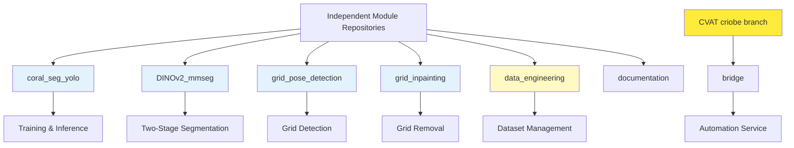

# Module Environments

Install and configure Pixi environments for all QUADRATSEG modules used in training and experimentation.

!!! info "For Developers"
    This guide sets up **module-specific Python environments** for AI research and model development. Each module has its own isolated environment with specific dependencies.

**Time Required**: 45-60 minutes
**Prerequisites**: [Pixi installed](1-pixi-setup.md) and repository cloned

## Module Overview

QUADRATSEG consists of **independent module repositories**, each with its own Pixi environment:



## Module Environments Reference

| Module | Environment Name | Purpose | Key Dependencies |
|--------|-----------------|---------|-----------------|
| **coral_seg_yolo** | `coral-seg-yolo` | Training/inference | PyTorch 2.5, Ultralytics 8.3 |
| | `coral-seg-yolo-dev` | Development | + Jupyter, FiftyOne |
| **DINOv2_mmseg** | `dinov2-mmseg` | Two-stage segmentation | PyTorch 2.0, MMSegmentation |
| **grid_pose_detection** | `grid-pose` | Grid detection | PyTorch, Ultralytics |
| | `grid-pose-dev` | Development | + Jupyter, FiftyOne |
| **grid_inpainting** | `grid-inpainting` | Grid removal | PyTorch, SimpleLama |
| | `grid-inpainting-deploy` | Deployment | Minimal dependencies |
| **data_engineering** | `default` | Dataset management | FiftyOne, CVAT SDK |
| **bridge** | `bridge` | Automation API | FastAPI, CVAT SDK |
| **documentation** | `default` | Documentation | MkDocs Material |

## Installation Strategy

You don't need to install all modules immediately. Choose based on your needs:

=== "Full Installation"
    Install all modules for complete development capability:
    - **Time**: 45-60 minutes
    - **Disk**: ~20GB for all environments
    - **Use case**: Full platform development

=== "Coral Segmentation Only"
    Focus on coral segmentation module:
    - **Modules**: coral_seg_yolo, data_engineering
    - **Time**: 20-25 minutes
    - **Use case**: Training coral segmentation models

=== "Grid Detection Only"
    Focus on grid detection modules:
    - **Modules**: grid_pose_detection, grid_inpainting
    - **Time**: 15-20 minutes
    - **Use case**: Grid detection and removal

=== "Minimal Setup"
    Just dataset management:
    - **Modules**: data_engineering
    - **Time**: 10-15 minutes
    - **Use case**: Dataset exploration, CVAT integration

## Step 1: Install Core ML Modules

Install environments for the primary ML module repositories:

!!! info "Prerequisites"
    Before proceeding, ensure you have:

    - Cloned the module repositories ([Step 3 from Pixi Setup](1-pixi-setup.md#step-3-clone-module-repositories))
    - Created data symlinks ([Step 4 from Pixi Setup](1-pixi-setup.md#step-4-create-data-symlinks))

### coral_seg_yolo (YOLO Coral Segmentation)

```bash
# Navigate to module repository
cd ~/Projects/coral_seg_yolo

# Install default environment
pixi install

# Expected output:
# ✔ Installing dependencies
# ✔ Resolving pytorch, cuda packages...
# ✔ Project in /path/to/coral_seg_yolo is ready to use!

# Verify installation
pixi run python --version
# Expected: Python 3.9.x

pixi run python -c "import torch; print(f'PyTorch {torch.__version__}')"
# Expected: PyTorch 2.5.0

pixi run python -c "import ultralytics; print(ultralytics.__version__)"
# Expected: 8.3.45
```

**Development Environment** (includes Jupyter, FiftyOne):
```bash
# Install dev environment
pixi install -e coral-seg-yolo-dev

# Verify FiftyOne
pixi run -e coral-seg-yolo-dev python -c "import fiftyone as fo; print(fo.__version__)"
# Expected: 1.0.1

# Launch Jupyter
pixi run -e coral-seg-yolo-dev jupyter lab
```

### DINOv2_mmseg (Two-Stage Segmentation)

```bash
# Clone if not already done
cd ~/Projects
git clone https://github.com/criobe/DINOv2_mmseg.git
cd DINOv2_mmseg
ln -s $DATA_ROOT data

# Install environment
pixi install

# Verify installation
pixi run python --version
# Expected: Python 3.9.x

pixi run python -c "import torch; print(f'PyTorch {torch.__version__}')"
# Expected: PyTorch 2.0.0

pixi run python -c "import mmseg; print(f'MMSeg {mmseg.__version__}')"
# Expected: 1.2.2
```

!!! warning "CUDA Version Difference"
    DINOv2_mmseg uses CUDA 11.7 (PyTorch 2.0), while coral_seg_yolo uses CUDA 12.1 (PyTorch 2.5). Both can coexist in separate environments.

### grid_pose_detection (Grid Detection)

```bash
# Navigate to module repository
cd ~/Projects/grid_pose_detection

# Install default environment
pixi install

# Verify installation
pixi run python -c "import torch; print(f'PyTorch {torch.__version__}')"

# Install dev environment (optional)
pixi install -e grid-pose-dev

# Test grid detection script
pixi run python src/gridpose_inference.py --help
```

### grid_inpainting (Grid Removal)

```bash
# Navigate to module repository
cd ~/Projects/grid_inpainting

# Install full environment
pixi install

# Verify SimpleLama
pixi run python -c "from simple_lama_inpainting import SimpleLama; print('SimpleLama available')"

# Test grid removal script
pixi run python grid_rem_with_kp.py --help
```

## Step 2: Install Data Management Module

Essential for dataset management and CVAT integration:

### data_engineering

```bash
# Navigate to module repository
cd ~/Projects/data_engineering

# Install environment
pixi install

# Verify FiftyOne installation
pixi run python -c "import fiftyone as fo; print(fo.__version__)"
# Expected: 1.8.0

# Verify CVAT SDK
pixi run python -c "import cvat_sdk; print('CVAT SDK available')"

# Launch FiftyOne app
pixi run fiftyone app launch
# Opens browser at http://localhost:5151
```

## Step 3: Install Support Modules (Optional)

### bridge (Automation Service)

Bridge is part of the CVAT repository. Only needed if you want to modify bridge code locally:

```bash
# Clone CVAT repository with bridge (use criobe branch)
cd ~/Projects
git clone --recurse-submodules -b criobe https://github.com/criobe/cvat.git
cd cvat/bridge

# Install environment
pixi install

# Verify FastAPI
pixi run python -c "import fastapi; print(fastapi.__version__)"

# Run bridge locally (for testing)
pixi run python -m uvicorn main:app --reload
```

!!! tip "Bridge in Docker"
    For production, bridge runs in Docker (see [End User Guide](../for-end-users/1-docker-deployment.md)). The Pixi environment is only for local development.

!!! warning "CVAT Branch"
    The CVAT repository must use the **`criobe` branch**, not `main`. Always clone with `-b criobe` or checkout the branch after cloning.

### documentation (This Documentation Site)

Only needed if you want to edit documentation:

```bash
# Clone documentation repository if not already done
cd ~/Projects
git clone https://github.com/criobe/documentation.git
cd documentation

# Install environment
pixi install

# Serve documentation locally
pixi run mkdocs serve
# Opens at http://127.0.0.1:8000/

# Build documentation
pixi run mkdocs build
```

## Step 4: Verify All Installations

Run verification tests to check all module environments:

```bash
# Test each module repository
echo "Testing coral_seg_yolo..."
cd ~/Projects/coral_seg_yolo && pixi run python -c "import torch, ultralytics; print('✓ coral_seg_yolo OK')"

echo "Testing grid_pose_detection..."
cd ~/Projects/grid_pose_detection && pixi run python -c "import torch; print('✓ grid_pose_detection OK')"

echo "Testing grid_inpainting..."
cd ~/Projects/grid_inpainting && pixi run python -c "from simple_lama_inpainting import SimpleLama; print('✓ grid_inpainting OK')"

echo "Testing data_engineering..."
cd ~/Projects/data_engineering && pixi run python -c "import fiftyone; print('✓ data_engineering OK')"

# Optional: Test DINOv2 if cloned
# cd ~/Projects/DINOv2_mmseg && pixi run python -c "import torch, mmseg; print('✓ DINOv2_mmseg OK')"
```

**Expected Output**:
```
Testing coral_seg_yolo...
✓ coral_seg_yolo OK
Testing DINOv2_mmseg...
✓ DINOv2_mmseg OK
Testing grid_pose_detection...
✓ grid_pose_detection OK
Testing grid_inpainting...
✓ grid_inpainting OK
Testing data_engineering...
✓ data_engineering OK
```

## Step 5: Download Pre-trained Models

Each module provides pre-trained models that need to be downloaded:

### Download All Models

Most modules include a download script. Models are stored in the centralized data directory:

```bash
# coral_seg_yolo models
cd ~/Projects/coral_seg_yolo
./download_models.sh
# Downloads to: $DATA_ROOT/models/ (accessible via data symlink)

# grid_pose_detection models
cd ~/Projects/grid_pose_detection
./download_models.sh
# Downloads to: assets/ directory

# grid_inpainting models
cd ~/Projects/grid_inpainting
./download_models.sh
# Downloads to: assets/ directory

# DINOv2_mmseg models (if cloned)
# cd ~/Projects/DINOv2_mmseg
# ./download_models.sh
# Downloads to: assets/ directory
```

### Manual Model Download

If download scripts fail, manually download from Google Cloud Storage:

```bash
# Example: coral_seg_yolo models
mkdir -p $DATA_ROOT/models

# Download via browser
# https://storage.googleapis.com/criobe_public/models/coralsegv4_yolo11m_best.pt

# Or using wget
cd $DATA_ROOT/models
wget https://storage.googleapis.com/criobe_public/models/coralsegv4_yolo11m_best.pt
```

**Model Storage Locations**:
```
$DATA_ROOT/models/              # Shared YOLO and other model weights
~/Projects/grid_pose_detection/assets/     # Grid detection models
~/Projects/grid_inpainting/assets/         # SimpleLama weights
~/Projects/DINOv2_mmseg/assets/           # DINOv2, SegFormer, SAM weights
```

## Environment Management

### Updating Environments

When pixi.toml changes (e.g., after git pull):

```bash
# Update single module
cd <module-directory>
pixi update

# Or clean and reinstall
pixi clean
pixi install
```

### Switching Between Environments

For modules with multiple environments:

```bash
cd coral_seg_yolo

# Use default environment (coral-seg-yolo)
pixi run python train.py

# Use dev environment (coral-seg-yolo-dev)
pixi run -e coral-seg-yolo-dev jupyter lab

# Activate specific environment shell
pixi shell -e coral-seg-yolo-dev
```

### Adding Custom Dependencies

If you need additional packages:

```bash
# Add to default environment
cd <module-directory>
pixi add <package-name>

# Add to specific environment
pixi add -e <env-name> <package-name>

# Example: Add matplotlib to coral-seg-yolo-dev
cd coral_seg_yolo
pixi add -e coral-seg-yolo-dev matplotlib
```

## Disk Space Management

Pixi environments can consume significant disk space:

### Check Disk Usage

```bash
# Check pixi cache size
du -sh ~/.pixi/

# Check per-module environment size
cd coral_seg_yolo
du -sh .pixi/envs/

# Check all module environments
du -sh ~/Projects/coral-segmentation/*/.pixi/envs/
```

**Typical Sizes**:
- coral_seg_yolo: ~6GB
- DINOv2_mmseg: ~5GB
- grid_pose_detection: ~5GB
- grid_inpainting: ~4GB
- data_engineering: ~3GB
- **Total**: ~25-30GB

### Clean Up Cache

```bash
# Clean unused packages from cache
pixi clean cache

# Remove specific module environment
cd <module-directory>
pixi clean

# Clean all module environments (keeps pixi.lock)
find ~/Projects/coral-segmentation -name ".pixi" -type d -exec rm -rf {} +
# Then reinstall as needed
```

## Common Issues

### Environment Installation Fails

**Symptoms**: `pixi install` fails with dependency conflicts

**Solutions**:
```bash
# Update pixi to latest version
pixi self-update

# Clear cache and retry
pixi clean
rm -rf ~/.pixi/envs/*
pixi install

# Check pixi.lock compatibility
rm pixi.lock
pixi install
```

### CUDA Version Mismatch

**Symptoms**: `RuntimeError: CUDA version mismatch`

**Solutions**:
```bash
# Check installed CUDA
nvidia-smi
# Note CUDA version

# Verify environment CUDA version
pixi run python -c "import torch; print(torch.version.cuda)"

# If mismatch, update pixi.toml:
# pytorch-cuda = "12.1"  # Match your system CUDA

# Reinstall
pixi clean
pixi install
```

### Import Errors After Installation

**Symptoms**: `ModuleNotFoundError: No module named 'X'`

**Solutions**:
```bash
# Ensure you're in the right environment
pixi shell
which python  # Should be in .pixi/envs/

# List installed packages
pixi list | grep <module-name>

# If missing, check pixi.toml and reinstall
pixi clean
pixi install

# For custom packages, add explicitly
pixi add <package-name>
```

### Ultralytics/FiftyOne Conflicts

**Symptoms**: Version conflicts between ultralytics and fiftyone

**Solutions**:
```bash
# These packages can conflict in the same environment
# Use separate environments:
# - coral-seg-yolo: ultralytics only (training/inference)
# - coral-seg-yolo-dev: both (dataset exploration)

# If conflicts persist, pin versions in pixi.toml:
# ultralytics = "8.3.45"
# fiftyone = "1.0.1"
```

### Jupyter Kernel Not Found

**Symptoms**: Jupyter can't find kernel after installation

**Solutions**:
```bash
# Install ipykernel in dev environment
cd <module>
pixi add -e <dev-env> ipykernel

# Register kernel manually
pixi run -e <dev-env> python -m ipykernel install --user --name=<env-name>

# Launch Jupyter
pixi run -e <dev-env> jupyter lab
```

## Development Workflows

### Training Workflow

```bash
# 1. Activate environment
cd coral_seg_yolo
pixi shell

# 2. Run training
python src/training/train.py --config experiments/config.yaml

# 3. Monitor with Tensorboard (if available)
tensorboard --logdir runs/

# 4. Exit environment
exit
```

### Dataset Exploration Workflow

```bash
# 1. Start FiftyOne app
cd data_engineering
pixi run fiftyone app launch

# 2. In another terminal, load dataset
pixi shell
python
>>> import fiftyone as fo
>>> dataset = fo.load_dataset("criobe_finegrained_annotated")
>>> session = fo.launch_app(dataset)

# 3. Explore in browser at http://localhost:5151
```

### Inference Testing Workflow

```bash
# Run inference without activating shell
cd coral_seg_yolo
pixi run python src/inference_demo.py \
    data/test_samples/5-grid_removal/ \
    results/ \
    models/coralsegv4_yolo11m_best.pt \
    --method overlapping
```

## Multi-Module Development

### Switching Between Modules

```bash
# Work on grid detection
cd ~/Projects/coral-segmentation/grid_pose_detection
pixi shell  # Activates grid-pose environment
python src/train.py
exit

# Switch to coral segmentation
cd ~/Projects/coral-segmentation/coral_seg_yolo
pixi shell  # Activates coral-seg-yolo environment
python src/train.py
exit
```

### Sharing Data Between Modules

Modules share common data directories:

```bash
coral-segmentation/
├── data/                    # Shared test data
│   └── test_samples/
│       ├── 1-raw_jpg/
│       ├── 2-quadrat_corner_export/
│       ├── 3-image_warping/
│       ├── 4-grid_pose_export/
│       └── 5-grid_removal/
├── coral_seg_yolo/
│   └── data/               # Module-specific data
│       ├── media/
│       └── pulled_from_cvat/
└── data_engineering/
    └── data/               # Dataset management
        └── fiftyone_datasets/
```

## Best Practices

### Environment Hygiene

1. **Keep environments isolated**: Don't mix pip and pixi installs
2. **Use lock files**: Commit `pixi.lock` for reproducibility
3. **Regular updates**: Run `pixi update` monthly
4. **Clean periodically**: Remove unused environments

### Development Tips

1. **Use dev environments for Jupyter**: Don't pollute production environments
2. **Pin important versions**: Specify exact versions for critical dependencies
3. **Document custom changes**: If modifying pixi.toml, document why
4. **Test after updates**: Verify training still works after pixi updates

### Performance Optimization

1. **SSD for cache**: Store `~/.pixi/` on fast SSD
2. **Parallel installations**: Install modules in parallel in separate terminals
3. **Prune cache**: Regularly run `pixi clean cache`
4. **Use minimal environments for deployment**: E.g., grid-inpainting-deploy

## Next Steps

!!! success "Module Environments Installed!"
    All development environments are ready for training and experimentation!

**What's next**:

1. **[Prepare Datasets](3-data-preparation.md)** - Download demo datasets and ML datasets for training
2. **[Configure GPU](4-gpu-configuration.md)** - Verify CUDA and optimize GPU settings
3. **[Configure CVAT Integration](../../configuration/for-developers/2-cvat-integration.md)** - Connect to CVAT for dataset management

## Quick Reference

### Essential Commands by Module

```bash
# coral_seg_yolo
cd coral_seg_yolo
pixi run python src/training/train.py          # Train model
pixi run python src/inference_demo.py          # Run inference
pixi run -e coral-seg-yolo-dev jupyter lab     # Jupyter

# DINOv2_mmseg
cd DINOv2_mmseg
pixi run python train.py                       # Train segmentation
pixi run python inference_with_coralscop.py    # Two-stage inference

# grid_pose_detection
cd grid_pose_detection
pixi run python src/gridpose_inference.py      # Run detection
pixi run -e grid-pose-dev jupyter lab          # Jupyter

# data_engineering
cd data_engineering
pixi run python create_fiftyone_dataset.py <project_name>  # Pull from CVAT
pixi run fiftyone app launch                                # Launch FiftyOne
```

### Verification Checklist

- [ ] coral_seg_yolo environment installed
- [ ] DINOv2_mmseg environment installed
- [ ] grid_pose_detection environment installed
- [ ] grid_inpainting environment installed
- [ ] data_engineering environment installed
- [ ] All pre-trained models downloaded
- [ ] Import tests pass for all modules
- [ ] GPU accessible from PyTorch

---

**Questions?** See [data preparation guide](3-data-preparation.md) or [Getting Help](../../../community/index.md).
