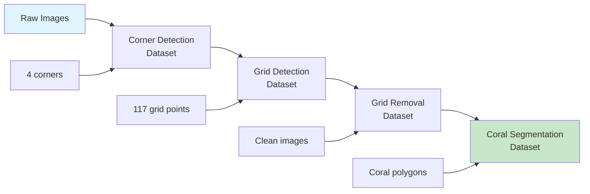

# Data Preparation

Download and prepare datasets for training, evaluation, and experimentation with QUADRATSEG models.

!!! info "For Developers"
    This guide sets up **training datasets** for model development. If you only want to process images with pre-trained models, you don't need this—see the [End User Guide](../for-end-users/1-docker-deployment.md) instead.

**Time Required**: 30-45 minutes (depending on dataset size and download speed)
**Prerequisites**: [Module environments installed](2-module-environments.md)

## Dataset Overview

QUADRATSEG uses multiple datasets across different pipeline stages:



## Available Datasets

### Training Datasets

| Dataset | Purpose | Size | Annotations | Module |
|---------|---------|------|-------------|--------|
| **CRIOBE Finegrained** | Coral segmentation | ~500 images | 16 genera, polygons | coral_seg_yolo, DINOv2_mmseg |
| **Banggai Extended** | Coral segmentation | ~300 images | 10 genera, polygons | coral_seg_yolo, DINOv2_mmseg |
| **Grid Corners** | Corner detection | ~800 images | 4 keypoints | grid_pose_detection |
| **Grid Pose** | Grid detection | ~800 images | 117 keypoints | grid_pose_detection |

### Test Datasets

Small sample datasets for quick testing:

```bash
# Download test samples (all modules)
cd ~/Projects/coral-segmentation
./download_test_samples.sh

# Creates data/test_samples/ with:
# - 1-raw_jpg/ (5 sample images)
# - 2-quadrat_corner_export/ (corner annotations)
# - 3-image_warping/ (warped images)
# - 4-grid_pose_export/ (grid annotations)
# - 5-grid_removal/ (clean images)
```

## Data Storage Structure

Understanding the data organization:

```
coral-segmentation/
├── data/                           # Shared test data
│   └── test_samples/
│
├── coral_seg_yolo/
│   └── data/
│       ├── media/
│       │   ├── criobe_finegrained_annotated/    # Images from CVAT
│       │   └── banggai_extended_annotated/
│       ├── pulled_from_cvat/                    # FiftyOne exports
│       │   ├── criobe_finegrained/
│       │   └── banggai_extended/
│       └── prepared_yolo/                       # YOLO format datasets
│           ├── criobe_finegrained/
│           └── banggai_extended/
│
├── DINOv2_mmseg/
│   └── data/
│       ├── media/                               # Images
│       ├── pulled_from_cvat/                    # FiftyOne exports
│       └── prepared_mmseg/                      # MMSeg format
│
├── grid_pose_detection/
│   └── data/
│       ├── media/
│       ├── pulled_from_cvat/
│       └── prepared_yolo/
│
└── data_engineering/
    └── data/
        └── fiftyone_datasets/                   # FiftyOne persistent storage
```

## Step 1: Download Test Samples

Start with small test datasets to verify everything works:

### Download All Test Samples

```bash
cd ~/Projects/coral-segmentation

# Download test samples script (if available)
./download_test_samples.sh

# Or manually download
mkdir -p data/test_samples
cd data/test_samples

# Download from Google Cloud Storage
wget https://storage.googleapis.com/criobe_public/test_samples/test_samples.tar.gz

# Extract
tar -xzf test_samples.tar.gz

# Verify structure
ls -la
# Should show: 1-raw_jpg/, 2-quadrat_corner_export/, etc.
```

### Test Sample Contents

```bash
cd data/test_samples

# Raw images (5 samples)
ls 1-raw_jpg/
# MooreaE2B_2020_05.jpg, MooreaE2B_2020_12.jpg, etc.

# Corner annotations (COCO format)
ls 2-quadrat_corner_export/
# instances_default.json (4 corner keypoints per image)

# Warped images (perspective corrected)
ls 3-image_warping/
# Cropped and warped versions of raw images

# Grid pose annotations (COCO format)
ls 4-grid_pose_export/
# person_keypoints_default.json (117 grid points per image)

# Grid-removed images (clean coral)
ls 5-grid_removal/
# Images with grid overlay removed via inpainting
```

## Step 2: Prepare Coral Segmentation Data

### Option A: Use Public Datasets (Recommended for Testing)

Download pre-prepared coral segmentation datasets:

```bash
cd ~/Projects/coral-segmentation/coral_seg_yolo/data

# Download CRIOBE Finegrained dataset
wget https://storage.googleapis.com/criobe_public/datasets/criobe_finegrained.tar.gz
tar -xzf criobe_finegrained.tar.gz

# Download Banggai Extended dataset
wget https://storage.googleapis.com/criobe_public/datasets/banggai_extended.tar.gz
tar -xzf banggai_extended.tar.gz

# Verify structure
ls -la prepared_yolo/
# criobe_finegrained/ (YOLO format)
# banggai_extended/ (YOLO format)
```

**Dataset Structure** (YOLO format):
```
prepared_yolo/criobe_finegrained/
├── images/
│   ├── train/           # Training images
│   ├── val/             # Validation images
│   └── test/            # Test images (optional)
├── labels/
│   ├── train/           # YOLO txt annotations
│   ├── val/
│   └── test/
└── dataset.yaml         # YOLO dataset configuration
```

### Option B: Pull from CVAT (Requires CVAT Access)

If you have access to CVAT with annotated projects:

```bash
cd ~/Projects/coral-segmentation/data_engineering

# Configure CVAT credentials (see configuration guide)
cp .env.example .env
# Edit .env with CVAT_URL, CVAT_USERNAME, CVAT_PASSWORD

# Pull dataset from CVAT
pixi run python create_fiftyone_dataset.py \
    --project-name "criobe_finegrained_annotated" \
    --output-dir data/pulled_from_cvat/criobe_finegrained

# This creates a FiftyOne dataset
# Images stored in: data/media/criobe_finegrained_annotated/
# Annotations: data/pulled_from_cvat/criobe_finegrained/
```

**Then convert to training format**:

```bash
cd ~/Projects/coral-segmentation/coral_seg_yolo

# Convert FiftyOne dataset to YOLO format
pixi run python src/data_preparation/prepare_yolo_dataset.py \
    --fiftyone-dataset "criobe_finegrained_annotated" \
    --output-dir data/prepared_yolo/criobe_finegrained \
    --train-split 0.7 \
    --val-split 0.2 \
    --test-split 0.1
```

## Step 3: Prepare Grid Detection Data

### Download Grid Detection Datasets

```bash
cd ~/Projects/coral-segmentation/grid_pose_detection/data

# Download corner detection dataset
wget https://storage.googleapis.com/criobe_public/datasets/grid_corners.tar.gz
tar -xzf grid_corners.tar.gz

# Download grid pose detection dataset
wget https://storage.googleapis.com/criobe_public/datasets/grid_pose.tar.gz
tar -xzf grid_pose.tar.gz

# Verify structure
ls -la prepared_yolo/
# grid_corners/ (4 keypoints per image)
# grid_pose/ (117 keypoints per image)
```

### Prepare from CVAT (Alternative)

```bash
cd ~/Projects/coral-segmentation/data_engineering

# Pull corner detection dataset
pixi run python create_fiftyone_dataset.py \
    --project-name "criobe_corner_annotation" \
    --output-dir data/pulled_from_cvat/corner_detection

# Pull grid pose dataset
pixi run python create_fiftyone_dataset.py \
    --project-name "criobe_grid_annotation" \
    --output-dir data/pulled_from_cvat/grid_pose
```

## Step 4: Verify Dataset Preparation

Check that datasets are correctly formatted:

### Verify Coral Segmentation Datasets

```bash
cd ~/Projects/coral-segmentation/coral_seg_yolo

# Check YOLO dataset structure
pixi run python -c "
from pathlib import Path
import yaml

# Load dataset config
with open('data/prepared_yolo/criobe_finegrained/dataset.yaml') as f:
    config = yaml.safe_load(f)
    print('Dataset:', config['path'])
    print('Classes:', len(config['names']))
    print('Names:', config['names'][:5], '...')

# Count images
train_imgs = list(Path('data/prepared_yolo/criobe_finegrained/images/train').glob('*.jpg'))
val_imgs = list(Path('data/prepared_yolo/criobe_finegrained/images/val').glob('*.jpg'))
print(f'Train images: {len(train_imgs)}')
print(f'Val images: {len(val_imgs)}')

# Check annotations exist
train_labels = list(Path('data/prepared_yolo/criobe_finegrained/labels/train').glob('*.txt'))
print(f'Train labels: {len(train_labels)}')
"
```

**Expected Output**:
```
Dataset: data/prepared_yolo/criobe_finegrained
Classes: 16
Names: ['Acanthastrea', 'Acropora', 'Astreopora', 'Atrea', 'Fungia'] ...
Train images: 350
Val images: 100
Train labels: 350
```

### Verify Grid Detection Datasets

```bash
cd ~/Projects/coral-segmentation/grid_pose_detection

# Check dataset
pixi run python -c "
from pathlib import Path

# Count images and labels
train_imgs = list(Path('data/prepared_yolo/grid_corners/images/train').glob('*.jpg'))
train_labels = list(Path('data/prepared_yolo/grid_corners/labels/train').glob('*.txt'))

print(f'Grid corners train images: {len(train_imgs)}')
print(f'Grid corners train labels: {len(train_labels)}')

# Read sample annotation
sample_label = train_labels[0]
with open(sample_label) as f:
    lines = f.readlines()
    print(f'Sample has {len(lines)} keypoints')
    print('First keypoint:', lines[0].strip()[:50], '...')
"
```

## Step 5: Explore Datasets with FiftyOne

FiftyOne provides visual exploration of datasets:

### Launch FiftyOne App

```bash
cd ~/Projects/coral-segmentation/data_engineering

# Start FiftyOne app
pixi run fiftyone app launch &

# Browser opens at http://localhost:5151
```

### Load and Explore Dataset

```bash
# In Python shell or Jupyter
pixi shell

python
>>> import fiftyone as fo
>>>
>>> # List available datasets
>>> fo.list_datasets()
['criobe_finegrained_annotated', 'banggai_extended_annotated', ...]
>>>
>>> # Load dataset
>>> dataset = fo.load_dataset("criobe_finegrained_annotated")
>>> print(dataset)
Name:           criobe_finegrained_annotated
Media type:     image
Num samples:    450
Persistent:     True
Tags:           []
Sample fields:
    ...
>>>
>>> # Launch app with dataset
>>> session = fo.launch_app(dataset)
```

**In FiftyOne App**:
- Browse all images
- Inspect annotations (polygons, keypoints)
- Filter by label, metadata
- View statistics and distributions
- Export subsets

## Dataset Configuration Files

### YOLO Dataset Configuration (dataset.yaml)

Example for coral segmentation:

```yaml
# dataset.yaml
path: /path/to/coral-segmentation/coral_seg_yolo/data/prepared_yolo/criobe_finegrained
train: images/train
val: images/val
test: images/test

# Number of classes
nc: 16

# Class names (genus-level identification)
names:
  0: Acanthastrea
  1: Acropora
  2: Astreopora
  3: Atrea
  4: Fungia
  5: Goniastrea
  6: Leptastrea
  7: Merulinidae
  8: Millepora
  9: Montastrea
  10: Montipora
  11: Other
  12: Pavona/Leptoseris
  13: Pocillopora
  14: Porites
  15: Psammocora
```

### MMSegmentation Dataset Configuration

Example for DINOv2:

```python
# configs/datasets/criobe_finegrained.py
dataset_type = 'CoralDataset'
data_root = 'data/prepared_mmseg/criobe_finegrained'

img_norm_cfg = dict(
    mean=[123.675, 116.28, 103.53],
    std=[58.395, 57.12, 57.375],
    to_rgb=True
)

train_pipeline = [
    dict(type='LoadImageFromFile'),
    dict(type='LoadAnnotations'),
    dict(type='Resize', img_scale=(1920, 1920), keep_ratio=True),
    dict(type='RandomFlip', prob=0.5),
    dict(type='PhotoMetricDistortion'),
    dict(type='Normalize', **img_norm_cfg),
    dict(type='DefaultFormatBundle'),
    dict(type='Collect', keys=['img', 'gt_semantic_seg']),
]

data = dict(
    samples_per_gpu=2,
    workers_per_gpu=4,
    train=dict(
        type=dataset_type,
        data_root=data_root,
        img_dir='images/train',
        ann_dir='labels/train',
        pipeline=train_pipeline
    ),
    val=dict(
        type=dataset_type,
        data_root=data_root,
        img_dir='images/val',
        ann_dir='labels/val',
        pipeline=val_pipeline
    )
)
```

## Data Augmentation

### YOLO Augmentation (Built-in)

YOLO includes augmentation in training config:

```yaml
# experiments/train_config.yaml
augment:
    hsv_h: 0.015        # Hue augmentation
    hsv_s: 0.7          # Saturation
    hsv_v: 0.4          # Value
    degrees: 0.0        # Rotation (disabled for underwater)
    translate: 0.1      # Translation
    scale: 0.5          # Scale
    shear: 0.0          # Shear (disabled)
    perspective: 0.0    # Perspective (disabled)
    flipud: 0.0         # Vertical flip (disabled)
    fliplr: 0.5         # Horizontal flip
    mosaic: 1.0         # Mosaic augmentation
    mixup: 0.0          # Mixup (disabled)
```

### Custom Augmentation

For custom augmentation pipeline:

```python
# src/data_preparation/augmentation.py
import albumentations as A

transform = A.Compose([
    A.HorizontalFlip(p=0.5),
    A.RandomBrightnessContrast(p=0.2),
    A.GaussNoise(p=0.1),
    A.ElasticTransform(p=0.1),
], bbox_params=A.BboxParams(format='yolo'))
```

## Dataset Statistics

### Generate Dataset Statistics

```bash
cd ~/Projects/coral-segmentation/coral_seg_yolo

# Analyze dataset
pixi run python src/analysis/dataset_stats.py \
    --dataset data/prepared_yolo/criobe_finegrained/dataset.yaml \
    --output stats/criobe_finegrained_stats.json

# Generate visualizations
pixi run python src/analysis/visualize_dataset.py \
    --stats stats/criobe_finegrained_stats.json \
    --output figures/
```

**Common Statistics**:
- Class distribution (instances per class)
- Image size distribution
- Annotation size distribution (coral area)
- Spatial distribution (where corals appear in images)

## Troubleshooting

### Download Failures

**Symptoms**: `wget` or `curl` fails to download datasets

**Solutions**:
```bash
# Check connectivity
ping storage.googleapis.com

# Try with curl instead
curl -O https://storage.googleapis.com/criobe_public/datasets/<dataset>.tar.gz

# Download via browser if command-line fails
# Then move to appropriate directory

# Verify download integrity
md5sum downloaded_file.tar.gz
# Compare with provided checksum
```

### CVAT Connection Errors

**Symptoms**: `create_fiftyone_dataset.py` fails with connection error

**Solutions**:
```bash
# Verify CVAT credentials in .env
cat data_engineering/.env | grep CVAT

# Test CVAT connection
cd data_engineering
pixi run python -c "
from cvat_sdk import Client
client = Client('http://localhost:8080')
client.login(('admin', 'password'))
print('Connected to CVAT')
print('Projects:', [p.name for p in client.projects.list()])
"

# Check CVAT is running
curl http://localhost:8080/api/server/about
```

### Incorrect Dataset Format

**Symptoms**: Training fails with "cannot find images" or "invalid annotations"

**Solutions**:
```bash
# Verify YOLO dataset structure
tree data/prepared_yolo/criobe_finegrained/ -L 2

# Should show:
# images/train/, images/val/
# labels/train/, labels/val/
# dataset.yaml

# Check dataset.yaml paths are absolute or relative to working directory
cat data/prepared_yolo/criobe_finegrained/dataset.yaml

# Verify image-label pairing
python -c "
from pathlib import Path
imgs = {p.stem for p in Path('data/prepared_yolo/criobe_finegrained/images/train').glob('*.jpg')}
lbls = {p.stem for p in Path('data/prepared_yolo/criobe_finegrained/labels/train').glob('*.txt')}
print(f'Images: {len(imgs)}, Labels: {len(lbls)}')
print(f'Unpaired: {imgs - lbls}')
"
```

### Disk Space Issues

**Symptoms**: "No space left on device" during download or extraction

**Solutions**:
```bash
# Check available space
df -h ~/Projects/coral-segmentation

# Datasets are large:
# - CRIOBE Finegrained: ~5GB
# - Banggai Extended: ~3GB
# - Grid datasets: ~8GB
# Total: ~20-25GB

# Clean up old datasets
rm -rf data/old_datasets/

# Use external storage
mkdir /mnt/external/quadratseg_data
ln -s /mnt/external/quadratseg_data ~/Projects/coral-segmentation/data
```

### FiftyOne Database Errors

**Symptoms**: `fiftyone.core.odm.database.DatabaseError`

**Solutions**:
```bash
# Restart FiftyOne database
pixi run fiftyone app stop
pixi run fiftyone app launch

# Clear FiftyOne cache
rm -rf ~/.fiftyone/cache/

# Reset FiftyOne database (WARNING: deletes all datasets)
pixi run python -c "import fiftyone as fo; fo.delete_datasets('*')"
```

## Data Management Best Practices

### Version Control

1. **Don't commit datasets to git**: Use `.gitignore`
2. **Version control metadata**: Commit `dataset.yaml` and preparation scripts
3. **Document dataset versions**: Tag datasets with version numbers
4. **Use dataset checksums**: Verify data integrity with MD5/SHA256

### Storage Organization

1. **Separate by module**: Each module has its own `data/` directory
2. **Use symbolic links**: Link to shared data instead of duplicating
3. **External storage**: Store large datasets on external drives
4. **Backup regularly**: Keep backups of annotated datasets

### Dataset Hygiene

1. **Validate annotations**: Check for errors before training
2. **Remove duplicates**: Use FiftyOne to find duplicate images
3. **Balance classes**: Monitor class distribution
4. **Document processing**: Keep notes on dataset preparation steps

## Next Steps

!!! success "Datasets Prepared!"
    Training datasets are ready for model development!

**What's next**:

1. **[Configure GPU](4-gpu-configuration.md)** - Verify CUDA and optimize GPU settings
2. **[Configure Training](../../configuration/for-developers/3-training-config.md)** - Set up training configurations
3. **Start Training** - Begin training your first model!

## Quick Reference

### Download Commands

```bash
# Test samples
cd ~/Projects/coral-segmentation
./download_test_samples.sh

# Coral segmentation datasets
cd coral_seg_yolo/data
wget https://storage.googleapis.com/criobe_public/datasets/criobe_finegrained.tar.gz
tar -xzf criobe_finegrained.tar.gz

# Grid detection datasets
cd grid_pose_detection/data
wget https://storage.googleapis.com/criobe_public/datasets/grid_corners.tar.gz
tar -xzf grid_corners.tar.gz
```

### FiftyOne Commands

```bash
# Launch app
cd data_engineering
pixi run fiftyone app launch

# In Python
import fiftyone as fo
dataset = fo.load_dataset("criobe_finegrained_annotated")
session = fo.launch_app(dataset)
```

### Verification Checklist

- [ ] Test samples downloaded
- [ ] Coral segmentation datasets prepared
- [ ] Grid detection datasets prepared
- [ ] YOLO dataset.yaml files exist
- [ ] Images and labels are paired
- [ ] FiftyOne app accessible
- [ ] Dataset statistics generated

---

**Questions?** See [GPU configuration guide](4-gpu-configuration.md) or [Getting Help](../../../community/index.md).
