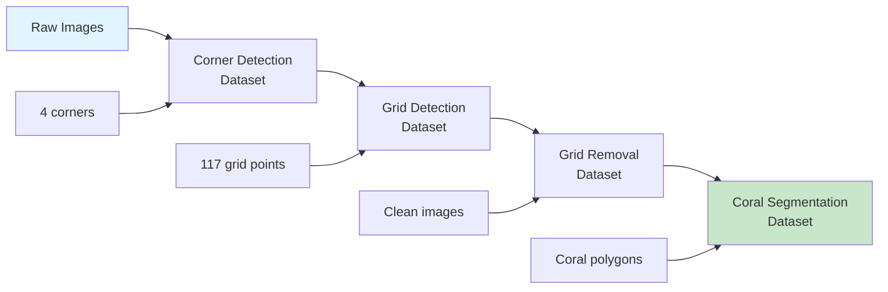

# Data Preparation

Download and prepare datasets for training, evaluation, and functional testing with QUADRATSEG models.

!!! info "For Developers"
    This guide covers both **ML datasets** (for model development) and **demo datasets** (for functional testing). If you only want to process images with pre-trained models, you don't need this—see the [End User Guide](../for-end-users/1-docker-deployment.md) instead.

!!! warning "Understanding Dataset Types"
    - **ML Datasets**: Large annotated datasets used for machine learning training and evaluation (includes train/val splits). These are production datasets pulled from CVAT projects.
    - **Demo Datasets**: Small sample datasets (5 images per pipeline stage) used for functional testing and demos during development. Not for training.

**Time Required**: 30-45 minutes (depending on dataset size and download speed)
**Prerequisites**: [Module environments installed](2-module-environments.md)

## Dataset Overview

QUADRATSEG uses multiple datasets across different pipeline stages:



## Available Datasets

### ML Datasets (Training and Evaluation)

QUADRATSEG uses annotated datasets from CVAT projects. Each dataset corresponds to a specific annotation task in the pipeline.

#### CRIOBE Datasets

Three separate CVAT projects covering different pipeline stages:

| Project Name | Pipeline Stage | Size | Annotations | Purpose |
|--------------|----------------|------|-------------|---------|
| **criobe_corner_annotation** | Stage 1: Corner Detection | Handpicked subset | 4 corner keypoints (skeleton) | Raw images with corrected corner annotations |
| **criobe_grid_annotation** | Stage 2: Grid Detection | 19 images (15 train, 4 val) | 117 grid intersection keypoints (skeleton) | Warped images with grid annotation |
| **criobe_finegrained_annotated** | Stage 3: Coral Segmentation | 345 images (242 train, 103 val) | 14,327 coral colonies, 16 genera (polygons) | Clean gridless images from French Polynesia (2006-2023) |

!!! note "Dataset Alignment"
    These 3 CRIOBE datasets are **NOT aligned** (different image subsets). Corner and grid datasets use handpicked images because annotations are expensive and fewer samples are needed for training good models.

#### Banggai Datasets

Two separate CVAT projects for the Banggai survey (2024):

| Project Name | Pipeline Stage | Size | Annotations | Purpose |
|--------------|----------------|------|-------------|---------|
| **banggai_corner_annotation** | Stage 1: Corner Detection | 735 images (8 sites, 2 transects each) | 4 corner keypoints (skeleton) | Raw images with validated corner annotations |
| **banggai_extended_annotated** | Stage 3: Coral Segmentation | 126 images (88 train, 38 val) | 2,943 coral colonies, 10 genera (polygons) | Clean warped images from 5 monitoring stations (ST03-ST08) |

### Demo Datasets (Functional Testing)

Small sample datasets for functional testing and development demos:

```bash
# Download demo samples (5 images covering all pipeline stages)
cd ~/Projects/coral-segmentation
./download_test_samples.sh

# Creates data/test_samples/ with:
# - 1-raw_jpg/ (5 sample images)
# - 2-quadrat_corner_export/ (corner annotations)
# - 3-image_warping/ (warped images)
# - 4-grid_pose_export/ (grid annotations)
# - 5-grid_removal/ (clean images)
```

!!! info "Demo vs ML Datasets"
    Demo datasets contain only **5 images** for quick functional testing. Use ML datasets for actual model training and evaluation.

## Data Storage Structure

QUADRATSEG uses a **centralized data directory** accessed via symlinks:

```
~/Projects/
├── criobe_data/                              # Centralized data (DATA_ROOT)
│   ├── test_samples/                        # Shared test data for all modules
│   │   ├── 1-raw_jpg/
│   │   ├── 2-quadrat_corner_export/
│   │   ├── 3-image_warping/
│   │   ├── 4-grid_pose_export/
│   │   └── 5-grid_removal/
│   ├── media/                               # Images from CVAT (shared)
│   │   ├── criobe_finegrained_annotated/
│   │   └── banggai_extended_annotated/
│   ├── pulled_from_cvat/                    # FiftyOne exports (shared)
│   │   ├── criobe_finegrained/
│   │   └── banggai_extended/
│   ├── prepared_yolo/                       # YOLO format datasets (shared)
│   │   ├── criobe_finegrained/
│   │   └── banggai_extended/
│   └── prepared_mmseg/                      # MMSeg format datasets (shared)
│
├── coral_seg_yolo/                          # Module repository
│   ├── data -> ~/Projects/criobe_data      # Symlink to shared data
│   └── src/
│
├── grid_pose_detection/                     # Module repository
│   ├── data -> ~/Projects/criobe_data      # Symlink to shared data
│   └── src/
│
├── grid_inpainting/                         # Module repository
│   ├── data -> ~/Projects/criobe_data      # Symlink to shared data
│   └── src/
│
└── data_engineering/                        # Module repository
    ├── data -> ~/Projects/criobe_data      # Symlink to shared data
    └── src/
```

**Benefits of Centralized Data**:
- Download test data once, accessible by all modules
- Share CVAT images and annotations across modules
- No duplication of large datasets (~20-30GB savings)
- Consistent paths across all modules

## Step 1: Download Demo Samples

Start with small demo datasets to verify everything works. Demo data is downloaded **once** to the centralized data directory:

### Download All Demo Samples

```bash
# Navigate to centralized data directory
cd $DATA_ROOT  # or cd ~/Projects/criobe_data

# Create test_samples directory
mkdir -p test_samples
cd test_samples

# Download from Google Cloud Storage
wget https://storage.googleapis.com/criobe_public/test_samples/test_samples.tar.gz

# Extract
tar -xzf test_samples.tar.gz

# Verify structure
ls -la
# Should show: 1-raw_jpg/, 2-quadrat_corner_export/, etc.

# All modules can now access via their data symlink!
# Example: ~/Projects/coral_seg_yolo/data/test_samples/
```

### Demo Sample Contents

Demo datasets contain **5 sample images** that progress through each pipeline stage:

```bash
# Navigate to demo samples (accessible from any module)
cd $DATA_ROOT/test_samples

# Stage 1: Raw images (5 samples)
ls 1-raw_jpg/
# MooreaE2B_2020_05.jpg, MooreaE2B_2020_12.jpg, etc.

# Stage 1 Output: Corner annotations (COCO format)
ls 2-quadrat_corner_export/
# instances_default.json (4 corner keypoints per image)

# Stage 2: Warped images (perspective corrected)
ls 3-image_warping/
# Cropped and warped versions of raw images

# Stage 2 Output: Grid pose annotations (COCO format)
ls 4-grid_pose_export/
# person_keypoints_default.json (117 grid points per image)

# Stage 3: Grid-removed images (clean coral)
ls 5-grid_removal/
# Images with grid overlay removed via inpainting
```

!!! tip "Demo Dataset Purpose"
    These 5 images are for **functional testing only**—to verify your environment setup and test inference pipelines. For model training, use the ML datasets described below.

**Access from Modules**:
All modules can access demo data through their symlink:
```bash
# From coral_seg_yolo
ls ~/Projects/coral_seg_yolo/data/test_samples/

# From grid_pose_detection
ls ~/Projects/grid_pose_detection/data/test_samples/

# Both point to the same centralized data!
```

## Step 2: Access ML Datasets from CVAT Backups

ML datasets are distributed as password-protected 7z archives containing CVAT project backups.

### Understanding CVAT Project Backups

Each dataset is exported from CVAT as a project backup (`.zip` file), then multiple related projects are bundled into a single encrypted 7z archive for distribution.

**Available Archives**:

- **CRIOBE Archive**: `criobe.7z` (3 projects)
    - `criobe_corner_annotation.zip`
    - `criobe_grid_annotation.zip`
    - `criobe_finegrained_annotated.zip`
    - Download: https://storage.googleapis.com/data_criobe/cvat_project_backups/criobe.7z

- **Banggai Archive**: `banggai.7z` (2 projects)
    - `banggai_corner_annotation.zip`
    - `banggai_extended_annotated.zip`
    - Download: https://storage.googleapis.com/data_criobe/cvat_project_backups/banggai.7z

!!! warning "Password Protected Archives"
    Archives use AES-256 encryption. To obtain the password, email **gilles.siu@criobe.pf** with:

    - Your name and institution
    - Research purpose (academic research only)
    - Which datasets you need

### Download and Extract ML Datasets

```bash
# Navigate to centralized data directory
cd $DATA_ROOT
mkdir -p cvat_backups
cd cvat_backups

# Download archives (password required for extraction)
wget https://storage.googleapis.com/data_criobe/cvat_project_backups/criobe.7z
wget https://storage.googleapis.com/data_criobe/cvat_project_backups/banggai.7z

# Install 7z if not available
sudo apt install p7zip-full  # Ubuntu/Debian
# or brew install p7zip on macOS

# Extract archives (enter password when prompted)
7z x criobe.7z
7z x banggai.7z

# Verify extracted project backups
ls -la
# Should show:
# criobe_corner_annotation.zip
# criobe_grid_annotation.zip
# criobe_finegrained_annotated.zip
# banggai_corner_annotation.zip
# banggai_extended_annotated.zip
```

### Restore Projects to CVAT

Import the project backups into your CVAT instance:

1. **Access CVAT**: Navigate to http://localhost:8080/projects
2. **Create from Backup**: Click "Create" → "Import from backup"
3. **Select Backup File**: Choose a project backup (e.g., `criobe_finegrained_annotated.zip`)
4. **Wait for Import**: CVAT will restore the project with all tasks, images, and annotations

Repeat for each project backup you need.

## Step 3: Pull ML Datasets from CVAT to FiftyOne

Once projects are restored in CVAT, pull them to create local FiftyOne datasets for training:

### Option A: Use Pre-Prepared Datasets (Recommended for Testing)

Download pre-prepared coral segmentation datasets to the centralized data directory:

```bash
# Navigate to centralized data directory
cd $DATA_ROOT

# Create prepared_yolo directory
mkdir -p prepared_yolo
cd prepared_yolo

# Download CRIOBE Finegrained dataset
wget https://storage.googleapis.com/criobe_public/datasets/criobe_finegrained.tar.gz
tar -xzf criobe_finegrained.tar.gz

# Download Banggai Extended dataset
wget https://storage.googleapis.com/criobe_public/datasets/banggai_extended.tar.gz
tar -xzf banggai_extended.tar.gz

# Verify structure
ls -la
# criobe_finegrained/ (YOLO format)
# banggai_extended/ (YOLO format)

# All modules can now access via symlink!
# Example: ~/Projects/coral_seg_yolo/data/prepared_yolo/
```

**Dataset Structure** (YOLO format):
```
prepared_yolo/criobe_finegrained/
├── images/
│   ├── train/           # Training images
│   ├── val/             # Validation images
│   └── test/            # Test images (optional)
├── labels/
│   ├── train/           # YOLO txt annotations
│   ├── val/
│   └── test/
└── dataset.yaml         # YOLO dataset configuration
```

### Option B: Pull from CVAT (Requires CVAT Access)

If you have access to CVAT with annotated projects:

```bash
cd ~/Projects/coral-segmentation/data_engineering

# Configure CVAT credentials (see configuration guide)
cp .env.example .env
# Edit .env with CVAT_URL, CVAT_USERNAME, CVAT_PASSWORD

# Pull dataset from CVAT
pixi run python create_fiftyone_dataset.py \
    --project-name "criobe_finegrained_annotated" \
    --output-dir data/pulled_from_cvat/criobe_finegrained

# This creates a FiftyOne dataset
# Images stored in: data/media/criobe_finegrained_annotated/
# Annotations: data/pulled_from_cvat/criobe_finegrained/
```

**Then convert to training format**:

```bash
# Navigate to coral_seg_yolo module
cd ~/Projects/coral_seg_yolo

# Convert FiftyOne dataset to YOLO format (output goes to shared data)
pixi run python src/data_preparation/prepare_yolo_dataset.py \
    --fiftyone-dataset "criobe_finegrained_annotated" \
    --output-dir data/prepared_yolo/criobe_finegrained \
    --train-split 0.7 \
    --val-split 0.2 \
    --test-split 0.1

# Dataset is now in $DATA_ROOT/prepared_yolo/criobe_finegrained/
```

## Step 3: Prepare Grid Detection Data

### Download Grid Detection Datasets

```bash
# Navigate to centralized data directory
cd $DATA_ROOT

# Create prepared_yolo directory if not exists
mkdir -p prepared_yolo
cd prepared_yolo

# Download corner detection dataset
wget https://storage.googleapis.com/criobe_public/datasets/grid_corners.tar.gz
tar -xzf grid_corners.tar.gz

# Download grid pose detection dataset
wget https://storage.googleapis.com/criobe_public/datasets/grid_pose.tar.gz
tar -xzf grid_pose.tar.gz

# Verify structure
ls -la
# grid_corners/ (4 keypoints per image)
# grid_pose/ (117 keypoints per image)

# Grid detection module can access via symlink:
# ~/Projects/grid_pose_detection/data/prepared_yolo/
```

### Prepare from CVAT (Alternative)

```bash
# Navigate to data_engineering module
cd ~/Projects/data_engineering

# Pull corner detection dataset (saves to shared data)
pixi run python create_fiftyone_dataset.py \
    --project-name "criobe_corner_annotation" \
    --output-dir data/pulled_from_cvat/corner_detection

# Pull grid pose dataset (saves to shared data)
pixi run python create_fiftyone_dataset.py \
    --project-name "criobe_grid_annotation" \
    --output-dir data/pulled_from_cvat/grid_pose

# Data is now in $DATA_ROOT/pulled_from_cvat/
```

## Step 4: Verify ML Dataset Preparation

Check that ML datasets are correctly formatted:

### Verify Coral Segmentation ML Datasets

```bash
cd ~/Projects/coral-segmentation/coral_seg_yolo

# Check YOLO dataset structure
pixi run python -c "
from pathlib import Path
import yaml

# Load dataset config
with open('data/prepared_yolo/criobe_finegrained/dataset.yaml') as f:
    config = yaml.safe_load(f)
    print('Dataset:', config['path'])
    print('Classes:', len(config['names']))
    print('Names:', config['names'][:5], '...')

# Count images
train_imgs = list(Path('data/prepared_yolo/criobe_finegrained/images/train').glob('*.jpg'))
val_imgs = list(Path('data/prepared_yolo/criobe_finegrained/images/val').glob('*.jpg'))
print(f'Train images: {len(train_imgs)}')
print(f'Val images: {len(val_imgs)}')

# Check annotations exist
train_labels = list(Path('data/prepared_yolo/criobe_finegrained/labels/train').glob('*.txt'))
print(f'Train labels: {len(train_labels)}')
"
```

**Expected Output**:
```
Dataset: data/prepared_yolo/criobe_finegrained
Classes: 16
Names: ['Acanthastrea', 'Acropora', 'Astreopora', 'Atrea', 'Fungia'] ...
Train images: 350
Val images: 100
Train labels: 350
```

### Verify Grid Detection ML Datasets

```bash
cd ~/Projects/coral-segmentation/grid_pose_detection

# Check dataset
pixi run python -c "
from pathlib import Path

# Count images and labels
train_imgs = list(Path('data/prepared_yolo/grid_corners/images/train').glob('*.jpg'))
train_labels = list(Path('data/prepared_yolo/grid_corners/labels/train').glob('*.txt'))

print(f'Grid corners train images: {len(train_imgs)}')
print(f'Grid corners train labels: {len(train_labels)}')

# Read sample annotation
sample_label = train_labels[0]
with open(sample_label) as f:
    lines = f.readlines()
    print(f'Sample has {len(lines)} keypoints')
    print('First keypoint:', lines[0].strip()[:50], '...')
"
```

## Step 5: Explore Datasets with FiftyOne

FiftyOne provides visual exploration of datasets:

### Launch FiftyOne App

```bash
cd ~/Projects/coral-segmentation/data_engineering

# Start FiftyOne app
pixi run fiftyone app launch &

# Browser opens at http://localhost:5151
```

### Load and Explore Dataset

```bash
# In Python shell or Jupyter
pixi shell

python
>>> import fiftyone as fo
>>>
>>> # List available datasets
>>> fo.list_datasets()
['criobe_finegrained_annotated', 'banggai_extended_annotated', ...]
>>>
>>> # Load dataset
>>> dataset = fo.load_dataset("criobe_finegrained_annotated")
>>> print(dataset)
Name:           criobe_finegrained_annotated
Media type:     image
Num samples:    450
Persistent:     True
Tags:           []
Sample fields:
    ...
>>>
>>> # Launch app with dataset
>>> session = fo.launch_app(dataset)
```

**In FiftyOne App**:
- Browse all images
- Inspect annotations (polygons, keypoints)
- Filter by label, metadata
- View statistics and distributions
- Export subsets

## Dataset Configuration Files

### YOLO Dataset Configuration (dataset.yaml)

Example for coral segmentation:

```yaml
# dataset.yaml
path: /path/to/coral-segmentation/coral_seg_yolo/data/prepared_yolo/criobe_finegrained
train: images/train
val: images/val
test: images/test

# Number of classes
nc: 16

# Class names (genus-level identification)
names:
  0: Acanthastrea
  1: Acropora
  2: Astreopora
  3: Atrea
  4: Fungia
  5: Goniastrea
  6: Leptastrea
  7: Merulinidae
  8: Millepora
  9: Montastrea
  10: Montipora
  11: Other
  12: Pavona/Leptoseris
  13: Pocillopora
  14: Porites
  15: Psammocora
```

### MMSegmentation Dataset Configuration

Example for DINOv2:

```python
# configs/datasets/criobe_finegrained.py
dataset_type = 'CoralDataset'
data_root = 'data/prepared_mmseg/criobe_finegrained'

img_norm_cfg = dict(
    mean=[123.675, 116.28, 103.53],
    std=[58.395, 57.12, 57.375],
    to_rgb=True
)

train_pipeline = [
    dict(type='LoadImageFromFile'),
    dict(type='LoadAnnotations'),
    dict(type='Resize', img_scale=(1920, 1920), keep_ratio=True),
    dict(type='RandomFlip', prob=0.5),
    dict(type='PhotoMetricDistortion'),
    dict(type='Normalize', **img_norm_cfg),
    dict(type='DefaultFormatBundle'),
    dict(type='Collect', keys=['img', 'gt_semantic_seg']),
]

data = dict(
    samples_per_gpu=2,
    workers_per_gpu=4,
    train=dict(
        type=dataset_type,
        data_root=data_root,
        img_dir='images/train',
        ann_dir='labels/train',
        pipeline=train_pipeline
    ),
    val=dict(
        type=dataset_type,
        data_root=data_root,
        img_dir='images/val',
        ann_dir='labels/val',
        pipeline=val_pipeline
    )
)
```

## Data Augmentation

### YOLO Augmentation (Built-in)

YOLO includes augmentation in training config:

```yaml
# experiments/train_config.yaml
augment:
    hsv_h: 0.015        # Hue augmentation
    hsv_s: 0.7          # Saturation
    hsv_v: 0.4          # Value
    degrees: 0.0        # Rotation (disabled for underwater)
    translate: 0.1      # Translation
    scale: 0.5          # Scale
    shear: 0.0          # Shear (disabled)
    perspective: 0.0    # Perspective (disabled)
    flipud: 0.0         # Vertical flip (disabled)
    fliplr: 0.5         # Horizontal flip
    mosaic: 1.0         # Mosaic augmentation
    mixup: 0.0          # Mixup (disabled)
```

### Custom Augmentation

For custom augmentation pipeline:

```python
# src/data_preparation/augmentation.py
import albumentations as A

transform = A.Compose([
    A.HorizontalFlip(p=0.5),
    A.RandomBrightnessContrast(p=0.2),
    A.GaussNoise(p=0.1),
    A.ElasticTransform(p=0.1),
], bbox_params=A.BboxParams(format='yolo'))
```

## Dataset Statistics

### Generate Dataset Statistics

```bash
cd ~/Projects/coral-segmentation/coral_seg_yolo

# Analyze dataset
pixi run python src/analysis/dataset_stats.py \
    --dataset data/prepared_yolo/criobe_finegrained/dataset.yaml \
    --output stats/criobe_finegrained_stats.json

# Generate visualizations
pixi run python src/analysis/visualize_dataset.py \
    --stats stats/criobe_finegrained_stats.json \
    --output figures/
```

**Common Statistics**:
- Class distribution (instances per class)
- Image size distribution
- Annotation size distribution (coral area)
- Spatial distribution (where corals appear in images)

## Troubleshooting

### Download Failures

**Symptoms**: `wget` or `curl` fails to download datasets

**Solutions**:
```bash
# Check connectivity
ping storage.googleapis.com

# Try with curl instead
curl -O https://storage.googleapis.com/criobe_public/datasets/<dataset>.tar.gz

# Download via browser if command-line fails
# Then move to appropriate directory

# Verify download integrity
md5sum downloaded_file.tar.gz
# Compare with provided checksum
```

### CVAT Connection Errors

**Symptoms**: `create_fiftyone_dataset.py` fails with connection error

**Solutions**:
```bash
# Verify CVAT credentials in .env
cat data_engineering/.env | grep CVAT

# Test CVAT connection
cd data_engineering
pixi run python -c "
from cvat_sdk import Client
client = Client('http://localhost:8080')
client.login(('admin', 'password'))
print('Connected to CVAT')
print('Projects:', [p.name for p in client.projects.list()])
"

# Check CVAT is running
curl http://localhost:8080/api/server/about
```

### Incorrect Dataset Format

**Symptoms**: Training fails with "cannot find images" or "invalid annotations"

**Solutions**:
```bash
# Verify YOLO dataset structure
tree data/prepared_yolo/criobe_finegrained/ -L 2

# Should show:
# images/train/, images/val/
# labels/train/, labels/val/
# dataset.yaml

# Check dataset.yaml paths are absolute or relative to working directory
cat data/prepared_yolo/criobe_finegrained/dataset.yaml

# Verify image-label pairing
python -c "
from pathlib import Path
imgs = {p.stem for p in Path('data/prepared_yolo/criobe_finegrained/images/train').glob('*.jpg')}
lbls = {p.stem for p in Path('data/prepared_yolo/criobe_finegrained/labels/train').glob('*.txt')}
print(f'Images: {len(imgs)}, Labels: {len(lbls)}')
print(f'Unpaired: {imgs - lbls}')
"
```

### Disk Space Issues

**Symptoms**: "No space left on device" during download or extraction

**Solutions**:
```bash
# Check available space
df -h $DATA_ROOT

# ML datasets are large:
# - Demo samples: ~50MB (5 images)
# - CRIOBE ML datasets: ~5-8GB
# - Banggai ML datasets: ~3-5GB
# - Grid ML datasets: ~8GB
# Total ML datasets: ~20-25GB

# Clean up old datasets
rm -rf $DATA_ROOT/old_datasets/

# Use external storage for ML datasets
mkdir /mnt/external/criobe_ml_data
export DATA_ROOT=/mnt/external/criobe_ml_data
# Update symlinks in each module
```

### 7z Archive Extraction Issues

**Symptoms**: Cannot extract 7z archive or "Wrong password" error

**Solutions**:
```bash
# Install 7z
sudo apt install p7zip-full  # Ubuntu/Debian
brew install p7zip           # macOS

# Test 7z installation
7z --help

# Extract with verbose output
7z x -v criobe.7z

# If password rejected, verify you have the correct password
# Email gilles.siu@criobe.pf to request access

# Check archive integrity
7z t criobe.7z
```

### FiftyOne Database Errors

**Symptoms**: `fiftyone.core.odm.database.DatabaseError`

**Solutions**:
```bash
# Restart FiftyOne database
pixi run fiftyone app stop
pixi run fiftyone app launch

# Clear FiftyOne cache
rm -rf ~/.fiftyone/cache/

# Reset FiftyOne database (WARNING: deletes all datasets)
pixi run python -c "import fiftyone as fo; fo.delete_datasets('*')"
```

## Data Management Best Practices

### Version Control

1. **Don't commit datasets to git**: Use `.gitignore` for data directories
2. **Version control metadata**: Commit `dataset.yaml` and preparation scripts
3. **Document dataset versions**: Tag datasets with version numbers
4. **Use dataset checksums**: Verify data integrity with MD5/SHA256
5. **Track CVAT backups**: Keep records of which backup versions you're using

### Storage Organization

1. **Centralized data directory**: Use `DATA_ROOT` with symlinks (as described above)
2. **Separate ML and demo datasets**: Keep functional test data separate from training data
3. **External storage**: Store large ML datasets on external drives if needed
4. **Backup CVAT projects**: Regularly export CVAT project backups

### Dataset Hygiene

1. **Validate annotations**: Check for errors before training
2. **Remove duplicates**: Use FiftyOne to find duplicate images
3. **Balance classes**: Monitor class distribution across train/val splits
4. **Document processing**: Keep notes on dataset preparation steps
5. **Understand dataset purpose**: Use demo datasets for testing, ML datasets for training

## Next Steps

!!! success "Datasets Prepared!"
    ML datasets are ready for model development!

**What's next**:

1. **[Configure GPU](4-gpu-configuration.md)** - Verify CUDA and optimize GPU settings
2. **[Configure Training](../../configuration/for-developers/3-training-config.md)** - Set up training configurations
3. **Start Training** - Begin training your first model!

## Quick Reference

### Download Commands

```bash
# Demo samples (5 images for functional testing)
cd ~/Projects/coral-segmentation
./download_test_samples.sh

# ML datasets - Download CVAT backups (password required)
cd $DATA_ROOT/cvat_backups
wget https://storage.googleapis.com/data_criobe/cvat_project_backups/criobe.7z
wget https://storage.googleapis.com/data_criobe/cvat_project_backups/banggai.7z
7z x criobe.7z
7z x banggai.7z

# Pre-prepared ML datasets (alternative to CVAT workflow)
cd $DATA_ROOT/prepared_yolo
wget https://storage.googleapis.com/criobe_public/datasets/criobe_finegrained.tar.gz
tar -xzf criobe_finegrained.tar.gz
```

### FiftyOne Commands

```bash
# Launch app
cd data_engineering
pixi run fiftyone app launch

# In Python
import fiftyone as fo
dataset = fo.load_dataset("criobe_finegrained_annotated")
session = fo.launch_app(dataset)
```

### Verification Checklist

- [ ] Demo samples downloaded (5 images)
- [ ] ML datasets downloaded from CVAT backups
- [ ] CVAT projects restored (if using CVAT workflow)
- [ ] Coral segmentation ML datasets prepared
- [ ] Grid detection ML datasets prepared
- [ ] YOLO dataset.yaml files exist
- [ ] Images and labels are paired
- [ ] FiftyOne app accessible
- [ ] ML dataset statistics generated

---

**Questions?** See [GPU configuration guide](4-gpu-configuration.md) or [Getting Help](../../../community/index.md).
