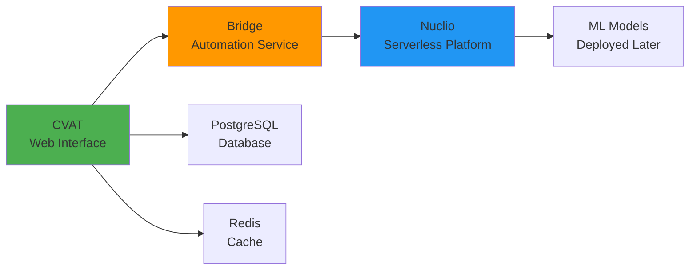

# Docker Deployment

Deploy the QUADRATSEG platform stack: CVAT + Nuclio + Bridge for automated coral reef image processing.

!!! info "For End Users"
    This guide is for **coral researchers** deploying the platform for production use. No Pixi or code access needed—everything runs in Docker containers.

**Time Required**: 30-45 minutes
**Target Users**: Coral researchers, marine biologists, reef monitoring teams

## What You'll Deploy



- **CVAT**: Web-based annotation and task management platform
- **Nuclio**: Serverless platform for hosting ML models
- **Bridge**: FastAPI service that orchestrates the pipeline via webhooks
- **PostgreSQL**: Database for CVAT data
- **Redis**: Cache for CVAT workers

**ML models** will be deployed separately in the [next guide](2-ml-models-deployment.md).

## Prerequisites

Before starting, ensure you have:

### System Requirements

- [x] **Operating System**: Linux (Ubuntu 20.04+ recommended) or macOS
- [x] **Docker**: Version 20.10+ ([install guide](https://docs.docker.com/engine/install/))
- [x] **Docker Compose**: Version 2.0+ (included with Docker Desktop)
- [x] **NVIDIA GPU**: 8GB+ VRAM recommended (GTX 1070 or better)
- [x] **NVIDIA Docker Runtime**: For GPU acceleration ([install guide](https://github.com/NVIDIA/nvidia-docker))
- [x] **Disk Space**: 20GB+ free space for Docker images and data
- [x] **Memory**: 16GB+ RAM recommended
- [x] **Git**: For cloning repository

### Verify Prerequisites

```bash
# Check Docker
docker --version
# Expected: Docker version 20.10.0 or higher

# Check Docker Compose
docker compose version
# Expected: Docker Compose version v2.0.0 or higher

# Check NVIDIA Docker runtime
docker run --rm --gpus all nvidia/cuda:12.0.0-base-ubuntu20.04 nvidia-smi
# Expected: GPU information displayed

# Check available disk space
df -h
# Ensure at least 20GB free in Docker's storage location
```

!!! warning "GPU Required"
    While the platform can run without GPU, inference will be extremely slow. A GPU with 8GB+ VRAM is **strongly recommended** for production use.

## Step 1: Clone Repository

Clone CRIOBE's CVAT fork which includes the bridge service and serverless components:

```bash
# Create directory for the platform
mkdir -p ~/quadratseg-platform
cd ~/quadratseg-platform

# Clone CRIOBE's CVAT repository
git clone https://github.com/Criobe/cvat.git
cd cvat

# Verify repository structure
ls -la
# Should see: bridge/, components/, docker-compose.yml, etc.
```

**Repository Structure**:
```
cvat/
├── bridge/                      # Bridge automation service
│   ├── docker-compose.bridge.yml
│   └── .env.example
├── components/
│   └── serverless/              # Nuclio serverless functions
│       └── docker-compose.serverless.yml
├── docker-compose.yml           # Main CVAT deployment
└── ...                          # CVAT core files
```

## Step 2: Configure Environment Variables

Create environment configuration files for CVAT and Bridge:

### 2.1 Configure CVAT

```bash
# Copy example environment file
cp .env.example .env

# Edit CVAT configuration
nano .env
```

**Minimal Required Configuration** (in `.env`):

```bash
# Admin Credentials (CHANGE THESE!)
CVAT_ADMIN_USERNAME=admin
CVAT_ADMIN_PASSWORD=your_secure_password_here
CVAT_ADMIN_EMAIL=admin@example.com

# Server Configuration
CVAT_HOST=localhost
CVAT_PORT=8080

# Database Configuration (defaults usually fine)
POSTGRES_USER=root
POSTGRES_PASSWORD=your_db_password_here
POSTGRES_DB=cvat

# Redis Configuration (defaults usually fine)
REDIS_HOST=cvat_redis
REDIS_PORT=6379

# Nuclio Configuration
NUCLIO_HOST=localhost
NUCLIO_PORT=8070

# Smokescreen Configuration (for webhook security)
# Allow gateway IP for bridge webhooks
SMOKESCREEN_OPTS=--allow-address=172.17.0.1
```

!!! danger "Security: Change Default Passwords"
    **Never use default passwords in production!** Change `CVAT_ADMIN_PASSWORD` and `POSTGRES_PASSWORD` to secure values.

### 2.2 Configure Bridge

```bash
# Navigate to bridge directory
cd bridge

# Copy example configuration
cp .env.example .env

# Edit bridge configuration
nano .env
```

**Bridge Configuration** (in `bridge/.env`):

```bash
# CVAT Connection
CVAT_URL=http://cvat_server:8080
CVAT_USERNAME=admin
CVAT_PASSWORD=your_secure_password_here  # Same as CVAT_ADMIN_PASSWORD

# Nuclio Connection
NUCLIO_HOST=nuclio
NUCLIO_PORT=8070

# Bridge Server
BRIDGE_PORT=8000

# Cache and Temporary Files
CACHE_DIR=/tmp/cvat_cache
AUTO_ANN_TIMEOUT=900  # Timeout for auto-annotation in seconds

# Logging
LOG_LEVEL=INFO
```

!!! tip "Credential Sync"
    Ensure `CVAT_PASSWORD` in `bridge/.env` matches `CVAT_ADMIN_PASSWORD` in `cvat/.env`

### 2.3 Return to CVAT Root

```bash
# Return to cvat root directory
cd ..
pwd
# Should show: ~/quadratseg-platform/cvat
```

## Step 3: Deploy the Stack

### 3.1 First-Time Deployment (Build Bridge)

On first deployment, the Bridge image must be built locally while CVAT and Nuclio use pre-built images:

```bash
# First-time deployment: build bridge image
docker compose \
  -f docker-compose.yml \
  -f bridge/docker-compose.bridge.yml \
  -f components/serverless/docker-compose.serverless.yml \
  up -d --build bridge cvat_server cvat_worker_webhooks
```

**Explanation**:
- `-f docker-compose.yml`: Main CVAT services
- `-f bridge/docker-compose.bridge.yml`: Bridge service
- `-f components/serverless/docker-compose.serverless.yml`: Nuclio platform
- `up -d`: Start services in detached mode
- `--build bridge`: Build only the bridge image (CVAT/Nuclio use pre-built images)
- `bridge cvat_server cvat_worker_webhooks`: Target specific services for building

**Expected Output**:
```
[+] Running 15/15
 ✔ Network cvat_cvat                  Created
 ✔ Volume cvat_cvat_data              Created
 ✔ Volume cvat_cvat_keys              Created
 ✔ Container cvat_redis               Started
 ✔ Container cvat_db                  Started
 ✔ Container cvat_opa                 Started
 ✔ Container nuclio_dashboard         Started
 ✔ Container cvat_server              Started
 ✔ Container cvat_worker_annotation   Started
 ✔ Container cvat_worker_webhooks     Started
 ✔ Container bridge                   Started
 ...
```

**Deployment Time**: 5-10 minutes (includes pulling pre-built images and building bridge)

### 3.2 Subsequent Deployments

After the first deployment, use this command (no build needed):

```bash
# Subsequent deployments: use pre-built images
docker compose \
  -f docker-compose.yml \
  -f bridge/docker-compose.bridge.yml \
  -f components/serverless/docker-compose.serverless.yml \
  up -d
```

!!! success "Image Strategy"
    - **CVAT**: Uses official pre-built images (pulled from Docker Hub)
    - **Nuclio**: Uses official pre-built images (pulled from Docker Hub)
    - **Bridge**: Built locally from source (only needs building once)

## Step 4: Verify Services

Check that all services are running correctly:

```bash
# Check container status
docker compose ps

# Expected output: All containers should show "Up" status
# Key services to verify:
# - cvat_server (port 8080)
# - nuclio_dashboard (port 8070)
# - bridge (port 8000)
# - cvat_db (PostgreSQL)
# - cvat_redis
# - cvat_worker_webhooks (important for automation!)
```

### Service Health Checks

Test each service endpoint:

```bash
# Test CVAT
curl http://localhost:8080/api/server/about
# Expected: JSON response with CVAT version

# Test Nuclio Dashboard
curl http://localhost:8070/api/healthz
# Expected: "OK"

# Test Bridge
curl http://localhost:8000/health
# Expected: {"status": "healthy"}
```

!!! tip "All Services Healthy"
    If all three commands return successful responses, your platform is deployed correctly!

## Step 5: Create Admin User

Create the admin user for CVAT access:

```bash
# Create superuser (interactive)
docker exec -it cvat_server \
  bash -ic 'python3 ~/manage.py createsuperuser'

# You'll be prompted to enter:
# - Username: (use the one from CVAT_ADMIN_USERNAME)
# - Email address: (use the one from CVAT_ADMIN_EMAIL)
# - Password: (use the one from CVAT_ADMIN_PASSWORD)
# - Password (again): (confirm)
```

**Expected Output**:
```
Username: admin
Email address: admin@example.com
Password:
Password (again):
Superuser created successfully.
```

!!! warning "Use Configured Credentials"
    Use the same username and password you configured in `.env` to avoid confusion.

## Step 6: Access CVAT

Your CVAT instance is now ready!

1. **Open Browser**: Navigate to http://localhost:8080
2. **Login**: Use the credentials you just created
    - Username: `admin`
    - Password: `your_secure_password_here`
3. **Explore Interface**:
    - **Projects**: Create and manage annotation projects
    - **Tasks**: Upload images and create annotation tasks
    - **Jobs**: Annotate images and review results

!!! success "Deployment Complete!"
    CVAT + Nuclio + Bridge are now deployed and ready for use!

## Service URLs

| Service | URL | Purpose |
|---------|-----|---------|
| **CVAT Web UI** | http://localhost:8080 | Main annotation interface |
| **Nuclio Dashboard** | http://localhost:8070 | Serverless function management |
| **Bridge API** | http://localhost:8000/docs | API documentation (Swagger) |
| **Bridge Health** | http://localhost:8000/health | Health check endpoint |

## Common Management Commands

### Start/Stop Services

```bash
# Start services
docker compose -f docker-compose.yml \
  -f bridge/docker-compose.bridge.yml \
  -f components/serverless/docker-compose.serverless.yml \
  up -d

# Stop services
docker compose -f docker-compose.yml \
  -f bridge/docker-compose.bridge.yml \
  -f components/serverless/docker-compose.serverless.yml \
  down

# Stop and remove volumes (WARNING: deletes all data!)
docker compose -f docker-compose.yml \
  -f bridge/docker-compose.bridge.yml \
  -f components/serverless/docker-compose.serverless.yml \
  down -v
```

### View Logs

```bash
# View all logs
docker compose logs -f

# View specific service logs
docker compose logs -f cvat_server
docker compose logs -f bridge
docker compose logs -f nuclio_dashboard

# View last 100 lines
docker compose logs --tail=100 cvat_server
```

### Restart Specific Service

```bash
# Restart bridge service
docker compose restart bridge

# Restart CVAT server
docker compose restart cvat_server

# Restart webhook worker (important for automation!)
docker compose restart cvat_worker_webhooks
```

## Troubleshooting

### Services Not Starting

**Symptoms**: Containers exit immediately or fail to start

**Solutions**:
```bash
# Check logs for errors
docker compose logs cvat_server
docker compose logs bridge

# Common issues:
# 1. Port conflicts (8080, 8070, 8000 already in use)
# 2. Insufficient permissions
# 3. Missing environment variables

# Check port usage
sudo netstat -tulpn | grep -E "8080|8070|8000"

# Rebuild if needed
docker compose down
docker compose up -d --build bridge cvat_server cvat_worker_webhooks
```

### Cannot Access CVAT Web UI

**Symptoms**: Browser shows "Connection refused" or "Site can't be reached"

**Solutions**:
```bash
# Verify cvat_server is running
docker compose ps cvat_server

# Check cvat_server logs
docker compose logs cvat_server

# Verify network
docker network ls
docker network inspect cvat_cvat

# Try accessing from container
docker exec cvat_server curl http://localhost:8080
```

### Bridge Not Accessible from CVAT

**Symptoms**: Webhooks fail with connection errors

**Solutions**:
```bash
# Verify bridge is running
docker compose ps bridge

# Test bridge from cvat_server container
docker exec cvat_server curl http://bridge.gateway:8000/health

# Check if extra_hosts is configured
docker inspect cvat_server | grep -A 5 ExtraHosts
# Should show: bridge.gateway:host-gateway

# If missing, ensure docker-compose.bridge.yml has:
# services:
#   cvat_server:
#     extra_hosts:
#       - "bridge.gateway:host-gateway"
```

### GPU Not Available

**Symptoms**: Nuclio functions deployed but inference is slow

**Solutions**:
```bash
# Verify GPU accessible in Docker
docker run --rm --gpus all nvidia/cuda:12.0.0-base-ubuntu20.04 nvidia-smi

# Check NVIDIA Docker runtime installed
docker info | grep nvidia

# If not installed, install nvidia-docker2:
# Ubuntu/Debian:
sudo apt-get install -y nvidia-docker2
sudo systemctl restart docker
```

### Database Connection Errors

**Symptoms**: CVAT shows database errors

**Solutions**:
```bash
# Check database container
docker compose ps cvat_db

# View database logs
docker compose logs cvat_db

# Connect to database
docker exec -it cvat_db psql -U root -d cvat

# Reset database (WARNING: deletes all data!)
docker compose down -v
docker compose up -d
```

## Security Considerations

!!! warning "Production Deployment"
    If deploying for production use beyond localhost:

    1. **Change all default passwords** in `.env` files
    2. **Configure SSL/TLS** for HTTPS access
    3. **Set up firewall rules** to restrict access
    4. **Use secrets management** for sensitive credentials
    5. **Regular database backups**
    6. **Monitor resource usage** and logs

## Next Steps

!!! success "Platform Deployed!"
    You've successfully deployed the QUADRATSEG platform stack!

**What's next**:

1. **[Deploy ML Models](2-ml-models-deployment.md)** - Deploy Nuclio serverless functions with ML models
2. **[Verify Installation](3-verification.md)** - Run verification tests
3. **[Configure Projects](../../configuration/for-end-users/1-cvat-projects.md)** - Set up CVAT projects for your workflow

## Quick Reference

### Deploy Command (First Time)

```bash
docker compose -f docker-compose.yml \
  -f bridge/docker-compose.bridge.yml \
  -f components/serverless/docker-compose.serverless.yml \
  up -d --build bridge cvat_server cvat_worker_webhooks
```

### Deploy Command (Subsequent)

```bash
docker compose -f docker-compose.yml \
  -f bridge/docker-compose.bridge.yml \
  -f components/serverless/docker-compose.serverless.yml \
  up -d
```

### Stop Command

```bash
docker compose -f docker-compose.yml \
  -f bridge/docker-compose.bridge.yml \
  -f components/serverless/docker-compose.serverless.yml \
  down
```

---

**Questions?** Check the [verification guide](3-verification.md) or see [Getting Help](../../../community/getting-help.md).
