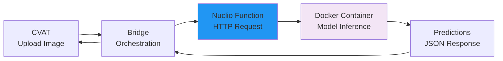

# ML Models Deployment

Deploy pre-trained ML models as Nuclio serverless functions for automated coral reef image processing.

!!! info "For End Users"
    This guide deploys **pre-trained models** as serverless functions. Models are automatically downloaded during Docker build—no manual download needed.

**Time Required**: 40-60 minutes (models download during deployment)
**Prerequisites**: [Docker deployment](1-docker-deployment.md) completed successfully

## What You'll Deploy

Six Nuclio serverless functions, each hosting a different ML model:

| Function Name | Purpose | Model Type | Inference Time |
|---------------|---------|------------|----------------|
| `pth-yolo-gridcorners` | Detect 4 quadrat corners | YOLOv11n | ~1s |
| `pth-yolo-gridpose` | Detect 117 grid intersections | YOLOv11n | ~2s |
| `pth-lama` | Remove grid lines via inpainting | SimpleLama | ~5-8s |
| `pth-yolo-coralsegv4` | Segment corals (CRIOBE dataset) | YOLOv11m-seg | ~7s |
| `pth-yolo-coralsegbanggai` | Segment corals (Banggai dataset) | YOLOv11m-seg | ~7s |
| `pth-mmseg-coralscopsegformer` | Two-stage coral segmentation | DINOv2 + SAM | ~15-25s |

**All models are publicly available and automatically downloaded during deployment.**

## How Nuclio Functions Work



Each Nuclio function:
- Runs in its own Docker container
- Has GPU access for fast inference
- Downloads its model during first build
- Exposes HTTP endpoint for predictions
- Auto-scales based on load

## Prerequisites

### Check CVAT Stack Running

```bash
# Verify CVAT + Nuclio + Bridge are running
cd ~/quadratseg-platform/cvat

docker compose ps
# All services should show "Up" status

# Verify Nuclio dashboard accessible
curl http://localhost:8070/api/healthz
# Expected: "OK"
```

### Install Nuclio CLI (nuctl)

The `nuctl` CLI is used to deploy and manage Nuclio functions:

```bash
# Download nuctl for Linux
wget https://github.com/nuclio/nuclio/releases/download/1.13.0/nuctl-1.13.0-linux-amd64

# Make executable
chmod +x nuctl-1.13.0-linux-amd64

# Move to system path
sudo mv nuctl-1.13.0-linux-amd64 /usr/local/bin/nuctl

# Verify installation
nuctl version
# Expected: Client version: 1.13.0
```

**For macOS**:
```bash
wget https://github.com/nuclio/nuclio/releases/download/1.13.0/nuctl-1.13.0-darwin-amd64
chmod +x nuctl-1.13.0-darwin-amd64
sudo mv nuctl-1.13.0-darwin-amd64 /usr/local/bin/nuctl
```

## Nuclio Function Structure

Each function is packaged in `components/serverless/pytorch/<function-name>/`:

```
pth-yolo-gridcorners/
├── function.yaml          # Nuclio configuration (build, runtime, resources)
├── inference.py           # Inference code
├── requirements.txt       # Python dependencies
└── README.md             # Function documentation
```

**function.yaml** contains:
- Docker build instructions
- Model download URL
- GPU resource allocation
- Runtime configuration
- Handler specification

**Models download automatically** via URLs specified in `function.yaml` during Docker build.

## Step 1: Grid Corner Detection

Deploy the corner detection function (detects 4 quadrat corners):

```bash
# Navigate to function directory
cd ~/quadratseg-platform/cvat/components/serverless/pytorch/pth-yolo-gridcorners

# Deploy function
nuctl deploy \
  --project-name cvat \
  --path . \
  --file function.yaml \
  --platform local \
  --verbose
```

**What happens during deployment:**
1. Nuclio reads `function.yaml`
2. Builds Docker image with dependencies
3. Downloads model from URL in `function.yaml`
4. Creates container with GPU access
5. Starts HTTP server for inference

**Expected Output:**
```
nuctl (I) Deploying function pth-yolo-gridcorners
nuctl (I) Building function image
nuctl (I) Pulling base image
nuctl (I) Building processor image
nuctl (I) Pushing image to registry
nuctl (I) Deploying function
nuctl (I) Function deployed successfully
nuctl (I) Function URL: http://localhost:49152
```

**Build Time**: 5-10 minutes (first time, includes model download ~200MB)

## Step 2: Grid Pose Detection

Deploy the grid pose detection function (detects 117 grid intersections):

```bash
cd ../pth-yolo-gridpose

nuctl deploy \
  --project-name cvat \
  --path . \
  --file function.yaml \
  --platform local \
  --verbose
```

**Build Time**: 5-10 minutes (includes model download ~200MB)

## Step 3: Grid Removal (Inpainting)

Deploy the grid removal function using SimpleLama inpainting:

```bash
cd ../pth-lama

nuctl deploy \
  --project-name cvat \
  --path . \
  --file function.yaml \
  --platform local \
  --verbose
```

**Build Time**: 5-10 minutes (includes model download ~300MB)

## Step 4: Coral Segmentation (CRIOBE Dataset)

Deploy the YOLO coral segmentation function trained on CRIOBE finegrained dataset:

```bash
cd ../pth-yolo-coralsegv4

nuctl deploy \
  --project-name cvat \
  --path . \
  --file function.yaml \
  --platform local \
  --verbose
```

**Build Time**: 5-10 minutes (includes model download ~500MB)

## Step 5: Coral Segmentation (Banggai Dataset)

Deploy the YOLO coral segmentation function trained on Banggai extended dataset:

```bash
cd ../pth-yolo-coralsegbanggai

nuctl deploy \
  --project-name cvat \
  --path . \
  --file function.yaml \
  --platform local \
  --verbose
```

**Build Time**: 5-10 minutes (includes model download ~500MB)

## Step 6: Two-Stage Segmentation (DINOv2 + CoralSCoP)

Deploy the two-stage segmentation function (highest accuracy):

```bash
cd ../pth-mmseg-coralscopsegformer

nuctl deploy \
  --project-name cvat \
  --path . \
  --file function.yaml \
  --platform local \
  --verbose
```

**Build Time**: 10-15 minutes (includes multiple model downloads ~1.5GB total)

!!! tip "Deploy in Parallel"
    You can deploy multiple functions in parallel by opening multiple terminal windows. This significantly reduces total deployment time.

## Verify Deployed Functions

### List All Functions

```bash
# List all deployed functions
nuctl get functions --platform local

# Expected output:
# NAMESPACE | NAME                              | PROJECT | STATE | NODE PORT | REPLICAS
# nuclio    | pth-yolo-gridcorners             | cvat    | ready | 49152     | 1/1
# nuclio    | pth-yolo-gridpose                | cvat    | ready | 49153     | 1/1
# nuclio    | pth-lama                         | cvat    | ready | 49154     | 1/1
# nuclio    | pth-yolo-coralsegv4              | cvat    | ready | 49155     | 1/1
# nuclio    | pth-yolo-coralsegbanggai         | cvat    | ready | 49156     | 1/1
# nuclio    | pth-mmseg-coralscopsegformer     | cvat    | ready | 49157     | 1/1
```

!!! success "All Functions Ready"
    If all functions show `STATE: ready` and `REPLICAS: 1/1`, deployment was successful!

### Check Function Details

```bash
# Get detailed info for a specific function
nuctl get function pth-yolo-gridcorners --platform local

# View function logs
nuctl get logs pth-yolo-gridcorners --platform local

# Get function port
nuctl get function pth-yolo-gridcorners --platform local -o json | grep "httpPort"
```

### Access Nuclio Dashboard

Open the Nuclio dashboard in your browser:

**URL**: http://localhost:8070

Navigate to: **Projects** → **cvat**

You should see all 6 functions listed with their status, replicas, and ports.

## Test Individual Function

Test a function directly with a sample image:

```bash
# Prepare test image (base64 encode)
IMAGE_B64=$(base64 -w0 path/to/test/image.jpg)

# Create test payload
cat > test_payload.json <<EOF
{
  "image": "$IMAGE_B64"
}
EOF

# Test corner detection function
curl -X POST \
  -H "Content-Type: application/json" \
  -d @test_payload.json \
  http://localhost:49152

# Expected: JSON response with predicted corners
```

**Response Format**:
```json
{
  "predictions": [
    {"class": 0, "confidence": 0.95, "bbox": [x1, y1, x2, y2]},
    ...
  ]
}
```

!!! tip "Port Numbers"
    Port numbers (49152, 49153, etc.) are assigned automatically. Check `nuctl get functions` for actual ports.

## GPU Verification

Verify functions have GPU access:

```bash
# Check GPU usage while function is running
nvidia-smi

# Should show:
# - Processes using GPU (python, nuclio functions)
# - GPU memory usage
# - GPU utilization percentage

# Check specific function GPU access
docker exec pth-yolo-gridcorners nvidia-smi
```

**Expected GPU Memory Usage** (approximate):
- Corner detection: ~2GB
- Grid pose: ~2GB
- Grid removal: ~4GB
- Coral segmentation (YOLO): ~4-6GB
- Two-stage segmentation: ~8-10GB

!!! warning "GPU Memory"
    Functions share GPU memory. If total usage exceeds GPU capacity, functions may fail or become slow. Consider running subsets of functions or using multiple GPUs.

## Managing Functions

### Update a Function

If you need to update a function (e.g., new model version):

```bash
# Navigate to function directory
cd ~/quadratseg-platform/cvat/components/serverless/pytorch/<function-name>

# Delete old function
nuctl delete function <function-name> --platform local

# Redeploy
nuctl deploy \
  --project-name cvat \
  --path . \
  --file function.yaml \
  --platform local \
  --verbose
```

### Delete a Function

```bash
# Delete specific function
nuctl delete function pth-yolo-gridcorners --platform local

# Delete all functions in cvat project
nuctl delete project cvat --platform local
```

### View Function Logs

```bash
# Real-time logs
nuctl get logs <function-name> --platform local --follow

# Last N lines
nuctl get logs <function-name> --platform local --tail 100

# Filter by log level
nuctl get logs <function-name> --platform local --level error
```

## Troubleshooting

### Function Build Fails

**Symptoms**: Function deployment fails during build phase

**Solutions**:
```bash
# Check build logs
nuctl get logs <function-name> --platform local

# Common issues:
# 1. Model download timeout (slow internet)
# 2. Insufficient disk space
# 3. Base image pull failure

# Retry deployment
nuctl deploy --project-name cvat --path . --file function.yaml --platform local -v

# Clean up and rebuild
docker system prune -a  # WARNING: removes unused Docker data
```

### Function Not Starting (State: Error)

**Symptoms**: Function shows `STATE: error` or `REPLICAS: 0/1`

**Solutions**:
```bash
# Check function logs
nuctl get logs <function-name> --platform local

# Common causes:
# 1. Out of GPU memory
# 2. Missing dependencies
# 3. Model file corrupted

# Check GPU memory
nvidia-smi

# Delete and redeploy
nuctl delete function <function-name> --platform local
nuctl deploy --project-name cvat --path . --file function.yaml --platform local -v
```

### Function Inference Slow or Fails

**Symptoms**: Function responds slowly or returns errors

**Solutions**:
```bash
# Check GPU availability
nvidia-smi

# Check function resource usage
docker stats <function-container-name>

# Check function logs for errors
nuctl get logs <function-name> --platform local

# Restart function
nuctl invoke <function-name> --method GET --platform local
```

### Port Already in Use

**Symptoms**: Deployment fails with "port already allocated"

**Solutions**:
```bash
# Check what's using the port
sudo netstat -tulpn | grep 49152

# Kill process using port
sudo kill <pid>

# Or modify function.yaml to use different port
# Edit function.yaml:
# spec:
#   triggers:
#     http:
#       attributes:
#         port: 50000  # Change to unused port
```

### Model Download Timeout

**Symptoms**: Build hangs during "Downloading model" step

**Solutions**:
```bash
# Increase timeout in function.yaml
# Add to spec section:
# spec:
#   build:
#     timeout: 1800  # 30 minutes

# Or manually download model and modify function.yaml
# to use local file instead of URL
```

## Function Configuration Reference

### GPU Resource Allocation

Each `function.yaml` specifies GPU resources:

```yaml
spec:
  resources:
    limits:
      nvidia.com/gpu: 1  # Number of GPUs to allocate
    requests:
      memory: "4Gi"      # Memory request
```

### Timeout Configuration

```yaml
spec:
  triggers:
    http:
      attributes:
        ingresses:
          0:
            host: ""
            paths:
              - /
        maxWorkers: 1
      kind: http
      maxRequestBodySize: 33554432  # 32MB max request size
```

### Auto-scaling

```yaml
spec:
  minReplicas: 1  # Minimum replicas
  maxReplicas: 1  # Maximum replicas (for auto-scaling)
```

!!! info "Single Replica"
    Functions are typically deployed with 1 replica for local deployment. For production, consider increasing replicas for high availability.

## Next Steps

!!! success "ML Models Deployed!"
    All Nuclio serverless functions are now deployed and ready!

**What's next**:

1. **[Verify Installation](3-verification.md)** - Test functions end-to-end
2. **[Configure CVAT Projects](../../configuration/for-end-users/1-cvat-projects.md)** - Set up projects
3. **[Configure Webhooks](../../configuration/for-end-users/2-webhooks-setup.md)** - Connect automation

## Quick Reference

### Deploy All Functions (Sequential)

```bash
cd ~/quadratseg-platform/cvat/components/serverless/pytorch

for func in pth-yolo-gridcorners pth-yolo-gridpose pth-lama pth-yolo-coralsegv4 pth-yolo-coralsegbanggai pth-mmseg-coralscopsegformer; do
  cd $func
  nuctl deploy --project-name cvat --path . --file function.yaml --platform local -v
  cd ..
done
```

### List Functions

```bash
nuctl get functions --platform local
```

### Delete All Functions

```bash
nuctl delete project cvat --platform local
```

---

**Questions?** Check [verification guide](3-verification.md) or see [Getting Help](../../../community/index.md).
