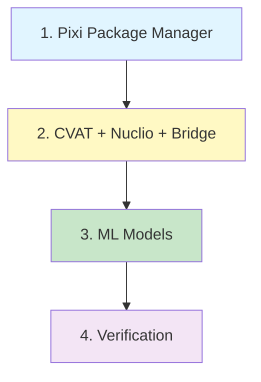

# Installation Guide

Complete installation instructions for the CRIOBE coral segmentation pipeline.

## Installation Overview

The CRIOBE pipeline consists of four main components that must be installed in order:



**Total Installation Time**: 1-2 hours (depending on download speeds)

## Prerequisites

Before starting, ensure you have:

- ✅ [System requirements](../requirements.md) met
- ✅ Ubuntu 20.04+ or WSL2 with Ubuntu (Windows users)
- ✅ Docker Engine 20.10+ installed
- ✅ Docker Compose v2.0+ installed
- ✅ Git installed
- ✅ 100+ GB free disk space
- ✅ NVIDIA GPU with 6+ GB VRAM (recommended)
- ✅ Internet connection for downloads

!!! warning "Check Requirements First"
    Don't skip the [requirements check](../requirements.md)! Missing dependencies cause most installation failures.

## Installation Steps

### Step 1: Install Pixi

[Pixi](pixi-environment.md) manages Python environments for all pipeline modules.

```bash
# Install Pixi
curl -fsSL https://pixi.sh/install.sh | bash

# Verify
pixi --version
```

**Time**: 2-3 minutes

**→ [Complete Pixi Installation Guide](pixi-environment.md)**

### Step 2: Install CVAT + Nuclio + Bridge

Deploy the annotation platform with serverless ML functions.

```bash
# Clone CVAT with bridge integration
mkdir -p ~/criobe-platform
cd ~/criobe-platform
git clone https://github.com/Criobe/bridge.git cvat
cd cvat

# Configure bridge
cat > bridge/.env << 'EOF'
CVAT_URL=http://cvat-server:8080
CVAT_USER=admin
CVAT_PWD=change_me_to_secure_password
CACHE_DIR=/tmp/cvat_cache
AUTO_ANN_TIMEOUT=900
EOF

# Deploy stack
docker compose \
  -f docker-compose.yml \
  -f bridge/docker-compose.bridge.yml \
  -f components/serverless/docker-compose.serverless.yml \
  up -d --build

# Create admin user
docker exec -it cvat_server \
  bash -ic 'python3 ~/manage.py createsuperuser'
```

**Time**: 30-45 minutes

**→ [Complete CVAT + Nuclio Installation Guide](cvat-nuclio.md)**

### Step 3: Install Module Environments

Install Pixi environments for each module you'll use.

```bash
cd ~/coral-segmentation

# Essential modules
cd coral_seg_yolo && pixi install -e coral-seg-yolo-dev && cd ..
cd grid_pose_detection && pixi install -e grid-pose-dev && cd ..
cd grid_inpainting && pixi install && cd ..

# Optional: DINOv2 (for highest accuracy)
cd DINOv2_mmseg && pixi install -e dinov2-mmseg && cd ..
```

**Time**: 15-30 minutes

**→ [Complete Pixi Environment Guide](pixi-environment.md)**

### Step 4: Download ML Models

Download pre-trained models for each module.

```bash
cd ~/coral-segmentation

# Download all models
cd grid_pose_detection && ./download_models.sh && cd ..
cd grid_inpainting && ./download_model.sh && cd ..
cd coral_seg_yolo && ./download_models.sh && cd ..
cd DINOv2_mmseg && ./download_models.sh && cd ..
```

**Time**: 15-30 minutes (depending on connection speed)

**→ [Complete ML Models Installation Guide](ml-models.md)**

### Step 5: Deploy Nuclio Functions

Deploy ML models as serverless functions for CVAT integration.

```bash
cd ~/criobe-platform/cvat

# Grid detection
nuctl deploy --project-name cvat \
  --path "./serverless/pytorch/yolo/gridcorners/nuclio/" --platform local -v

nuctl deploy --project-name cvat \
  --path "./serverless/pytorch/yolo/gridpose/nuclio/" --platform local -v

# Grid removal
nuctl deploy --project-name cvat \
  --path "./serverless/pytorch/lama/nuclio/" --platform local -v

# Coral segmentation
nuctl deploy --project-name cvat \
  --path "./serverless/pytorch/yolo/coralsegv4/nuclio/" \
  --file "./serverless/pytorch/yolo/coralsegv4/nuclio/function.yaml" \
  --platform local -v
```

**Time**: 10-20 minutes

**→ See [CVAT Installation Step 6](cvat-nuclio.md#step-6-deploy-nuclio-functions)**

## Verify Installation

Run through this verification checklist:

### Service Health Checks

```bash
# CVAT
curl http://localhost:8080/api/server/about
# Expected: {"name":"CVAT","version":"2.29.0",...}

# Nuclio
curl http://localhost:8070/api/healthz
# Expected: OK

# Bridge
curl http://localhost:8000/health
# Expected: {"status":"healthy"}
```

### Web Interface Access

| Service | URL | Expected |
|---------|-----|----------|
| CVAT | http://localhost:8080/ | Login page |
| Nuclio Dashboard | http://localhost:8070/projects/cvat/functions | Function list |
| Bridge API Docs | http://localhost:8000/docs | FastAPI docs |

### Module Environment Tests

```bash
# Test YOLO environment
cd ~/coral-segmentation/coral_seg_yolo
pixi run -e coral-seg-yolo-dev python -c "import torch; print(f'PyTorch: {torch.__version__}, CUDA: {torch.cuda.is_available()}')"
# Expected: PyTorch: 2.5.0+cu121, CUDA: True

# Test DINOv2 environment
cd ~/coral-segmentation/DINOv2_mmseg
pixi run -e dinov2-mmseg python -c "import mmseg; print(f'MMSeg: {mmseg.__version__}')"
# Expected: MMSeg: 1.x.x
```

### Model Tests

```bash
# Test YOLO model loads
cd ~/coral-segmentation/coral_seg_yolo
pixi run -e coral-seg-yolo-dev python -c "
from src.inference_engine import YOLOPredictor
predictor = YOLOPredictor('models/coralsegv4_yolo11m_best.pt')
print('✅ YOLO model loaded')
"
```

### Run Quick Demo

Test the complete pipeline with sample data:

```bash
cd ~/coral-segmentation/coral_seg_yolo

# Download test samples
./download_test_samples.sh

# Run inference demo
pixi run -e coral-seg-yolo-dev python src/inference_demo.py \
    data/test_samples/5-grid_removal/ \
    results/demo/ \
    models/coralsegv4_yolo11m_best.pt
```

**→ [5-Minute Demo](../../quickstart/5-minute-demo.md)** for complete testing

## Installation Options

### Minimal Installation (CPU Only)

For development/testing without GPU:

**Components**:
- ✅ Pixi
- ✅ CVAT + Bridge (skip Nuclio)
- ✅ YOLO module only
- ❌ Skip DINOv2 (requires GPU)

**Time**: 30-45 minutes

### Standard Installation (GPU)

Recommended for most users:

**Components**:
- ✅ All components
- ✅ YOLO + Grid modules
- ✅ Nuclio functions
- ⚠️ DINOv2 optional

**Time**: 1-1.5 hours

### Full Installation (Production)

For production deployments:

**Components**:
- ✅ All components
- ✅ All modules including DINOv2
- ✅ All Nuclio functions
- ✅ Multi-server setup (optional)

**Time**: 1.5-2 hours

## Platform-Specific Notes

### Ubuntu / Debian

Follow instructions as written. Recommended platform.

### Windows (WSL2)

1. Install WSL2 with Ubuntu 22.04
2. Install Docker Desktop for Windows
3. Enable WSL2 integration in Docker Desktop settings
4. Follow Ubuntu instructions inside WSL2 terminal

**→ [Windows-specific notes](cvat-nuclio.md#platform-specific-instructions)**

### macOS

**Limitations**:
- No CUDA support (CPU-only mode)
- Slower inference (10-50x)
- Good for development, not production

**Gateway IP**: Use `192.168.65.1` instead of `172.17.0.1` for network configuration

## Troubleshooting

### Common Installation Issues

#### Docker Permission Denied

**Error**: `Got permission denied while trying to connect to the Docker daemon socket`

**Solution**:
```bash
sudo usermod -aG docker $USER
# Log out and back in
```

#### Port Already in Use

**Error**: `bind: address already in use`

**Solution**:
```bash
# Find process using port
sudo lsof -i :8080

# Kill process or change CVAT port
```

#### Out of Disk Space

**Error**: `no space left on device`

**Solution**:
```bash
# Check space
df -h

# Clean Docker
docker system prune -a

# Clean Pixi cache
pixi clean cache
```

#### CUDA Not Available

**Error**: `torch.cuda.is_available()` returns `False`

**Solution**:
```bash
# Check NVIDIA drivers
nvidia-smi

# If missing, install drivers:
# Ubuntu: sudo ubuntu-drivers autoinstall
# Reboot after installation
```

### Installation Fails Midway

**General approach**:
1. Check logs for specific error
2. Remove failed container/environment
3. Re-run installation step
4. Consult specific guide for troubleshooting

**Examples**:
```bash
# CVAT installation failed
docker compose -f docker-compose.yml ... down
# Fix issue, then retry

# Pixi installation failed
pixi clean -e <env-name>
pixi install -e <env-name> -v
```

## Post-Installation

After successful installation:

1. **Configure Projects**: [CVAT Projects Setup](../configuration/cvat-projects.md)
2. **Set Up Webhooks**: [Webhooks Configuration](../configuration/webhooks.md)
3. **Run First Annotation**: [First Annotation Tutorial](../../quickstart/first-annotation.md)

## Uninstallation

To completely remove the installation:

### Remove Docker Stack

```bash
cd ~/criobe-platform/cvat

# Stop and remove all containers and volumes
docker compose \
  -f docker-compose.yml \
  -f bridge/docker-compose.bridge.yml \
  -f components/serverless/docker-compose.serverless.yml \
  down -v

# Remove images (optional)
docker system prune -a
```

### Remove Pixi Environments

```bash
# Remove per-project environments
cd ~/coral-segmentation/<module>
pixi clean

# Remove global Pixi cache
pixi clean cache

# Uninstall Pixi
rm -rf ~/.pixi
rm ~/.local/bin/pixi
```

### Remove Source Code

```bash
# Remove CVAT/bridge
rm -rf ~/criobe-platform

# Remove module source
rm -rf ~/coral-segmentation
```

## Next Steps

!!! success "Installation Complete!"
    You're ready to start annotating and processing coral images!

**Recommended next steps**:

1. 📋 **[Configuration Guide](../configuration/index.md)** - Configure CVAT projects and webhooks
2. 🚀 **[5-Minute Demo](../../quickstart/5-minute-demo.md)** - Test the pipeline with sample data
3. 📝 **[First Annotation Tutorial](../../quickstart/first-annotation.md)** - Create your first automated workflow

## Quick Reference

### Installation Commands

```bash
# 1. Pixi
curl -fsSL https://pixi.sh/install.sh | bash

# 2. CVAT + Nuclio + Bridge
git clone https://github.com/Criobe/bridge.git ~/criobe-platform/cvat
cd ~/criobe-platform/cvat
docker compose -f docker-compose.yml -f bridge/docker-compose.bridge.yml \
  -f components/serverless/docker-compose.serverless.yml up -d --build

# 3. Module environments
cd ~/coral-segmentation/<module>
pixi install -e <env-name>

# 4. Download models
./download_models.sh  # in each module directory

# 5. Deploy Nuclio functions
nuctl deploy --project-name cvat --path "./serverless/pytorch/..." --platform local -v
```

### Service URLs

```
CVAT Web:          http://localhost:8080/
Nuclio Dashboard:  http://localhost:8070/
Bridge API:        http://localhost:8000/docs
```

---

**Questions?** See [Getting Help](../../community/getting-help.md) or consult individual installation guides linked above.
