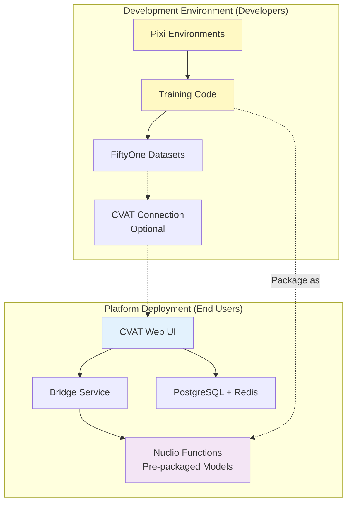
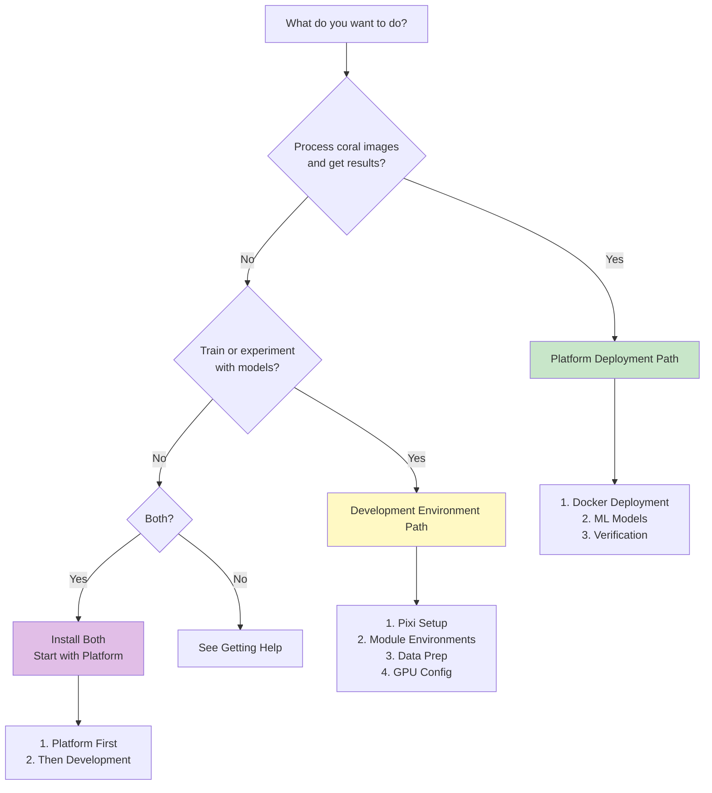

# Installation Guide

Complete installation instructions for the QUADRATSEG platform—developed by CRIOBE. Choose your installation path based on your role.

## Who Are You?

QUADRATSEG has two distinct installation paths depending on your use case:

-   :material-docker:{ .lg .middle } **End User - Platform Deployment**

    ---

    Deploy the production platform for **processing coral images** and getting automated segmentation results.

    **Use Case**: Run the CVAT + Nuclio + Bridge platform

    **Tools**: Docker, Docker Compose (no Pixi)

    [:octicons-arrow-right-24: Platform Installation](for-end-users/1-docker-deployment.md)

-   :material-code-braces:{ .lg .middle } **Developer - Development Environment**

    ---

    Set up the development environment for **training models, experimenting with architectures**, and iterating on the ML pipeline.

    **Use Case**: Train/eval/experiment with models

    **Tools**: Pixi, Python, CUDA

    [:octicons-arrow-right-24: Development Installation](for-developers/1-pixi-setup.md)

## Installation Comparison

| Aspect | Platform Deployment | Development Environment |
|--------|-------------------|------------------------|
| **Target Users** | Coral researchers, biologists | AI researchers, ML engineers |
| **Purpose** | Process images, get results | Train models, experiment |
| **Components** | CVAT + Nuclio + Bridge | Pixi environments per module |
| **Package Manager** | Docker only | Pixi (+ Docker optional) |
| **GPU Usage** | For inference (Nuclio functions) | For training and inference |
| **Pixi Required** | ❌ No | ✅ Yes |
| **Time Estimate** | 1.5-2 hours | 1.5-2 hours |
| **Complexity** | ⭐⭐ Moderate | ⭐⭐⭐ Advanced |

!!! info "Key Distinction"
    **Platform deployment** runs models as Docker services (no code access needed). **Development environment** provides code access for training and experimentation.

## Platform Deployment Path

For end users who want to deploy and use the platform:

### Installation Steps

1. **[Docker Deployment](for-end-users/1-docker-deployment.md)** - Deploy CVAT + Nuclio + Bridge stack
    - Clone CRIOBE's CVAT repository
    - Configure environment variables
    - Deploy with Docker Compose
    - Create admin user
    - **Time**: 30-45 minutes

2. **[ML Models Deployment](for-end-users/2-ml-models-deployment.md)** - Deploy serverless ML functions
    - Install nuctl CLI
    - Deploy 6 Nuclio functions (models auto-download)
    - Verify function deployment
    - **Time**: 40-60 minutes

3. **[Verification](for-end-users/3-verification.md)** - Verify installation
    - Health checks for all services
    - GPU availability test
    - Single inference test
    - **Time**: 10-15 minutes

### After Installation

Once installed, proceed to [Configuration](../configuration/for-end-users/1-cvat-projects.md) to set up projects and webhooks.

---

## Development Environment Path

For developers who want to train and experiment with models:

### Installation Steps

1. **[Pixi Setup](for-developers/1-pixi-setup.md)** - Install Pixi package manager
    - Install Pixi
    - Clone coral-segmentation repository
    - Understand repository structure
    - **Time**: 10-15 minutes

2. **[Module Environments](for-developers/2-module-environments.md)** - Set up module environments
    - Install Pixi environments per module
    - Download pre-trained models
    - Download test data
    - **Time**: 30-45 minutes

3. **[Data Preparation](for-developers/3-data-preparation.md)** - Set up FiftyOne and datasets
    - Configure FiftyOne
    - Connect to CVAT
    - Pull datasets
    - **Time**: 20-30 minutes

4. **[GPU Configuration](for-developers/4-gpu-configuration.md)** - Configure CUDA
    - CUDA version management
    - GPU memory configuration
    - Multi-GPU setup
    - **Time**: 15-20 minutes

### After Installation

Once installed, proceed to [Configuration](../configuration/for-developers/1-environment-variables.md) to configure environments and training setups.

---

## Prerequisites by Path

### For Platform Deployment

- [x] Docker Engine 20.10+
- [x] Docker Compose v2.0+
- [x] NVIDIA GPU with 8GB+ VRAM
- [x] NVIDIA Docker runtime
- [x] 20GB+ disk space
- [x] Git

### For Development Environment

- [x] All platform deployment prerequisites (if deploying locally)
- [x] Pixi package manager
- [x] Python 3.9+ (managed by Pixi)
- [x] 50GB+ disk space (for datasets and experiments)
- [x] Git

!!! tip "Can I Do Both?"
    Yes! You can install both the platform (for deployment) and the development environment (for training). They are independent and complementary.

## Architecture Overview

Understanding how components relate helps choose your path:

**Platform Deployment**: Self-contained Docker services for production use

**Development Environment**: Code-level access for model training and experimentation

## Quick Decision Tree

Not sure which path to follow? Use this decision tree:

## Getting Help

!!! question "Need Assistance?"
    - **Platform Deployment Issues**: Check [troubleshooting](for-end-users/3-verification.md#troubleshooting)
    - **Development Setup Issues**: Check [GPU configuration](for-developers/4-gpu-configuration.md#troubleshooting)
    - **General Help**: See [Getting Help](../../community/getting-help.md)
    - **GitHub Issues**: [Report problems](https://github.com/criobe/coral-segmentation/issues)

## Next Steps

**Choose your path above and start installing!**

After installation, you'll proceed to the [Configuration](../configuration/index.md) section to complete your setup.
