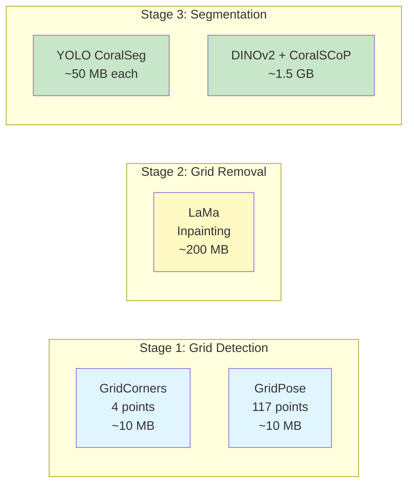

# ML Models Installation

Download and deploy pre-trained machine learning models for the QUADRATSEG platform developed by CRIOBE.

!!! tip "What You'll Download"
    - **Grid Detection Models**: Corner detection (4 points) and full grid detection (117 points)
    - **Grid Removal Model**: LaMa inpainting model for grid line removal
    - **Coral Segmentation Models**: YOLO models for CRIOBE and Banggai datasets
    - **DINOv2 Models**: Semantic segmentation with SegFormer and CoralSCoP
    - **Model sizes**: Total ~5-10 GB across all modules

**Time Required**: 15-30 minutes (depending on internet speed)
**Prerequisites**: [Pixi environments installed](pixi-environment.md), internet connection

## Overview

The QUADRATSEG platform uses different ML models at each processing stage:



## Model Storage Location

Models are hosted on Google Cloud Storage public repository:

- **Base URL**: `https://storage.googleapis.com/public_model_repo/`
- **No authentication required**
- **Available globally**

Each module includes download scripts that fetch models from this repository.

## Download Methods

You can download models in two ways:

### Method 1: Download Scripts (Recommended)

Each module has a `download_models.sh` or `download_model.sh` script:

```bash
cd <module-directory>
./download_models.sh
```

**Advantages**:
- Automatic file verification
- Skip already-downloaded files
- Progress indicators
- Error handling

### Method 2: Manual Download

Directly download models using `curl` or `wget` (useful for custom setups):

```bash
curl -L -o <destination> <model-url>
```

## Step 1: Grid Detection Models

### Grid Corners (4-Point Detection)

```bash
cd ~/coral-segmentation/grid_pose_detection

# Download models and templates
./download_models.sh
```

**What gets downloaded**:

| File | Purpose | Size | Path |
|------|---------|------|------|
| `gridcorners_yolov11n_best.pt` | Corner detection model | ~10 MB | `assets/` |
| `kp_template_corners.npy` | 4-point template | <1 MB | `assets/` |
| `gridpose_yolov11n_best.pt` | Full grid detection | ~10 MB | `assets/` |
| `kp_template.npy` | 117-point template | <1 MB | `assets/` |

**Verify download**:
```bash
ls -lh assets/*.pt assets/*.npy

# Expected output:
# gridcorners_yolov11n_best.pt  (~10 MB)
# gridpose_yolov11n_best.pt     (~10 MB)
# kp_template_corners.npy       (~2 KB)
# kp_template.npy               (~5 KB)
```

### Manual Download URLs

If automatic download fails:

```bash
cd grid_pose_detection/assets

# Grid corners model
curl -L -o gridcorners_yolov11n_best.pt \
  https://storage.googleapis.com/public_model_repo/gridcorners_yolov11n_imgz_720/weights/best.pt

# Grid corners template
curl -L -o kp_template_corners.npy \
  https://storage.googleapis.com/public_model_repo/kp_template_corners.npy

# Grid pose model
curl -L -o gridpose_yolov11n_best.pt \
  https://storage.googleapis.com/public_model_repo/gridpose_yolov11n_imgz_720/weights/best.pt

# Grid pose template
curl -L -o kp_template.npy \
  https://storage.googleapis.com/public_model_repo/kp_template.npy
```

## Step 2: Grid Removal Model

### SimpleLama Inpainting Model

```bash
cd ~/coral-segmentation/grid_inpainting

# Download SimpleLama model
./download_model.sh
```

**What gets downloaded**:

| File | Purpose | Size | Path |
|------|---------|------|------|
| `big-lama.pt` | Grid inpainting model | ~200 MB | `models/` |

**Verify download**:
```bash
ls -lh models/big-lama.pt

# Expected: ~200 MB file
```

**Manual download**:
```bash
cd grid_inpainting/models

curl -L -o big-lama.pt \
  https://github.com/enesmsahin/simple-lama-inpainting/releases/download/v0.1.0/big-lama.pt
```

## Step 3: Coral Segmentation Models (YOLO)

### YOLO Models for Coral Segmentation

```bash
cd ~/coral-segmentation/coral_seg_yolo

# Download YOLO models
./download_models.sh
```

**What gets downloaded**:

| File | Purpose | Dataset | Size | Path |
|------|---------|---------|------|------|
| `coralsegv4_yolo11m_best.pt` | Coral segmentation | CRIOBE Finegrained | ~50 MB | `models/` |
| `banggai_yolo11m_best.pt` | Coral segmentation | Banggai Extended | ~50 MB | `models/` |

**Verify download**:
```bash
ls -lh models/*.pt

# Expected output:
# banggai_yolo11m_best.pt      (~50 MB)
# coralsegv4_yolo11m_best.pt   (~50 MB)
```

**Manual download**:
```bash
cd coral_seg_yolo/models

# CoralSegV4 model (CRIOBE finegrained dataset)
curl -L -o coralsegv4_yolo11m_best.pt \
  https://storage.googleapis.com/public_model_repo/coralsegv4_yolo11m_imgsz_1920/weights/best.pt

# Banggai model (Banggai extended dataset)
curl -L -o banggai_yolo11m_best.pt \
  https://storage.googleapis.com/public_model_repo/banggai_yolo11m_imgsz_1920/weights/best.pt
```

## Step 4: DINOv2 Segmentation Models

### DINOv2 + SegFormer + CoralSCoP

```bash
cd ~/coral-segmentation/DINOv2_mmseg

# Download all DINOv2 models
./download_models.sh
```

**What gets downloaded**:

| File | Purpose | Size | Path |
|------|---------|------|------|
| `dinov2_vitb14_coralsegv4_ms_config_segformer.py` | Config file | <1 MB | `assets/` |
| `best_mIoU_epoch_140.pth` | SegFormer checkpoint | ~350 MB | `assets/` |
| `vit_b_coralscop.pth` | CoralSCoP (SAM) model | ~400 MB | `assets/pretrained_models/` |
| `dinov2_vitb14_pretrain.pth` | DINOv2 backbone | ~350 MB | `assets/pretrained_models/` |

**Verify download**:
```bash
ls -lh assets/*.{pth,py}
ls -lh assets/pretrained_models/*.pth

# Expected:
# assets/best_mIoU_epoch_140.pth                  (~350 MB)
# assets/dinov2_vitb14_coralsegv4_ms_config_segformer.py
# assets/pretrained_models/vit_b_coralscop.pth    (~400 MB)
# assets/pretrained_models/dinov2_vitb14_pretrain.pth  (~350 MB)
```

**Manual download**:
```bash
cd DINOv2_mmseg

# Create directories
mkdir -p assets/pretrained_models

# SegFormer config
curl -L -o assets/dinov2_vitb14_coralsegv4_ms_config_segformer.py \
  https://storage.googleapis.com/public_model_repo/dinov2_vitb14_coralsegv4_ms_config_segformer/dinov2_vitb14_coralsegv4_ms_config_segformer.py

# SegFormer model checkpoint
curl -L -o assets/best_mIoU_epoch_140.pth \
  https://storage.googleapis.com/public_model_repo/dinov2_vitb14_coralsegv4_ms_config_segformer/best_mIoU_epoch_140.pth

# CoralSCoP model
curl -L -o assets/pretrained_models/vit_b_coralscop.pth \
  https://storage.googleapis.com/public_model_repo/vit_b_coralscop.pth

# DINOv2 pretrained backbone
curl -L -o assets/pretrained_models/dinov2_vitb14_pretrain.pth \
  https://storage.googleapis.com/public_model_repo/pretrained_models/dinov2_vitb14_pretrain.pth
```

## Download All Models at Once

Download all models for all modules in one script:

```bash
#!/bin/bash
# Save as: download_all_models.sh

cd ~/coral-segmentation

echo "📥 Downloading all QUADRATSEG pipeline models..."

# Grid detection models
echo ""
echo "=== Grid Detection Models ==="
cd grid_pose_detection && ./download_models.sh && cd ..

# Grid removal model
echo ""
echo "=== Grid Removal Model ==="
cd grid_inpainting && ./download_model.sh && cd ..

# YOLO coral segmentation
echo ""
echo "=== YOLO Coral Segmentation ==="
cd coral_seg_yolo && ./download_models.sh && cd ..

# DINOv2 models
echo ""
echo "=== DINOv2 Segmentation ==="
cd DINOv2_mmseg && ./download_models.sh && cd ..

echo ""
echo "🎉 All models downloaded successfully!"
```

Make executable and run:
```bash
chmod +x download_all_models.sh
./download_all_models.sh
```

## Verify All Downloads

Check all models are downloaded correctly:

```bash
#!/bin/bash
# Verification script

echo "📊 Verifying ML model downloads..."
echo ""

check_file() {
    if [ -f "$1" ]; then
        echo "✅ $1 ($(du -h "$1" | cut -f1))"
    else
        echo "❌ MISSING: $1"
    fi
}

cd ~/coral-segmentation

echo "=== Grid Detection Models ==="
check_file "grid_pose_detection/assets/gridcorners_yolov11n_best.pt"
check_file "grid_pose_detection/assets/gridpose_yolov11n_best.pt"
check_file "grid_pose_detection/assets/kp_template_corners.npy"
check_file "grid_pose_detection/assets/kp_template.npy"

echo ""
echo "=== Grid Removal Model ==="
check_file "grid_inpainting/models/big-lama.pt"

echo ""
echo "=== YOLO Coral Segmentation ==="
check_file "coral_seg_yolo/models/coralsegv4_yolo11m_best.pt"
check_file "coral_seg_yolo/models/banggai_yolo11m_best.pt"

echo ""
echo "=== DINOv2 Models ==="
check_file "DINOv2_mmseg/assets/best_mIoU_epoch_140.pth"
check_file "DINOv2_mmseg/assets/pretrained_models/vit_b_coralscop.pth"
check_file "DINOv2_mmseg/assets/pretrained_models/dinov2_vitb14_pretrain.pth"
```

## Test Models

Verify models load correctly:

### Test Grid Detection

```bash
cd ~/coral-segmentation/grid_pose_detection

pixi run -e grid-pose-dev python -c "
from ultralytics import YOLO
model = YOLO('assets/gridcorners_yolov11n_best.pt')
print('✅ GridCorners model loaded successfully')
"
```

### Test Grid Removal

```bash
cd ~/coral-segmentation/grid_inpainting

pixi run python -c "
from src.lama import SimpleLama
lama = SimpleLama('models/big-lama.pt', 'cpu')
print('✅ LaMa model loaded successfully')
"
```

### Test YOLO Segmentation

```bash
cd ~/coral-segmentation/coral_seg_yolo

pixi run -e coral-seg-yolo-dev python -c "
from src.inference_engine import YOLOPredictor
predictor = YOLOPredictor('models/coralsegv4_yolo11m_best.pt')
print('✅ YOLO CoralSegV4 model loaded successfully')
"
```

### Test DINOv2

```bash
cd ~/coral-segmentation/DINOv2_mmseg

pixi run -e dinov2-mmseg python -c "
from mmseg.apis import init_model
model = init_model(
    'assets/dinov2_vitb14_coralsegv4_ms_config_segformer.py',
    'assets/best_mIoU_epoch_140.pth',
    device='cpu'
)
print('✅ DINOv2 SegFormer model loaded successfully')
"
```

## Deploy Models to Nuclio

After downloading, deploy models as Nuclio serverless functions for CVAT integration.

### Deploy Grid Detection Functions

```bash
cd ~/criobe-platform/cvat

# Grid corners (4 points)
nuctl deploy --project-name cvat \
  --path "./serverless/pytorch/yolo/gridcorners/nuclio/" \
  --platform local -v

# Grid pose (117 points)
nuctl deploy --project-name cvat \
  --path "./serverless/pytorch/yolo/gridpose/nuclio/" \
  --platform local -v
```

### Deploy Grid Removal Function

```bash
# LaMa inpainting
nuctl deploy --project-name cvat \
  --path "./serverless/pytorch/lama/nuclio/" \
  --platform local -v
```

### Deploy YOLO Segmentation Functions

```bash
# CoralSegV4
nuctl deploy --project-name cvat \
  --path "./serverless/pytorch/yolo/coralsegv4/nuclio/" \
  --file "./serverless/pytorch/yolo/coralsegv4/nuclio/function.yaml" \
  --platform local -v

# Banggai (optional)
nuctl deploy --project-name cvat \
  --path "./serverless/pytorch/yolo/coralsegbanggai/nuclio/" \
  --file "./serverless/pytorch/yolo/coralsegbanggai/nuclio/function.yaml" \
  --platform local -v
```

!!! info "Nuclio Deployment"
    See [Nuclio Functions Configuration](../configuration/nuclio-functions.md) for detailed deployment instructions and troubleshooting.

## Model Details

### Grid Detection Models

**GridCorners (4-point detection)**:
- **Architecture**: YOLOv11-nano detection + Hungarian matching
- **Input size**: 720x720
- **Output**: 4 corner keypoints
- **Inference time**: ~1s on GTX 1070
- **Use case**: Quadrat cropping and perspective correction

**GridPose (117-point detection)**:
- **Architecture**: YOLOv11-nano detection + template matching
- **Input size**: 720x720
- **Output**: 117 grid intersection keypoints
- **Inference time**: ~2s on GTX 1070
- **Use case**: Precise grid removal

### Grid Removal Model

**SimpleLama (Big)**:
- **Architecture**: LaMa (Large Mask Inpainting)
- **Input size**: 3000x3000 (auto-resize)
- **Output**: Grid-free image
- **Inference time**: ~5-8s on GTX 1070
- **Use case**: Remove grid lines for clean coral images

### Coral Segmentation Models

**CoralSegV4 (CRIOBE Finegrained)**:
- **Architecture**: YOLOv11-medium instance segmentation
- **Dataset**: 18 coral species
- **Input size**: 1920x1920
- **Output**: Polygon masks per instance
- **Inference time**: ~7s on GTX 1070
- **mAP**: ~65% (instance detection)

**Banggai Extended**:
- **Architecture**: YOLOv11-medium instance segmentation
- **Dataset**: 10 coral genera
- **Input size**: 1920x1920
- **Output**: Polygon masks per instance
- **Inference time**: ~7s on GTX 1070

### DINOv2 Models

**SegFormer (Semantic Segmentation)**:
- **Architecture**: DINOv2-ViT-B14 + SegFormer head
- **Dataset**: CRIOBE Finegrained (18 classes)
- **Input size**: Multi-scale (512, 768, 1024, 1280)
- **Output**: Semantic segmentation map
- **Inference time**: ~8s on GTX 1070
- **mIoU**: 49.53% (best accuracy)

**CoralSCoP (Instance Refinement)**:
- **Architecture**: Segment Anything Model (ViT-B) fine-tuned
- **Purpose**: Convert semantic masks to instance polygons
- **Inference time**: ~12s per image on GTX 1070
- **Output**: Instance-level polygon masks

## Troubleshooting

### Download Fails with Connection Error

**Error**: `curl: (6) Could not resolve host`

**Solution**:
```bash
# Test internet connection
ping google.com

# Try alternative download method
wget -O <destination> <model-url>

# Use proxy if behind firewall
export http_proxy=http://proxy:port
export https_proxy=http://proxy:port
```

### Download Incomplete

**Error**: File size smaller than expected

**Solution**:
```bash
# Remove incomplete file
rm <incomplete-file>

# Re-download with resume capability
curl -C - -L -o <destination> <model-url>
```

### Model Won't Load

**Error**: `RuntimeError: Error loading state_dict`

**Solution**:
```bash
# Verify file is not corrupted
md5sum <model-file>

# Check file size matches expected
ls -lh <model-file>

# Re-download if corrupted
rm <model-file>
./download_models.sh
```

### Out of Disk Space

**Check space**:
```bash
df -h
du -sh ~/coral-segmentation/*/models
du -sh ~/coral-segmentation/*/assets
```

**Free space**:
```bash
# Remove unnecessary models
rm coral_seg_yolo/models/banggai_yolo11m_best.pt  # If not using Banggai

# Clean Docker images
docker system prune -a

# Clean Pixi cache
pixi clean cache
```

### GPU Out of Memory During Model Loading

**Error**: `CUDA out of memory`

**Solution**:
```bash
# Use CPU for testing
python -c "model = load_model('model.pt', device='cpu')"

# Reduce batch size
# Restart Python to clear GPU memory
```

## Storage Requirements

Total disk space required per module:

| Module | Models | Templates/Assets | Total |
|--------|--------|------------------|-------|
| **Grid Detection** | 20 MB | 10 KB | 20 MB |
| **Grid Removal** | 200 MB | - | 200 MB |
| **YOLO Coral Seg** | 100 MB | - | 100 MB |
| **DINOv2** | 1.1 GB | 350 MB | 1.5 GB |
| **Total** | ~1.4 GB | ~350 MB | **~1.8 GB** |

**Recommended**: 5 GB free space for models + temporary files + Docker images

## Next Steps

!!! success "Models Downloaded!"
    All pre-trained models are ready for inference and deployment.

**Continue with**:

- [Nuclio Functions Deployment](../configuration/nuclio-functions.md) - Deploy models to Nuclio
- [First Annotation Tutorial](../../quickstart/first-annotation.md) - Test the complete pipeline with CVAT

## Quick Reference

### Download Commands

```bash
# All models
cd ~/coral-segmentation
for dir in grid_pose_detection grid_inpainting coral_seg_yolo DINOv2_mmseg; do
    cd $dir && ./download_model*.sh && cd ..
done

# Individual modules
cd grid_pose_detection && ./download_models.sh
cd grid_inpainting && ./download_model.sh
cd coral_seg_yolo && ./download_models.sh
cd DINOv2_mmseg && ./download_models.sh
```

### Model Locations

```bash
# Grid detection
grid_pose_detection/assets/gridcorners_yolov11n_best.pt
grid_pose_detection/assets/gridpose_yolov11n_best.pt

# Grid removal
grid_inpainting/models/big-lama.pt

# YOLO segmentation
coral_seg_yolo/models/coralsegv4_yolo11m_best.pt
coral_seg_yolo/models/banggai_yolo11m_best.pt

# DINOv2
DINOv2_mmseg/assets/best_mIoU_epoch_140.pth
DINOv2_mmseg/assets/pretrained_models/vit_b_coralscop.pth
DINOv2_mmseg/assets/pretrained_models/dinov2_vitb14_pretrain.pth
```

---

**Questions?** See [Getting Help](../../community/getting-help.md) or check [Nuclio Deployment](../configuration/nuclio-functions.md).
