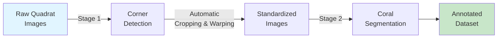
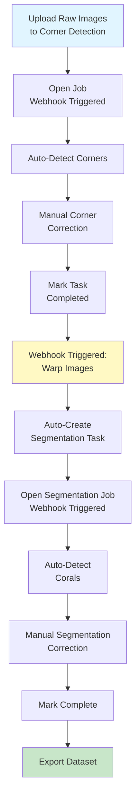

# Guide B: Two-Stage Banggai Setup

Learn how to process raw quadrat images through corner detection, perspective correction, and coral segmentation using automated webhooks.

## Introduction

This guide demonstrates a **two-stage pipeline workflow** used for the Banggai coral dataset. Unlike Guide A, this workflow handles raw underwater quadrat images that need perspective correction before segmentation.

### Use Case

**When to use this guide:**

- Raw underwater quadrat photos with visible corners (no grid lines)
- Images taken at angles requiring perspective correction
- Need standardized, cropped quadrat views for analysis
- Automated pipeline from raw images to annotated corals

**Examples of suitable images:**

- Underwater quadrat photographs from Banggai region
- Images with visible quadrat frame corners (usually marked with colored tape or buoys)
- Photos where camera position varies between shots

### Pipeline Overview



**Stage 1**: Detect 4 corner points of the quadrat frame → automatically crop and warp images

**Stage 2**: Annotate coral genera on the standardized images

### What You'll Learn

- Create two CVAT projects with different label configurations (skeleton + polygon)
- Deploy corner detection model as Nuclio function
- Configure Bridge webhooks for automatic task creation
- Set up end-to-end pipeline automation
- Process images through multiple stages automatically

### Expected Outcome

- Two interconnected CVAT projects
- Automated workflow from raw upload to segmentation tasks
- Warped, standardized quadrat images
- Annotated coral dataset ready for training

### Time Required

- **Initial setup**: ~1 hour
- **Per-image processing**: ~5-7 minutes (2 min corner detection + 3-5 min segmentation correction)

## Prerequisites

!!! warning "Critical: Complete Setup First"
    This guide requires ALL CVAT projects and webhooks to be configured BEFORE uploading any images. Webhooks automatically create tasks in downstream projects, so those projects must exist first.

    **You must complete the full setup configuration before beginning annotation work.**

### Required Setup Steps

You must complete these setup guides in order:

1. **[CVAT Projects Configuration](../../setup/configuration/for-end-users/1-cvat-projects.md)**

    Create and configure **2 projects** with proper labels:

    - **Project 1: Corner Detection** - Follow the "Corner Detection" section to create `banggai_corner_detection` with 4-point skeleton labels
    - **Project 2: Coral Segmentation** - Follow the "Coral Segmentation" section to create `banggai_coral_segmentation` with 16 coral genera polygon labels

2. **[Webhooks Setup](../../setup/configuration/for-end-users/2-webhooks-setup.md)**

    Configure **3 webhooks** after all projects exist:

    - **Webhook 1** (on Corner Detection project): Model detection webhook for auto-detecting corners
    - **Webhook 2** (on Corner Detection project): Task completion webhook for automatic image warping and task creation
    - **Webhook 3** (on Coral Segmentation project): Model detection webhook for auto-segmenting corals

3. **[Workflow Testing](../../setup/configuration/for-end-users/3-workflow-testing.md)**

    Verify the complete automation pipeline works end-to-end.

### Setup Checklist

Before starting annotation workflow, verify you have:

- [x] **CVAT instance** running with admin access
- [x] **Nuclio serverless platform** deployed
- [x] **Bridge service** running and connected to CVAT network
- [x] **2 CVAT projects created and configured**:
    - `banggai_corner_detection` (corner detection project)
    - `banggai_coral_segmentation` (segmentation project)
- [x] **3 webhooks configured**:
    - Corner detection: Model detection webhook (job state → "in progress")
    - Corner detection: Task completion webhook (task → "completed")
    - Segmentation: Model detection webhook (job state → "in progress")
- [x] **2 Nuclio models deployed**:
    - `pth-yolo-gridcorners` (corner detection)
    - `pth-yolo-coralsegbanggai` (coral segmentation)
- [x] Raw quadrat images with visible corner markers
- [x] Completed [Guide A](1-single-stage-segmentation.md) (recommended for CVAT familiarity)

!!! tip "Quick Setup Verification"
    Before proceeding, verify your setup:

    ```bash
    # Check Bridge service
    docker ps | grep bridge
    curl http://localhost:8000/health
    # Should return {"status": "healthy"}

    # Check Nuclio functions deployed
    nuctl get functions --platform local | grep -E "(gridcorners|coralsegbanggai)"
    # Both should show STATE: ready

    # Check CVAT projects exist
    # Navigate to http://localhost:8080/projects
    # Verify both projects are listed
    ```

## Pipeline Configuration Reference

This section summarizes the configuration needed for this two-stage pipeline. **Detailed setup instructions are in the [setup guides](../../setup/configuration/for-end-users/1-cvat-projects.md)** - you should have already completed those before reaching this point.

### Project Summary

This pipeline requires 2 CVAT projects (configured in [CVAT Projects guide](../../setup/configuration/for-end-users/1-cvat-projects.md)):

| Stage | Project Name | Label Type | Setup Guide Section | Purpose |
|-------|--------------|------------|---------------------|---------|
| 1 | `banggai_corner_detection` | Skeleton (4 points) | "Project 1: Corner Detection" | Detect quadrat corners for perspective correction |
| 2 | `banggai_coral_segmentation` | Polygon (16 genera) | "Project 3: Coral Segmentation" | Annotate coral species on warped images |

### Webhook Summary

This pipeline requires 3 webhooks (configured in [Webhooks Setup guide](../../setup/configuration/for-end-users/2-webhooks-setup.md)):

| Project | Webhook Type | Target URL | Trigger Event | Setup Guide Section | Purpose |
|---------|-------------|------------|---------------|---------------------|---------|
| `banggai_corner_detection` | Model Detection | `detect-model-webhook?model_name=pth-yolo-gridcorners` | Job → "in progress" | "Corner Detection Webhook" | Auto-detect 4 corner points |
| `banggai_corner_detection` | Task Completion | `crop-quadrat-and-create-new-task-webhook?target_proj_id={SEG_ID}` | Task → "completed" | "Task Completion Webhook (Corner → Segmentation)" | Warp images and create segmentation task |
| `banggai_coral_segmentation` | Model Detection | `detect-model-webhook?model_name=pth-yolo-coralsegbanggai&conv_mask_to_poly=true` | Job → "in progress" | "Coral Segmentation Webhook" | Auto-segment coral polygons |

!!! info "Webhook Configuration Details"
    The `{SEG_ID}` in the task completion webhook must be replaced with your actual coral segmentation project ID from CVAT.

    Follow the [Webhooks Setup guide](../../setup/configuration/for-end-users/2-webhooks-setup.md) for step-by-step instructions on configuring each webhook with the correct project IDs, event triggers, and URLs.

### Model Deployment Summary

Both models must be deployed to Nuclio before starting annotation:

**Corner Detection Model** (Stage 1):

```bash
cd PROJ_ROOT/criobe/grid_pose_detection/deploy/pth-yolo-gridcorners
./deploy_as_zip.sh
nuctl deploy --project-name cvat --path ./nuclio --platform local --verbose
```

**Coral Segmentation Model** (Stage 2):

```bash
cd PROJ_ROOT/criobe/coral_seg_yolo/deploy/pth-yolo-coralsegbanggai
./deploy_as_zip.sh
nuctl deploy --project-name cvat --path ./nuclio --platform local --verbose
```

For detailed deployment instructions, see the [setup guides](../../setup/configuration/for-end-users/1-cvat-projects.md).

### Label Configuration Reference

**Corner Detection Labels** (Skeleton with 4 points):

- Label name: `quadrat_corner` (skeleton type)
- 4 sublabels: Points labeled "1", "2", "3", "4"
- Corner order: Clockwise from top-left (TL → TR → BR → BL)
- Confidence attribute: 0-100% (default 100)

**Coral Segmentation Labels** (16 genera polygons):

Acanthastrea, Acropora, Astreopora, Atrea, Fungia, Goniastrea, Leptastrea, Merulinidae, Millepora, Montastrea, Montipora, Other, Pavona/Leptoseris, Pocillopora, Porites, Psammocora

All labels include a `confidence` attribute (0-100%).

For complete label JSON configurations, see [CVAT Projects Configuration](../../setup/configuration/for-end-users/1-cvat-projects.md).

!!! success "Setup Complete?"
    If you've completed all setup steps from the prerequisites, you're ready to begin the annotation workflow!

## Annotation Workflow

Once all projects, webhooks, and models are configured, you can begin processing images through the pipeline.

### Stage 1: Corner Detection Workflow

#### Step 1.1: Upload Raw Quadrat Images

1. In the `banggai_corner_detection` project, click **Create a new task**
2. Configure task:
    - **Name**: `raw_batch_01`
    - **Subset**: `train` (or `val`/`test` as appropriate)
3. **Upload images**: Select your raw quadrat photos
4. **Submit** to create task

!!! tip "Image Naming Convention"
    For proper metadata extraction, name images as:

    - `{site}_{year}_{quadrat_id}.jpg` (e.g., `BanggaiReef_2023_05.jpg`)
    - Or `{site}_{quadrat_id}_{year}.jpg`

    This allows automatic extraction of location, year, and quadrat number.

#### Step 1.2: Semi-Automatic Corner Detection

1. Open a job in the `raw_batch_01` task
2. Change job state to **"in progress"** - this triggers the detection webhook automatically
3. The corner detection model runs (you'll see activity in Bridge logs)
4. Wait 5-10 seconds, then **refresh** the page (`F5`)
5. Four corner points should appear on the image!

!!! info "Automatic Detection"
    The webhook configured in setup automatically runs the corner detection model when job state changes to "in progress". No manual triggering needed!

#### Step 1.3: Manual Corner Correction

Review and correct the automatically detected corners:

- **Check corner positions**: Are all 4 corners correctly detected?
- **Adjust if needed**: Drag corner points to exact positions
- **Correct order**: Ensure clockwise order (TL → TR → BR → BL)
- **Add missing corners**: If model missed a corner, manually add it
- **Remove duplicates**: Delete extra detected points
- **Save**: Press `Ctrl+S`

!!! warning "Corner Order is Critical"
    The warping algorithm depends on correct corner order:

    1. **Top-left** corner (usually marked)
    2. **Top-right** corner
    3. **Bottom-right** corner
    4. **Bottom-left** corner

    Clockwise from top-left! Wrong order will result in distorted warped images.

#### Step 1.4: Complete Corner Detection Task

Once all corners are correctly annotated:

1. Review all images in the task
2. Verify 4 corners per image in correct clockwise order
3. Click **Menu** → **Finish the job**
4. Mark the task as **Completed** in the project view

!!! success "Automatic Progression to Stage 2"
    When you mark the task as "completed", the task completion webhook automatically:

    - Downloads corner annotations
    - Warps images using perspective transformation
    - Creates new task in the segmentation project
    - Uploads warped images

    Monitor progress in Bridge logs:

    ```bash
    docker logs -f bridge
    ```

### Stage 2: Coral Segmentation Workflow

#### Step 2.1: Verify Automatic Task Creation

After completing the corner detection task in Stage 1, the task completion webhook automatically creates a new task in the segmentation project.

**Check for the new task:**

1. Navigate to the `banggai_coral_segmentation` project in CVAT
2. You should see a new task automatically created (e.g., `raw_batch_01_warped`)
3. The task contains warped, standardized images from the corner detection stage

**Monitor automation progress:**

```bash
# Watch Bridge logs to see processing
docker logs -f bridge

# You should see:
# INFO: Received task completion webhook for task ID: 123
# INFO: Processing corner annotations...
# INFO: Warping 20 images...
# INFO: Creating new task in project...
# INFO: Created task "raw_batch_01_warped" with 20 images
```

!!! success "Automatic Warping Complete"
    The Bridge service automatically:

    - Downloaded corner annotations from the completed task
    - Applied perspective transformation to crop and warp each image
    - Uploaded warped images to the segmentation project
    - Created a new task with preserved metadata

#### Step 2.2: Semi-Automatic Coral Segmentation

1. Open a job in the auto-created segmentation task
2. Job state is automatically set to **"in progress"** (triggers detection webhook)
3. The segmentation model runs automatically (wait ~10-30 seconds)
4. **Refresh** the page (`F5`) - coral polygons should appear!

!!! info "Automatic Detection"
    Tasks created by webhooks automatically have their job state set to "in progress", which immediately triggers the segmentation detection webhook. No manual state change needed!

#### Step 2.3: Manual Correction and Annotation

Review and correct the automatically generated coral annotations:

**Correction workflow** (see [Guide A](1-single-stage-segmentation.md) for detailed instructions):

- Review each automatically detected polygon
- Correct boundaries and species labels as needed
- Add missing coral colonies
- Remove false positives
- Adjust confidence values if uncertain
- Save frequently (`Ctrl+S`)

**When finished:**

1. Review all images in the task
2. Click **Menu** → **Finish the job**
3. Mark task as **Completed** when ready for export

## End-to-End Pipeline Workflow

Here's the complete automated workflow:



**Summary of automation:**

1. **Upload** raw images → Corner detection project
2. **Open job** → Auto-detect corners (webhook)
3. **Correct corners** → Mark task complete
4. **Automatic** → Warp images + create segmentation task (webhook)
5. **Open segmentation job** → Auto-detect corals (webhook)
6. **Correct segmentation** → Mark complete
7. **Export** final dataset

## Data Export and Preparation

Once both stages are complete, export the annotated dataset.

### Pull Both Projects with FiftyOne

```bash
cd PROJ_ROOT/criobe/data_engineering
pixi shell

# Pull corner detection annotations (optional, for records)
python create_fiftyone_dataset.py \
    --cvat-project-name "banggai_corner_detection" \
    --dataset-name "banggai_corners_fo"

# Pull segmentation annotations (main dataset)
python create_fiftyone_dataset.py \
    --cvat-project-name "banggai_coral_segmentation" \
    --dataset-name "banggai_segmentation_fo"
```

### Verify and Prepare for Training

```bash
# Launch FiftyOne app
fiftyone app launch banggai_segmentation_fo
```

Verify:

- Warped images look correctly cropped and oriented
- Coral annotations are present
- Label distribution is reasonable

### Convert to Training Format

**For YOLO training:**

```bash
cd PROJ_ROOT/criobe/coral_seg_yolo
pixi shell -e coral-seg-yolo-dev

python src/prepare_data.py \
    --dataset-name banggai_segmentation_fo \
    --output-dir data/prepared_for_training/banggai_dataset
```

**For MMSeg training:**

```bash
cd PROJ_ROOT/criobe/DINOv2_mmseg
pixi shell -e dinov2-mmseg

python prepare_data.py \
    --dataset-name banggai_segmentation_fo \
    --output-dir data/prepared_for_training/banggai_dataset
```

## Troubleshooting

??? question "Warping webhook doesn't trigger"
    **Check:**

    1. Task is marked **Completed** (not just job finished)
    2. Webhook URL has correct project ID
    3. Bridge service is running: `docker logs bridge`
    4. Bridge can access CVAT: Test with `curl http://cvat_server:8080` from bridge container

    **Manual trigger:**
    ```bash
    # Find task ID from CVAT URL when viewing the task
    curl -X POST "http://localhost:8000/crop-quadrat-and-create-new-task-webhook?target_proj_id=7" \
        -H "Content-Type: application/json" \
        -d '{"task_id": 123}'
    ```

??? question "Warped images are distorted"
    **Possible causes:**

    - Corner order is incorrect (not clockwise from top-left)
    - Corner positions are inaccurate
    - Image resolution is very low

    **Solutions:**

    1. Re-check corner annotations in CVAT
    2. Ensure corners are in correct order
    3. Re-run task completion (mark as "in progress", then "completed" again)

??? question "Segmentation task created but empty"
    **Check:**

    - Bridge logs for error messages
    - Original task had images with corner annotations
    - File permissions in CVAT media directory

    **Verify warped images:**
    ```bash
    # Check bridge container volumes
    docker exec -it bridge ls /cvat/data/tasks/
    ```

??? question "Corner detection model detects wrong points"
    **Common issues:**

    - Low image quality (blur, poor lighting)
    - Corner markers not visible or obscured
    - Different quadrat frame design than training data

    **Solutions:**

    - Manually correct detections
    - Consider training a custom corner detection model on your specific quadrat design
    - Ensure images have sufficient resolution (minimum 1920x1080 recommended)

## Next Steps

Congratulations! You've set up a complete two-stage pipeline with:

- ✅ Automated corner detection and image warping
- ✅ Webhook-based task creation between stages
- ✅ Semi-automatic coral segmentation
- ✅ Export-ready annotated dataset

### Continue Learning

- **Train custom models**: [YOLO Training Guide](../training-and-deployment/yolo-segmentation.md)
- **Learn the full pipeline**: [Three-Stage CRIOBE Setup](3-three-stage-criobe.md) (adds grid removal)
- **Deploy your models**: [Model Deployment Guide](../training-and-deployment/model-deployment.md)

### Advanced Topics

- **Batch processing**: Process multiple tasks in parallel
- **Quality control**: Set up annotation review workflows
- **Custom taxonomies**: Modify label configurations for different coral classifications
- **Performance tuning**: Optimize webhook response times and model inference speed

---

**Next Guide**: [Three-Stage CRIOBE Setup](3-three-stage-criobe.md) · [Back to Overview](index.md)
