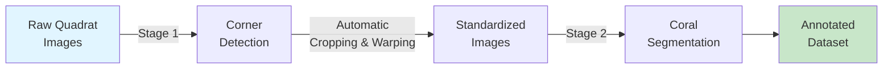
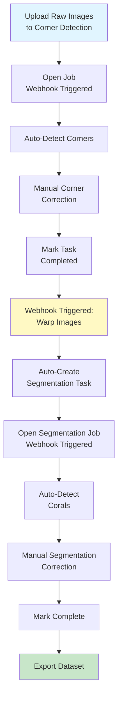

# Guide B: Two-Stage Banggai Setup

Learn how to process raw quadrat images through corner detection, perspective correction, and coral segmentation using automated webhooks.

## Introduction

This guide demonstrates a **two-stage pipeline workflow** used for the Banggai coral dataset. Unlike Guide A, this workflow handles raw underwater quadrat images that need perspective correction before segmentation.

### Use Case

**When to use this guide:**

- Raw underwater quadrat photos with visible corners (no grid lines)
- Images taken at angles requiring perspective correction
- Need standardized, cropped quadrat views for analysis
- Automated pipeline from raw images to annotated corals

**Examples of suitable images:**

- Underwater quadrat photographs from Banggai region
- Images with visible quadrat frame corners (usually marked with colored tape or buoys)
- Photos where camera position varies between shots

### Pipeline Overview



**Stage 1**: Detect 4 corner points of the quadrat frame → automatically crop and warp images

**Stage 2**: Annotate coral genera on the standardized images

### What You'll Learn

- Create two CVAT projects with different label configurations (skeleton + polygon)
- Deploy corner detection model as Nuclio function
- Configure Bridge webhooks for automatic task creation
- Set up end-to-end pipeline automation
- Process images through multiple stages automatically

### Expected Outcome

- Two interconnected CVAT projects
- Automated workflow from raw upload to segmentation tasks
- Warped, standardized quadrat images
- Annotated coral dataset ready for training

### Time Required

- **Initial setup**: ~1 hour
- **Per-image processing**: ~5-7 minutes (2 min corner detection + 3-5 min segmentation correction)

## Prerequisites

Before starting, ensure you have:

- [x] CVAT instance running with admin access
- [x] **Nuclio serverless platform** deployed
- [x] **Bridge service** running and connected to CVAT network
- [x] Raw quadrat images with visible corner markers
- [x] Completed [Guide A](1-single-stage-segmentation.md) (recommended for CVAT familiarity)

!!! warning "Bridge Service Required"
    This guide requires the Bridge service for automated task creation between stages. Verify it's running:

    ```bash
    docker ps | grep bridge
    # Should show bridge container running

    # Test bridge API
    curl http://localhost:8000/health
    # Should return {"status": "healthy"}
    ```

## Stage 1: Corner Detection and Image Warping

### Step 1.1: Create CVAT Project for Corner Detection

1. Log in to CVAT at `http://localhost:8080`
2. Navigate to **Projects** → Click **+** to create new project
3. Enter project details:
    - **Name**: `banggai_corner_detection`
    - **Description**: "Quadrat corner detection for perspective correction (Banggai dataset)"

### Step 1.2: Configure Corner Detection Labels

Click the **Raw** tab in label configuration and paste this JSON:

```json
[
  {
    "name": "corner",
    "color": "#ff0000",
    "attributes": [],
    "type": "points"
  }
]
```

!!! info "Skeleton Configuration"
    CVAT will automatically create a skeleton when you add 4 points in the correct order during annotation. The skeleton structure is:

    - **4 joints** (corner points)
    - **Order matters**: Top-left → Top-right → Bottom-right → Bottom-left (clockwise)
    - **Edges**: Automatically connects corners in a quadrilateral

### Step 1.3: Upload Raw Quadrat Images

1. In the `banggai_corner_detection` project, click **Create a new task**
2. Configure task:
    - **Name**: `raw_batch_01`
    - **Subset**: `train` (or `val`/`test` as appropriate)
3. **Upload images**: Select your raw quadrat photos
4. **Submit** to create task

!!! tip "Image Naming Convention"
    For proper metadata extraction, name images as:

    - `{site}_{year}_{quadrat_id}.jpg` (e.g., `BanggaiReef_2023_05.jpg`)
    - Or `{site}_{quadrat_id}_{year}.jpg`

    This allows automatic extraction of location, year, and quadrat number.

### Step 1.4: Deploy Corner Detection Model

Deploy the pre-trained YOLOv11 corner detection model:

```bash
# Navigate to grid pose detection module
cd /home/taiamiti/Projects/criobe/grid_pose_detection

# Activate environment
pixi shell -e grid-pose

# Navigate to deployment directory
cd deploy/pth-yolo-gridcorners

# Deploy to Nuclio
./deploy_as_zip.sh

nuctl deploy --project-name cvat \
    --path ./nuclio \
    --platform local \
    --verbose
```

**Verify deployment:**

```bash
# Check function status
nuctl get functions --platform local | grep gridcorners

# Should show:
# pth-yolo-gridcorners  ready  ...
```

Test the function:

```bash
# From deploy directory
curl -X POST http://localhost:8001 \
    -H "Content-Type: application/json" \
    -d @test_payload.json
```

### Step 1.5: Configure Detection Webhook

Set up automatic corner detection when jobs are opened:

1. Navigate to `banggai_corner_detection` project in CVAT
2. Click **Actions** → **Webhooks**
3. Click **Create webhook**
4. Configure:
    - **Target URL**: `http://bridge:8000/detect-model-webhook?model_name=pth-yolo-gridcorners&conv_mask_to_poly=false`
    - **Description**: "Auto-detect quadrat corners"
    - **Events**: Check **"When a job state is changed to 'in progress'"**
    - **Content type**: `application/json`
    - **Enable SSL verification**: Uncheck (for local deployment)
5. Click **Submit**

!!! info "Webhook Parameters"
    - `model_name=pth-yolo-gridcorners`: The deployed Nuclio function name
    - `conv_mask_to_poly=false`: Don't convert masks to polygons (we're using points/skeleton for this stage)

### Step 1.6: Run Semi-Automatic Corner Detection

1. Open a job in the `raw_batch_01` task
2. The webhook triggers automatically, running the corner detection model
3. Wait 5-10 seconds, then **refresh** the page (`F5`)
4. Four corner points should appear on the image!

**Manual correction workflow:**

- **Check corner positions**: Are all 4 corners correctly detected?
- **Adjust if needed**: Drag corner points to exact positions
- **Correct order**: Ensure clockwise order (TL → TR → BR → BL)
- **Add missing corners**: If model missed a corner, manually add it
- **Remove duplicates**: Delete extra detected points
- **Save**: Press `Ctrl+S`

!!! warning "Corner Order is Critical"
    The warping algorithm depends on correct corner order:

    1. **Top-left** corner (usually marked)
    2. **Top-right** corner
    3. **Bottom-right** corner
    4. **Bottom-left** corner

    Clockwise from top-left! Wrong order will result in distorted warped images.

### Step 1.7: Complete Corner Detection Tasks

Once all corners are correctly annotated:

1. Review all images in the task
2. Verify 4 corners per image
3. Click **Menu** → **Finish the job**
4. Mark the task as **Completed** in the project view

## Stage 2: Automated Cropping and Segmentation

### Step 2.1: Create CVAT Project for Segmentation

1. Create a new project in CVAT
2. Enter details:
    - **Name**: `banggai_coral_segmentation`
    - **Description**: "Coral genus segmentation on warped Banggai images"

### Step 2.2: Configure Segmentation Labels

Use the same 16 coral genera labels from Guide A:

Click **Raw** tab and paste:

```json
[
  {
    "name": "Acanthastrea",
    "color": "#ff0000",
    "attributes": [],
    "type": "polygon"
  },
  {
    "name": "Acropora",
    "color": "#00ff00",
    "attributes": [],
    "type": "polygon"
  },
  {
    "name": "Astreopora",
    "color": "#0000ff",
    "attributes": [],
    "type": "polygon"
  },
  {
    "name": "Atrea",
    "color": "#ffff00",
    "attributes": [],
    "type": "polygon"
  },
  {
    "name": "Fungia",
    "color": "#ff00ff",
    "attributes": [],
    "type": "polygon"
  },
  {
    "name": "Goniastrea",
    "color": "#00ffff",
    "attributes": [],
    "type": "polygon"
  },
  {
    "name": "Leptastrea",
    "color": "#ff8000",
    "attributes": [],
    "type": "polygon"
  },
  {
    "name": "Merulinidae",
    "color": "#8000ff",
    "attributes": [],
    "type": "polygon"
  },
  {
    "name": "Millepora",
    "color": "#00ff80",
    "attributes": [],
    "type": "polygon"
  },
  {
    "name": "Montastrea",
    "color": "#ff0080",
    "attributes": [],
    "type": "polygon"
  },
  {
    "name": "Montipora",
    "color": "#80ff00",
    "attributes": [],
    "type": "polygon"
  },
  {
    "name": "Other",
    "color": "#808080",
    "attributes": [],
    "type": "polygon"
  },
  {
    "name": "Pavona/Leptoseris",
    "color": "#ff8080",
    "attributes": [],
    "type": "polygon"
  },
  {
    "name": "Pocillopora",
    "color": "#8080ff",
    "attributes": [],
    "type": "polygon"
  },
  {
    "name": "Porites",
    "color": "#80ff80",
    "attributes": [],
    "type": "polygon"
  },
  {
    "name": "Psammocora",
    "color": "#ff80ff",
    "attributes": [],
    "type": "polygon"
  }
]
```

Click **Continue** to create the project.

### Step 2.3: Configure Bridge Webhook for Automatic Warping

This is the **key automation step**: when corner detection tasks are completed, automatically warp images and create segmentation tasks.

1. Return to the `banggai_corner_detection` project
2. Go to **Actions** → **Webhooks**
3. Click **Create webhook** (this is a second webhook on the same project)
4. Configure:
    - **Target URL**: `http://bridge:8000/crop-quadrat-and-create-new-task-webhook?target_proj_id={SEGMENTATION_PROJECT_ID}`
    - **Description**: "Auto-warp and create segmentation tasks"
    - **Events**: Check **"When a task status is changed to 'completed'"**
    - **Content type**: `application/json`
5. **Replace `{SEGMENTATION_PROJECT_ID}`** with the actual project ID

**To find the segmentation project ID:**

1. Navigate to the `banggai_coral_segmentation` project
2. Look at the URL: `http://localhost:8080/projects/{PROJECT_ID}`
3. Copy the number (e.g., `7`)
4. Update webhook URL: `http://bridge:8000/crop-quadrat-and-create-new-task-webhook?target_proj_id=7`

Click **Submit**.

### Step 2.4: Trigger Automatic Warping

Now test the automation:

1. Ensure your corner detection task (`raw_batch_01`) is marked **Completed**
2. The webhook triggers automatically
3. **Check Bridge logs** to monitor progress:

    ```bash
    docker logs -f bridge
    ```

    You should see:
    ```
    INFO: Received task completion webhook for task ID: 123
    INFO: Processing corner annotations...
    INFO: Warping 20 images...
    INFO: Creating new task in project 7...
    INFO: Created task "raw_batch_01_warped" with 20 images
    ```

4. **Navigate to `banggai_coral_segmentation` project**
5. You should see a new task automatically created with warped images!

!!! success "Automation in Action"
    The Bridge service just:

    - Downloaded corner annotations from the completed task
    - Applied perspective transformation to crop and warp each image to a standard view
    - Uploaded the warped images to the segmentation project
    - Created a new task with preserved metadata

    All automatically! 🎉

### Step 2.5: Deploy Segmentation Model (Optional)

For semi-automatic coral annotation, deploy the Banggai segmentation model:

```bash
cd /home/taiamiti/Projects/criobe/coral_seg_yolo/deploy/pth-yolo-coralsegbanggai

./deploy_as_zip.sh

nuctl deploy --project-name cvat \
    --path ./nuclio \
    --platform local \
    --verbose
```

### Step 2.6: Configure Segmentation Detection Webhook

Add a webhook to the `banggai_coral_segmentation` project:

1. Navigate to `banggai_coral_segmentation` project
2. **Actions** → **Webhooks** → **Create webhook**
3. Configure:
    - **Target URL**: `http://bridge:8000/detect-model-webhook?model_name=pth-yolo-coralsegbanggai&conv_mask_to_poly=true`
    - **Description**: "Auto-detect corals on job open"
    - **Events**: Check **"When a job state is changed to 'in progress'"**
    - **Content type**: `application/json`
4. Click **Submit**

### Step 2.7: Annotate Corals on Warped Images

1. Open a job in the auto-created segmentation task
2. Model automatically runs and adds coral polygons (wait ~10-30 sec, then refresh)
3. Review and correct predictions (see Guide A Step 4.5 for correction workflow)
4. Save frequently (`Ctrl+S`)
5. Mark job as complete when done

## End-to-End Pipeline Workflow

Here's the complete automated workflow:



**Summary of automation:**

1. **Upload** raw images → Corner detection project
2. **Open job** → Auto-detect corners (webhook)
3. **Correct corners** → Mark task complete
4. **Automatic** → Warp images + create segmentation task (webhook)
5. **Open segmentation job** → Auto-detect corals (webhook)
6. **Correct segmentation** → Mark complete
7. **Export** final dataset

## Data Export and Preparation

Once both stages are complete, export the annotated dataset.

### Pull Both Projects with FiftyOne

```bash
cd /home/taiamiti/Projects/criobe/data_engineering
pixi shell

# Pull corner detection annotations (optional, for records)
python create_fiftyone_dataset.py \
    --cvat-project-name "banggai_corner_detection" \
    --dataset-name "banggai_corners_fo"

# Pull segmentation annotations (main dataset)
python create_fiftyone_dataset.py \
    --cvat-project-name "banggai_coral_segmentation" \
    --dataset-name "banggai_segmentation_fo"
```

### Verify and Prepare for Training

```bash
# Launch FiftyOne app
fiftyone app launch banggai_segmentation_fo
```

Verify:

- Warped images look correctly cropped and oriented
- Coral annotations are present
- Label distribution is reasonable

### Convert to Training Format

**For YOLO training:**

```bash
cd /home/taiamiti/Projects/criobe/coral_seg_yolo
pixi shell -e coral-seg-yolo-dev

python src/prepare_data.py \
    --dataset-name banggai_segmentation_fo \
    --output-dir data/prepared_for_training/banggai_dataset
```

**For MMSeg training:**

```bash
cd /home/taiamiti/Projects/criobe/DINOv2_mmseg
pixi shell -e dinov2-mmseg

python prepare_data.py \
    --dataset-name banggai_segmentation_fo \
    --output-dir data/prepared_for_training/banggai_dataset
```

## Troubleshooting

??? question "Warping webhook doesn't trigger"
    **Check:**

    1. Task is marked **Completed** (not just job finished)
    2. Webhook URL has correct project ID
    3. Bridge service is running: `docker logs bridge`
    4. Bridge can access CVAT: Test with `curl http://cvat_server:8080` from bridge container

    **Manual trigger:**
    ```bash
    # Find task ID from CVAT URL when viewing the task
    curl -X POST "http://localhost:8000/crop-quadrat-and-create-new-task-webhook?target_proj_id=7" \
        -H "Content-Type: application/json" \
        -d '{"task_id": 123}'
    ```

??? question "Warped images are distorted"
    **Possible causes:**

    - Corner order is incorrect (not clockwise from top-left)
    - Corner positions are inaccurate
    - Image resolution is very low

    **Solutions:**

    1. Re-check corner annotations in CVAT
    2. Ensure corners are in correct order
    3. Re-run task completion (mark as "in progress", then "completed" again)

??? question "Segmentation task created but empty"
    **Check:**

    - Bridge logs for error messages
    - Original task had images with corner annotations
    - File permissions in CVAT media directory

    **Verify warped images:**
    ```bash
    # Check bridge container volumes
    docker exec -it bridge ls /cvat/data/tasks/
    ```

??? question "Corner detection model detects wrong points"
    **Common issues:**

    - Low image quality (blur, poor lighting)
    - Corner markers not visible or obscured
    - Different quadrat frame design than training data

    **Solutions:**

    - Manually correct detections
    - Consider training a custom corner detection model on your specific quadrat design
    - Ensure images have sufficient resolution (minimum 1920x1080 recommended)

## Next Steps

Congratulations! You've set up a complete two-stage pipeline with:

- ✅ Automated corner detection and image warping
- ✅ Webhook-based task creation between stages
- ✅ Semi-automatic coral segmentation
- ✅ Export-ready annotated dataset

### Continue Learning

- **Train custom models**: [YOLO Training Guide](../training-and-deployment/yolo-segmentation.md)
- **Learn the full pipeline**: [Three-Stage CRIOBE Setup](3-three-stage-criobe.md) (adds grid removal)
- **Deploy your models**: [Model Deployment Guide](../training-and-deployment/model-deployment.md)

### Advanced Topics

- **Batch processing**: Process multiple tasks in parallel
- **Quality control**: Set up annotation review workflows
- **Custom taxonomies**: Modify label configurations for different coral classifications
- **Performance tuning**: Optimize webhook response times and model inference speed

---

**Next Guide**: [Three-Stage CRIOBE Setup](3-three-stage-criobe.md) · [Back to Overview](index.md)
