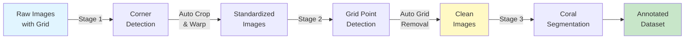
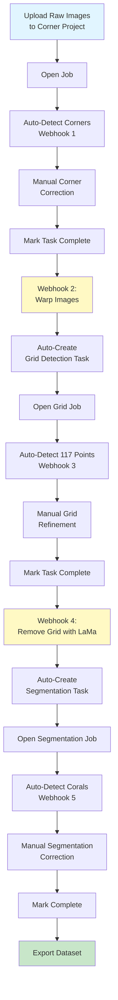

# Guide C: Three-Stage CRIOBE Setup

Learn how to process raw quadrat images with grid overlays through the complete four-stage pipeline: corner detection, grid pose detection, grid removal, and coral segmentation.

## Introduction

This guide demonstrates the **most comprehensive pipeline workflow** used for the CRIOBE coral dataset. It handles raw underwater quadrat images with grid overlays, requiring all preprocessing stages before annotation.

### Use Case

**When to use this guide:**

- Raw underwater quadrat photos with visible grid overlays
- Images taken at angles requiring perspective correction
- Grid lines that must be removed before coral segmentation
- Need for fully automated end-to-end processing pipeline
- Highest quality standardized output for scientific analysis

**Examples of suitable images:**

- Underwater quadrat photographs from CRIOBE monitoring stations
- Images with PVC grid frames overlaying the coral
- Photos where both quadrat corners and grid intersections are visible
- Standard 9x9 grid (117 intersection points) or similar regular grids

### Pipeline Overview



**Stage 1**: Detect 4 quadrat corners → automatically crop and warp images

**Stage 2**: Detect 117 grid intersection points on warped images

**Stage 3**: Automatically remove grid using LaMa inpainting → clean coral images

**Stage 4**: Annotate coral genera on clean images

### What You'll Learn

- Create four interconnected CVAT projects with different label configurations
- Deploy four Nuclio functions for each pipeline stage
- Configure a complete webhook automation chain
- Monitor and debug multi-stage pipelines
- Implement quality control checkpoints at each stage
- Export and organize multi-stage datasets

### Expected Outcome

- Four CVAT projects working together as an automated pipeline
- Raw images automatically processed through all stages
- High-quality grid-removed images ready for annotation
- Complete annotated coral dataset for training
- Understanding of complex workflow orchestration

### Time Required

- **Initial setup**: ~2 hours (first time)
- **Per-image processing**: ~8-12 minutes total
    - Stage 1 (corners): ~2 min
    - Stage 2 (grid): ~3 min
    - Stage 3 (removal): ~automatic (5-8 sec per image)
    - Stage 4 (segmentation): ~3-5 min correction

## Prerequisites

Before starting, ensure you have:

- [x] CVAT instance running with admin access
- [x] **Nuclio serverless platform** deployed and functional
- [x] **Bridge service** running and connected to CVAT network
- [x] Raw quadrat images with visible grid overlays
- [x] Sufficient disk space (processed images ~3x original dataset size)
- [x] Completed [Guide B](2-two-stage-banggai.md) (highly recommended for webhook understanding)

!!! warning "Bridge Service is Essential"
    This guide relies heavily on the Bridge service for automation. Verify it's properly configured:

    ```bash
    # Check bridge container
    docker ps | grep bridge

    # Verify bridge can reach CVAT
    docker exec -it bridge curl http://cvat_server:8080

    # Test bridge API
    curl http://localhost:8000/health
    # Should return {"status": "healthy"}

    # Check bridge logs
    docker logs -f bridge
    ```

## Stage 1: Corner Detection and Image Warping

### Step 1.1: Create CVAT Project for Corners

1. Log in to CVAT at `http://localhost:8080`
2. Navigate to **Projects** → Click **+**
3. Enter project details:
    - **Name**: `criobe_corner_annotation`
    - **Description**: "Quadrat corner detection for CRIOBE dataset (Stage 1 of 4)"

### Step 1.2: Configure Corner Labels

Click the **Raw** tab in label configuration and paste:

```json
[
  {
    "name": "corner",
    "color": "#ff0000",
    "attributes": [],
    "type": "points"
  }
]
```

Click **Continue** to create the project.

!!! info "4-Point Skeleton Structure"
    When annotating, create exactly 4 points in clockwise order:

    1. Top-left corner
    2. Top-right corner
    3. Bottom-right corner
    4. Bottom-left corner

    CVAT will automatically create edges connecting them as a quadrilateral skeleton.

### Step 1.3: Upload Raw Quadrat Images

1. In `criobe_corner_annotation`, click **Create a new task**
2. Configure task:
    - **Name**: `moorea_2023_batch_01` (use descriptive names with location/year)
    - **Subset**: `train` (or `val`/`test`)
3. **Upload images**: Select raw quadrat photos with grid overlays
4. Click **Submit**

!!! tip "Image Naming Convention for CRIOBE"
    Use the format: `{site}_{year}_{quadrat_id}.jpg`

    Examples:
    - `MooreaE2B_2020_05.jpg` → Moorea Entre 2 Baies, 2020, quadrat 5
    - `Tikehau_2023_15.jpg` → Tikehau, 2023, quadrat 15

    This enables automatic metadata extraction for area, year, and quadrat number.

### Step 1.4: Deploy GridCorners Model

```bash
# Navigate to grid pose detection module
cd /home/taiamiti/Projects/criobe/grid_pose_detection

# Activate environment
pixi shell -e grid-pose

# Navigate to deployment directory
cd deploy/pth-yolo-gridcorners

# Run deployment script
./deploy_as_zip.sh

# Deploy to Nuclio
nuctl deploy --project-name cvat \
    --path ./nuclio \
    --platform local \
    --verbose
```

**Verify deployment:**

```bash
# Check function status
nuctl get functions --platform local | grep gridcorners

# Expected output:
# pth-yolo-gridcorners  ready  http://:8001  ...

# Test function
cd /home/taiamiti/Projects/criobe/grid_pose_detection/deploy/pth-yolo-gridcorners
curl -X POST http://localhost:8001 \
    -H "Content-Type: application/json" \
    -d @test_payload.json
```

### Step 1.5: Configure Detection Webhook

1. In CVAT, navigate to `criobe_corner_annotation` project
2. Click **Actions** → **Webhooks** → **Create webhook**
3. Configure:
    - **Target URL**: `http://bridge:8000/detect-model-webhook?model_name=pth-yolo-gridcorners&conv_mask_to_poly=false`
    - **Description**: "Auto-detect quadrat corners (Stage 1)"
    - **Events**: Check **"When a job state is changed to 'in progress'"**
    - **Content type**: `application/json`
    - **Enable SSL verification**: Uncheck
4. Click **Submit**

### Step 1.6: Semi-Automatic Corner Detection

1. Open a job in your corner detection task
2. Webhook triggers automatically, running corner detection
3. Wait 5-10 seconds, then refresh (`F5`)
4. Four corner points should appear!

**Manual correction:**

- Verify all 4 corners are detected
- Drag points to exact corner positions
- Ensure clockwise order: TL → TR → BR → BL
- Delete duplicates if model detected extras
- Save with `Ctrl+S`

!!! warning "Critical: Corner Order"
    Incorrect corner order will produce distorted warped images! Always verify clockwise ordering starting from top-left.

### Step 1.7: Complete Corner Detection

Once all images have correct corner annotations:

1. Review entire task
2. Click **Menu** → **Finish the job**
3. Mark task as **Completed** in project view

## Stage 2: Grid Pose Detection

### Step 2.1: Create CVAT Project for Grid Detection

1. Create new project in CVAT
2. Enter details:
    - **Name**: `criobe_grid_annotation`
    - **Description**: "117-point grid detection for CRIOBE dataset (Stage 2 of 4)"

### Step 2.2: Configure Grid Point Labels

This is the most complex label configuration. Click **Raw** tab and paste:

```json
[
  {
    "name": "grid_point",
    "color": "#00ff00",
    "attributes": [],
    "type": "points"
  }
]
```

!!! info "117-Point Grid Skeleton"
    The CRIOBE quadrat uses a standard 9×13 grid (117 intersection points). When the model runs, it will:

    - Detect all 117 grid intersections
    - Create a skeleton connecting adjacent points
    - Numbered from top-left to bottom-right

    The grid template is stored in `grid_pose_detection/assets/kp_template_gridpose.npy`.

### Step 2.3: Configure Automatic Task Creation from Stage 1

Now configure the **bridge webhook** to automatically warp images and create grid detection tasks when corner detection is complete.

1. Return to `criobe_corner_annotation` project
2. Click **Actions** → **Webhooks** → **Create webhook** (second webhook)
3. Configure:
    - **Target URL**: `http://bridge:8000/crop-quadrat-and-create-new-task-webhook?target_proj_id={GRID_PROJECT_ID}`
    - **Description**: "Auto-warp and create grid detection tasks (Stage 1 → 2)"
    - **Events**: Check **"When a task status is changed to 'completed'"**
    - **Content type**: `application/json`

**To find `{GRID_PROJECT_ID}`:**

1. Navigate to `criobe_grid_annotation` project
2. Check URL: `http://localhost:8080/projects/{PROJECT_ID}`
3. Copy the ID (e.g., `8`)
4. Update webhook URL: `http://bridge:8000/crop-quadrat-and-create-new-task-webhook?target_proj_id=8`

Click **Submit**.

### Step 2.4: Trigger Automatic Warping

Your corner detection task should already be marked **Completed** from Step 1.7. The webhook triggers automatically.

**Monitor the process:**

```bash
# Watch bridge logs in real-time
docker logs -f bridge
```

Expected output:
```
INFO: Webhook received: task completion for task_id=45
INFO: Fetching corner annotations from CVAT...
INFO: Found 4 corners for 25 images
INFO: Applying perspective transformation...
INFO: Warping image 1/25: MooreaE2B_2020_05.jpg
INFO: Warping image 2/25: MooreaE2B_2020_06.jpg
...
INFO: Uploading warped images to CVAT...
INFO: Creating task in project 8: moorea_2023_batch_01_warped
INFO: Task created successfully with ID: 46
```

**Verify:**

1. Navigate to `criobe_grid_annotation` project
2. You should see new task(s) with warped images automatically created!

!!! success "Stage 1 → 2 Automation Complete"
    The bridge just automatically:

    - Downloaded corner annotations
    - Warped all images to standardized perspective
    - Uploaded warped images to grid detection project
    - Created new tasks with preserved metadata

### Step 2.5: Deploy GridPose Model

```bash
cd /home/taiamiti/Projects/criobe/grid_pose_detection/deploy/pth-yolo-gridpose

./deploy_as_zip.sh

nuctl deploy --project-name cvat \
    --path ./nuclio \
    --platform local \
    --verbose
```

**Verify:**

```bash
nuctl get functions --platform local | grep gridpose
# pth-yolo-gridpose  ready  http://:8002  ...
```

### Step 2.6: Configure Grid Detection Webhook

1. Navigate to `criobe_grid_annotation` project
2. **Actions** → **Webhooks** → **Create webhook**
3. Configure:
    - **Target URL**: `http://bridge:8000/detect-model-webhook?model_name=pth-yolo-gridpose&conv_mask_to_poly=false`
    - **Description**: "Auto-detect 117 grid points (Stage 2)"
    - **Events**: Check **"When a job state is changed to 'in progress'"**
    - **Content type**: `application/json`
4. Click **Submit**

### Step 2.7: Semi-Automatic Grid Detection

1. Open a job in the auto-created grid detection task
2. Model runs automatically (detecting 117 points)
3. Wait 10-15 seconds, then refresh (`F5`)
4. All 117 grid intersection points should appear!

**Manual refinement:**

- **Check point count**: Should be exactly 117 points
- **Verify grid structure**: Points should form a regular 9×13 grid
- **Adjust positions**: Drag individual points to exact intersection locations
- **Check ordering**: Points should be numbered top-left to bottom-right
- **Delete extras**: Remove any duplicate or misdetected points
- **Add missing points**: Manually add if model missed any intersections

!!! tip "Grid Detection Quality Tips"
    - Zoom in to 200-300% for precise point placement
    - Grid should be perfectly regular (equal spacing)
    - Pay special attention to edge points (easiest to miss)
    - Use keyboard `Del` to remove selected points quickly

### Step 2.8: Complete Grid Detection

1. Verify all images have 117 correctly positioned grid points
2. Click **Menu** → **Finish the job**
3. Mark task as **Completed**

## Stage 3: Automated Grid Removal

### Step 3.1: Create CVAT Project for Clean Images

1. Create new project
2. Enter details:
    - **Name**: `criobe_clean_images`
    - **Description**: "Grid-removed images for CRIOBE dataset (Stage 3 of 4)"

!!! info "No Labels Needed"
    This project doesn't require any label configuration because it's an **intermediate processing stage**. The LaMa inpainting model will automatically remove grids using keypoints from Stage 2.

### Step 3.2: Deploy LaMa Inpainting Model

```bash
cd /home/taiamiti/Projects/criobe/grid_inpainting/deploy

./deploy_as_zip.sh

nuctl deploy --project-name cvat \
    --path ./pth-lama-nuclio \
    --platform local \
    --verbose
```

**Verify:**

```bash
nuctl get functions --platform local | grep lama
# pth-lama  ready  http://:8003  ...

# Test function
curl -X POST http://localhost:8003 \
    -H "Content-Type: application/json" \
    -d @test_payload.json
```

### Step 3.3: Configure Grid Removal Webhook

Now configure automatic grid removal when grid detection tasks complete.

**Find the segmentation project ID first** (we'll create it in next section, but note the ID):

1. Navigate to CVAT Projects
2. Note the next available project ID (usually incremental)
3. You can create the segmentation project now (Step 4.1) or come back to update this webhook later

**Configure webhook on grid detection project:**

1. Return to `criobe_grid_annotation` project
2. **Actions** → **Webhooks** → **Create webhook** (second webhook)
3. Configure:
    - **Target URL**: `http://bridge:8000/remove-grid-and-create-new-task-webhook?target_proj_id={SEGMENTATION_PROJECT_ID}`
    - **Description**: "Auto-remove grid and create segmentation tasks (Stage 2 → 4)"
    - **Events**: Check **"When a task status is changed to 'completed'"**
    - **Content type**: `application/json`
4. Replace `{SEGMENTATION_PROJECT_ID}` with actual ID
5. Click **Submit**

!!! warning "Update Webhook After Creating Segmentation Project"
    If you don't know the segmentation project ID yet:

    1. Create a placeholder webhook with `target_proj_id=999`
    2. Create the segmentation project (Step 4.1)
    3. Return here and **Edit** the webhook to update the correct project ID

### Step 3.4: Trigger Automatic Grid Removal

Your grid detection task should be marked **Completed** from Step 2.8. The webhook triggers automatically.

**Monitor grid removal:**

```bash
docker logs -f bridge
```

Expected output:
```
INFO: Webhook received: task completion for task_id=46
INFO: Fetching grid pose annotations (117 points per image)...
INFO: Calling LaMa inpainting function...
INFO: Processing image 1/25: MooreaE2B_2020_05_warped.jpg
INFO: Generating grid mask from 117 keypoints...
INFO: Running LaMa inpainting (CUDA)...
INFO: Grid removed from image 1/25 (8.3s)
...
INFO: Uploading clean images to CVAT project 10...
INFO: Created task: moorea_2023_batch_01_clean
```

!!! info "LaMa Processing Time"
    Grid removal takes ~5-8 seconds per image using GPU. For a batch of 25 images, expect 2-3 minutes total processing time.

**Verify clean images:**

1. Navigate to segmentation project (or `criobe_clean_images` if you created it as intermediate)
2. Open the auto-created task
3. Verify grid lines are completely removed
4. Check image quality (no artifacts, coral details preserved)

!!! success "Stage 2 → 4 Automation Complete"
    The bridge just:

    - Downloaded 117 grid points per image
    - Generated grid line masks
    - Applied LaMa inpainting to remove grids
    - Created clean images ready for segmentation
    - Uploaded to final segmentation project

## Stage 4: Coral Segmentation

### Step 4.1: Create CVAT Project for Segmentation

1. Create new project
2. Enter details:
    - **Name**: `criobe_finegrained_annotated`
    - **Description**: "Coral segmentation on clean images - CRIOBE finegrained taxonomy (16 genera)"

### Step 4.2: Configure Coral Genus Labels

Click **Raw** tab and paste the complete 16-genera configuration:

```json
[
  {
    "name": "Acanthastrea",
    "color": "#ff0000",
    "attributes": [],
    "type": "polygon"
  },
  {
    "name": "Acropora",
    "color": "#00ff00",
    "attributes": [],
    "type": "polygon"
  },
  {
    "name": "Astreopora",
    "color": "#0000ff",
    "attributes": [],
    "type": "polygon"
  },
  {
    "name": "Atrea",
    "color": "#ffff00",
    "attributes": [],
    "type": "polygon"
  },
  {
    "name": "Fungia",
    "color": "#ff00ff",
    "attributes": [],
    "type": "polygon"
  },
  {
    "name": "Goniastrea",
    "color": "#00ffff",
    "attributes": [],
    "type": "polygon"
  },
  {
    "name": "Leptastrea",
    "color": "#ff8000",
    "attributes": [],
    "type": "polygon"
  },
  {
    "name": "Merulinidae",
    "color": "#8000ff",
    "attributes": [],
    "type": "polygon"
  },
  {
    "name": "Millepora",
    "color": "#00ff80",
    "attributes": [],
    "type": "polygon"
  },
  {
    "name": "Montastrea",
    "color": "#ff0080",
    "attributes": [],
    "type": "polygon"
  },
  {
    "name": "Montipora",
    "color": "#80ff00",
    "attributes": [],
    "type": "polygon"
  },
  {
    "name": "Other",
    "color": "#808080",
    "attributes": [],
    "type": "polygon"
  },
  {
    "name": "Pavona/Leptoseris",
    "color": "#ff8080",
    "attributes": [],
    "type": "polygon"
  },
  {
    "name": "Pocillopora",
    "color": "#8080ff",
    "attributes": [],
    "type": "polygon"
  },
  {
    "name": "Porites",
    "color": "#80ff80",
    "attributes": [],
    "type": "polygon"
  },
  {
    "name": "Psammocora",
    "color": "#ff80ff",
    "attributes": [],
    "type": "polygon"
  }
]
```

Click **Continue**.

!!! info "CRIOBE Finegrained Taxonomy"
    This 16-genera classification is used for scientific monitoring at CRIOBE research stations. For different taxonomies, see [Label Templates Reference](../reference/cvat-label-templates.md).

### Step 4.3: Verify Automatic Task Creation

If you configured the webhook correctly in Step 3.3, tasks should already be created here with grid-removed images!

If not created automatically:

1. Go back to Step 3.3 and verify webhook configuration
2. Manually trigger by marking grid detection task as "in progress" then "completed" again

### Step 4.4: Deploy Coral Segmentation Model

```bash
cd /home/taiamiti/Projects/criobe/coral_seg_yolo/deploy/pth-yolo-coralsegv4

./deploy_as_zip.sh

nuctl deploy --project-name cvat \
    --path ./nuclio \
    --platform local \
    --verbose
```

**Verify:**

```bash
nuctl get functions --platform local | grep coralseg
# pth-yolo-coralsegv4  ready  http://:8004  ...
```

### Step 4.5: Configure Segmentation Detection Webhook

1. Navigate to `criobe_finegrained_annotated` project
2. **Actions** → **Webhooks** → **Create webhook**
3. Configure:
    - **Target URL**: `http://bridge:8000/detect-model-webhook?model_name=pth-yolo-coralsegv4&conv_mask_to_poly=true`
    - **Description**: "Auto-detect coral instances (Stage 4)"
    - **Events**: Check **"When a job state is changed to 'in progress'"**
    - **Content type**: `application/json`
4. Click **Submit**

### Step 4.6: Semi-Automatic Coral Segmentation

1. Open a job in segmentation task
2. Model runs automatically, creating polygon annotations in CVAT
3. Wait 15-30 seconds (depends on coral density), then refresh
4. Coral polygons should appear!

**Manual correction workflow:**

- **Check for missed corals**: Scan entire image, add missing colonies
- **Correct boundaries**: Adjust polyline vertices to match coral edges precisely
- **Fix genus labels**: Change misclassified corals to correct genus
- **Delete false positives**: Remove annotations on rocks, sand, or artifacts
- **Split merged colonies**: Delete merged shapes, draw separate polylines
- **Quality check**: Ensure all corals >2cm diameter are annotated

For detailed correction techniques, see [Guide A, Step 4.5](1-single-stage-segmentation.md#45-manual-correction-workflow).

### Step 4.7: Complete Segmentation

1. Review and correct all images
2. Click **Menu** → **Finish the job**
3. Mark task as **Completed**

## Complete Pipeline Automation

### End-to-End Workflow Summary

Here's how the complete four-stage pipeline works once configured:



### Webhook Configuration Summary

You should have configured **5 webhooks total** across 3 projects:

| Project | Webhook | Trigger | Action |
|---------|---------|---------|--------|
| `criobe_corner_annotation` | 1 | Job → In Progress | Auto-detect corners (GridCorners model) |
| `criobe_corner_annotation` | 2 | Task → Completed | Warp images + create grid detection tasks |
| `criobe_grid_annotation` | 3 | Job → In Progress | Auto-detect 117 grid points (GridPose model) |
| `criobe_grid_annotation` | 4 | Task → Completed | Remove grid with LaMa + create segmentation tasks |
| `criobe_finegrained_annotated` | 5 | Job → In Progress | Auto-detect corals (YOLO segmentation model) |

### Monitoring and Debugging

**Check webhook executions:**

1. In CVAT, navigate to any project with webhooks
2. **Actions** → **Webhooks** → Click on a webhook
3. View **Recent Deliveries** tab to see execution history

**Monitor bridge service:**

```bash
# Real-time logs
docker logs -f bridge

# Recent errors
docker logs bridge | grep ERROR

# Check webhook processing
docker logs bridge | grep "Webhook received"
```

**Verify Nuclio functions:**

```bash
# Check all function statuses
nuctl get functions --platform local

# View specific function logs
nuctl get logs pth-yolo-gridcorners --platform local

# Check function metrics
curl http://localhost:8070/api/functions
```

**Test webhooks manually:**

```bash
# Test corner detection
curl -X POST "http://localhost:8000/detect-model-webhook?model_name=pth-yolo-gridcorners&conv_mask_to_poly=false" \
    -H "Content-Type: application/json" \
    -d '{"job_id": 123}'

# Test image warping
curl -X POST "http://localhost:8000/crop-quadrat-and-create-new-task-webhook?target_proj_id=8" \
    -H "Content-Type: application/json" \
    -d '{"task_id": 45}'

# Test grid removal
curl -X POST "http://localhost:8000/remove-grid-and-create-new-task-webhook?target_proj_id=10" \
    -H "Content-Type: application/json" \
    -d '{"task_id": 46}'
```

### Quality Control Checkpoints

Implement QA at each stage:

**Stage 1 Quality Checks:**
- [ ] All 4 corners detected per image
- [ ] Corner order is clockwise (TL → TR → BR → BL)
- [ ] Corner positions are accurate (within 5 pixels of actual corners)
- [ ] No missing or duplicate corners

**Stage 2 Quality Checks:**
- [ ] Warped images are properly cropped to quadrat boundaries
- [ ] No perspective distortion (grid should appear rectangular)
- [ ] Image resolution preserved
- [ ] All 117 grid points detected
- [ ] Grid points form regular 9×13 pattern
- [ ] Point positions accurate (within 3 pixels of intersections)

**Stage 3 Quality Checks:**
- [ ] Grid lines completely removed
- [ ] No visible artifacts or blur
- [ ] Coral textures preserved
- [ ] Image brightness consistent
- [ ] No edge effects or black regions

**Stage 4 Quality Checks:**
- [ ] All visible coral colonies annotated (>2cm diameter)
- [ ] Polylines follow colony boundaries accurately
- [ ] Genus labels correct (or "Other" if uncertain)
- [ ] No false positives on background
- [ ] Overlapping corals separated into individual instances

## Data Export and Preparation

### Pull All Projects from CVAT

```bash
cd /home/taiamiti/Projects/criobe/data_engineering
pixi shell

# Pull corner annotations (optional, for records)
python create_fiftyone_dataset.py \
    --cvat-project-name "criobe_corner_annotation" \
    --dataset-name "criobe_corners_fo"

# Pull grid annotations (optional, for training grid detection)
python create_fiftyone_dataset.py \
    --cvat-project-name "criobe_grid_annotation" \
    --dataset-name "criobe_grid_fo"

# Pull final segmentation dataset (main dataset)
python create_fiftyone_dataset.py \
    --cvat-project-name "criobe_finegrained_annotated" \
    --dataset-name "criobe_finegrained_fo"
```

### Organize Multi-Stage Dataset

The FiftyOne datasets now contain:

- **criobe_corners_fo**: Raw images + 4-point corner annotations
- **criobe_grid_fo**: Warped images + 117-point grid annotations
- **criobe_finegrained_fo**: Clean images + coral annotations (FiftyOne polylines from CVAT polygons)

**Verify in FiftyOne app:**

```bash
# View segmentation dataset
fiftyone app launch criobe_finegrained_fo

# Compare across stages
fiftyone app launch criobe_corners_fo criobe_grid_fo criobe_finegrained_fo
```

### Prepare for Training

**For YOLO segmentation training:**

```bash
cd /home/taiamiti/Projects/criobe/coral_seg_yolo
pixi shell -e coral-seg-yolo-dev

python src/prepare_data.py \
    --dataset-name criobe_finegrained_fo \
    --output-dir data/prepared_for_training/criobe_finegrained
```

**For MMSeg segmentation training:**

```bash
cd /home/taiamiti/Projects/criobe/DINOv2_mmseg
pixi shell -e dinov2-mmseg

python prepare_data.py \
    --dataset-name criobe_finegrained_fo \
    --output-dir data/prepared_for_training/criobe_finegrained
```

**For grid detection training (if retraining models):**

```bash
cd /home/taiamiti/Projects/criobe/grid_pose_detection
pixi shell -e grid-pose-dev

# Prepare corner detection data
python src/prepare_data.py \
    --task gridcorners \
    --dataset criobe_corners_fo \
    --output-dir data/prepared_for_training/gridcorners

# Prepare grid pose data
python src/prepare_data.py \
    --task gridpose \
    --dataset criobe_grid_fo \
    --output-dir data/prepared_for_training/gridpose
```

## Troubleshooting

??? question "Webhook chain breaks at some stage"
    **Symptoms:** Automation stops after Stage 1 or Stage 2

    **Debug steps:**

    1. Check bridge logs for errors:
       ```bash
       docker logs bridge | tail -100
       ```

    2. Verify webhook configurations in CVAT (check target URLs and events)

    3. Test bridge endpoints manually:
       ```bash
       curl http://localhost:8000/health
       curl http://localhost:8000/docs  # View API documentation
       ```

    4. Ensure task status is exactly "completed" (not "validation" or other states)

    5. Check network connectivity:
       ```bash
       docker exec -it bridge ping cvat_server
       docker exec -it bridge curl http://cvat_server:8080/api/projects
       ```

??? question "Grid removal produces artifacts or incomplete removal"
    **Possible causes:**

    - Grid points not accurately positioned
    - Grid pattern differs from training data
    - LaMa model needs fine-tuning
    - Image resolution too low

    **Solutions:**

    1. Re-check grid point positions in Stage 2 (must be very precise!)

    2. Increase grid line mask width in bridge configuration

    3. Consider fine-tuning LaMa on your specific grid pattern:
       ```bash
       cd /home/taiamiti/Projects/criobe/grid_inpainting
       # See README.md for fine-tuning instructions
       ```

    4. Manually review and correct problematic images

??? question "Warped images are distorted or rotated"
    **Possible causes:**

    - Corner order is wrong (not clockwise)
    - Corner positions inaccurate
    - Missing corners

    **Solutions:**

    1. Return to Stage 1 corner detection task
    2. Verify corner order: TL (0) → TR (1) → BR (2) → BL (3)
    3. Ensure corners are at exact quadrat frame positions
    4. Re-complete the task to trigger warping again

??? question "Model detection webhook times out or fails"
    **Check:**

    1. Nuclio function is running:
       ```bash
       nuctl get functions --platform local
       ```

    2. Function has sufficient resources (GPU available):
       ```bash
       nvidia-smi  # Check GPU usage
       ```

    3. Bridge can reach Nuclio functions:
       ```bash
       docker exec -it bridge curl http://pth-yolo-gridcorners:8080
       ```

    4. Webhook timeout settings (increase if needed in CVAT webhook config)

??? question "Tasks created in wrong project"
    **Cause:** Incorrect `target_proj_id` in webhook URL

    **Fix:**

    1. Find correct project ID from CVAT URL
    2. Edit webhook configuration in CVAT
    3. Update `target_proj_id` parameter
    4. Re-trigger by marking source task as "in progress" then "completed"

??? question "FiftyOne dataset pull fails or is incomplete"
    **Check:**

    1. All tasks marked as "completed"
    2. CVAT credentials correct in `.env`:
       ```bash
       cat /home/taiamiti/Projects/criobe/data_engineering/.env
       ```

    3. Project name exactly matches:
       ```python
       from cvat_sdk import make_client
       client = make_client(host="http://localhost:8080", credentials=("admin", "password"))
       projects = client.projects.list()
       print([p.name for p in projects])
       ```

    4. Retry with verbose logging:
       ```bash
       python create_fiftyone_dataset.py \
           --cvat-project-name "criobe_finegrained_annotated" \
           --dataset-name "criobe_finegrained_fo" \
           --verbose
       ```

## Batch Processing at Scale

For large-scale dataset creation:

### Parallel Processing Strategy

1. **Create multiple tasks per stage** (batches of 20-50 images)
2. **Process all Stage 1 tasks first** (complete all corner detection)
3. **Wait for all Stage 2 tasks to be created** automatically
4. **Process all Stage 2 tasks** (complete all grid detection)
5. **Wait for automatic grid removal** (may take time)
6. **Process all Stage 4 tasks** (complete all segmentation)

### Optimization Tips

**For faster processing:**

- Use GPU with sufficient VRAM (16GB+ recommended for batch processing)
- Increase Nuclio function replicas for parallel execution
- Process tasks in parallel (open multiple CVAT browser tabs)
- Pre-load models to reduce cold-start time

**For quality:**

- Have dedicated QA person review each stage
- Create quality control checklists
- Use CVAT task assignment features for team annotation
- Regular calibration sessions to ensure consistent annotation standards

## Next Steps

Congratulations! You've mastered the complete CRIOBE pipeline. You now have:

- ✅ Four interconnected CVAT projects
- ✅ Complete webhook automation chain
- ✅ Semi-automatic processing at every stage
- ✅ High-quality grid-removed coral images
- ✅ Annotated dataset ready for training

### Continue Learning

**Train models on your dataset:**

- [YOLO Segmentation Training](../training-and-deployment/yolo-segmentation.md) - Fast inference
- [MMSeg Segmentation Training](../training-and-deployment/mmseg-segmentation.md) - Maximum accuracy
- [Grid Detection Training](../training-and-deployment/grid-detection.md) - Custom grid patterns
- [Grid Removal Training](../training-and-deployment/grid-removal.md) - Fine-tune LaMa

**Deploy trained models:**

- [Model Deployment Guide](../training-and-deployment/model-deployment.md) - Nuclio deployment for all modules

### Advanced Topics

- **Custom grid templates**: Adapt to different grid sizes (e.g., 7×7, 11×11)
- **Multi-site datasets**: Merge annotations from different locations
- **Temporal analysis**: Track coral changes across years
- **Hierarchical taxonomies**: Train models on extended or main family classifications

## Reference Materials

- [CVAT Label Templates](../reference/cvat-label-templates.md) - All configurations
- [Webhook Configuration Reference](../reference/cvat-label-templates.md#webhook-configurations)
- [Bridge Service API Documentation](http://localhost:8000/docs) - When bridge is running
- [Nuclio Function Documentation](http://localhost:8070) - Dashboard when deployed

### Module Documentation

For detailed technical information on each stage:

- **Stage 1 & 2**: [grid_pose_detection/README.md](https://github.com/taiamiti/criobe/grid_pose_detection/README.md)
- **Stage 3**: [grid_inpainting/README.md](https://github.com/taiamiti/criobe/grid_inpainting/README.md)
- **Stage 4 (YOLO)**: [coral_seg_yolo/README.md](https://github.com/taiamiti/criobe/coral_seg_yolo/README.md)
- **Stage 4 (MMSeg)**: [DINOv2_mmseg/README.md](https://github.com/taiamiti/criobe/DINOv2_mmseg/README.md)
- **Bridge Service**: [bridge/README.md](https://github.com/taiamiti/criobe/bridge/README.md)

---

**Back to**: [Two-Stage Guide](2-two-stage-banggai.md) · [Data Preparation Overview](index.md)
