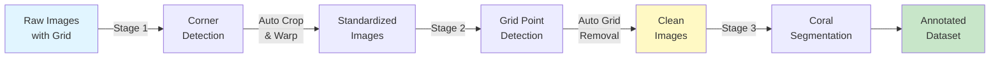

# Guide C: Three-Stage CRIOBE Setup

Learn how to process raw quadrat images with grid overlays through the complete four-stage pipeline: corner detection, grid pose detection, grid removal, and coral segmentation.

## Introduction

This guide demonstrates the **most comprehensive pipeline workflow** used for the CRIOBE coral dataset. It handles raw underwater quadrat images with grid overlays, requiring all preprocessing stages before annotation.

### Use Case

**When to use this guide:**

- Raw underwater quadrat photos with visible grid overlays
- Images taken at angles requiring perspective correction
- Grid lines that must be removed before coral segmentation
- Need for fully automated end-to-end processing pipeline
- Highest quality standardized output for scientific analysis

**Examples of suitable images:**

- Underwater quadrat photographs from CRIOBE monitoring stations
- Images with PVC grid frames overlaying the coral
- Photos where both quadrat corners and grid intersections are visible
- Standard 9x9 grid (117 intersection points) or similar regular grids

### Pipeline Overview



**Stage 1**: Detect 4 quadrat corners → automatically crop and warp images

**Stage 2**: Detect 117 grid intersection points on warped images

**Stage 3**: Automatically remove grid using LaMa inpainting → clean coral images

**Stage 4**: Annotate coral genera on clean images

!!! info "4 Stages, 3 CVAT Projects"
    This is a **four-stage pipeline** that requires only **three CVAT projects**:

    - **Stage 1** uses `criobe_corner_annotation` project
    - **Stage 2** uses `criobe_grid_annotation` project
    - **Stage 3** is fully automatic (no CVAT project needed)
    - **Stage 4** uses `criobe_finegrained_annotated` project

    Stage 3 (grid removal) runs automatically via webhook when Stage 2 completes, requiring no manual annotation work.

### What You'll Learn

- Create three CVAT projects for the four-stage pipeline (Stage 3 is automatic)
- Deploy four Nuclio functions for each pipeline stage
- Configure a complete webhook automation chain
- Monitor and debug multi-stage pipelines
- Implement quality control checkpoints at each stage
- Export and organize multi-stage datasets

### Expected Outcome

- Three CVAT projects working together as a four-stage automated pipeline
- Raw images automatically processed through all stages
- High-quality grid-removed images ready for annotation
- Complete annotated coral dataset for training
- Understanding of complex workflow orchestration

### Time Required

- **Initial setup**: ~2 hours (first time)
- **Per-image processing**: ~8-12 minutes total
    - Stage 1 (corners): ~2 min
    - Stage 2 (grid): ~3 min
    - Stage 3 (removal): ~automatic (5-8 sec per image)
    - Stage 4 (segmentation): ~3-5 min correction

## Prerequisites

!!! warning "Critical: Complete Setup First"
    This guide requires ALL CVAT projects and ALL webhooks to be configured BEFORE uploading any images. The pipeline uses 5 webhooks that automatically create tasks in downstream projects, so ALL projects must exist before configuring ANY webhooks.

    **You must complete the full setup configuration before beginning annotation work.**

### Required Setup Steps

You must complete these setup guides in order:

1. **[CVAT Projects Configuration](../../setup/configuration/for-end-users/1-cvat-projects.md)**

    Create and configure **3 projects** with proper labels:

    - **Project 1: Corner Detection** - Follow the "Corner Detection" section to create `criobe_corner_annotation` with 4-point skeleton labels
    - **Project 2: Grid Detection** - Follow the "Grid Detection" section to create `criobe_grid_annotation` with 117 grid point labels
    - **Project 3: Coral Segmentation** - Follow the "Coral Segmentation" section to create `criobe_finegrained_annotated` with 16 coral genera polygon labels

2. **[Webhooks Setup](../../setup/configuration/for-end-users/2-webhooks-setup.md)**

    Configure **5 webhooks** across projects after all projects exist:

    - **Webhook 1** (on Corner Detection project): Model detection webhook for auto-detecting corners
    - **Webhook 2** (on Corner Detection project): Task completion webhook for automatic image warping and grid task creation
    - **Webhook 3** (on Grid Detection project): Model detection webhook for auto-detecting 117 grid points
    - **Webhook 4** (on Grid Detection project): Task completion webhook for automatic grid removal and segmentation task creation
    - **Webhook 5** (on Coral Segmentation project): Model detection webhook for auto-segmenting corals

3. **[Workflow Testing](../../setup/configuration/for-end-users/3-workflow-testing.md)**

    Verify the complete automation pipeline works end-to-end through all four stages.

### Setup Checklist

Before starting annotation workflow, verify you have:

- [x] **CVAT instance** running with admin access
- [x] **Nuclio serverless platform** deployed and functional
- [x] **Bridge service** running and connected to CVAT network
- [x] **3 CVAT projects created and configured**:
    - `criobe_corner_annotation` (Stage 1: corner detection)
    - `criobe_grid_annotation` (Stage 2: grid detection)
    - `criobe_finegrained_annotated` (Stage 4: coral segmentation)
- [x] **5 webhooks configured across projects**:
    - Corner project: Model detection + task completion webhooks
    - Grid project: Model detection + task completion webhooks
    - Segmentation project: Model detection webhook
- [x] **4 Nuclio models deployed**:
    - `pth-yolo-gridcorners` (corner detection)
    - `pth-yolo-gridpose` (grid point detection)
    - `pth-lama` (grid removal/inpainting)
    - `pth-yolo-coralsegv4` (coral segmentation)
- [x] Raw quadrat images with visible grid overlays
- [x] Sufficient disk space (processed images ~3x original dataset size)
- [x] Completed [Guide B](2-two-stage-banggai.md) (highly recommended for webhook understanding)

!!! tip "Quick Setup Verification"
    Before proceeding, verify your setup:

    ```bash
    # Check Bridge service
    docker ps | grep bridge
    docker exec -it bridge curl http://cvat_server:8080
    curl http://localhost:8000/health
    # Should return {"status": "healthy"}

    # Check all Nuclio functions deployed
    nuctl get functions --platform local | grep -E "(gridcorners|gridpose|lama|coralsegv4)"
    # All 4 functions should show STATE: ready

    # Check CVAT projects exist
    # Navigate to http://localhost:8080/projects
    # Verify all 3 projects are listed with correct IDs

    # Monitor Bridge logs in separate terminal
    docker logs -f bridge
    ```

## Pipeline Configuration Reference

This section summarizes the configuration needed for this four-stage pipeline. **Detailed setup instructions are in the [setup guides](../../setup/configuration/for-end-users/1-cvat-projects.md)** - you should have already completed those before reaching this point.

### Project Summary

This pipeline requires 3 CVAT projects (configured in [CVAT Projects guide](../../setup/configuration/for-end-users/1-cvat-projects.md)):

| Stage | Project Name | Label Type | Setup Guide Section | Purpose |
|-------|--------------|------------|---------------------|---------|
| 1 | `criobe_corner_annotation` | Skeleton (4 points) | "Project 1: Corner Detection" | Detect quadrat corners for perspective correction |
| 2 | `criobe_grid_annotation` | Points (117 total) | "Project 2: Grid Detection" | Detect grid intersection points (9×13 grid) |
| 3 (automatic) | N/A - Grid removal processing | N/A | N/A | Automatic grid removal via LaMa inpainting (no project needed) |
| 4 | `criobe_finegrained_annotated` | Polygon (16 genera) | "Project 3: Coral Segmentation" | Annotate coral species on clean images |

!!! note "Stage 3 is Automatic"
    Stage 3 (grid removal) does not require a separate CVAT project. The grid removal webhook processes images and directly creates tasks in the coral segmentation project (`criobe_finegrained_annotated`).

### Webhook Summary

This pipeline requires 5 webhooks across 3 projects (configured in [Webhooks Setup guide](../../setup/configuration/for-end-users/2-webhooks-setup.md)):

| Project | Webhook Type | Target URL | Trigger Event | Setup Guide Section | Purpose |
|---------|-------------|------------|---------------|---------------------|---------|
| `criobe_corner_annotation` | Model Detection | `detect-model-webhook?model_name=pth-yolo-gridcorners` | Job → "in progress" | "Corner Detection Webhook" | Auto-detect 4 corner points |
| `criobe_corner_annotation` | Task Completion | `crop-quadrat-and-create-new-task-webhook?target_proj_id={GRID_ID}` | Task → "completed" | "Task Completion Webhook (Corner → Grid)" | Warp images and create grid detection task |
| `criobe_grid_annotation` | Model Detection | `detect-model-webhook?model_name=pth-yolo-gridpose` | Job → "in progress" | "Grid Detection Webhook" | Auto-detect 117 grid intersection points |
| `criobe_grid_annotation` | Task Completion | `remove-grid-and-create-new-task-webhook?target_proj_id={SEG_ID}` | Task → "completed" | "Task Completion Webhook (Grid → Segmentation)" | Remove grid lines and create segmentation task |
| `criobe_finegrained_annotated` | Model Detection | `detect-model-webhook?model_name=pth-yolo-coralsegv4&conv_mask_to_poly=true` | Job → "in progress" | "Coral Segmentation Webhook" | Auto-segment coral polygons |

!!! info "Webhook Configuration Details"
    The `{GRID_ID}` and `{SEG_ID}` placeholders in the task completion webhooks must be replaced with your actual project IDs from CVAT.

    Follow the [Webhooks Setup guide](../../setup/configuration/for-end-users/2-webhooks-setup.md) for step-by-step instructions on configuring each webhook with the correct project IDs, event triggers, and URLs.

### Model Deployment Summary

All four models must be deployed to Nuclio before starting annotation:

**Corner Detection Model** (Stage 1):

```bash
cd PROJ_ROOT/criobe/grid_pose_detection/deploy/pth-yolo-gridcorners
./deploy_as_zip.sh
nuctl deploy --project-name cvat --path ./nuclio --platform local --verbose
```

**Grid Pose Detection Model** (Stage 2):

```bash
cd PROJ_ROOT/criobe/grid_pose_detection/deploy/pth-yolo-gridpose
./deploy_as_zip.sh
nuctl deploy --project-name cvat --path ./nuclio --platform local --verbose
```

**LaMa Inpainting Model** (Stage 3):

```bash
cd PROJ_ROOT/criobe/grid_inpainting/deploy
./deploy_as_zip.sh
nuctl deploy --project-name cvat --path ./pth-lama-nuclio --platform local --verbose
```

**Coral Segmentation Model** (Stage 4):

```bash
cd PROJ_ROOT/criobe/coral_seg_yolo/deploy/pth-yolo-coralsegv4
./deploy_as_zip.sh
nuctl deploy --project-name cvat --path ./nuclio --platform local --verbose
```

For detailed deployment instructions, see the [setup guides](../../setup/configuration/for-end-users/1-cvat-projects.md).

### Label Configuration Reference

**Corner Detection Labels** (Skeleton with 4 points):

- Label name: `quadrat_corner` (skeleton type)
- 4 sublabels: Points labeled "1", "2", "3", "4"
- Corner order: Clockwise from top-left (TL → TR → BR → BL)
- Confidence attribute: 0-100% (default 100)

**Grid Detection Labels** (117 individual points):

- Label name: `grid_point` (points type)
- 117 points total (9×13 grid pattern)
- Auto-detected by model, requires manual refinement
- Critical for accurate grid removal

**Coral Segmentation Labels** (16 genera polygons):

Acanthastrea, Acropora, Astreopora, Atrea, Fungia, Goniastrea, Leptastrea, Merulinidae, Millepora, Montastrea, Montipora, Other, Pavona/Leptoseris, Pocillopora, Porites, Psammocora

All labels include a `confidence` attribute (0-100%).

For complete label JSON configurations, see [CVAT Projects Configuration](../../setup/configuration/for-end-users/1-cvat-projects.md).

!!! success "Setup Complete?"
    If you've completed all setup steps from the prerequisites, you're ready to begin the annotation workflow!

## Annotation Workflow

Once all projects, webhooks, and models are configured, you can begin processing images through the complete four-stage pipeline.

### Stage 1: Corner Detection Workflow

#### Step 1.1: Upload Raw Quadrat Images

1. In `criobe_corner_annotation`, click **Create a new task**
2. Configure task:
    - **Name**: `moorea_2023_batch_01` (use descriptive names with location/year)
    - **Subset**: `train` (or `val`/`test`)
3. **Upload images**: Select raw quadrat photos with grid overlays
4. Click **Submit**

!!! tip "Image Naming Convention for CRIOBE"
    Use the format: `{site}_{year}_{quadrat_id}.jpg`

    Examples:
    - `MooreaE2B_2020_05.jpg` → Moorea Entre 2 Baies, 2020, quadrat 5
    - `Tikehau_2023_15.jpg` → Tikehau, 2023, quadrat 15

    This enables automatic metadata extraction for area, year, and quadrat number.

#### Step 1.2: Semi-Automatic Corner Detection

1. Open a job in your corner detection task
2. Change job state to **"in progress"** - this triggers the detection webhook automatically
3. The corner detection model runs (monitor Bridge logs)
4. Wait 5-10 seconds, then **refresh** (`F5`)
5. Four corner points should appear!

!!! info "Automatic Detection"
    The webhook configured in setup automatically runs the corner detection model when job state changes to "in progress". No manual triggering needed!

#### Step 1.3: Manual Corner Correction

Review and correct the automatically detected corners:

- Verify all 4 corners are detected
- Drag points to exact corner positions
- Ensure clockwise order: TL → TR → BR → BL
- Delete duplicates if model detected extras
- Save with `Ctrl+S`

!!! warning "Critical: Corner Order"
    Incorrect corner order will produce distorted warped images! Always verify clockwise ordering starting from top-left:

    1. Top-left corner
    2. Top-right corner
    3. Bottom-right corner
    4. Bottom-left corner

#### Step 1.4: Complete Corner Detection

Once all images have correct corner annotations:

1. Review entire task
2. Verify 4 corners per image in correct clockwise order
3. Click **Menu** → **Finish the job**
4. Mark task as **Completed** in project view

!!! success "Automatic Progression to Stage 2"
    When you mark the task as "completed", the task completion webhook automatically:

    - Downloads corner annotations
    - Warps images using perspective transformation
    - Creates new task in the grid detection project
    - Uploads warped images

    Monitor progress in Bridge logs:

    ```bash
    docker logs -f bridge
    ```

### Stage 2: Grid Detection Workflow

#### Step 2.1: Verify Automatic Task Creation

After completing the corner detection task in Stage 1, the task completion webhook automatically creates a new task in the grid detection project.

**Check for the new task:**

1. Navigate to the `criobe_grid_annotation` project in CVAT
2. You should see a new task automatically created (e.g., `moorea_2023_batch_01_warped`)
3. The task contains warped, standardized images from the corner detection stage

!!! success "Automatic Warping Complete"
    The Bridge service automatically:

    - Downloaded corner annotations
    - Applied perspective transformation
    - Uploaded warped images to grid detection project
    - Created new task ready for grid annotation

#### Step 2.2: Semi-Automatic Grid Detection

**To find `{GRID_PROJECT_ID}`:**

1. Navigate to `criobe_grid_annotation` project
2. Check URL: `http://localhost:8080/projects/{PROJECT_ID}`
3. Copy the ID (e.g., `8`)
4. Update webhook URL: `http://bridge:8000/crop-quadrat-and-create-new-task-webhook?target_proj_id=8`

Click **Submit**.

### Step 2.4: Trigger Automatic Warping

Your corner detection task should already be marked **Completed** from Step 1.7. The webhook triggers automatically.

**Monitor the process:**

```bash
# Watch bridge logs in real-time
docker logs -f bridge
```

Expected output:
```
INFO: Webhook received: task completion for task_id=45
INFO: Fetching corner annotations from CVAT...
INFO: Found 4 corners for 25 images
INFO: Applying perspective transformation...
INFO: Warping image 1/25: MooreaE2B_2020_05.jpg
INFO: Warping image 2/25: MooreaE2B_2020_06.jpg
...
INFO: Uploading warped images to CVAT...
INFO: Creating task in project 8: moorea_2023_batch_01_warped
INFO: Task created successfully with ID: 46
```

**Verify:**

1. Navigate to `criobe_grid_annotation` project
2. You should see new task(s) with warped images automatically created!

!!! success "Stage 1 → 2 Automation Complete"
    The bridge just automatically:

    - Downloaded corner annotations
    - Warped all images to standardized perspective
    - Uploaded warped images to grid detection project
    - Created new tasks with preserved metadata

### Step 2.5: Deploy GridPose Model

```bash
cd PROJ_ROOT/criobe/grid_pose_detection/deploy/pth-yolo-gridpose

./deploy_as_zip.sh

nuctl deploy --project-name cvat \
    --path ./nuclio \
    --platform local \
    --verbose
```

**Verify:**

```bash
nuctl get functions --platform local | grep gridpose
# pth-yolo-gridpose  ready  http://:8002  ...
```

### Step 2.6: Configure Grid Detection Webhook

1. Navigate to `criobe_grid_annotation` project
2. **Actions** → **Webhooks** → **Create webhook**
3. Configure:
    - **Target URL**: `http://bridge:8000/detect-model-webhook?model_name=pth-yolo-gridpose&conv_mask_to_poly=false`
    - **Description**: "Auto-detect 117 grid points (Stage 2)"
    - **Events**: Check **"When a job state is changed to 'in progress'"**
    - **Content type**: `application/json`
4. Click **Submit**

### Step 2.7: Semi-Automatic Grid Detection

1. Open a job in the auto-created grid detection task (job state is automatically set to **"in progress"** by the webhook)
2. Model runs automatically (detecting 117 points)
3. Wait 10-15 seconds, then refresh (`F5`)
4. All 117 grid intersection points should appear!

!!! info "Automatic Job State"
    Tasks created by the cropping webhook automatically have their job state set to "in progress", which triggers the grid detection webhook immediately. No manual state change is needed.

**Manual refinement:**

- **Check point count**: Should be exactly 117 points
- **Verify grid structure**: Points should form a regular 9×13 grid
- **Adjust positions**: Drag individual points to exact intersection locations
- **Check ordering**: Points should be numbered top-left to bottom-right
- **Delete extras**: Remove any duplicate or misdetected points
- **Add missing points**: Manually add if model missed any intersections

!!! tip "Grid Detection Quality Tips"
    - Zoom in to 200-300% for precise point placement
    - Grid should be perfectly regular (equal spacing)
    - Pay special attention to edge points (easiest to miss)
    - Use keyboard `Del` to remove selected points quickly

### Step 2.8: Complete Grid Detection

1. Verify all images have 117 correctly positioned grid points
2. Click **Menu** → **Finish the job**
3. Mark task as **Completed**

### Stage 3: Automatic Grid Removal

This stage is **fully automatic** - no manual annotation work required!

!!! info "Automatic Processing"
    When you complete a grid detection task in Stage 2, the webhook automatically:

    - Downloads grid point annotations (117 points)
    - Generates masks around grid lines using the point positions
    - Calls LaMa inpainting model to remove grid
    - Creates task in segmentation project with clean images

    **Processing time**: ~5-8 seconds per image on GPU

#### Step 3.1: Monitor Automatic Grid Removal

After completing Stage 2, monitor the automatic grid removal:

```bash
nuctl get functions --platform local | grep lama
# pth-lama  ready  http://:8003  ...

# Test function
curl -X POST http://localhost:8003 \
    -H "Content-Type: application/json" \
    -d @test_payload.json
```

### Step 3.3: Configure Grid Removal Webhook

Now configure automatic grid removal when grid detection tasks complete.

**Find the segmentation project ID first** (we'll create it in next section, but note the ID):

1. Navigate to CVAT Projects
2. Note the next available project ID (usually incremental)
3. You can create the segmentation project now (Step 4.1) or come back to update this webhook later

**Configure webhook on grid detection project:**

1. Return to `criobe_grid_annotation` project
2. **Actions** → **Webhooks** → **Create webhook** (second webhook)
3. Configure:
    - **Target URL**: `http://bridge:8000/remove-grid-and-create-new-task-webhook?target_proj_id={SEGMENTATION_PROJECT_ID}`
    - **Description**: "Auto-remove grid and create segmentation tasks (Stage 2 → 4)"
    - **Events**: Check **"When a task status is changed to 'completed'"**
    - **Content type**: `application/json`
4. Replace `{SEGMENTATION_PROJECT_ID}` with actual ID
5. Click **Submit**

!!! warning "Update Webhook After Creating Segmentation Project"
    If you don't know the segmentation project ID yet:

    1. Create a placeholder webhook with `target_proj_id=999`
    2. Create the segmentation project (Step 4.1)
    3. Return here and **Edit** the webhook to update the correct project ID

### Step 3.4: Trigger Automatic Grid Removal

Your grid detection task should be marked **Completed** from Step 2.8. The webhook triggers automatically.

**Monitor grid removal:**

```bash
docker logs -f bridge
```

Expected output:
```
INFO: Webhook received: task completion for task_id=46
INFO: Fetching grid pose annotations (117 points per image)...
INFO: Calling LaMa inpainting function...
INFO: Processing image 1/25: MooreaE2B_2020_05_warped.jpg
INFO: Generating grid mask from 117 keypoints...
INFO: Running LaMa inpainting (CUDA)...
INFO: Grid removed from image 1/25 (8.3s)
...
INFO: Uploading clean images to CVAT project 10...
INFO: Created task: moorea_2023_batch_01_clean
```

!!! info "LaMa Processing Time"
    Grid removal takes ~5-8 seconds per image using GPU. For a batch of 25 images, expect 2-3 minutes total processing time.

**Verify clean images:**

1. Navigate to segmentation project (or `criobe_clean_images` if you created it as intermediate)
2. Open the auto-created task
3. Verify grid lines are completely removed
4. Check image quality (no artifacts, coral details preserved)

!!! success "Stage 2 → 4 Automation Complete"
    The bridge just:

    - Downloaded 117 grid points per image
    - Generated grid line masks
    - Applied LaMa inpainting to remove grids
    - Created clean images ready for segmentation
    - Uploaded to final segmentation project

### Stage 4: Coral Segmentation Workflow

After Stage 3 completes grid removal, you're ready for final coral annotation on clean images.

#### Step 4.1: Verify Automatic Task Creation

After the grid removal process completes in Stage 3, the webhook automatically creates a new task in the segmentation project.

**Check for the new task:**

1. Navigate to the `criobe_finegrained_annotated` project in CVAT
2. You should see a new task automatically created with clean, grid-removed images
3. The task is ready for coral segmentation

!!! success "Automatic Task Creation"
    The Bridge service automatically:

    - Processed grid-removed images from Stage 3
    - Uploaded clean images to segmentation project
    - Created task ready for annotation
    - Set job state to "in progress" (triggers segmentation webhook)

#### Step 4.2: Semi-Automatic Coral Segmentation

!!! note "Label Configuration Reference"
    The complete 16-genera polygon label configuration (300+ lines of JSON) is in the setup guide. See [CVAT Projects Configuration](../../setup/configuration/for-end-users/1-cvat-projects.md) for the full JSON.

1. Open a job in the auto-created segmentation task
2. Job state is automatically set to **"in progress"** (triggers segmentation webhook)
3. The coral segmentation model runs automatically (wait ~15-30 seconds)
4. **Refresh** the page (`F5`) - coral polygons should appear on the clean images!

!!! info "Automatic Detection"
    Tasks created by the grid removal webhook automatically have job state set to "in progress", which triggers the segmentation detection webhook immediately.

#### Step 4.3: Manual Correction and Annotation

Review and correct the automatically generated coral annotations:

**Correction workflow** (see [Guide A](1-single-stage-segmentation.md) or [Guide B](2-two-stage-banggai.md) for detailed instructions):

- Review each automatically detected polygon
- Correct boundaries and species labels as needed
- Add missing coral colonies
- Remove false positives
- Adjust confidence values if uncertain
- Save frequently (`Ctrl+S`)

**When finished:**

1. Review all images in the task
2. Click **Menu** → **Finish the job**
3. Mark task as **Completed** when ready for export

## End-to-End Pipeline Summary

You've now completed the full four-stage CRIOBE pipeline! Here's what happened:

**Stage 1: Corner Detection**
- Uploaded raw images with grid overlays
- Auto-detected 4 quadrat corners
- Manual correction and task completion

**Stage 2: Grid Detection  **
- Automatic task creation with warped images
- Auto-detected 117 grid intersection points
- Manual refinement for accuracy

**Stage 3: Grid Removal (Automatic)**
- LaMa inpainting removed grid lines
- Generated clean coral images
- No manual work required (~5-8 sec/image)

**Stage 4: Coral Segmentation**
- Automatic task creation with clean images
- Auto-segmented coral polygons (16 genera)
- Manual correction and completion

!!! success "Complete Automation Achieved"
    From raw upload to final dataset, the only manual steps were:

    1. Correct corner positions (Stage 1)
    2. Refine grid points (Stage 2)
    3. Correct coral segmentations (Stage 4)

    All image transformations and task creation were fully automated!

## Data Export and Preparation

### Pull All Projects from CVAT

```bash
cd PROJ_ROOT/criobe/data_engineering
pixi shell

# Pull corner detection annotations (optional, for records)
python create_fiftyone_dataset.py "criobe_corner_annotation"

# Pull grid detection annotations (optional, for analysis)
python create_fiftyone_dataset.py "criobe_grid_annotation"

# Pull final segmentation dataset (main dataset)
python create_fiftyone_dataset.py "criobe_finegrained_annotated"
```

### Organize Multi-Stage Dataset

The FiftyOne datasets now contain:

- **criobe_corner_annotation**: Raw images + 4-point corner annotations
- **criobe_grid_annotation**: Warped images + 117-point grid annotations
- **criobe_finegrained_annotated**: Clean images + coral annotations (FiftyOne polylines from CVAT polygons)

**Verify in FiftyOne app:**

```bash
# View segmentation dataset
fiftyone app launch criobe_finegrained_annotated

# Compare across stages
fiftyone app launch criobe_corner_annotation criobe_grid_annotation criobe_finegrained_annotated
```

### Prepare for Training

**For YOLO segmentation training:**

```bash
cd PROJ_ROOT/criobe/coral_seg_yolo
pixi shell -e coral-seg-yolo-dev

python src/prepare_data.py \
    --dataset-name criobe_finegrained_annotated \
    --output-dir data/prepared_for_training/criobe_finegrained
```

**For MMSeg segmentation training:**

```bash
cd PROJ_ROOT/criobe/DINOv2_mmseg
pixi shell -e dinov2-mmseg

python prepare_data.py \
    --dataset-name criobe_finegrained_annotated \
    --output-dir data/prepared_for_training/criobe_finegrained
```

**For grid detection training (if retraining models):**

```bash
cd PROJ_ROOT/criobe/grid_pose_detection
pixi shell -e grid-pose-dev

# Prepare corner detection data
python src/prepare_data.py \
    --task gridcorners \
    --dataset criobe_corner_annotation \
    --output-dir data/prepared_for_training/gridcorners

# Prepare grid pose data
python src/prepare_data.py \
    --task gridpose \
    --dataset criobe_grid_annotation \
    --output-dir data/prepared_for_training/gridpose
```

## Troubleshooting

??? question "Webhook chain breaks at some stage"
    **Symptoms:** Automation stops after Stage 1 or Stage 2

    **Debug steps:**

    1. Check bridge logs for errors:
       ```bash
       docker logs bridge | tail -100
       ```

    2. Verify webhook configurations in CVAT (check target URLs and events)

    3. Test bridge endpoints manually:
       ```bash
       curl http://localhost:8000/health
       curl http://localhost:8000/docs  # View API documentation
       ```

    4. Ensure task status is exactly "completed" (not "validation" or other states)

    5. Check network connectivity:
       ```bash
       docker exec -it bridge ping cvat_server
       docker exec -it bridge curl http://cvat_server:8080/api/projects
       ```

??? question "Grid removal produces artifacts or incomplete removal"
    **Possible causes:**

    - Grid points not accurately positioned
    - Grid pattern differs from training data
    - LaMa model needs fine-tuning
    - Image resolution too low

    **Solutions:**

    1. Re-check grid point positions in Stage 2 (must be very precise!)

    2. Increase grid line mask width in bridge configuration

    3. Consider fine-tuning LaMa on your specific grid pattern:
       ```bash
       cd PROJ_ROOT/criobe/grid_inpainting
       # See README.md for fine-tuning instructions
       ```

    4. Manually review and correct problematic images

??? question "Warped images are distorted or rotated"
    **Possible causes:**

    - Corner order is wrong (not clockwise)
    - Corner positions inaccurate
    - Missing corners

    **Solutions:**

    1. Return to Stage 1 corner detection task
    2. Verify corner order: TL (0) → TR (1) → BR (2) → BL (3)
    3. Ensure corners are at exact quadrat frame positions
    4. Re-complete the task to trigger warping again

??? question "Model detection webhook times out or fails"
    **Check:**

    1. Nuclio function is running:
       ```bash
       nuctl get functions --platform local
       ```

    2. Function has sufficient resources (GPU available):
       ```bash
       nvidia-smi  # Check GPU usage
       ```

    3. Bridge can reach Nuclio functions:
       ```bash
       docker exec -it bridge curl http://pth-yolo-gridcorners:8080
       ```

    4. Webhook timeout settings (increase if needed in CVAT webhook config)

??? question "Tasks created in wrong project"
    **Cause:** Incorrect `target_proj_id` in webhook URL

    **Fix:**

    1. Find correct project ID from CVAT URL
    2. Edit webhook configuration in CVAT
    3. Update `target_proj_id` parameter
    4. Re-trigger by marking source task as "in progress" then "completed"

??? question "FiftyOne dataset pull fails or is incomplete"
    **Check:**

    1. All tasks marked as "completed"
    2. CVAT credentials correct in `.env`:
       ```bash
       cat PROJ_ROOT/criobe/data_engineering/.env
       ```

    3. Project name exactly matches:
       ```python
       from cvat_sdk import make_client
       client = make_client(host="http://localhost:8080", credentials=("admin", "password"))
       projects = client.projects.list()
       print([p.name for p in projects])
       ```

    4. Retry the dataset pull:
       ```bash
       python create_fiftyone_dataset.py "criobe_finegrained_annotated"
       ```

## Batch Processing at Scale

For large-scale dataset creation:

### Parallel Processing Strategy

1. **Create multiple tasks per stage** (batches of 20-50 images)
2. **Process all Stage 1 tasks first** (complete all corner detection)
3. **Wait for all Stage 2 tasks to be created** automatically
4. **Process all Stage 2 tasks** (complete all grid detection)
5. **Wait for automatic grid removal** (may take time)
6. **Process all Stage 4 tasks** (complete all segmentation)

### Optimization Tips

**For faster processing:**

- Use GPU with sufficient VRAM (16GB+ recommended for batch processing)
- Increase Nuclio function replicas for parallel execution
- Process tasks in parallel (open multiple CVAT browser tabs)
- Pre-load models to reduce cold-start time

**For quality:**

- Have dedicated QA person review each stage
- Create quality control checklists
- Use CVAT task assignment features for team annotation
- Regular calibration sessions to ensure consistent annotation standards

## Next Steps

Congratulations! You've mastered the complete CRIOBE pipeline. You now have:

- ✅ Three CVAT projects orchestrating a four-stage pipeline
- ✅ Complete webhook automation chain
- ✅ Semi-automatic processing at every stage
- ✅ High-quality grid-removed coral images
- ✅ Annotated dataset ready for training

### Continue Learning

**Train models on your dataset:**

- [YOLO Segmentation Training](../training-and-deployment/yolo-segmentation.md) - Fast inference
- [MMSeg Segmentation Training](../training-and-deployment/mmseg-segmentation.md) - Maximum accuracy
- [Grid Detection Training](../training-and-deployment/grid-detection.md) - Custom grid patterns
- [Grid Removal Training](../training-and-deployment/grid-removal.md) - Fine-tune LaMa

**Deploy trained models:**

- [Model Deployment Guide](../training-and-deployment/model-deployment.md) - Nuclio deployment for all modules

### Advanced Topics

- **Custom grid templates**: Adapt to different grid sizes (e.g., 7×7, 11×11)
- **Multi-site datasets**: Merge annotations from different locations
- **Temporal analysis**: Track coral changes across years
- **Hierarchical taxonomies**: Train models on extended or main family classifications

## Reference Materials

- [CVAT Label Templates](../reference/cvat-label-templates.md) - All configurations
- [Module Documentation](../reference/module-documentation.md) - Technical docs for all pipeline modules
- [Webhook Configuration Reference](../reference/cvat-label-templates.md#webhook-configurations)
- [Bridge Service API Documentation](http://localhost:8000/docs) - When bridge is running
- [Nuclio Function Documentation](http://localhost:8070) - Dashboard when deployed

---

**Back to**: [Two-Stage Guide](2-two-stage-banggai.md) · [Data Preparation Overview](index.md)
