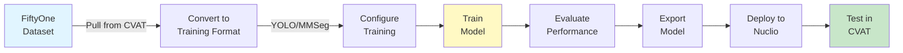

# Training and Deployment Guides

Learn how to train custom models and deploy them as serverless functions for automated coral monitoring.

## Overview

This section provides practical guides for training machine learning models on your annotated datasets and deploying them to production. Each guide corresponds to a specific module in the QUADRATSEG pipeline.

<div class="grid cards" markdown>

-   :material-network:{ .lg .middle } **YOLO Segmentation**

    ---

    **Fast instance segmentation** for production use

    **Module**: `coral_seg_yolo`

    **Use case**: Real-time processing, automated monitoring

    [:octicons-arrow-right-24: Train YOLO](yolo-segmentation.md)

-   :material-brain:{ .lg .middle } **DINOv2 + MMSeg**

    ---

    **High-accuracy semantic segmentation** for research

    **Module**: `DINOv2_mmseg`

    **Use case**: Scientific analysis, maximum accuracy

    [:octicons-arrow-right-24: Train MMSeg](mmseg-segmentation.md)

-   :material-grid:{ .lg .middle } **Grid Detection**

    ---

    **Keypoint detection** for corners and grid intersections

    **Module**: `grid_pose_detection`

    **Use case**: Preprocessing pipeline stages 1 & 2

    [:octicons-arrow-right-24: Train Grid Detection](grid-detection.md)

-   :material-image-remove:{ .lg .middle } **Grid Removal**

    ---

    **Inpainting** to remove grid overlays

    **Module**: `grid_inpainting`

    **Use case**: Preprocessing pipeline stage 3

    [:octicons-arrow-right-24: Setup Grid Removal](grid-removal.md)

-   :material-rocket-launch:{ .lg .middle } **Model Deployment**

    ---

    **Deploy models as Nuclio functions** for CVAT integration

    **Applies to**: All modules

    **Use case**: Production deployment, webhook automation

    [:octicons-arrow-right-24: Deploy Models](model-deployment.md)

</div>

## Guide Comparison

Choose the appropriate training guide based on your task:

| Guide | Task Type | Training Time | Inference Time | Accuracy | Best For |
|-------|-----------|---------------|----------------|----------|----------|
| **YOLO Segmentation** | Instance Segmentation | ~8-12 hours | ~7.4s/image | Good (mAP@0.5: 0.65-0.75) | Production, real-time |
| **DINOv2 + MMSeg** | Semantic → Instance | ~24-36 hours | ~15-25s/image | Excellent (mIoU: 49.5%) | Research, accuracy |
| **Grid Detection** | Keypoint Detection | ~4-6 hours | ~1-2s/image | High (template matching) | Preprocessing |
| **Grid Removal** | Inpainting | Pre-trained | ~5-8s/image | N/A | Preprocessing |

## Prerequisites

Before starting any training guide, ensure you have:

- [x] **Annotated dataset** from [Data Preparation Guides](../data-preparation/index.md)
- [x] **CUDA-capable GPU** (16GB+ VRAM recommended)
- [x] **Pixi environment manager** installed
- [x] **Sufficient disk space** (50GB+ for datasets and model checkpoints)
- [x] **FiftyOne datasets** created from CVAT projects
- [x] **Environment variables configured** per [Environment Variables Guide](../../setup/configuration/for-developers/1-environment-variables.md)

!!! tip "Complete Data Preparation First"
    These guides assume you have already completed one of the data preparation workflows:

    - [Single-Stage Segmentation](../data-preparation/1-single-stage-segmentation.md)
    - [Two-Stage Banggai Setup](../data-preparation/2-two-stage-banggai.md)
    - [Three-Stage CRIOBE Setup](../data-preparation/3-three-stage-criobe.md)

!!! info "Alternative: Password-Protected Datasets"
    If you have obtained access credentials, you can skip the data preparation workflow by using pre-annotated CVAT project backups:

    - **CRIOBE Archive** (`criobe.7z`): Contains criobe_finegrained_annotated (345 images, 16 genera)
    - **Banggai Archive** (`banggai.7z`): Contains banggai_extended_annotated (126 images, 10 genera)

    These archives contain complete CVAT projects that can be restored directly to your CVAT instance, then pulled to FiftyOne for training.

    **To obtain access**: Email gilles.siu@criobe.pf with your name, institution, and research purpose (academic research only).

    **Setup instructions**: See [Developer Data Preparation Guide](../../setup/installation/for-developers/3-data-preparation.md#step-2-access-ml-datasets-from-cvat-backups) for download and restoration steps.

## Training Workflow Overview

All training guides follow a similar structure:



### Common Steps Across All Guides

1. **Pull Data from CVAT**: Use `data_engineering/create_fiftyone_dataset.py`
2. **Convert to Framework Format**: YOLO `.txt` labels or MMSeg `.png` masks
3. **Configure Training**: Edit config files for hyperparameters
4. **Train Model**: Run training script with GPU acceleration
5. **Evaluate**: Compute metrics on validation set
6. **Export Model**: Save trained weights
7. **Deploy to Nuclio**: Package as serverless function
8. **Test Integration**: Verify webhook-based inference in CVAT

## Module-Specific Considerations

### YOLO Segmentation (`coral_seg_yolo`)

**When to use:**

- Need fast inference for real-time monitoring
- Deploying to edge devices or production environments
- Instance segmentation with bounding boxes + masks
- Limited computational resources

**Key features:**

- End-to-end instance segmentation
- Multiple backbone options (YOLOv11n/s/m/l/x)
- Built-in data augmentation
- Easy deployment with ONNX export

**Training datasets:**

- CRIOBE Finegrained (16 genera)
- Banggai Extended (10 classes)
- Custom datasets with polyline annotations

### DINOv2 + MMSeg (`DINOv2_mmseg`)

**When to use:**

- Maximum accuracy for scientific research
- Semantic segmentation at pixel level
- Two-stage workflow with CoralSCoP refinement
- Publication-quality results

**Key features:**

- DINOv2 ViT-B/14 backbone (foundation model)
- SegFormer decoder head
- Multi-scale training and inference
- CoralSCoP + SAM for instance refinement

**Training datasets:**

- CRIOBE Finegrained (converted to semantic masks)
- Banggai Extended
- Hierarchical taxonomies (finegrained → extended → main families)

### Grid Detection (`grid_pose_detection`)

**When to use:**

- Training custom corner/grid detection for new quadrat designs
- Adapting to different grid patterns (not 9×13)
- Improving detection on challenging underwater conditions

**Key features:**

- YOLOv11-pose for keypoint detection
- Hungarian algorithm template matching
- Separate models for corners (4 points) and grid pose (117 points)
- COCO keypoint format

**Training datasets:**

- Corner annotations (4-point skeletons)
- Grid annotations (117-point skeletons)
- Custom skeleton configurations

### Grid Removal (`grid_inpainting`)

**When to use:**

- Pre-trained SimpleLama usually sufficient (no training needed)
- Fine-tuning only if grid pattern very different from training data
- Adapting to different grid widths or materials

**Key features:**

- SimpleLama (LaMa variant optimized for small masks)
- Keypoint-based mask generation
- CUDA acceleration
- Usually works out-of-the-box

**Training datasets:**

- Image pairs: grid images + clean images (if fine-tuning)
- Grid keypoint annotations for mask generation

## Learning Path

!!! tip "Recommended Training Order"
    For users building a complete pipeline from scratch:

    1. **Start with YOLO Segmentation** (easiest, fastest results)
        - Train a coral segmentation model on your clean images
        - Deploy and test in CVAT
        - Use for semi-automatic annotation of more data

    2. **Optionally train Grid Detection** (if using grids)
        - Train corner detection for your specific quadrat design
        - Train grid pose detection for your grid pattern
        - Deploy for preprocessing automation

    3. **Fine-tune Grid Removal** (if needed)
        - Usually pre-trained model works well
        - Fine-tune only if artifacts appear

    4. **Train DINOv2 + MMSeg** (advanced, for maximum accuracy)
        - More complex setup and longer training
        - Best for final production models or research publications

## GPU Requirements

### Recommended Hardware

**Minimum (for experimentation):**

- NVIDIA GPU with 8GB VRAM (RTX 3070, RTX 4060 Ti)
- 16GB system RAM
- 100GB free disk space

**Recommended (for production training):**

- NVIDIA GPU with 16GB+ VRAM (RTX 4080, RTX 4090, A5000)
- 32GB+ system RAM
- 500GB free SSD storage

**Optimal (for large-scale training):**

- NVIDIA GPU with 24GB+ VRAM (RTX 4090, A6000, A100)
- 64GB+ system RAM
- 1TB+ NVMe SSD

### Memory Management

All modules implement GPU memory optimization:

- **YOLO**: Automatic batch size adjustment, mixed precision training
- **MMSeg**: Gradient checkpointing, multi-scale training strategies
- **Grid Detection**: Efficient keypoint representation
- **Grid Removal**: Batch processing with CUDA synchronization

## Training Time Estimates

Based on typical dataset sizes:

| Model | Dataset Size | GPU | Epochs | Time | Checkpoint Size |
|-------|--------------|-----|--------|------|-----------------|
| YOLO-11n-seg | 500 images | RTX 4090 | 100 | ~4 hours | ~10 MB |
| YOLO-11m-seg | 500 images | RTX 4090 | 100 | ~8 hours | ~50 MB |
| DINOv2 + SegFormer | 500 images | RTX 4090 | 160 | ~24 hours | ~350 MB |
| Grid Detection (corners) | 200 images | RTX 4090 | 100 | ~2 hours | ~8 MB |
| Grid Detection (pose) | 200 images | RTX 4090 | 100 | ~4 hours | ~12 MB |

## Evaluation Metrics

### Instance Segmentation (YOLO)

- **mAP@0.5**: Mean Average Precision at IoU threshold 0.5
- **mAP@0.5:0.95**: Mean AP across IoU thresholds 0.5 to 0.95
- **Precision**: Ratio of true positives to all predictions
- **Recall**: Ratio of true positives to all ground truth instances
- **F1 Score**: Harmonic mean of precision and recall

### Semantic Segmentation (MMSeg)

- **mIoU**: Mean Intersection over Union across all classes
- **Pixel Accuracy**: Percentage of correctly classified pixels
- **Per-class IoU**: IoU for each coral genus
- **Confusion Matrix**: Class-wise prediction errors

### Keypoint Detection (Grid Detection)

- **Keypoint AP**: Average Precision for keypoint localization
- **OKS (Object Keypoint Similarity)**: Normalized distance metric
- **Template Matching Success Rate**: Percentage of correctly ordered keypoints
- **Mean Euclidean Distance**: Average pixel error per keypoint

## Deployment Overview

After training, deploy models as Nuclio serverless functions:

```bash
# Generic deployment pattern
cd {module}/deploy/{function-name}

# Package model and dependencies
./deploy_as_zip.sh

# Deploy to Nuclio
nuctl deploy --project-name cvat \
    --path ./nuclio \
    --platform local \
    --verbose
```

See [Model Deployment Guide](model-deployment.md) for complete instructions.

## What's Next?

Choose your training path based on your needs:

**For coral segmentation:**

- [YOLO Segmentation Training](yolo-segmentation.md) - Start here for fast results
- [MMSeg Segmentation Training](mmseg-segmentation.md) - Advanced, higher accuracy

**For preprocessing:**

- [Grid Detection Training](grid-detection.md) - Custom quadrat/grid patterns
- [Grid Removal Setup](grid-removal.md) - Usually no training needed

**For deployment:**

- [Model Deployment Guide](model-deployment.md) - Deploy any trained model to Nuclio

## Reference Materials

### Module Documentation

Each module has detailed README with advanced options:

- [coral_seg_yolo/README.md](https://github.com/taiamiti/criobe/coral_seg_yolo/README.md)
- [DINOv2_mmseg/README.md](https://github.com/taiamiti/criobe/DINOv2_mmseg/README.md)
- [grid_pose_detection/README.md](https://github.com/taiamiti/criobe/grid_pose_detection/README.md)
- [grid_inpainting/README.md](https://github.com/taiamiti/criobe/grid_inpainting/README.md)

### External Resources

- [Ultralytics YOLO Documentation](https://docs.ultralytics.com/)
- [MMSegmentation Documentation](https://mmsegmentation.readthedocs.io/)
- [FiftyOne Documentation](https://docs.voxel51.com/)
- [Nuclio Serverless Platform](https://nuclio.io/docs/)

---

**Choose Your Guide**: [YOLO](yolo-segmentation.md) · [MMSeg](mmseg-segmentation.md) · [Grid Detection](grid-detection.md) · [Grid Removal](grid-removal.md) · [Deployment](model-deployment.md)
