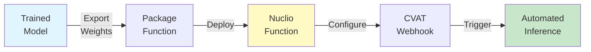

# Model Deployment to Nuclio

Deploy trained models as serverless functions for automated coral monitoring with CVAT integration.

## Introduction

This guide provides **unified deployment instructions** for all QUADRATSEG models. After training models in any module (YOLO, MMSeg, Grid Detection, Grid Removal), deploy them as **Nuclio serverless functions** to enable:

- Automated pre-annotation in CVAT (via webhooks)
- Real-time inference API endpoints
- Scalable, GPU-accelerated processing
- Integration with the complete preprocessing pipeline

### What is Nuclio?

**Nuclio** is a high-performance serverless platform that:

- Deploys ML models as HTTP endpoints
- Manages GPU resources automatically
- Scales based on demand
- Integrates natively with CVAT for automated annotation

### Deployment Workflow



## Prerequisites

Before deploying, ensure you have:

- [x] Nuclio platform installed (see [Installation Guide](../../setup/installation/for-end-users/2-ml-models-deployment.md))
- [x] Trained model weights from one of the training guides
- [x] CVAT instance running
- [x] Bridge service running (for webhook integration)
- [x] `nuctl` CLI tool installed
- [x] Environment variables configured (see [Environment Variables Guide](../../setup/configuration/for-developers/1-environment-variables.md))

**Verify Nuclio is running:**

```bash
# Check Nuclio dashboard
curl http://localhost:8070

# List existing functions
nuctl get functions --platform local

# Check CVAT project exists
nuctl get projects --platform local | grep cvat
```

## Generic Deployment Steps

All modules follow this pattern:

### Step 1: Locate Model Weights

Navigate to your module and identify the trained model weights:

```bash
cd PROJ_ROOT/criobe/{module}/
```

**Find your best checkpoint:**

```bash
# For YOLO models (coral_seg_yolo, grid_pose_detection):
ls runs/{train_dir}/weights/best.pt

# For MMSeg (DINOv2_mmseg):
ls work_dirs/{experiment}/best_mIoU_epoch_X.pth
ls work_dirs/{experiment}/*.py  # Also need config file

# For grid_inpainting: No weights needed - model downloads automatically
```

!!! note "No manual copying needed"
    The new parameterized deployment scripts handle copying automatically. You just need to know the paths to pass as arguments.

### Step 2: Review Function Configuration

Each module contains deployment files in the `deploy/` folder:

```bash
cd PROJ_ROOT/criobe/{module}/deploy/
```

This folder contains the `function.yaml` configuration file that defines:

```yaml
metadata:
  name: pth-{model-name}           # Unique function name
  namespace: cvat
  annotations:
    name: Model description (e.g., "Grid corners detection")
    type: detector                 # or "tracker", "interactor"
    spec: |
      [
        {
          "name": "label_name",
          "type": "polygon",          # or "skeleton", "points"
          "attributes": [
            {
              "name": "confidence",
              "input_type": "number",
              "mutable": true,
              "values": ["0", "100", "1"],
              "default_value": "100"
            }
          ]
        }
      ]

spec:
  handler: main:handler              # Python handler function
  runtime: python:3.9

  build:
    commands:                        # Install dependencies
      - pip install torch torchvision ultralytics
      # Add model-specific packages

  env:                              # Environment variables
    - name: MODEL_PATH
      value: /opt/nuclio/model_weights.pt
    - name: CONF_THRESHOLD
      value: "0.25"

  resources:
    limits:
      nvidia.com/gpu: "1"           # Request GPU
    requests:
      memory: 8Gi                   # Memory requirement
```

!!! info "Confidence Attribute and Score Conversion"
    The `confidence` attribute in the label spec captures model prediction confidence:

    **Score Conversion Process:**

    1. **Model output**: Prediction scores are typically between 0 and 1 (e.g., 0.87 for 87% confidence)
    2. **Percentage conversion**: Convert to 0-100 range by multiplying by 100: `score * 100`
    3. **String formatting**: Return as string in the handler JSON response (e.g., `"87"`)

    **CVAT 2.29.0 Compatibility:**

    - CVAT 2.29.0 does **not handle float values** for numeric attributes
    - The confidence attribute expects **integer values** (0-100) converted to **strings** in the handler response
    - Example conversion in handler:
      ```python
      confidence_score = prediction.conf.item()  # 0.0-1.0 from model
      confidence_percent = str(int(confidence_score * 100))  # "0"-"100" for CVAT
      ```

    This allows users to:

    - Filter low-confidence predictions in CVAT
    - Sort annotations by confidence score
    - Perform quality control on automated annotations
    - Prioritize review of uncertain predictions

### Step 3: Review Handler Function

The `deploy/` folder also contains the `main.py` handler that receives CVAT webhook data and returns predictions:

```bash
cd PROJ_ROOT/criobe/{module}/deploy/
cat main.py
```

Handler structure:

```python
import json
import base64
import numpy as np
from model_wrapper import ModelInference

# Initialize model once at startup
model = ModelInference(
    model_path='model_weights.pt',
    device='cuda:0'
)

def handler(context, event):
    """
    Nuclio handler for model inference

    Args:
        context: Nuclio context
        event: Event with image data

    Returns:
        JSON response with predictions
    """
    data = event.body

    # Decode image from base64
    image_data = base64.b64decode(data['image'])
    image = decode_image(image_data)

    # Run inference
    predictions = model.predict(image)

    # Convert to CVAT format
    cvat_annotations = convert_to_cvat_format(predictions)

    return context.Response(
        body=json.dumps(cvat_annotations),
        headers={},
        content_type='application/json',
        status_code=200
    )
```

### Step 4: Package Function

All modules now use **parameterized deployment scripts** that package everything from the `deploy/` folder:

```bash
# Run from module root directory
cd PROJ_ROOT/criobe/{module}/

# Each module has its own argument structure:

# For coral_seg_yolo (2 arguments):
./deploy_as_zip.sh MODEL_NAME MODEL_WEIGHTS

# For DINOv2_mmseg (4 arguments):
./deploy_as_zip.sh MODEL_NAME SEGFORMER_WEIGHTS SEGFORMER_CONFIG SAM_WEIGHTS

# For grid_pose_detection (3 arguments, unified script):
./deploy_as_zip.sh MODEL_NAME MODEL_WEIGHTS TEMPLATE_PATH
```

**What the script does:**

The `deploy_as_zip.sh` script packages the contents of the `deploy/` folder along with your model files:

1. **Copies deployment files** from `PROJ_ROOT/criobe/{module}/deploy/`:
   - `function.yaml` - Nuclio function configuration
   - `main.py` - Handler code
   - Additional source code modules (e.g., `src/`, `inferencer.py`)

2. **Adds your model files**:
   - Model weights (checkpoint files)
   - Configuration files (for MMSeg)
   - Template files (for grid detection)

3. **Creates portable archive** `nuclio.zip` containing:

```
nuclio/
├── function.yaml        # Function configuration
├── main.py              # Handler code
├── best.pt / best_segformer.pth  # Model checkpoint (standardized name)
├── best_segformer_config.py      # Config file (MMSeg only)
├── kp_template.npy               # Template file (grid detection only)
├── src/ or inferencer.py         # Source code modules
└── ...                           # Additional dependencies
```

!!! success "Portable Deployment Package"
    The resulting `nuclio.zip` archive is **fully portable** and contains everything needed to deploy the function. You can deploy it using two deployment options shown in **Step 5** below.

**Key benefits of parameterized deployment:**

- ✅ No manual copying of weights to deploy directories
- ✅ Deploy different model versions easily
- ✅ Input validation prevents errors
- ✅ Standardized weight names across deployments
- ✅ Clear help text with examples
- ✅ Portable archive can be deployed anywhere

### Step 5: Deploy to Nuclio

After creating `nuclio.zip`, you have **two deployment options**:

**Option 1: Deploy via CVAT's centralized serverless folder**

```bash
# Extract to CVAT's serverless directory
unzip nuclio.zip -d /path/to/cvat/serverless/pytorch/{framework}/{function_name}/

# Deploy from CVAT directory
cd /path/to/cvat
nuctl deploy --project-name cvat \
    --path ./serverless/pytorch/{framework}/{function_name}/nuclio/ \
    --platform local \
    --verbose
```

**Option 2: Deploy from local bundle directory** (recommended for development)

```bash
# Extract to local nuclio_bundles directory
mkdir -p nuclio_bundles/{function_name}
unzip nuclio.zip -d nuclio_bundles/{function_name}/

# Deploy directly from local bundle
nuctl deploy --project-name cvat \
    --path ./nuclio_bundles/{function_name}/nuclio/ \
    --platform local \
    --verbose
```

!!! tip "Which option to choose?"
    - **Option 1** is useful when CVAT manages all serverless functions centrally
    - **Option 2** is more flexible for development and testing, keeping deployments separate from the CVAT source tree

**Expected output:**

```
nuctl (I) Deploying function {"name": "pth-yolo-coralsegv4"}
nuctl (I) Building {"name": "pth-yolo-coralsegv4"}
nuctl (I) Staging files and preparing base images
nuctl (I) Building processor image {"image": "..."}
nuctl (I) Pushing {"repository": "local"}
nuctl (I) Function deployed {"name": "pth-yolo-coralsegv4", "version": "latest"}
```

### Step 6: Verify Deployment

```bash
# Check function status
nuctl get functions --platform local

# Expected:
# NAME                    PROJECT  STATE  REPLICAS  NODE PORT
# pth-yolo-coralsegv4    cvat     ready  1         8010
```

**Access function:**

- **Nuclio dashboard**: `http://localhost:8070`
- **Function endpoint**: `http://localhost:{PORT}` (varies per function)

### Step 7: Test Function

Create a test payload:

```bash
# Encode test image to base64
python -c "
import base64
with open('test_image.jpg', 'rb') as f:
    img_b64 = base64.b64encode(f.read()).decode()
    print('{\"image\": \"' + img_b64 + '\"}')
" > test_payload.json

# Test function
curl -X POST http://localhost:8010 \
    -H "Content-Type: application/json" \
    -d @test_payload.json
```

**Expected response:**

```json
[
  {
    "label": "Acropora",
    "points": [[x1,y1], [x2,y2], ...],
    "type": "polyline",
    "confidence": 0.87
  },
  ...
]
```

## Module-Specific Deployment

### YOLO Segmentation (`coral_seg_yolo`)

**Deployable functions:**

- `pth-yolo-coralsegv4` (CRIOBE finegrained, 16 genera)
- `pth-yolo-coralsegbanggai` (Banggai extended, 10 classes)

**Deployment:**

```bash
cd PROJ_ROOT/criobe/coral_seg_yolo

# Package function with trained weights (no manual copying needed)
./deploy_as_zip.sh coralsegv4 \
    runs/yolov11_criobe_finegrained_annotated/train/weights/best.pt

# For Banggai model
./deploy_as_zip.sh coralsegbanggai \
    runs/yolov11_banggai_extended_annotated/train/weights/best.pt

# Deploy using Option 1 (CVAT centralized)
unzip nuclio.zip -d /path/to/cvat/serverless/pytorch/yolo/coralsegv4/
cd /path/to/cvat
nuctl deploy --project-name cvat \
    --path ./serverless/pytorch/yolo/coralsegv4/nuclio/ \
    --platform local \
    --verbose

# OR Deploy using Option 2 (local bundle)
mkdir -p nuclio_bundles/coralsegv4
unzip nuclio.zip -d nuclio_bundles/coralsegv4/
nuctl deploy --project-name cvat \
    --path ./nuclio_bundles/coralsegv4/nuclio/ \
    --platform local \
    --verbose
```

**Deployment script arguments:**

```bash
./deploy_as_zip.sh MODEL_NAME MODEL_WEIGHTS_PATH

# Arguments:
#   MODEL_NAME          Model name (coralsegv4 or coralsegbanggai)
#   MODEL_WEIGHTS_PATH  Path to model weights file (.pt file)
```

**What happens:**

- Script validates inputs (model name and weights existence)
- Copies weights as `best.pt` (standardized name)
- Copies `src/` module for inference engine
- Creates `nuclio.zip` ready for deployment

**Key configuration (`function.yaml`):**

```yaml
env:
  - name: MODEL_PATH
    value: /opt/nuclio/model_weights.pt
  - name: CONF_THRESHOLD
    value: "0.25"
  - name: IOU_THRESHOLD
    value: "0.5"
  - name: CONVERT_TO_POLYLINE
    value: "true"  # Convert masks to polylines for CVAT
```

**Webhook URL:**

```
http://bridge:8000/detect-model-webhook?model_name=pth-yolo-coralsegv4&conv_mask_to_poly=true
```

### DINOv2 + MMSeg (`DINOv2_mmseg`)

**Deployable functions:**

- `pth-mmseg-coralscopsegformer` (DINOv2 semantic + CoralSCoP instance)

**Deployment:**

```bash
cd PROJ_ROOT/criobe/DINOv2_mmseg

# Package function with all required files (no manual copying needed)
./deploy_as_zip.sh coralscopsegformer \
    work_dirs/dinov2_vitb14_coralsegv4_ms_config_segformer/best_mIoU_epoch_140.pth \
    work_dirs/dinov2_vitb14_coralsegv4_ms_config_segformer/dinov2_vitb14_coralsegv4_ms_config_segformer.py \
    assets/pretrained_models/vit_b_coralscop.pth

# Deploy using Option 1 (CVAT centralized)
unzip nuclio.zip -d /path/to/cvat/serverless/pytorch/mmseg/coralscopsegformer/
cd /path/to/cvat
nuctl deploy --project-name cvat \
    --path ./serverless/pytorch/mmseg/coralscopsegformer/nuclio/ \
    --platform local \
    --verbose

# OR Deploy using Option 2 (local bundle)
mkdir -p nuclio_bundles/coralscopsegformer
unzip nuclio.zip -d nuclio_bundles/coralscopsegformer/
nuctl deploy --project-name cvat \
    --path ./nuclio_bundles/coralscopsegformer/nuclio/ \
    --platform local \
    --verbose
```

**Deployment script arguments:**

```bash
./deploy_as_zip.sh MODEL_NAME SEGFORMER_WEIGHTS SEGFORMER_CONFIG SAM_WEIGHTS

# Arguments:
#   MODEL_NAME          Model name (coralscopsegformer)
#   SEGFORMER_WEIGHTS   Path to Segformer model weights (.pth file)
#   SEGFORMER_CONFIG    Path to Segformer config file (.py file)
#   SAM_WEIGHTS         Path to CoralSCoP/SAM weights (.pth file)
```

**What happens:**

- Script validates all inputs (model name, weights, config existence)
- Copies Segformer weights as `best_segformer.pth` (standardized name)
- Copies Segformer config as `best_segformer_config.py` (standardized name)
- Copies SAM weights as `vit_b_coralscop.pth` (standardized name)
- Copies source modules: `inferencer.py`, `dataset/`, `models/`, `segment_anything/`
- Creates `nuclio.zip` ready for deployment

**Key configuration:**

```yaml
env:
  - name: SEGFORMER_CONFIG
    value: /opt/nuclio/config.py
  - name: SEGFORMER_WEIGHTS
    value: /opt/nuclio/segformer_weights.pth
  - name: SAM_WEIGHTS
    value: /opt/nuclio/sam_weights.pth
  - name: CONF_THRESHOLD
    value: "0.5"

resources:
  limits:
    nvidia.com/gpu: "1"
  requests:
    memory: 16Gi  # Requires more memory than YOLO
```

**Webhook URL:**

```
http://bridge:8000/detect-model-webhook?model_name=pth-mmseg-coralscopsegformer&conv_mask_to_poly=true
```

### Grid Detection (`grid_pose_detection`)

**Deployable functions:**

- `pth-yolo-gridcorners` (4-point corner detection)
- `pth-yolo-gridpose` (117-point grid detection)

**Unified deployment (for both GridCorners and GridPose):**

```bash
cd PROJ_ROOT/criobe/grid_pose_detection

# Package GridCorners function (4 points for quadrat cropping)
./deploy_as_zip.sh gridcorners \
    runs/gridcorners/detect/train14/weights/best.pt \
    assets/kp_template_corners.npy

# Package GridPose function (117 points for grid removal)
./deploy_as_zip.sh gridpose \
    runs/gridpose/detect/train6/weights/best.pt \
    assets/kp_template.npy

# Deploy GridCorners using Option 1 (CVAT centralized)
unzip nuclio.zip -d /path/to/cvat/serverless/pytorch/yolo/gridcorners/
cd /path/to/cvat
nuctl deploy --project-name cvat \
    --path ./serverless/pytorch/yolo/gridcorners/nuclio/ \
    --platform local \
    --verbose

# OR Deploy GridPose using Option 2 (local bundle)
mkdir -p nuclio_bundles/gridpose
unzip nuclio.zip -d nuclio_bundles/gridpose/
nuctl deploy --project-name cvat \
    --path ./nuclio_bundles/gridpose/nuclio/ \
    --platform local \
    --verbose
```

**Deployment script arguments:**

```bash
./deploy_as_zip.sh MODEL_NAME MODEL_WEIGHTS TEMPLATE_PATH

# Arguments:
#   MODEL_NAME      Model name (gridpose or gridcorners)
#   MODEL_WEIGHTS   Path to model weights file (.pt file)
#   TEMPLATE_PATH   Path to template file (.npy file)
```

**What happens:**

- Script validates inputs (model name, weights, template existence)
- Copies weights as `best.pt` (standardized name)
- Copies template as `kp_template.npy` or `kp_template_corners.npy` (based on model type)
- Copies `src/` module for inference engine
- Creates `nuclio.zip` ready for deployment

**Key configuration:**

```yaml
env:
  - name: MODEL_PATH
    value: /opt/nuclio/model_weights.pt
  - name: TEMPLATE_PATH
    value: /opt/nuclio/kp_template.npy
  - name: USE_TEMPLATE_MATCHING
    value: "true"  # Hungarian algorithm for correct ordering
```

**Webhook URLs:**

```
# GridCorners
http://bridge:8000/detect-model-webhook?model_name=pth-yolo-gridcorners&conv_mask_to_poly=false

# GridPose
http://bridge:8000/detect-model-webhook?model_name=pth-yolo-gridpose&conv_mask_to_poly=false
```

### Grid Removal (`grid_inpainting`)

**Deployable functions:**

- `pth-lama` (SimpleLama inpainting)

**Deployment:**

```bash
cd PROJ_ROOT/criobe/grid_inpainting

# No need to copy model weights - automatically downloaded by Nuclio function.yaml

# Package and deploy
./deploy_as_zip.sh

nuctl deploy --project-name cvat \
    --path ./nuclio \
    --platform local \
    --verbose
```

!!! info "Automatic Model Download"
    The grid inpainting function automatically downloads the SimpleLama model (`big-lama.pt`) from Google Cloud Storage during deployment via the `function.yaml` configuration. You don't need to manually copy model weights.

**Key configuration:**

```yaml
env:
  - name: MODEL_PATH
    value: /opt/nuclio/model_weights.pt
  - name: GRID_LINE_WIDTH
    value: "8"

resources:
  limits:
    nvidia.com/gpu: "1"
  requests:
    memory: 8Gi
```

**Usage:**

Grid removal is called automatically by Bridge service via `remove-grid-and-create-new-task-webhook`.

## CVAT Integration

### Configure Detection Webhooks

**For coral segmentation, grid detection, corner detection:**

1. Navigate to CVAT project
2. **Actions** → **Webhooks** → **Create webhook**
3. Configure webhook:

**Webhook configuration:**

```
Target URL: http://bridge:8000/detect-model-webhook?model_name={FUNCTION_NAME}&conv_mask_to_poly={true|false}

Description: Auto-detect {feature} on job open

Events:
☑ When a job state is changed to 'in progress'

Content type: application/json

Enable SSL verification: ☐ (unchecked for local deployment)
```

**Parameters:**

- `model_name`: Nuclio function name (e.g., `pth-yolo-coralsegv4`)
- `conv_mask_to_poly`:
    - `true` for segmentation (convert masks to polylines)
    - `false` for keypoints (keep as points/skeleton)

### Configure Task Completion Webhooks

**For automated pipeline stages (cropping, grid removal):**

1. Navigate to CVAT project (source stage)
2. **Actions** → **Webhooks** → **Create webhook**
3. Configure:

**Cropping/warping webhook:**

```
Target URL: http://bridge:8000/crop-quadrat-and-create-new-task-webhook?target_proj_id={NEXT_PROJECT_ID}

Description: Auto-warp and create next stage tasks

Events:
☑ When a task status is changed to 'completed'

Content type: application/json
```

**Grid removal webhook:**

```
Target URL: http://bridge:8000/remove-grid-and-create-new-task-webhook?target_proj_id={SEGMENTATION_PROJECT_ID}

Description: Auto-remove grid and create segmentation tasks

Events:
☑ When a task status is changed to 'completed'

Content type: application/json
```

### Test Webhook Integration

1. **Upload test images** to CVAT project with webhook configured
2. **Create task** from images
3. **Open job** (should trigger detection webhook)
4. **Wait 10-30 seconds**, then **refresh** page
5. **Verify** annotations appear automatically

## Monitoring and Debugging

### View Function Logs

```bash
# Real-time logs
nuctl get logs pth-yolo-coralsegv4 --platform local --follow

# Recent logs
nuctl get logs pth-yolo-coralsegv4 --platform local | tail -100

# Filter by level
nuctl get logs pth-yolo-coralsegv4 --platform local | grep ERROR
```

### Check Function Metrics

**Nuclio dashboard** (`http://localhost:8070`):

- Request count
- Success/failure rate
- Average response time
- GPU utilization

**CLI metrics:**

```bash
nuctl get functions pth-yolo-coralsegv4 --platform local --output json | jq '.status.state'
```

### Common Issues

??? question "Function deployment fails with 'image build failed'"
    **Causes:**

    - Missing dependencies in `requirements.txt`
    - Incompatible package versions
    - Large model file exceeds Docker layer limit

    **Solutions:**

    1. Check build logs:
       ```bash
       nuctl build {function-name} --path ./nuclio --platform local --verbose
       ```
    2. Verify all dependencies listed in `build.commands` section
    3. For large models, use volume mounts instead of embedding:
       ```yaml
       volumes:
         - hostPath:
             path: /path/to/models
           name: models
       ```

??? question "Function deploys but returns 500 errors"
    **Debug:**

    1. Check function logs:
       ```bash
       nuctl get logs {function-name} --platform local
       ```
    2. Test handler locally:
       ```bash
       cd deploy/{function-name}
       python main.py  # Test handler outside Nuclio
       ```
    3. Common errors:
        - Model file not found (check paths)
        - CUDA out of memory (reduce batch size)
        - Missing dependencies

??? question "Webhook triggers but no predictions appear in CVAT"
    **Check:**

    1. **Bridge logs**:
       ```bash
       docker logs bridge | tail -50
       ```
    2. **Function was called**:
       ```bash
       nuctl get logs {function-name} --platform local | grep "handler called"
       ```
    3. **Response format correct**: Must return JSON matching CVAT annotation format
    4. **Webhook configuration**: Verify URL and parameters are correct

??? question "Function runs slowly or times out"
    **Optimize:**

    1. **Check GPU usage**:
       ```bash
       nvidia-smi
       # Function should show GPU utilization
       ```
    2. **Increase timeout** in webhook configuration (default 30s)
    3. **Reduce image size** if possible (resize before inference)
    4. **Use lighter model** (e.g., yolo11n instead of yolo11m)
    5. **Batch processing**: Process multiple images together

??? question "Multiple requests cause GPU out of memory"
    **Solutions:**

    1. **Limit replicas** to 1 per GPU:
       ```yaml
       spec:
         minReplicas: 1
         maxReplicas: 1
       ```
    2. **Increase memory limit**:
       ```yaml
       resources:
         limits:
           memory: 16Gi  # Increase from 8Gi
       ```
    3. **Clear CUDA cache** after each request:
       ```python
       import torch
       torch.cuda.empty_cache()
       ```

## Advanced Deployment

### Multi-GPU Deployment

Deploy multiple replicas across GPUs:

```yaml
spec:
  minReplicas: 2
  maxReplicas: 4

  resources:
    limits:
      nvidia.com/gpu: "1"  # Each replica gets 1 GPU
```

Nuclio will distribute requests across replicas.

### Model Versioning

Deploy multiple versions simultaneously:

```bash
# Deploy v1
nuctl deploy --project-name cvat \
    --path ./nuclio \
    --platform local \
    --tag v1

# Deploy v2 with different config
nuctl deploy --project-name cvat \
    --path ./nuclio_v2 \
    --platform local \
    --tag v2
```

Switch between versions in CVAT webhook configuration.

### Custom Resource Allocation

Fine-tune resource requests:

```yaml
resources:
  limits:
    nvidia.com/gpu: "1"
    memory: 16Gi
    cpu: "4"
  requests:
    memory: 8Gi
    cpu: "2"
```

### Inference Optimization

**Use TensorRT for faster inference (NVIDIA GPUs):**

```python
# Export YOLO model to TensorRT
from ultralytics import YOLO

model = YOLO('best.pt')
model.export(format='engine', device=0)  # Creates best.engine

# Use in Nuclio function
model = YOLO('best.engine', task='segment')
```

**Use ONNX for cross-platform deployment:**

```python
model.export(format='onnx')
# Use with ONNXRuntime in Nuclio
```

### Batch Inference

Process multiple images in one request:

```python
def handler(context, event):
    data = event.body
    images = [decode_image(img) for img in data['images']]

    # Batch inference (faster)
    results = model.predict(images, batch=len(images))

    annotations = [convert(r) for r in results]
    return context.Response(body=json.dumps(annotations), ...)
```

## Testing and Validation

### Unit Tests for Functions

Create tests for handler logic:

```python
# tests/test_handler.py
import unittest
from main import handler

class TestHandler(unittest.TestCase):
    def test_coral_detection(self):
        event = MockEvent(body={'image': test_image_b64})
        context = MockContext()

        response = handler(context, event)

        self.assertEqual(response.status_code, 200)
        annotations = json.loads(response.body)
        self.assertGreater(len(annotations), 0)
```

Run tests:

```bash
cd deploy/{function-name}
python -m pytest tests/
```

### Integration Tests

Test deployed function end-to-end:

```bash
# Run integration test script
python tests/test_integration.py \
    --function-url http://localhost:8010 \
    --test-images data/test_samples/
```

### Performance Benchmarks

Measure inference time:

```bash
python benchmark_function.py \
    --function-url http://localhost:8010 \
    --test-images data/test_samples/ \
    --num-runs 100
```

Expected results:

| Model | Image Size | Avg Time | Throughput |
|-------|------------|----------|------------|
| YOLO-11n-seg | 1920x1920 | 4.2s | 14 img/min |
| YOLO-11m-seg | 1920x1920 | 7.4s | 8 img/min |
| DINOv2 + CoralSCoP | 1920x1920 | 18.5s | 3 img/min |
| GridCorners | 1920x1920 | 1.1s | 55 img/min |
| GridPose | 1920x1920 | 2.3s | 26 img/min |
| LaMa | 1920x1920 | 6.8s | 9 img/min |

## Deployment Checklist

Before deploying to production, verify:

- [ ] Model achieves acceptable accuracy on validation set
- [ ] Function tested locally with representative images
- [ ] Memory and GPU requirements appropriate for hardware
- [ ] Handler code includes proper error handling
- [ ] Logging configured for debugging
- [ ] CVAT webhook tested with real annotation tasks
- [ ] Performance meets requirements (inference time)
- [ ] Documentation updated with deployment details

## Next Steps

Now that your models are deployed:

- **Set up complete pipeline**: [Three-Stage CRIOBE Setup](../data-preparation/3-three-stage-criobe.md)
- **Automate annotation workflow**: Use deployed models for semi-automatic annotation
- **Monitor performance**: Track metrics and improve models iteratively
- **Scale deployment**: Add more GPU resources as needed

## Reference

### Nuclio Documentation

- [Nuclio Official Docs](https://nuclio.io/docs/)
- [Function Reference](https://nuclio.io/docs/reference/function-configuration/)
- [Runtimes](https://nuclio.io/docs/reference/runtimes/)

### CVAT Integration

- [CVAT Serverless Tutorial](https://opencv.github.io/cvat/docs/administration/advanced/installation_automatic_annotation/)
- [CVAT Webhooks](https://opencv.github.io/cvat/docs/api_sdk/sdk/webhooks/)

### Module-Specific

- [coral_seg_yolo/deploy/README.md](https://github.com/taiamiti/criobe/coral_seg_yolo/deploy/README.md)
- [DINOv2_mmseg/deploy/README.md](https://github.com/taiamiti/criobe/DINOv2_mmseg/deploy/README.md)
- [grid_pose_detection/deploy/README.md](https://github.com/taiamiti/criobe/grid_pose_detection/deploy/README.md)
- [grid_inpainting/deploy/README.md](https://github.com/taiamiti/criobe/grid_inpainting/deploy/README.md)

---

**Related Guides**: [YOLO Training](yolo-segmentation.md) · [MMSeg Training](mmseg-segmentation.md) · [Grid Detection](grid-detection.md) · [Grid Removal](grid-removal.md) · [Back to Overview](index.md)
